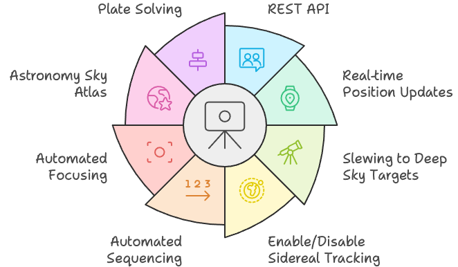

[Home](./README.md) | [Hardware Guide](docs/hardware.md) | [Installation Guide](docs/installation.md) | [Using Stellarim](docs/stellarium.md) | [Using Nina](docs/nina.md)

# Introduction

The [Benro Polaris](https://www.benro-polaris.com/) tripod head is a great product. It's manufactured to a high standard, comes in a compact and sturdy design, and its mobile App has many features that are easy to use. Although its not cheap, it is cheaper than a modern telescope mount like the [ZWO AM3 Harmonic Equatorial Mount](https://www.zwoastro.com/product/zwo-am3-harmonic-equatorial-mount/). The Polaris can also be used for other photography projects beyond astro photography.

That being said, the mobile App and firmware updates appear to have slowed down. Many of the promised features from the original [Kickstarter](https://www.kickstarter.com/projects/benropolaris/polaris-smart-electric-tripod-head) project havent materialised. We are still waiting for 3 Point Alignment, a larger catalogue of deep sky objects, linking with planetarium software, improved sequencing of image capture, plate solving and framing. The product has more potential if only we could enable it.

Thats what this project is all about. The intention is to open up the Benro Polaris with a HTTP based [REST API](https://www.ibm.com/topics/rest-apis) that will allow other applications to leverage this great platform. 

The Alpaca Benro Polaris (`ABP`) will provide a standard [ASCOM](https://ascom-standards.org/) driver that supports the  [ITelescopeV3 interface](https://ascom-standards.org/Help/Developer/html/T_ASCOM_DeviceInterface_ITelescopeV3.htm) for the Benro Polaris tripod head. This standard interface is supported by applications like [Stellarium](https://stellarium.org/en/) (a free open source planetarium application) and [Nina](https://nighttime-imaging.eu/) (Nighttime Imaging 'N' Astronomy - An astrophotography imaging suite). 

This enables a whole suite of advanved features for the Benro Polaris.

# Overview
The Alpaca Benro Polaris has documentation to help you prepare your hardware, install software and use the features in Stellarium and Nina. Since the ABP is an ASCOM stanndard driver there are many other applications that can make use of it. Let us know what you've found usefull.

## [Hardware Guide](./docs/hardware.md)
The [Hardware Guide(s)](./docs/hardware.md) provide an overview of the recommended equipment/hardware to be used with Alpaca Benro Polaris. The guides describe how to prepare and setup a Mini PC, Rapsberry Pi or Docker platforms.

## [Installation Guide](./docs/installation.md)
The [Installation Guide](./docs/installation.md) provides instructions on how to install the Alpaca Benro Polaris Driver, Stellarium and Nina.

## [Using Stellarim](./docs/stellarium.md)
The [Using Stellarim Guide](./docs/stellarium.md) on Stellarium is not a comprehensive users guide. It is aimed to orient you in what features can leverage the Alpaca Benro Polaris. 

The University of Western Australia has [A Guide To Using Stellarium](https://nighttime-imaging.eu/docs/master/site/pdf/Manual.pdf)

## [Using Nina](./docs/nina.md)
The [Using Nina Guide](./docs/nina.md) is not a comprehensive users guide. It is aimed to orient you in what features can leverage the Alpaca Benro Polaris. 

Refer to the thorough [Nina online documentation](https://nighttime-imaging.eu/docs/master/site/) or [Nina PDF Manual](https://nighttime-imaging.eu/docs/master/site/pdf/Manual.pdf) for more info.
