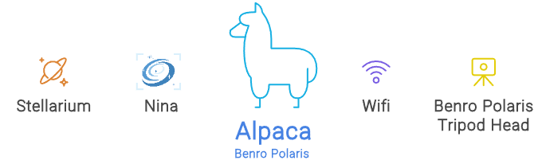
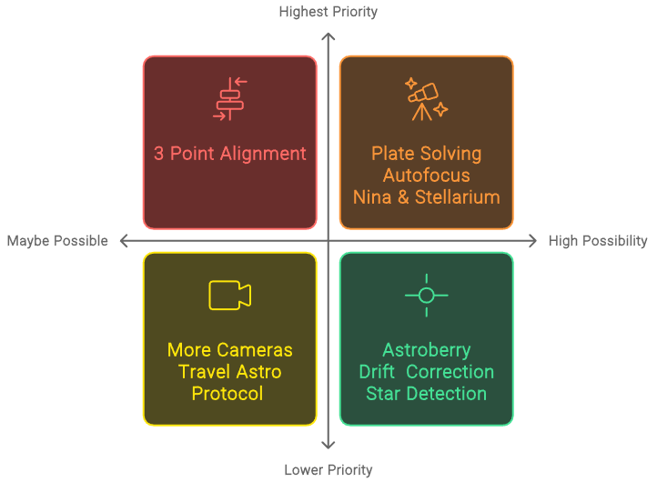

[Home](./README.md) | [Hardware Guide](docs/hardware.md) | [Installation Guide](docs/installation.md) | [Using Stellarim](docs/stellarium.md) | [Using Nina](docs/nina.md)

# Introduction

The [Benro Polaris](https://www.benro-polaris.com/) tripod head is a great product. It's manufactured to a high standard, comes in a compact and sturdy design, and its mobile App has many easy-to-use features. Although its not cheap, it is cheaper than a modern telescope mount like the [ZWO AM3 Harmonic Equatorial Mount](https://www.zwoastro.com/product/zwo-am3-harmonic-equatorial-mount/). The Polaris can also be used for other photography projects beyond astro-photography.

That said, the mobile App and firmware updates appear to have slowed down. Many of the promised features from the original [Kickstarter](https://www.kickstarter.com/projects/benropolaris/polaris-smart-electric-tripod-head) project haven't materialised. We are still waiting for 3 Point Alignment, a larger catalogue of deep sky objects, linking with planetarium software, improved sequencing of image capture, plate solving and framing. The product has more potential if only we could enable it.

That is what this project is all about. The intention is to open up the Benro Polaris with an HTTP-based [REST API](https://www.ibm.com/topics/rest-apis) that will allow other applications to leverage this great platform. 

The Alpaca Benro Polaris (`ABP`) provides a standard [ASCOM](https://ascom-standards.org/) driver that supports the  [ITelescopeV3 interface](https://ascom-standards.org/Help/Developer/html/T_ASCOM_DeviceInterface_ITelescopeV3.htm) for the Benro Polaris tripod head. This standard interface supports applications like [Stellarium](https://stellarium.org/en/) (a free open-source planetarium application) and [Nina](https://nighttime-imaging.eu/) (Nighttime Imaging 'N' Astronomy - An astrophotography imaging suite). 

The priorities of this open-source project reflect feedback from the [Polaris Camera Controller Global Group](https://www.facebook.com/groups/326138891873755). This group provided great suggestions and encouragement for this project, with over 120 supporting it in just 2 days. I've summarised the feedback comments below with features getting the most requests listed as high-priority. The open-source project meets ALL feasible requests. There are still some challenges to the 3-point alignment; although we have some ideas!

# Documentation Overview
The Alpaca Benro Polaris has documentation to help you prepare your hardware, install software and use the features in Stellarium and Nina. Since the ABP is an ASCOM standard driver, many other applications can make use of it. Let us know what you've found that works.

## [Hardware Guide](./docs/hardware.md)
The [Hardware Guide(s)](./docs/hardware.md) provide an overview of the recommended equipment/hardware to be used with Alpaca Benro Polaris. The guides describes preparing and seting up a Mini PC, Rapsberry Pi or Docker platform.

## [Installation Guide](./docs/installation.md)
The [Installation Guide](./docs/installation.md) provides instructions on installing the Alpaca Benro Polaris Driver, ASCOM Platform, Stellarium, and Nina.

## [Using Stellarim](./docs/stellarium.md)
The [Using Stellarim Guide](./docs/stellarium.md) on Stellarium is not a comprehensive users guide. It is aimed to orient you in what features can leverage the Alpaca Benro Polaris. 

The University of Western Australia has [A Guide To Using Stellarium](https://nighttime-imaging.eu/docs/master/site/pdf/Manual.pdf)

## [Using Nina](./docs/nina.md)
The [Using Nina Guide](./docs/nina.md) is not a comprehensive users guide. It aims to orient you in what features can leverage the Alpaca Benro Polaris. 

Refer to the thorough [Nina online documentation](https://nighttime-imaging.eu/docs/master/site/) or [Nina PDF Manual](https://nighttime-imaging.eu/docs/master/site/pdf/Manual.pdf) for more info.

# Recognition
I'd like to thank the following people who helped make this project a reality:

## Technical Expertise
* Vladimir Vyskocil - for his work on the protocol and demonstrating comms, helping inspire this project.
* Robert B. Denny - for his work in writing a template for Alpaca drivers everywhere.
* Steven Byrnes - and the SeeStar_alp driver developers for sharing their great work.
* Peter Simpson - for leading the ASCOM architecture and developing the conformance test suite.
* ASCOM Initiative Members - for their tireless standards work to improve astronomy  device  compatibility. 

## Kickstarter Game Changer Backers
* To be completed

## Kickstarter That's Awesome Backers
* To be completed

## User Group Feedback
* Everyone who posted feedback on the [Polaris Camera Controller Global Group](https://www.facebook.com/groups/326138891873755)
  

# Caution - Use at own Risk
Please be aware that this is not official Benro Software. If you decide to use it - you are doing so at your own risk.

There is a chance of voiding the warranty or damaging your Benro Polaris hardware. There is a chance that you may use the driver/hardware in a way, unintended by its design. The driver is not official Benro software. They may not support you. Due to the extensive testing, the risk of hardware damage is very low.