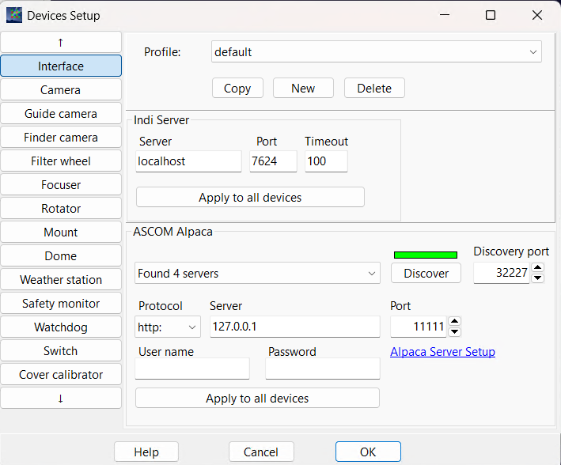
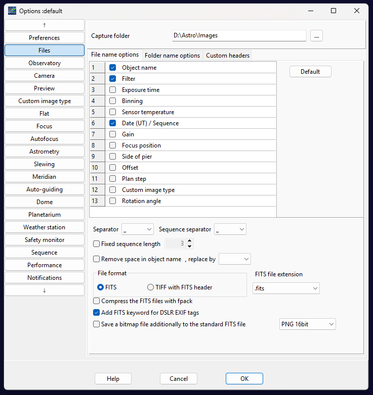
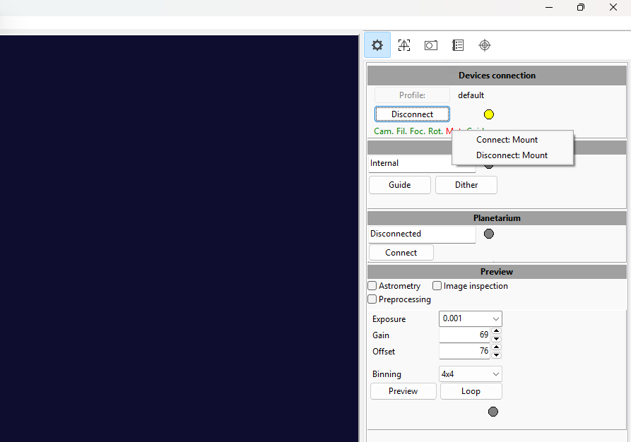
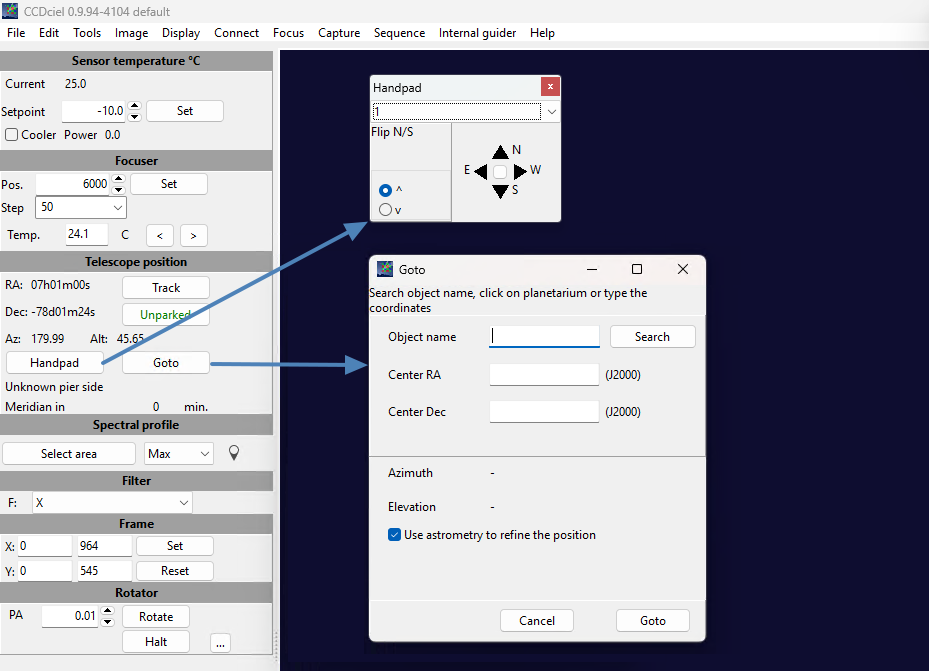

[Home](../README.md) | [Hardware](./hardware.md) | [Installation](./installation.md) | [Pilot](./pilot.md) | [Control](./control.md) | [Stellarium](./stellarium.md) | [Nina](./nina.md) | [CCDciel](./ccdciel.md) | [Guiding](./guiding.md) | [Troubleshooting](./troubleshooting.md) | [FAQ](./faq.md)

# Using CCDciel with Benro Polaris
[Setup](#1-capturing-images) | [Main Window](#2-main-ccdciel-window) | [Autofocus](#3-auto-focus) | [Plate Solving](#4-plate-solving) | [Sync Guiding](#5-scripting) | [Pulse Guiding](#6-pulse-guiding) 

## 1. Capturing Images
The Benro Polaris App does a great job controlling your camera to take sequences of images for panoramas, time-lapse, and astrophotography. It exposes many camera features and makes them easy to setup and use. Unfortunately, it doesn't stretch or process images, show RAW files, or make it easy to customize file names or copy them off for stacking.

If you want to go beyond the native app, several software options provide more tailored control of your camera, especially for astrophotography. Some include:

* [BackyardEOS](https://www.otelescope.com/store/category/2-backyardeos/) (no mount control)
* [APT](https://www.astrophotography.app/) - Astro Photography Tool (paid, ASCOM support)
* [SGPro](https://www.sequencegeneratorpro.com/sgpro/) - Sequence Generator Pro (paid, ASCOM Support)
* [Nina](https://nighttime-imaging.eu/) - Nighttime Imaging 'N' Astronomy (free, ASCOM support, Win)
* [CCDciel](https://ap-i.net/ccdciel/en/start/) - (free, ASCOM support, MacOS/Linux/Win)

We are focusing on using CCDCiel, an alternate solution, due to its price (free), and its suitability for macOS and Windows users.

### CCDciel Device Setup
Upon opening CCDciel, the Devices Setup dialog will appear, allowing you to discover and connect to all your various astronomy equipment. Step through each of the device types and connect up your camera, mount, rotator, and optionally your filter wheel, focuser or other devices you may have. 
* **Mount:** Select the ASCOM Alpaca tab, open the dropdown, then select **Alpaca Benro Polaris Telescope**.
* **Rotator:** Select the ASCOM Alpaca tab, open the dropdown, then select **Alpaca Benro Polaris Rotator**.
* **Camera:** For the MiniCAM8 you need to install the ASCOM Camera driver first.
* **Filter:** For the MiniCAM8 integrated filter-wheel, you need to install the ASCOM Camera CFW driver first.
* **Focuser:** Select the ASCOM tab, click **Choose**, and use ASCOM to select the Gemini Focuser and setup its COM port. 
* **Guide Camera:** Install Indi or ASCOM drivers for your camera first.  

### Preferences Setup
The **Preferences Dialog** can be accessed from the **Edit > Preferences** dropdown menu. It will allow you to make initial setup changes including
* **Files:** Directory and filename format of captured images
* **Observatory:** Your observing sites latitude and longitude
* **Camera:** Camera temperature for Astro Cameras
* **Focus:** Focus offsets if you have a filter wheel
* **Astrometry:** Plate-solving technique, recommend using ASTAP.
* **Slewing:** Set correction method to **Mount Sync** and enable **Sync the Rotator**
* **Meridian:** Choose **Do nothing** as we are using an Az/Alt mount
* **Autoguiding:** Choose **Internal** autoguiding if you have a guide camera
* **Sequence:** Enable **Run astrometry on every image** for sync guiding

## 2. Main CCDciel Window
While Ninas Sky Atlas is good for when you dont have an internet connection, other options you may want to consider include:

### Devices Connection and Preview
On the main CCDciel window, use the **Devices Connection Tool** in the upper-right corner to connect all configured equipment by clicking **Connect**. You can also connect or disconnect individual devices by clicking their abbreviated device names. You can use the Preview panel to **Preview** a single image, or **Loop** to continuously preview.

### Device Control
On the main CCDciel window, in the upper-left corner, are controls for each of the devices you have connected to. These can include your main camera, focuser, telescope, rotator, and filter wheel.

The **Telescope Controls** allow you to control the Benro Polaris Mount.
* **Track:** Enable and Disable Sidereal Tracking
* **Park:** Park and Unpark the mount
* **Handpad:** Opens a dialog with speed and joystick slewing
* **Goto:** Opens a dialog to search for a target, enter RA/Dec co-ordinates and enable astrometry.

The **Rotator Controls** allow you to control the Benro Polaris Mount as well.
* **PA:** This field allows you to monior or control the equatorial Position Angle of the rotator directly.

## 3. Auto-Focus
### Calibration

## 4. Plate-Solving 
### Installing ASTAP

## 5. Scripting
### Sync Guiding
### Panoramas

## 6. Pulse Guiding
### Calibration
