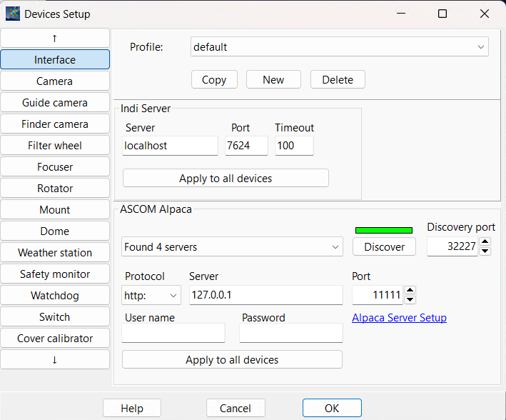
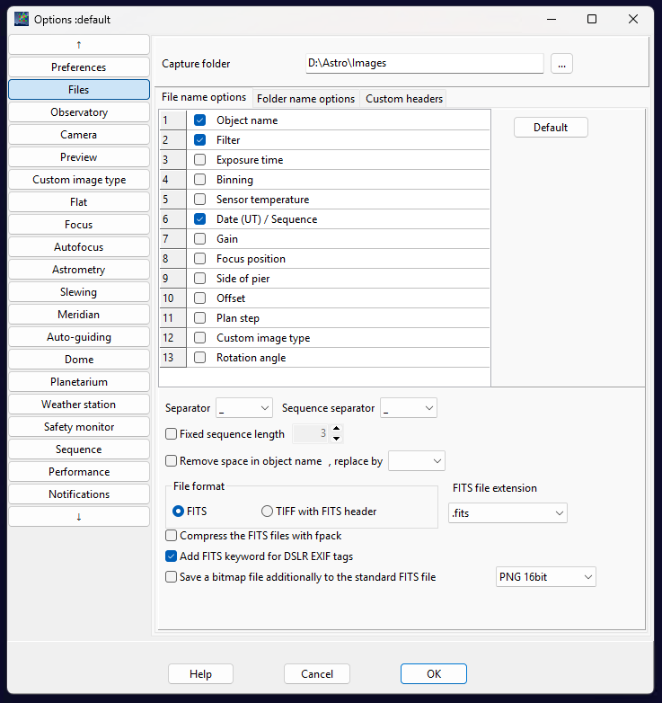
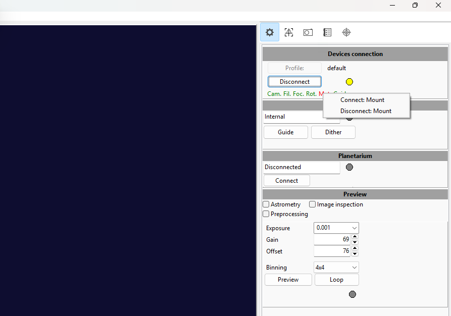
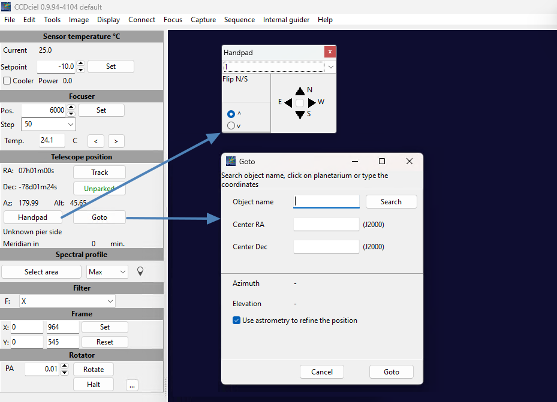

[Home](../README.md) | [Hardware](./hardware.md) | [Installation](./installation.md) | [Pilot](./pilot.md) | [Control](./control.md) | [Stellarium](./stellarium.md) | [Nina](./nina.md) | [CCDciel](./ccdciel.md) | [Guiding](./guiding.md) | [Troubleshooting](./troubleshooting.md) | [FAQ](./faq.md)

# Using CCDciel with Benro Polaris
[Setup](#1-capturing-images) | [Main Window](#2-main-ccdciel-window) | [Autofocus](#3-auto-focus) | [Plate Solving](#4-plate-solving) | [Sync Guiding](#5-scripting) | [Pulse Guiding](#6-pulse-guiding) 

## 1. Capturing Images
The Benro Polaris App does a great job controlling your camera to take sequences of images for panoramas, time-lapse, and astrophotography. It exposes many camera features and makes them easy to setup and use. Unfortunately, it doesn't stretch or process images, show RAW files, or make it easy to customize file names or copy them off for stacking.

If you want to go beyond the native app, several software options provide more tailored control of your camera, especially for astrophotography. Some include:

* [BackyardEOS](https://www.otelescope.com/store/category/2-backyardeos/) (no mount control)
* [APT](https://www.astrophotography.app/) - Astro Photography Tool (paid, ASCOM support)
* [SGPro](https://www.sequencegeneratorpro.com/sgpro/) - Sequence Generator Pro (paid, ASCOM Support)
* [Nina](https://nighttime-imaging.eu/) - Nighttime Imaging 'N' Astronomy (free, ASCOM support, Win)
* [CCDciel](https://ap-i.net/ccdciel/en/start/) - (free, ASCOM support, MacOS/Linux/Win)

We are focusing on using CCDCiel, an alternate solution, due to its price (free), and its suitability for macOS and Windows users.

### CCDciel Device Setup
Upon opening CCDciel, the Devices Setup dialog will appear, allowing you to discover and connect to all your various astronomy equipment. Step through each of the device types and connect up your camera, mount, rotator, and optionally your filter wheel, focuser or other devices you may have. 
* **Mount:** Select the ASCOM Alpaca tab, open the dropdown, then select **Alpaca Benro Polaris Telescope**.
* **Rotator:** Select the ASCOM Alpaca tab, open the dropdown, then select **Alpaca Benro Polaris Rotator**.
* **Camera:** For the MiniCAM8 you need to install the ASCOM Camera driver first.
* **Filter:** For the MiniCAM8 integrated filter-wheel, you need to install the ASCOM Camera CFW driver first.
* **Focuser:** Select the ASCOM tab, click **Choose**, and use ASCOM to select the Gemini Focuser and setup its COM port. 
* **Guide Camera:** Install Indi or ASCOM drivers for your camera first.  

### Preferences Setup
The **Preferences Dialog** can be accessed from the **Edit > Preferences** dropdown menu. It will allow you to make initial setup changes including
* **Files:** Directory and filename format of captured images
* **Observatory:** Your observing sites latitude and longitude
* **Camera:** Camera temperature for Astro Cameras
* **Focus:** Focus offsets if you have a filter wheel
* **Astrometry:** Plate-solving technique, recommend using ASTAP.
* **Slewing:** Set correction method to **Mount Sync** and enable **Sync the Rotator**
* **Meridian:** Choose **Do nothing** as we are using an Az/Alt mount
* **Autoguiding:** Choose **Internal** autoguiding if you have a guide camera
* **Sequence:** Enable **Run astrometry on every image** and **Recenter sequence target that drift** to keep targets centred (see [Plate-Solving](#4-plate-solving))

## 2. Main CCDciel Window

### Devices Connection and Preview
On the main CCDciel window, use the **Devices Connection Tool** in the upper-right corner to connect all configured equipment by clicking **Connect**. You can also connect or disconnect individual devices by clicking their abbreviated device names. You can use the Preview panel to **Preview** a single image, or **Loop** to continuously preview.

### Device Control
On the main CCDciel window, in the upper-left corner, are controls for each of the devices you have connected to. These can include your main camera, focuser, telescope, rotator, and filter wheel.

The **Telescope Controls** allow you to control the Benro Polaris Mount.
* **Track:** Enable and Disable Sidereal Tracking
* **Park:** Park and Unpark the mount
* **Handpad:** Opens a dialog with speed and joystick slewing
* **Goto:** Opens a dialog to search for a target, enter RA/Dec co-ordinates and enable astrometry.

The **Rotator Controls** allow you to control the Benro Polaris Mount as well.
* **PA:** This field allows you to monior or control the equatorial Position Angle of the rotator directly.

## 3. Auto-Focus
CCDciel can drive a connected focuser to find the best focus, measuring the HFD (Half Flux Diameter) of the stars in each image: the smaller the better. A focused lens is also needed before plate-solving will work.

### Manual Focus
Point the camera at the sky and use the **Preview** panel in **Loop** mode. Start with 10-15 second exposures while stars are out-of-focus disks, then reduce to about 1 second as focus improves. Double-click a star near the image centre, check it is not saturated, and enable **Manual focus aid** on the **Focus** tab to magnify it. Adjust the focuser until the star is as small and bright as possible.

### Calibration
Before using autofocus, run **Tools > Focuser calibration** with a focused, centred star field. Set the exposure, preferred move direction, step size and backlash (if known). CCDciel then moves the focuser in one direction and back, measuring the star diameter, to find the minimum HFD. If the forward and reverse curves don't line up, cancel, adjust the backlash and restart. When finished, the focuser is left at the minimum HFD and the recommended parameters are shown; click **Save** to store them in the auto-focus preferences.

### Autofocus
In **Edit > Preferences > Auto-focus**, choose the **Dynamic** method (it fits a curve through the HFD measurements). Test the calibrated parameters with the **Autofocus** button on the **Focus** tab. In a sequence, each plan step has its own autofocus settings.

## 4. Plate-Solving
CCDciel supports ASTAP, astrometry.net and PlateSolve2/3 to identify where your camera points in the sky. We recommend [ASTAP](https://www.hnsky.org/astap.htm), which is fast and works on Windows, macOS, Linux and Raspberry Pi.

The Alpaca Driver aligns the Benro Polaris to the solved coordinates whenever you perform a **Sync**. The more plate-solve syncs you perform, the more accurate the alignment. This can remove the need for a compass alignment or manually aligning a first star with the Benro app.

### Installing ASTAP
* Download ASTAP from [hnsky.org/astap.htm](https://www.hnsky.org/astap.htm) and install the **G17** star database alongside it.
* In **Edit > Preferences > Astrometry**, select **ASTAP** and set its program folder (typically `c:\Program Files\astap` on Windows, `/Applications/astap.app/Contents/MacOS` on macOS, `/opt/astap` on Linux).
* Set the **Maximum search radius** large enough to cover how far off the mount may be pointing (above 180° solves blind, but slowly).
* For images over 3000 pixels wide, set ASTAP **Binning** to 2 (2-3 for about 5000 pixels).
* Set the camera **pixel size** (camera preferences) and the lens **focal length** (astrometry preferences) correctly, or solving will likely fail.

ASTAP needs about 30 focused stars; 5-10 second exposures are usually enough.

### Solving and Syncing
Take a **Preview** image, right-click it and choose **Resolve**. If it fails, right-click and choose **View last resolver log** to see why.

In **Edit > Preferences > Slewing**, set the **Correction method** to **Mount sync**. Each goto that uses astrometry then takes a control exposure, plate-solves it, sends a **Sync** to the mount and slews again, until within the **precision** you set or the maximum number of tries is reached. Every sync also refines the Alpaca Driver's alignment. Enable **Sync the rotator** to sync the driver's rotator to the solved position angle at each slew.

### Recentering Targets
In a sequence, enable the target option **Use astrometry to refine the position** to centre each target on arrival. In **Edit > Preferences > Sequence**, **Run astrometry on every image** solves every captured image and shows the result in the log; **Recenter sequence target that drift** then plans a recenter before the next exposure whenever the drift exceeds the value you set. CCDciel recommends this value is more than 1.5x the slew precision (and 2-3x any dithering).

## 5. Scripting
CCDciel scripts are written in Python. Enable the Script tool from the **Display** menu, then open the **Capture** tab on the right of the screen: under **Run Script** you can select a script and run it, or use **Edit**, **New** and **Copy** to open the script editor. Scripts can be run from there, or as part of a sequence: when a target starts, as a step of a plan, and at the start or end of the sequence. The commands available to scripts are listed in CCDciel's [Script reference](https://www.ap-i.net/ccdciel/en/documentation/jsonrpc_reference).

### Alpaca Driver Scripts
The [`utility/ccdciel`](../utility/ccdciel) folder provides scripts for the Alpaca Driver's most common extensions:

| Script | Arguments | What it does |
|---|---|---|
| `PolarisSyncGuide` | settle seconds (optional, default 5) | Plate-solves the current image and syncs the mount, for [Sync Guiding](#sync-guiding) |
| `PolarisPanoSlew` | panel number (optional) | Slews to the next [panorama](#panoramas) panel, or to the given panel |
| `PolarisSlewAbsolute` | `key=value` coordinates | Slews to the given coordinates, see [Slewing](#slewing) |
| `PolarisSlewRelative` | `key=value` offsets | Moves by the given offsets, see [Slewing](#slewing) |

**Installing on Windows:** double-click [`utility/ccdciel/install.bat`](../utility/ccdciel/install.bat). It copies the scripts into CCDciel's folder (`%LOCALAPPDATA%\ccdciel`) as `.script` files, replacing any older versions; start CCDciel once before running it, and restart CCDciel afterwards if it was running.

**Installing manually** (or on macOS/Linux): copy each `Polaris*.py` file into CCDciel's configuration folder, the folder holding `ccdciel.conf` and CCDciel's other `.script` files, renamed to end in `.script`, e.g. `PolarisSyncGuide.script`. Alternatively, click **New** under **Run Script**, give it the same name, replace the template with the file's contents and click **Save**.

The scripts read the Alpaca Driver's address from CCDciel's mount settings (**ASCOM Alpaca** tab), so nothing needs editing. They use only standard Python, so they run with the Python included with CCDciel.

**Using:** add a script step to a plan, with the script's name and its arguments, or test a script from **Run Script** on the **Capture** tab. Each script writes what it did to the CCDciel log, and fails the step if the action fails.

### Sync Guiding
The Alpaca Driver treats a plate-solve **sync without a slew** as a guiding correction rather than a new alignment point (see [Guiding](./guiding.md)). The recommended workflow is to solve and sync every 1 to 3 minutes during your imaging sequence.
* In Alpaca Pilot, enable **Multi-Point Alignment** and **Sync Guiding (Plate-solve)**.
* Add a `PolarisSyncGuide` step to your plan after the light frames, so it runs every 1 to 3 minutes of imaging. It solves the image just taken (no extra exposure) with CCDciel's `Astrometry_sync` command.
* After a goto, the first sync adds an alignment point and turns sync guiding on; the following syncs are used as guiding corrections (if within 3 degrees).
* After a sync the driver moves the mount back onto its target, so the script waits a few seconds (the settle argument) before the next exposure.
* Sync guiding with CCDciel is new: please report how it works for you.
* Don't combine sync guiding with pulse guiding: the guider pulls each sync correction straight back to its lock position.

### Panoramas
The use the Alpaca Driver's [PanoGrid](./pilot.md#capturing-panoramas-with-the-alpaca-driver) for advanced panorama workflows. The `PolarisPanoSlew` script, allows you to move the mount between the defined panels.

In CCDciel, add a `PolarisPanoSlew` step before each panel's light frames. With no argument, the script slews to the next panel, wrapping back to panel 1 after the last panel. You can also specify a panel number to slew directly to that panel. The step completes once the slew is finished.

### Slewing
To Slew to alternate coordinate reference frames supported by the Alpaca Driver, you can use the `PolarisSlewAbsolute` and `PolarisSlewRelative` scripts. Their arguments are one or more `key=value` pairs separated by spaces:

| Key | Coordinate | Units |
|---|---|---|
| `ra` | Right Ascension | hours |
| `dec` | Declination | degrees |
| `pa` | Position Angle | degrees |
| `az` | Azimuth | degrees |
| `alt` | Altitude | degrees |
| `roll` | Roll Angle | degrees |
| `l` | Galactic Longitude | degrees |
| `b` | Galactic Latitude | degrees |
| `gpa` | Galactic Position Angle | degrees |
| `m1`, `m2`, `m3` | Motor angles (the θ values on the Alpaca Pilot PID pages) | degrees |

* Values are decimal (`dec=-59.5`), or hours/degrees, minutes and seconds (`ra=10:45:03`, `dec=-59:41:04`, `ra=10h45m03s`).
* **`PolarisSlewAbsolute`** slews to the coordinates given; coordinates not given keep their current value, e.g. `az=240 alt=45 roll=0` or `ra=10:45:03 dec=-59:41:04 pa=90`.
* **`PolarisSlewRelative`** adds each value to the current target, e.g. `alt=0.5 roll=-10` or `ra=0:00:30`.
* Mix any of the coordinate keys in one step, but not with the motor keys `m1`, `m2`, `m3`.
* The driver keeps every slew within the Benro Polaris limits (Altitude 0-70°, Roll ±60°, see [Control](./control.md)).
* The step finishes when the slew is complete.

## 6. Pulse Guiding
CCDciel's **Internal guider** uses a guide camera to watch a guide star and sends pulse guide commands to the mount, which the Alpaca Driver turns into small corrections of the M1-M3 motor speeds. It has been tested with the Alpaca Driver.

### Setup
* Connect the **Guide Camera** in the Devices Setup dialog.
* In **Edit > Preferences > Auto-guiding**, choose **Internal guider** (or **PHD2**, with its host and port, if you guide with PHD2).
* In Alpaca Pilot, **Sidereal Tracking** must be enabled, with the tracking rate set to **Sidereal**.
* The **Guide Rate** is set on the Alpaca Pilot **Settings** page. The default **1.0x** works well; reduce it (e.g. 0.75x) if the guider pushes the mount around too much.

### Calibration
Calibrate once before guiding. Set the guide exposure to 3-5 seconds with the stars in focus, point at least 45 degrees away from the celestial pole, and click **Calibration**. The guider sends pulses in four directions and measures how the star moves; this takes a few minutes. The results are shown on the **Advanced** tab, where the East/West and North/South values should match.

For the Benro Polaris:
* **Calibrate at your imaging target**, at the same position angle you will image at. RA/Dec guide pulses become a mix of motor movements that changes across the sky, so avoid large slews or position angle changes after calibrating.
* **PEC can stay on while calibrating**: the driver recognises CCDciel's calibration pulses, and PEC Drift Correction ignores them (`pec_ignore_guider_calibration`, on by default). PEC Worm Gear Correction doesn't learn from guiding, so it can stay on too.

### Guiding
Click **Guide** to start guiding. The **Guider** tab shows the corrections and lets you adjust the RA and Dec **Gain** and **Hysteresis**. You can monitor the pulse guide commands and the RA/Dec setpoint changes on the Alpaca Pilot **PID Tuning** page.
