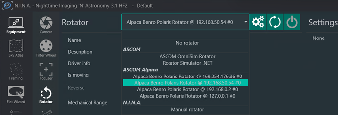
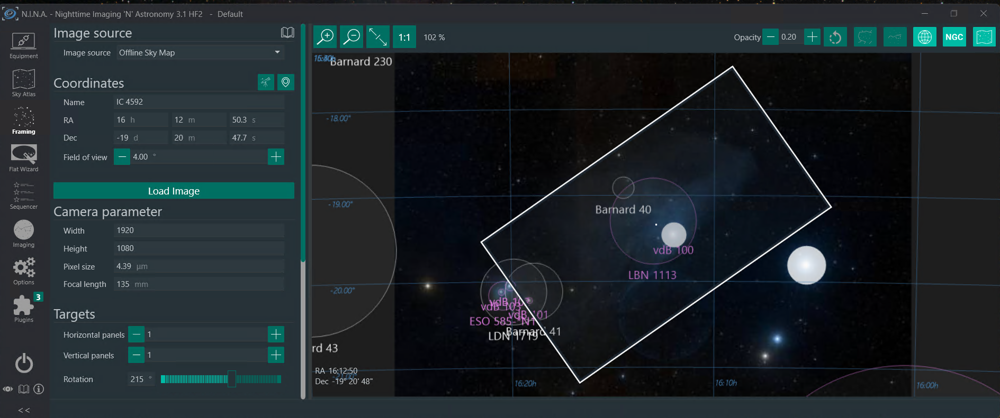
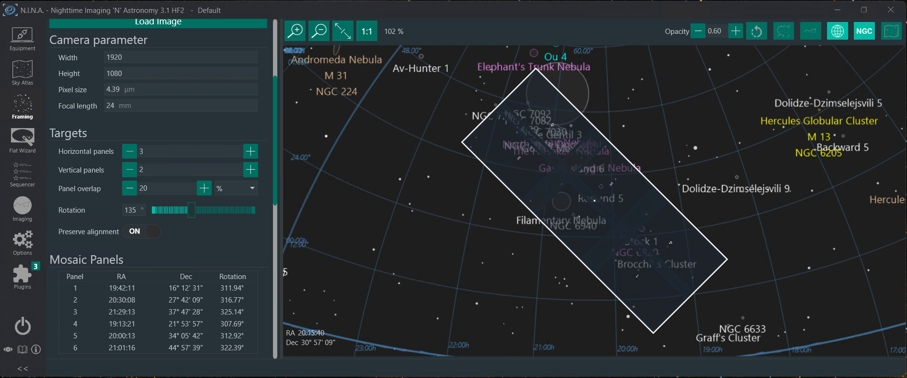
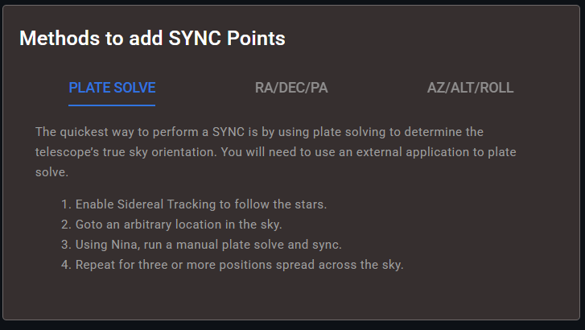
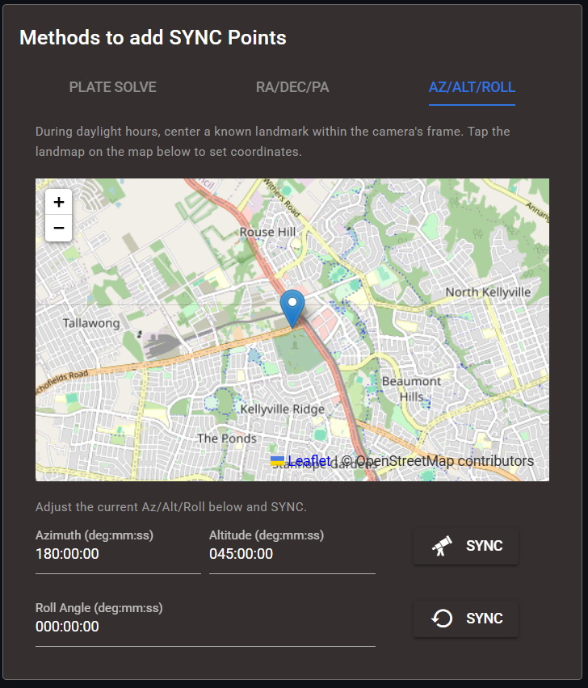
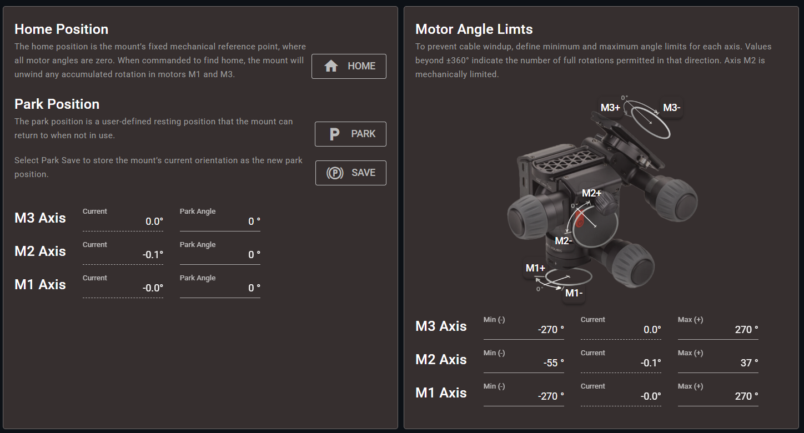

[Home](../README.md) | [Hardware](./hardware.md) | [Installation](./installation.md) | [Pilot](./pilot.md) | [Control](./control.md) | [Stellarium](./stellarium.md) | [Nina](./nina.md) | [Troubleshooting](./troubleshooting.md) | [FAQ](./faq.md)

# Advanced Motion Control Guide
[Challenges](#challenges-with-existing-control) | 
[Rotator](#alpaca-rotator) | 
[Alignment](#alignment-models) | 
[Safety](#equipment-safety) | 
[Filtering](#kalman-filter) | 
[Calibration](#motor-speed-calibration) | 
[PID Controller](#pid-controller-and-performance-tuning) | 
[Orbitals](#orbitals-and-non-sidereal-tracking) | 
[Guiding](#pulse-guiding) 

# Challenges with existing Control
>PODCAST LINK: [20 - Deep Dive Podcast on Alpaca Benro Polaris V2.0](https://youtu.be/KUBCTnEsnlE)

The Benro Polaris mount, especially with its Astro Attachment, is popular among amateur astrophotographers for its compact design and app-driven interface. But while the hardware is excellent, the software can leave many users frustrated.

When version 1.0 of the Alpaca Driver was launched, it allowed advanced imaging and planetarium software to work with the Polaris. As more people used these applications, limitations quickly surfaced:
- Tracking drift was noticeable during long imaging sessions
- Promised features like three-star alignment never materialized
- Users lacked the precision tools needed for serious deep sky work

With version 2.0 of the Alpaca Driver, we introduce a complete rewrite of the motion control system. The motors are now driven using advanced algorithms that dramatically improve tracking accuracy, responsiveness, and stability.

This guide covers describes each of the new motion control concepts introduced in V2.0

 
 

---

# Alpaca Rotator
>VIDEO DEMO: [23 - Alpaca Rotator Framing in Nina and Stellarium](https://youtu.be/_Swd-jIyQis)

The Alpaca Rotator feature is an advanced capability within the Alpaca Benro Polaris (ABP) Driver, specifically designed to enhance precision framing and complex imaging sequences for deep-sky astrophotography.

This guide outlines the purpose, setup, control concepts, and practical usage of the Alpaca Rotator, drawing on the capabilities introduced in the version 2.0 driver.

---

## I. Introduction and Core Function

The Alpaca Rotator functionality unlocks and controls the third axis of the Benro Polaris mount.

*   **Primary Purpose:** The main goal of the Alpaca Rotator is to help achieve **better framing of deep sky objects** and assist significantly with **mosaics and panoramas**.
*   **ASCOM Standard:** The feature is implemented by supporting the **ASCOM Alpaca Rotator Interface v3** standard.
*   **Co-ordinate independance:** The rotator enables rotation around the camera’s boresight while **maintaining the existing Azimuth/Altitude (Az/Alt) or Right Ascension/Declination (RA/Dec) coordinates**.
*   **Roll Angle Preservation:** Unlike the standard Polaris firmware, the ABP Driver’s new **GOTO commands preserve the roll angle** instead of automatically resetting it to zero after every GOTO operation.

---

## II. Key Concepts: Roll Angle vs. Position Angle

The ABP Driver allows control over rotation using two coordinate systems: Roll Angle (in the geographic system) and Position Angle (in the equatorial system).

### Roll Angle (Az/Alt/Roll)

The roll angle is generally considered **intuitive**.

*   It represents the **angle or tilt of the camera relative to the horizon**.
*   The driver automatically calculates how the mount needs to move all motors to achieve a specified roll (e.g., a 30° roll) while keeping the Azimuth and Altitude coordinates consistent.
*   The roll angle is considered related to **Astro Axis**, but in reality it requires all motors to be moved in co-ordination.

### Position Angle (RA/Dec/PA)

Position angle is the angle between the direction to the celestial north and the top of the image frame, measured counterclockwise from north. The Position Angle (PA) is a **consistent reference** used for framing that is independent of the observer's location. It is often not as intuitive as the roll angle.

*   The Position Angle is defined in the **equatorial coordinate system**.
*   A PA of **0 degrees** means the top of the image frame is pointing toward the **celestial North Pole**.
*   Angles **increase in a counter-clockwise fashion**.
*   The Position Angle is equal to the Roll Angle plus the Parallactic Angle.

### Parallactic Angle 

The Parallactic Angle is the angle between the direction to the celestial north  and the zenith, measured at the position of a celestial object in the sky. It describes how the sky appears to rotate around the object. The Paralactive Angle is unique for every Azimuth/Altitude orientation of the mount. It can be displayed in applications like Stellarium. The Driver uses the Parallactic Angle to calculate the Position Angle.

## III. Rotator Setup and Control

### Connecting in NINA

To enable rotator control in third-party applications like NINA (Nighttime Imaging 'N' Astronomy):

1.  In NINA’s Equipment setup, navigate to the **Rotator equipment** section.
2.  Perform a **device discovery** to find the Alpaca Rotator.
3.  Connect to the device. NINA will then have **full control of the rotation axis**.

### Control via Alpaca Pilot App

The Alpaca Pilot App offers direct, real-time control over the rotation axis.

*   **Dashboard Viewing:** The **Dashboard** features **Zoomable Radial Dials** that display the mount’s current roll and position angle (PA) coordinates. You can quickly switch between Azimuth/Altitude/Roll and Right Ascension/Declination/Position Angle views.
*   **Direct Input:** You can **click on the set point** and directly enter a numerical value for the desired roll or position.
*   **Presets (Az/Alt Mode):** When in Azimuth/Altitude mode, you can use the **floating action button** on the roll set point to quickly navigate to common presets, such as **zero degrees** or **plus or minus 45 degrees**.
*   **Movement:** The driver calculates the **best way to move the head** to the target roll/PA location, and the green arrow indicates the desired point. Slew commands now support moving by **Azimuth, Altitude, and Roll coordinates**.

---

## IV. Rotator in Imaging Applications

The Alpaca Rotator is crucial for advanced framing techniques, particularly when using software like NINA and Stellarium.

### Framing with NINA

The rotator function is natively integrated with NINA’s framing capabilities.

1.  **Framing Assistant:** In NINA's Framing Assistant, you can **change the proposed rotation angle** (Position Angle) to see the framing adjust visually.
2.  **Rotation View:** Enabling the **rotation view** within the Framing Assistant allows you to change the orientation of the image perspective, which makes the framing process easier.
3.  **Sequenced Correction:** During an imaging sequence, after NINA performs a plate solve and determines the position angle of the captured image, it will **correct any angular offset** by issuing minor adjustments to the rotator to correctly position the panel.

### Mosaics and Panoramas
The rotator enables precise, structured imaging for large targets.

*   **Tiled Mosaics:** When planning a tiled mosaic (e.g., three wide and two high), NINA calculates the Right Ascension and Declination for each panel.
*   **Preserving Alignment:** By enabling **"preserve alignment"** in NINA, the system automatically recalculates the specific position angle for each individual panel, ensuring the overall mosaic results in a rectangular image.

### Integrating with Stellarium

To visualize your framing accurately in Stellarium, an adjustment is necessary.

*   **Coordinate Mismatch:** Stellarium’s internal "rotation angle" setting uses a different frame of reference than the standard ASCOM Position Angle used by the driver and NINA.
*   **Correcting the Angle:** To achieve the same framing in Stellarium as calculated in NINA (e.g., a proposed PA of 140°), you must input the **negative of the Position Angle** into Stellarium’s rotation angle setting (e.g., -140°).

 
 

---

# Alignment Models
>VIDEO DEMO: [24 - Multi Point Alignment and Tripod Tilt](https://youtu.be/4CMO0R_yphw)

The V2.0 Alpaca Driver re-engineered the alignment and sync interfaces to support two distinct alignment methods, transforming how the Benro Polaris (BP) achieves accurate polar alignment. This guide outlines the features and operational principles of the two primary alignment modes; Single-Point and Multi-Point Alignment. 

### I. Single-Point Alignment (SPA)

Single-Point Alignment (SPA) is the more traditional alignment method supported by the  Driver. This is the default alignment method with the V2.0 Driver:

*   **Function:** It **mirrors the standard Polaris method**, syncing the mount to a single known celestial position.
*   **Correction:** Corrections resulting from the sync apply globally.
*   **Requirement:** This method **relies on precise tripod leveling**.
*   **Limitation:** SPA can be susceptible to drift.
*   **Usage:** Alignment can be achieved simply with a **single plate-solve**. 

When using the Pilot App for initial setup, you can skip the Compass Align and Star Align steps, as the driver will use a default value (assuming the mount is pointing south at 45 degrees altitude). The first plate-solve will correct any misalignment.

The Single Point Alignment is simpler to perform and is still a valid method for alignment of your Benro Polaris. Only progress to Multi Point Alignment when you are prepared to monitor and fine tune the alignment model.

### II. Multi-Point Alignment (MPA) 

Multi-Point Alignment (MPA), is the advanced alignment feature recommended for achieving high precision:

*   **Function:** This method builds a detailed **correction model** from three or more known synchronization (SYNC) positions.
*   **Compensation:** The model compensates for multiple sources of error that a single point cannot correct, including **tripod tilt, polar misalignment, cone error**, and other mechanical offsets.
*   **Algorithm:** The technology is adapted from the **QUEST algorithm**, which uses a closed-form, quaternion-based solution to provide a precise result.
*   **Benefit:** A major advantage of MPA is that users **no longer need to obsess over leveling their tripod**, as the model is designed to detect and correct for tilt.
*   **Procedure:** To perform  Multi Point Alignment, you simply **perform multiple synced plate solves**. Each new sync automatically adds to the Driver's knowledge of the Polaris alignment at different orientations and times.

Here is the procedure for performing Multi-Point Alignment and information regarding the necessary synchronization points, based on the version 2.0 driver and its integration with applications like NINA (Nighttime Imaging 'N' Astronomy).

## III. Performing Multi-Point Alignment

### A. Initial Mount Setup

Before starting the alignment process, ensure the mount is prepared and connected to the ABP Driver:

1.  **Polaris Mode:** Power on the Benro Polaris (BP) mount and use the BP App to switch it to **Astro Mode**.
2.  **Skip Standard Alignment:** You can **skip** the standard Benro Polaris **Compass Align** and **Star Align** steps, as the driver will use default values (assuming the device is pointing South at 45 degrees altitude).
5.  **Physical Setup:** Mount your camera, place the tripod outside, and **level the Benro Polaris as accurately as possible** (though the MPA model compensates for tilt, good leveling remains important for accuracy).
6.  **Focus:** Perform a NINA Autofocus run.
7. **Start Tracking:** Enable sidereal tracking from Nina or Alpaca Pilot

### B. Initiating Alignment via Plate Solving 

The Multi-Point Alignment model is built by performing synchronization (`SYNC`) operations, typically initiated after a **plate solve**. A single, accurate sync is generally sufficient to align the Polaris initially:

1.  **Enable Multi-Point Alignment:** Use Alpaca Pilot App to enable MPA from either the Settings page or the Alignment page.
1.  **Manual Plate Solve and Sync:** Perform a **manually initiated plate-solve and sync**.
    *   Plate solving uses the camera image to identify the star patterns and precisely determine the mount’s orientation.
    *   The ABP Driver automatically aligns the Benro Polaris with the resolved coordinates whenever a `Sync` command is performed.
2.  **Alignment Confirmation:** Once this first plate-solve and sync is successful, the Polaris is now considered aligned.

### C. Polar Alignment

To assist the multi-point model to be as polar aligned as possible, we recommend performing a plate-solve at your Celestrial Pole. This will ensure a point for the Celestrial Pole is in the model and help reduce residual error at that location. Use the following procedure:
1. **Launch Alpaca Pilot**: from a web browser or via Nina Equipment setup cogs.
2. **Search the catalog**: By typing 'pole' into the search bar
3. **Initiate Navigation**: Once a target is selected, click the appropriate GOTO button to immediately navigate to that location. 
4. **Wait for Completion**: Ensure the mount has fully stopped before proceding
5.  **Manual Plate Solve and Sync:** Perform a **manually initiated plate-solve and sync**.

### D. Target Trajectory Alignment

Any remaining points in the model should be placed along the trajectory of your imaging target. You can perform just one plate-solve at your target, or if you are performing a long imaging session you may want to perform a couple of plate-solves along its trajectory. 
1. **Navigate to your target**: Use Alpaca Pilot, Stellarium or Nina to select and navigate to the current location of your target
2. **Optionally Naviagate along target trajectory**: 
    1. **Decrease Right Ascenscion** Use Alpaca Pilot to decrease the Right Ascension position by an hour or two. Enter 'd-2' into the Right Ascension setpoint field.
    1. **Wait for Completion**: Ensure the mount has fully stopped before proceding
    2.  **Manual Plate Solve and Sync:** Perform a **manually initiated plate-solve and sync**.
    3. **Navigate back to your target**: Navigate back to the current location of your target
2. **Wait for Completion**: Ensure the mount has fully stopped before proceding
5.  **Manual Plate Solve and Sync:** Perform a **manually initiated plate-solve and sync**.

### E. Review Model Residuals

After you add any additional sync points to the model, you should review the model residuals on the Alignment page in Alpaca Pilot. When the Driver updates the model, it recalculates how well it fits all of the sync points. Any slight deviation between what that sync point said it was and what the model thinks it should have been, will be listed as a residual. The last sync point will always have zero residual. 

The other sync points in this list, will likely have varying residuals. The lower the better. If you see anything above 5°, then you might want to consider deleting that point. You really want to keep them down in the arc minutes. And these are arc seconds. 

Delete a sync point by clicking on the cross next to the point. Note that if tracking is enabled when you delete a sync point, the model will adjust, and the mount will shift the head to its new understanding of where the current target is located. If this varies from its current location, then perform another manually initiated plate-solve and sync.

A very good multi-point alignment model will have all sync points with residuals of arc-seconds, and none with arc-minutes or whole degrees of residuals.

### IV. Adding Sync Points to the model
By adding sync points, you help the Driver build a geometric model of your mount’s orientation relative to the sky. There are three approaches to adding sync points to the model.

#### Method 1: Sync via Plate Solve

This is the most automated and accurate method. When your imaging software performs a **plate solve**, it determines the exact celestial coordinates your camera is pointing at. ABP uses this data to add a sync point to the alignment model.

- Best for: Astrophotographers using tools like NINA and ASTAP
- How: After a successful plate solve, ABP automatically adds the sync point
- Benefit: High-precision alignment with minimal manual input

#### Method 2: Sync via RA/Dec/PA Coordinates 

You can manually add a sync point by specifying a known celestial target using **Right Ascension and Declination**.

- Best for: Users targeting known stars or objects
- How: Manually align the image with the known target then confirm the **Sync** with an application like Stellarium or Alpaca Pilot
- Benefit: Useful when plate solving isn’t available or for quick calibration

#### Method 3: Sync via Geographic Landmark (Azimuth and Altitude)

ABP now supports syncing using **azimuth and altitude**, which means you can align to visible landmarks, even during the day or without a star field.  At your observing site, you might have a visible landmark like a high-tension power line or surveyers mark. If you point your camera directly at it:
- Use the **Pilot app** to click on the landmark on the map in the Alignment page.
- ABP draws a line from your site to the landmark and calculates its azimuth and altitude
- Click **Sync** to add it to the model

---

#### Summary: Sync Methods Comparison

| Method | Input Type | Best Use Case | Automation Level |
|--------|------------|----------------|------------------|
| **Plate Solve** | RA/Dec from image | Imaging sessions | Fully automatic |
| **Celestial Target** | Manual RA/Dec | Known star/object | Semi-manual |
| **Geographic Landmark** | Az/Alt from Pilot app | Daytime or visual targets | Manual or assisted |

 
 

---

# Equipment Safety

>VIDEO DEMO: [25 - Home, Park and Motor Angle Limits](https://youtu.be/45EP-DExSOQ)

The Benro Polaris mount, while compact and powerful, has a known issue: it can rotate far enough to **wrap cables tightly around the tripod**, risking damage to cables, camera and mount. This kind of entanglement can lead to costly repairs or interrupted imaging sessions.

Version 2.0 of the Alpaca Benro Polaris (ABP) Driver introduces essential safety mechanisms to protect your gear and simplify your setup workflow. These updates address real-world risks and frustrations reported by users — especially around cable management and unexpected mount behavior.

To prevent these issues, the driver now includes:

- **Motor Angle Limits**  
  These define safe rotation boundaries for each axis, ensuring the mount never turns far enough to cause cable strain or collision. You can customize these limits based on your setup.

- **Revised Find Home Behavior**  
  The updated Find Home routine uses sensor feedback to return the mount to a known, safe orientation, without taking shortcuts and over-rotating cables.
  
- **Improved Park Functionality**  
  The Park feature now respects motor limit, allowing you to safely stow the mount at a custom location, again without risking cable wrap or tripod collisions.

### A. Motor Angle Limits

The driver tracks the actual physical rotation of the mount's motors (M1, M2, M3) using **Motor Angles**. Unlike standard coordinates (like Azimuth), which wrap around (e.g., 360° returns to 0°), the motor angle **does not wrap around**; it continuously records how far the motor has moved from its home position. These angles are also not dependant on one another, so the M1 angle is not effected by the Astro Axis.

You can define a **maximum amount of rotation** in each direction for each motor angle to prevent potential twisting of cables.

1.  **Limit Breach:** If a motor axis **exceeds its defined rotation limit** (e.g., Motor 3 goes beyond $270^\circ$), the system will issue a **notification banner**, and **all control to the Polaris will be stopped**. This halt prevents further motion, including tracking, to protect the cables.
2.  **Reviewing the Alarm:** You must click the **review button** on the banner, which takes you to the settings page, where you can inspect which alarm limit was exceeded (e.g., M3 current value > maximum limit).
3.  **Resetting the Alarm:** You must click the **reset button** to acknowledge the limit breach. This action provides a **one-minute window** during which you can move the mount and correct the rotation.
4.  **Clearing the Alarm:** The notification banner and limit indication will disappear once the motor axis is brought back **within the defined limits**.

> **Important Safety Note:** Although these safety measures are built into V2.0, we advise against operating the Polaris **unattended**, as some failure modes may still be beyond the driver's control. 

### B. Home Functionality

The new **Home** functionality moves the mount based entirely on motor angles:

*   **Action:** When you click "Home," the driver commands the motors to wind back so that the **M1, M2, and M3 Motor Angles are all zero**.
*   **Orientation:** If your mount is set up pointing south, the Home position (0, 0, 0 motor angles) will typically result in an azimuth of $180^\circ$, an altitude of $45^\circ$, and a roll of $0^\circ$.
*   **Alternative Reset:** If you need a complete the joystick double tap function of the Benro Polaris App, an **axis reset** function is still available, but it is located only on the Alpaca Pilot Connect page.

### B. Park Functionality

The **Park** function provides a customisable, safe resting position for mounting and unmounting equipment.

*   **Motor-Based:** Like the Home function, the Park function operates by defining target **motor angles**, not coordinate values.
*   **Default:** By default, the Park position is set to motor angles of $(0, 0, 0)$, making it identical to the Home position.
*   **Customisation:** You can **customize** the Park angle from the **settings page**. This is often useful, particularly when using an L-mount for your camera.

#### Setting a Custom Park Position:

1.  **Access Settings:** Navigate to the settings page within the Alpaca Pilot App.
2.  **Adjust Motor Angles:** Use the diagrams to move the motor angles to a desired orientation.
    *   *Example: Move the M3 axis to around $90^\circ$ to easily access the lever and tightening knob on the camera mount.*
    *   *Example: Bring the M2 axis down to approximately $-45^\circ$ to make the plate level, facilitating camera mounting and unmounting.*
3.  **Save:** Click the **Save** button to update the motor angles for the Park location.

#### Unparking the Mount:

1.  **Execution:** When the mount successfully reaches the custom Park location, a **yellow banner** will appear on the dashboard.
2.  **Function Lock:** In the Park state, **most functions are disabled**.
3.  **Resuming Use:** To resume normal use of the mount (e.g., initiating a GOTO or tracking), you must click the designated button to **unpark** it.

 
 

---
# Kalman Filter
>VIDEO DEMO: [31 - Setting Overrides, Kalman Filtering and PWM](https://youtu.be/aDFKAWBNQHU)

The **Kalman Filter** is a core component of the motion control system introduced in **ABP Driver v2.0**. It plays a critical role in improving the **accuracy, stability, and responsiveness** of the Polaris mount by filtering noisy sensor data and enhancing the system’s understanding of its own motion.

> **Note:** Kalman Filter Tuning is optional. You can skip this step if you're not ready to dive in.

---

## I. Purpose and Function

The Kalman Filter is designed to solve a fundamental problem: **sensor noise**. The Polaris mount reports its orientation every 200 milliseconds, but these readings can fluctuate significantly — especially at arcsecond-level precision. The key benefits of the Kalman Filter include:

- **Noise Reduction**  
  Raw telemetry from the mount is often jittery. The Kalman Filter smooths out these fluctuations, removing spikes and inconsistencies that would otherwise degrade tracking accuracy.

- **State Estimation**  
  Rather than relying solely on raw data, the filter combines:
  - **Measured telemetry** (what the mount says it's doing)
  - **Predicted motion** (what the system expects based on recent behavior)  

  This fusion produces a more reliable estimate of the mount’s true position and velocity.

## II. Analogy: A Stabilizer in the Fog

Imagine trying to track a fast-moving object while standing on a rocking boat in thick fog. Your view is shaky, your footing unstable, and your guesses are rough at best.

The **Kalman Filter** is like a digital stabilizer:
- It predicts where the object should be
- It compares that prediction to your noisy observations
- It fuses both into a much clearer, more stable estimate

This is exactly what the ABP driver does; giving your mount a steadier, smarter sense of where it’s pointing, even when the raw data is unreliable.

## II. Tuning and Diagnostics

While the default settings are well-optimized, the **Kalman Filter Tuning** page in the Alpaca Pilot App allow deeper insight and control. To access the Kalman Filter Tuning Page, Open the **Alpaca Pilot App** and naigate to  **KF Tuning** under the Performance Tuning in the Side Menu

### A. What You Can Do
- **Visualize performance** using real-time charts showing:
  - Blue line: raw sensor data
  - White line: filtered estimate
- **Adjust filter parameters** to control how much trust is placed in raw telemetry vs predicted motion
- **Test slow movement** to observe how the filter responds to subtle tracking changes

### B. Example Parameters Explained
- **Angular Position Measurement Error**  
  This setting tells the filter how noisy you believe the raw data is.  
  - Set it **low** (e.g. near zero) if you trust the sensor readings completely — but expect a jittery output  
  - Set it **higher** to smooth out fluctuations and get a more stable estimate

- **Kalman Gain**  
This value is a key parameter in the Kalman Filter algorithm that determines how much weight to give to new measurements versus the filter’s internal prediction. It controls how much the system “trusts” the incoming sensor data compared to its own estimate of what should be happening.

    - A **high Kalman Gain** means the filter relies heavily on the latest measurement — making it more responsive but potentially noisier.
    - A **low Kalman Gain** means the filter favors its prediction — resulting in smoother output but slower reaction to changes.

  - If you increase the measurement error, make sure the **Kalman Gain stays above 0.15**. A typical stable value is around **0.15** to **0.25**, which balances responsiveness with smoothness

 
 

---
# Motor Speed Calibration

>VIDEO DEMO: [32 - Calibrating Speed Control for your Polaris](https://youtu.be/U_0-mBDuTjE)

The **Motor Speed Controller Calibration** feature in ABP v2.0 allows advanced users to fine-tune motor behavior for their specific Polaris mount. While the system works well with default values, calibration can improve tracking precision, especially for long-exposure astrophotography.

You can access the Motor Speed Calibration Tool by opening Alpaca Pilot and navigating to **Calibration** under **Performance Tuning** in the side menu  

> **Note:** Calibration is optional. You can skip this step if you're not ready to dive in.

## A. Preparing for the Test

Before running a motor speed calibration test:
- Ensure the **Polaris mount can move freely**
- **Remove any camera or payload** to avoid strain
- You can perform this test **during the day**

## B. Running the Calibration

1. **Select an Axis**  
   Choose which motor axis to test:
   - **M1** – Azimuth
   - **M2** – Altitude
   - **M3** – Rotation (Astro Axis)

2. **Start the Test**  
   - Click **Test** to begin
   - If no specific test is selected, the driver will test **all available speeds**
   - The mount will move through a series of commands, measuring actual speed at each step

3. **Monitor Test Progress**  
   - Monitor the completion of each test in the table view.
   - You can ABORT and stop the tests at any time.
   
## D. Reviewing Results

After testing:
- View the **Results Table** showing:
  - Commanded speed
  - Measured speed
  - % Change from baseline
  - Standard deviation

 - **A Low %Change and Low Test Stdev** indicate a reliable test  
> **WARNING:** If a test shows high standard deviation or unexpected large change, you can and should **retest that speed individually**. Select the test in the table and click Test again.

## E. Approving Results

Once satisfied with the results of the Motor Speed Calibration tests:
- **Select individual tests** to approve, or leave all unselected to approve everything
- Click **Approve** to apply the new calibration
- The driver will now use these values instead of defaults

> NOTE: Each axis (M1, M2, M3) maintains its own calibration profile

## D. Final Thoughts

Calibrating your motor speed controller ensures:
- More accurate slews
- Smoother tracking
- Better guiding performance
- Potentially improved deep-sky imaging results

 
 

---
# PID Controller and Performance Tuning

>VIDEO DEMO: [33 - PID Control and Kinematics](https://youtu.be/6vJbSb0gl3M)

The Proportional-Integral-Derivative (PID) Controller is the core component of the revised motion control system in the Alpaca Benro Polaris Driver Version 2.0. While the system works well with the default parameters, this section is designed for advanced users who wish to **diagnose poor tracking** or fine-tune the controller’s performance.

## 1. Purpose and Role of the PID Controller

The PID Controller is responsible for **closed-loop speed regulation** and is essential for achieving stable tracking. It works by measuring the error between where the mount *should* be (the Set Point) and where it *actually* is (the Present Value).

The driver utilizes a **3-axis PID controller** for closed-loop motor positioning and explicitly handles **zero crossover** to eliminate the need for traditional backlash correction. The PID controller sums up the proportional, integral, derivative, and feed-forward values to determine the precise **motor speed** required to drive each of the three motors in the Polaris head.

## 2. Accessing the PID Tuning Interface

You can access the PID tuning pages via the **Alpaca Pilot App**, which provides a detailed visualization of the controller’s real-time performance.

1.  Open the **Alpaca Pilot App** (accessible via browser or the settings cog in NINA’s Equipment tab).
2.  Navigate to the side menu and choose the **PID Tuning**.

The PID Tuning page provides an overview of all three axes, allowing you to monitor tracking performance. You can switch between viewing axes in three different domains a. equatorial (Right Ascension, Declination, Position Angle); b. topocentric (Azimuth, Altitude, Roll) and c. motor (M1, M2, M3) coordinates.

## 3. Diagnosing Tracking Performance (Steady State)

To assess how well the mount is tracking, focus on the **RMS Error** and the behavior of the chart lines.

### A. RMS Error

The RMS (Root Mean Square) error measures the running average of how far the mount’s position deviates from its intended position, measured in **arcseconds**.

*   **Goal:** The lower the RMS error, the better.
*   **Performance Benchmark:** An RMS error **under three arc seconds** is considered very good.

### B. Analyzing the Position Charts (Top Charts)

These charts display the target position versus the actual position for each coordinate.

*   **Set Point (Green Line):** This is the target position the mount is trying to achieve. During sidereal tracking, the set point is expected to be **flat, steady, and horizontal** when viewed in Equatorial Coordinates.
*   **Actual Position (White Line):** This is the mount’s measured position.
*   **Ideal Tracking:** The white line should **very closely track the green line**. Ideally, the white line should be slightly underneath the green line.
*   **Warning Signs:** Watch for large swings, **oscillations, or zigzags** in the white line, which indicate a problem with tracking or control.

### C. Analyzing the Velocity Charts (Bottom Charts)

These charts show the movement and speed of the mount’s motors. They display four key signals used to blend the final motor speed output.

| Line Colour | Component | Function in Control System | Ideal Behavior in Steady State |
| :--- | :--- | :--- | :--- |
| **Cyan** | **Output Signal** | The actual speed being commanded to the motor. | Should closely follow the Green Line. |
| **Green** | **Feed Forward** | The speed the motor *should* be going at to maintain sidereal motion. | Should be straight and horizontal. |
| **Magenta** | **KP (Proportional)** | Corrects deviation proportional to how far off the target you are. | Should **hover around the zero mark** (average value of zero). |
| **Olive** | **KI (Integral)** | Corrects for persistent errors (how far you have *been* off target). | Should be straight and flat. |
| **Orange/Brown** | **KD (Derivative)** | Dampens fast movement to reduce oscillations. | Should be straight and flat, mirroring the Cyan line velocity. |

If the system is tracking well, the velocity graphs should be **smooth, straight, and steady**, indicating the mount is making precise, calm adjustments rather than overcorrecting or jittering.

## 4. Understanding Dynamic Inputs and Tuning

The PID Tuning detail page (accessed by clicking **Tune** on an axis) allows you to view dynamic tests, simulating real-world commands. The goal of tuning is to ensure the mount responds quickly to commands without overshooting or oscillating.

### A. Dynamic Tests (GoTo, Slew, Pulse Guide)

The PID controller is designed to react differently to these inputs:

*   **GoTo (Step Input):** Simulates applications slewing to a target. The set point jumps, and the PID causes the speed to accelerate quickly to the maximum slew rate, then decelerate toward the new position. This uses kinematically optimized trajectory planning.
*   **Slew (Ramp Input):** Holding a slew button (e.g., in the Alpaca Pilot Dashboard) causes the set point to move up on a **steady ramp** at the commanded slew rate (e.g., 1 degree per second).
*   **Pulse Guiding (Velocity Input):** Simulates micro-corrections from guiding software (like PHD2) via the Pulse Guiding API. This appears as a **jump in speed** (velocity pulse) and a subsequent step in the set point for the duration of the pulse.

### B. Adjusting PID Parameters

Tuning involves adjusting the proportional (KP), derivative (KD), and integral (KI) gains. Changes take effect **immediately** but are not persistent unless you manually click **Save** in the settings. The current recommended default parameters are set with **Kp=1.0, Ki=0.05, and Kd=0.5**.

| Parameter | Tuning Goal & Effect | Symptoms of Misalignment |
| :--- | :--- | :--- |
| **KP (Proportional Gain)** | Controls **responsiveness**. Determines how aggressively the system responds to the immediate error signal. Increasing KP speeds up the response to GOTOs. | **Too High:** Mount accelerates too quickly, **overshoots** the target, and causes **oscillations** (a sine wave pattern). |
| **KD (Derivative Gain)** | Controls **dampening**. Used to slow down the system when motion is fast, reducing oscillations and overshoot. Should generally be set at about **half of KP**. | **Too Low (with high KP):** Mount overshoots target and oscillates. |
| **KI (Integral Gain)** | Eliminates **persistent errors**. Increases motor output slowly to close any sustained, small gap (steady state error) between the PV and the SP. | **Too Low:** The Present Value (PV) trails consistently below the Set Point (SP) during steady tracking. |

 
 

---
# Orbitals and Non-Sidereal Tracking

>VIDEO DEMO - [26 - Tracking Orbitals](https://youtu.be/no47ZNagEDk)

The Alpaca Benro Polaris Driver Version 2.0 introduces comprehensive support for non-sidereal tracking, allowing the mount to precisely follow objects whose equatorial coordinates change constantly with time. This capability is achieved through the implementation of the **full ASCOM tracking rates** and real-time calculation of target positions.

## 1. Supported Tracking Rates

The driver supports the standard ASCOM tracking rates, which deviate from the default sidereal motion required for fixed stars.

| Tracking Rate | Target Type | Description |
| :--- | :--- | :--- |
| **Sidereal** | Deep Sky Objects (DSOs), Stars | Standard tracking rate for objects outside the Solar System. |
| **Lunar** | The Moon | Precisely tracks the motion of the Moon. |
| **Solar** | The Sun | Tracks the Sun's motion (requires safety confirmation before enabling). |
| **Custom** | Planets, Moons, Satellites, Comets, Asteroids and other Near Earth Objects | Tracks natural and artificial objects using advanced orbital mechanics. 
|

The driver is capable of tracking 
- the **Sun**, all the solar system **Planets**, and the larger **Planetary moons**.
- over **32,000 artificial satellites**, including man made satellites, rocket bodies, space stations, and space debris.
- over **1 million heliocentric objects**, such as comets, asteriods and near Earth objects.

## 2. Accessing Orbital Targets via the Catalog

Orbital objects are accessed through the Alpaca Pilot App's integrated Catalog.

### Solar System Objects

Natural bodies, including the Sun, Moon, planets (such as Mars), and planetary moons (such as Titan, the Saturnian moon), are listed directly within the Catalog.

1.  **Select Target:** Navigate to the Catalog and use the filters to view **Planets or Moons**.
2.  **Initiate GoTo:** Choose the desired target (e.g., Mars) and select the **GoTo button**.
3.  **Automatic Rate Change:** The mount will automatically change the tracking rate to match the selected object (e.g., the tracking status will show 'Solar', 'Lunar' or the targets name).

### Artificial Satellites

The Catalog also enables the search and tracking of over 32,000 artificial objects, including **Space Stations, satellites, rocket bodies, and space debris**, using their **NORAD ID**.

1.  **Find NORAD ID:** Locate the satellite's NORAD ID (also called the space catalog number) using external resources such as Heavens-Above, N2YO, CelesTrak, or SatelliteMap.space.
2.  **Search in Pilot:** Enter the NORAD ID into the Pilot Catalog search bar.
3.  **Start Tracking:** The driver fetches the orbital parameters and begins tracking that satellite.

### Helio-centric Objects
The Catalog also enables the search and tracking of over 1 million Near Earth Objects, including **Asteriods, Comets, Drawf Planets, Interstellar objects**, using their **Name or Designator**.

1.  **Find Object's ID:** Locate the object's ID using external resources such as TheSkyLive.com, EysOnAsteriods, MinorPlanetCenter.net, Sky-Tonight.com, AstroForumSpace.com, or cobs.si.
2.  **Search in Pilot:** Enter the Object's ID into the Pilot Catalog search bar using the following formats.
    - Long-period comets: "C/2025 A6", "C/2020 F3"
    - Short-period comets: "P/2023 R1" 
    - Provisional comet designations: "2006 F8"
    - Dwarf Planet names: "Ceres", "Makemake"
    - Named asteroids:  "Vesta", "Pallas", "Iris", "Flora", "Hebe", "Apophis" 
    - Numbered asteroids: "00433" → Eros
    - Provisional asteroid designations: "2023 BU", "2021 PH27",  "A801 AA" → Ceres
3. **Monitor Response:** The NASA JPL Horizons database has stricter search term requirements, so be sure to check the success or failure notification to determine whether a different format is needed.

4.  **Start Tracking:** The driver fetches the orbital parameters and begins tracking that satellite.

## 3. Tracking Status

### Pre-Tracking and Visibility Monitoring

Because orbital objects can be below the horizon or too low for effective observation, the driver includes a pre-tracking feature.

*   **Monitoring Altitude:** If an orbital object is below the **10° altitude** threshold, the mount will not actively track it.
*   **Status Indication:** The status chip will turn **orange** and display the target's current position e.g., "ISS (ZARYA) (Az 223° Alt -31°)".
*   **Idle Tracking:** While in this state, the mount falls back to sidereal tracking (if enabled), allowing deep-sky imaging while waiting for the satellite to rise.
*   **Automatic Slew:** Once the object rises above 10° altitude, the mount will **automatically slew to that coordinate and start tracking it**. Tracking will stop when the satellite sets and dips below the threshold again.

### Active Tracking
When an orbital is above the **10° altitude** threshold, the mount will automatically slew to the target and start tracking its motion.

*   **Continuous Updates:** The driver updates the equatorial set point coordinates every **200 milliseconds** to precisely track the object's dynamic motion.
*   **Status Chip:** The Dashboard's Status Indicator will reflect the current tracking rate, displaying **Lunar**, **Solar** or the objects **Name**, (e.g., "Titan" or "ISS (ZARYA)").
*   **Maintaining Offset:** If you use the slew commands to manually offset the mount (e.g., to focus on a feature of the Moon), the system will **continue to update the tracking** and follow the object from that new offset location. This offset can be removed by turning tracking off and then back on again.

## 4. Considerations for Satellite Imaging

Artificial satellites present unique challenges due to their speed.

*   **Imaging Technique:** For brighter, faster-moving satellites, users may want to consider recording **video** and using techniques like Lucky Imaging to capture sharp frames. 
- **Best viewing times**: 1–2 hours after sunset or before sunrise, when the satellite is sunlit but your location is dark.
* Alternatively, switching to **sidereal tracking** will allow the satellite to sweep across the star field.

#### Typical Pass Duration of Artificial Objects by Orbit Type

| Orbit Type         | Altitude Range | Pass Duration | Example Satellites         |
|--------------------|----------------|---------------|----------------------------|
| Low Earth Orbit (LEO) | 200–2,000 km   | 2–10 minutes   | ISS, Starlink, Hubble      |
| Medium Earth Orbit (MEO) | ~20,000 km     | 10–20 minutes  | GPS, Galileo               |
| Geostationary Orbit | ~35,786 km     | Continuous     | Weather, communications    |

- **LEO satellites** like the ISS typically take **4–6 minutes** to cross from horizon to horizon when visible.
- **Inclination and observer latitude** affect how high and long the pass appears. Near-equatorial orbits may skim the horizon at high latitudes.
- **Elevation angle** matters: passes directly overhead (high elevation) are longer and brighter than low-angle ones.

 
 

---
## Pulse Guiding

 
 

