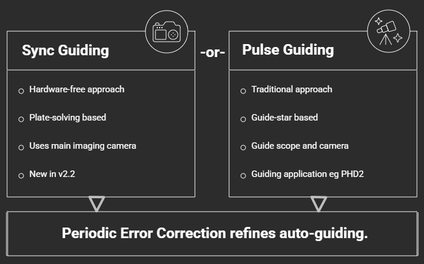

[Home](../README.md) | [Hardware](./hardware.md) | [Installation](./installation.md) | [Pilot](./pilot.md) | [Control](./control.md) | [Stellarium](./stellarium.md) | [Nina](./nina.md) | [CCDciel](./ccdciel.md) | [Guiding](./guiding.md) | [Troubleshooting](./troubleshooting.md) | [FAQ](./faq.md)

# Guiding Users Guide
[Sync-Guiding](#approach-1-plate-solvesync-guiding-hardware-free) | 
[Pulse-Guiding](#approach-2-pulse-guiding-hardware-based) | 
[Periodic Error Correction](#proactive-auto-guiding-refinement)  |
[PHD2: Pre-requisites](#2-phd2-guiding-prerequisites) | 
[Equipment Setup](#3-phd2-equipment-setup) | 
[Calibration](#4-phd2-calibration) | 
[Workflow](#5-pulse-guiding-with-phd2) |

Guiding is a general concept that refers to any method used to correct tracking errors. It includes manual-guiding, auto-guiding, encoder-assisted guiding, and software based corrections. 

## Alternate Auto-Guiding Approaches

**Auto-Guiding** is a broad term for any method used to automatically correct for tracking errors. While the Alpaca Driver’s Multi-Point-Alignment model (QUEST) provides an excellent foundation for tracking, physical factors like **periodic error**, **mechanical error**, and **polar mis-alignment**, can still cause star trailing and drift. 

The Benro Polaris has a **periodic error** measured at **over 14 arc minutes**, with a repeating **35-minute** cycle. To achieve improved results, the driver supports two distinct auto-guiding approaches:
1.  **Sync Guiding:** A hardware-free, software-based approach using your main imaging camera.
2.  **Pulse Guiding:** A traditional hardware-based approach using a dedicated guide scope and camera.

#### **Approach 1: Plate-Solve/Sync Guiding (Hardware-Free)**

This innovative approach finally solves the drift problem without requiring a separate guide scope or camera. By using the main imaging camera to periodically "re-anchor" the alignment model, the driver can effectively correct for tracking drift.

*   **How it Works:** When you perform a **plate-solve sync without slewing**, the driver no longer treats it as a simple Multi-Point-Alignment update. Instead, it interprets the residual error as a **guiding correction**. 
*   **The Recommended Workflow:**
    1.  **Initialise:** Perform your standard Multi-Point Alignment (MPA) and slew to your target.
    2.  **Automate:** Configure your capture software (like NINA) to perform a **"Solve and Sync" every 2 to 5 minutes** as part of your imaging sequence.
    3.  **Result:** The driver will automatically refine the alignment and PEC model with every sync, keeping the target perfectly centered.
*   **Primary Benefits:**
    *   **No Extra Hardware:** Eliminates the cost, weight, and cable management of a guide scope and camera.
    *   **Superior Accuracy:** Full-frame plate-solves provide much higher resolution and more reliable data than traditional single-star guiding.
    *   **Faster Operation:** Guiding happens "in-place" during your normal sequence; no more repetitive slew-and-center cycles.

#### **Approach 2: Pulse Guiding (Hardware-Based)**

Pulse Guiding is a high-speed feedback mechanism that uses a dedicated camera to monitor a guide star's position. This remains the gold standard for correcting high-frequency errors **within a single exposure**.

*   **How it Works:** An external application (such as **PHD2**) monitors a guide star and sends "pulse corrections" to the driver. The driver interprets these as temporary velocity changes, nudging the mount back into alignment without interrupting the underlying sidereal motion.
*   **Primary Benefits:**
    *   **Sub-Exposure Correction:** Corrects tracking errors immediately as they happen, preventing stars from turning into "footballs" during a long frame.
    *   **Long Exposures:** Ideal for very deep-sky imaging where exposures may exceed 2 or 5 minutes.
    *   **Improved Control:** Version 2.2 incorporates improvements to the accuracy of **Pulse Guiding*, improving the reliability of calibration and corections.
    
## Proactive Auto-Guiding Refinement

Version 2.2 incoporates a significant step forward in tracking accuracy when you use either approach to auto-guiding. **Periodic Error Correction (PEC)** is a specialized, proactive layer that sits **below either auto-guiding approach**. It does not replace guiding; rather, it uses the data provided by either Sync or Pulse guiding to build a superior tracking model.

*   **Proactive Modeling:** While guiding is reactive (fixing errors after they happen), PEC develops a **recursive least squares model** to estimate instantaneous drift rates. This allows the driver to **anticipate** mechanical oscillations and apply fine-grained corrections every **200ms**.
*   **Dual Support:** PEC learns from whichever guiding data is available. It monitors the "pulses" from PHD2 or the "residuals" from Plate-Solve Syncs to refine its understanding of the 35-minute gear cycle. 
*   **Convergence:** To ensure high fidelity, the PEC model only begins applying proactive corrections once it meets strict statistical criteria, such as a low **P-value**, a low **rmse**, and an **R² value** indicating good fit.
*   **Integration:** This implementation is fully integrated into the **PID control loop**, enabling the Benro Polaris to maintain pinpoint stars even during long exposures by effectively "killing" the periodic error before it manifests.

 
 
 

---

This remainder of this document introduces how to use **PHD2** and pulse-guiding with the **Alpaca Benro Polaris Driver** on a **Benro Polaris mount**. It is intended for users who are new to pulse-guiding, as well as those transitioning from unguided imaging.

## 1. Pulse Guiding Introduction

>VIDEO DEMO: [27 - Guiding the Alpaca Benro Polaris](https://youtu.be/dn1nLxT5eWw)

### Why Use Pulse-Guiding?

Pulse-guiding is used to correct **small tracking errors and drift** that occur during long-exposure or long-session astrophotography. Even with good multi-point alignment and careful setup, small mechanical imperfections, AHRS drift, atmospheric effects, and tracking rate errors may cause stars to slowly trail or drift over time. Pulse-guiding helps correct many of these issues.

For the Benro Polaris, the **primary benefit of pulse-guiding is eliminating drift**, enabling longer more consistent imaging sessions. It’s important to set realistic expectations. Pulse-guiding cannot fix:

* Poor focus, optical issues, or unfavourable seeing conditions
* Vibrations caused by tripod flexure, ground instability, or wind
* Mechanical binding, balance problems, cable drag or obstructions
* The inherent mechanical in-precision of the Polaris

> Note: Pulse-guiding is totally optional. You can still obtain excellent DSO images without the use of pulse-guiding. Pulse-guiding is not a replacement for good setup, it is a **fine correction tool**, not a cure-all.

### How does Pulse-guiding work?
Pulse-guiding is controlled by a separate guiding application that connects to the guiding camera as well as the Alpaca Driver. The guiding application operates by:
* Continuously monitoring a selected guide star (or stars) from the guide camera
* Measuring small deviations from the star’s expected position
* Sending **pulse-guiding correction commands** to the Alpaca Driver

The Alpaca Driver then:
* Refines the target's equatorial setpoints
* Translates these corrections into motor-level adjustments
* Sends the updated motion commands to the Benro Polaris mount

### What Guiding Applications are supported?

The Alpaca Driver exposes pulse-guiding commands through the **ASCOM Alpaca ITelescopeV3 Interface**. Any guiding application that supports this pulse-guiding interface can work with the Alpaca Driver.
The following guiding solutions have been tested with v2.0:

* **CCDciel’s Pulseguider** — provides integrated guiding, including star selection, calibration, and corrections. Ideal for macOS and non-NINA platforms.
* **PHD2** (used alongside **NINA**) — PHD2 handles guiding, while NINA manages imaging and dithering (via PHD2)
* **NINA Direct Guider** — enables dithering without a guide scope. Not recommended as we have not seen significant improvements with this solution.

The remainder of this secion will focus on the second solution, using **PHD2**.

## 2. PHD2 Guiding Prerequisites

### 2.1 Hardware Purchases and Software Installation
To perform auto-guiding you will need some additional equipment, including the following. See [Hardware Pulse-Guiding Equipment](./hardware.md#guiding-scope-and-camera-optional) for more details.
* A **Guide scope** (eg SVBony SV106 Guide Scope), or an off-axis guider (OAG)
* A **Guide camera** (e.g. ToupTek GPM462M, ZWO ASI120MM, ZWO ASI220MM, etc.)
* Suitable **Mounting equipment** 

You will also need to download and install the following software onto the Mini-PC.
* **ASCOM Platform** - Download latest ASCOM Platform from the [ASCOM Home page](https://ascom-standards.org/index.htm)
* **PHD2 Guiding Application** - Download free PHD2 application from the [PHD2 Download page](https://openphdguiding.org/downloads/)

### 2.2 ASCOM Telescope and Rotator Setup
Once the ASCOM Platform is been installed, you need to use the **ASCOM Diagnostics App** to create a dynamic driver link to the Alpaca Driver's Telescope and Rotator. This step makes the Alpaca Driver's Telescope and Rotator available to all ASCOM-compatible applications, including PHD2, and only needs to be done once.

>Note: Nina does not require the ASCOM dynamic driver link to communicate with the Alpaca Driver, as it connects directly via the Alpaca protocol. Unforuntely, PHD2 on Windows only supports ASCOM, so this setup is necessary.

1. Launch **ASCOM Diagnostics App**
2. Select **Choose and Connect to Device** from **Choose Device** menu
3. Select **Telescope** from the dropdown, then click **Choose**
   * On the **ASCOM Telescope Chooser** dialog, click **Alpaca** from the menubar
   * Click **Discovery Enabled** until it is green
   * Click **Discover Now**
   * Using the dropdown, choose each **NEW ALPACA DEVICE**, Clicking **Ok** twice on each one, until no more new alpaca devices are present in the dropdown.
   * On the **ASCOM Telescope Chooser** dialog, click **Alpaca** again
   * Click **Manage Devices** to list all the new alpaca devices you added.
   * Review the **IP Address** of each Telescope driver listed, and remove all unwanted drivers.
   * Aim to leave only one Telescope driver so it is easier to choose the correct one from PHD2. 
   * Click **Close** when complete.
   * Using the dropdown, choose the **Alpaca Benro Polaris Telescope** you kept
   * Click **Ok**
   * Click **Connect** to confirm the Alpaca Driver Telescope is setup. 
4. Select **Rotator** from the dropdown, then click **Choose**
   * On the **ASCOM Rotator Chooser** dialog, click **Alpaca** from the menubar
   * Click **Discovery Enabled** until it is green
   * Click **Discover Now**
   * Using the dropdown, choose each **NEW ALPACA DEVICE**, Clicking **Ok** twice on each one, until no more new alpaca devices are present in the dropdown.
   * On the **ASCOM Rotator Chooser** dialog, click **Alpaca** again
   * Click **Manage Devices** to list all the new alpaca devices you added.
   * Review the **IP Address** of each Rotator driver listed, and remove all unwanted drivers.
   * Aim to leave only one Rotator driver AND one Telescope so it is easier to choose the correct one from PHD2. 
   * Click **Close** when complete.
   * Using the dropdown, choose the **Alpaca Benro Polaris Rotator** you kept
   * Click **Ok**
   * Click **Connect** to confirm the Alpaca Driver Rotator is setup. 
5. Close the **Device Connection Tester** dialog box
6. Close the **ASCOM Diagnostics App**

## 3. PHD2 Equipment Setup
Once PHD2 has been installed, you need to perform some initial setup. This includes connecting, focusing and configuring the equipment.

### 3.1 PHD2 Connecting Equipment
Connecting PHD2 to the guide camera and Alpaca Driver (one time setup)
1. Ensure your **guide camera** is physically connected and power it on.
2. Ensure the **Alpaca Driver** is running and connected to the Polaris.
3. Launch **PHD2**
4. Select **Guide** from the **PHD2** menubar, then **Connect Equipment**
5. Choose **New Using Wizard**, from the **Manage Profiles** dropdown.
    * Camera: select your **guide camera** from the dropdown list
    * Scope: set your **Guide scope focal length** eg 190mm for SV106. Click **Next**.
    * Mount: select **Alpaca Benro Polaris Telescope (ASCOM)** from the dropdown list. Click **Next**.
    * Leave Adaptive Optices as None (not required), then click **Next**.
    * Rotator: select **Alpaca Benro Polaris Rotator (ASCOM)** from the dropdown list. Click **Next**.
    * Finish the wizard and save the profile.
6. On the **Connect Equipment** diaglog, click the **Camera Setup** button
    * You will find **Camera Setup** next to the Camera **Connect** button
    * Change the Camera Mode to **16 bit**. Click **Ok**.
    * Click **Connect All**, or **Connect** each device individually.
8. Select **Guide** from the **PHD2** menubar, then **Advanced Settings**.
    * Change to the **Camera** tab.
    * Change the **Saturation by Max-ADU Value** to 65535.
    * Click **Ok**

### 3.2 Guide Scope and Camera setup
Focusing, Rotating and Aligning the guide camera (one time setup)
1. Ensure your **main camera** is centered on a recognisable landmark, like a powerline tower, tall building, or tall fixed object, as far away as possible. This can be done during twilight hours or even during daytime.
2. Ensure you have a laptop, tablet or phone, near the guide camera. This will allow you to remote into the Mini-PC running PHD2, make guide camera focus and alignment adjustments, and see the effect immediately.
3. Using **PHD2**, connect to all equipment
5. On the bottom left toolbar of the main PHD2 window  
    - Click **Loop Exposures**. Also available from the **Guide** menubar item.
    - Set an appropriate **Exposure Duration** from the dropdown eg 0.01 s
    - Adjust the **Gamma Adjustment Slider** to see the landmark image 
6. Focus the **guide camera**. eg for an SV106 guide scope
    - Set the helical focuser to half way
    - Slide the lipstick **guide camera** in/out to roughtly focus
    - You may need an extension tube attached to the camera to reach rough focus
    - Fine tune the focus with the helical focuser  
7. Rotate the **guide camera** to orient the landmark so it points upwards correctly.
8. Align the **guide camera** with the **main camera**. eg for an SV106 guide scope
    - Loosen the guide scope **mounting screws**
    - Adjust the mounting screws to point the **guide camera** to the exact same position as seen by the **main camera**
9. Instead of using **PHD2** to focus and align the guide camera you may consider using **Nina**. It provides an excellent **cross-hairs overlay** that can assist with alignment. 
    - Using PHD2, disconnect all equipment
    - Using Nina, open the **Image tab** and enable **cross-hair overlay**
    - Connect to the **main camera** and point mount at the landmark
    - Connect to the **guide camera**, then physically focus, rotate and align.
    - Connect back to the **main camera**

### 3.3 Configuring PHD2 Recommended Settings
Using PHD2, configure the following settings for use with the Alpaca Driver.

* Check **Enable Server** from the Tools menu, to allow Nina to work with PHD2
* Set **Exposure Duration** to 0.5 s as a starting point..
* Adjust **Gamma Adjustment Slider** to make stars visible in PHD2.
* Click the **Brain Button** or choose **Advanced Settings** from the **Guide** menu
    - Select the **Guiding** tab of **Advanced Settings**
    - Enable **Use Multiple Stars** to improve guide star stability and robustness, particularly in poorer seeing or when individual stars fluctuate in brightness.
    - Enable **Assume Dec orthogonal to RA** to help PHD2 achieve a successful calibration.  Geometrically, Right Ascension and Declination are always perpendicular. However, guiding software works in camera pixel space, not celestial coordinates. Factors such as targets near the celestial poles, guide camera rotation, small mechanical tolerances, differential flexure, and polar misalignment can cause RA and Dec to appear non-orthogonal to the guider. With the Alpaca Driver’s multi-point alignment, you should have very good polar alignment. With a stable setup and non-polar targets, it’s generally safe to let PHD2 assume Dec is orthogonal to RA. This can help improve the chances of a good calibration.
    - Ensure **Focal Length** and **Pixel size** is set correctly for your guide scope and guide camera
    - Leave all remaining settings at default to start with

### 3.4 Configuring Alpaca Driver settings
Using Alpaca Pilot, configure the following Alpaca Driver guiding settings.

* **Guide Rate** - I typically use **0.75× Sidereal**, but the default **1.0×** also works well in most cases. If you feel the guiding application is pushing the mount around too much, causing it to oscillate, you can reduce the **Guide Rate**. Typically the RA and Dec guide rates are matching. This can be adjusted on the Alpaca Pilot *Settings* page.

* **Sidereal Tracking** - For guiding to work, sidereal tracking **must be enabled** in the driver. The tracking rate must be set to **Sidereal** and auto-guiding is not suitable for Lunar, Solar, or Custom Orbital tracking.

* **PID Tuning** - When autoguiding is active, you can monitor the pulse guide commands and shifts in Right Ascension and Declination Setpoints from the PID Tuning page.

* The **EQ vs Az/Alt Mode** in the Alpaca Dashboard does **not** affect guiding. It only changes which coordinate system is displayed on the radial dials.

 

## 4. PHD2 Calibration
Calibration determines how your mount responds to guide pulses in Right Ascension (RA) and Declination (Dec). During this process, **PHD2** measures how far and in what direction a guide star moves in response to controlled pulse commands. It then builds a model that allows it to calculate the precise pulse corrections required to counteract tracking drift.

For best results, calibration should be performed under the following conditions:

* **Within ±20° of the celestial equator (Dec ≈ 0°)**
  Near the celestial equator, guide pulses produce the largest and most measurable star movement, resulting in more accurate calibration data.

* **Within one hour of the celestial meridian**
  Calibrating near the meridian minimizes atmospheric refraction and mechanical flexure effects, providing a more stable and representative measurement of mount behavior.

* **Using the same Position Angle as the intended imaging target**
  The guide camera orientation must match the equatorial rotation orientation used during imaging so that the calibrated RA and Dec movement vectors align correctly with the image axes.

* **Close to the intended imaging target** 
  RA/Dec guide commands are translated into coordinated motor movements whose relationship varies with sky position. Calibrating near the imaging target ensures the transformation between guide corrections and motor motion remains accurate. If the mount is slewed after calibration, avoid large pointing changes and maintain the same position angle.

Following these guidelines ensures calibration is accurate, reliable, and representative of actual guiding conditions.

### 4.1 Calibration Process
To Calibrate PHD2, use the Calibration Assistant:
1. Considering the guidelines, slew the Polaris close to your imaging target, using Nina, Stellarium or Alpaca Pilot.
2. Enable Sidereal Tracking.
3. Using **PHD2**, connect all equipment.
4. Click **Calibration Assistant** from the **Tools** menu item.
4. Note the current **Pointing Location**
6. Enter the **Calibration Location**
    - Enter a **Declination** the same as your current **Pointing Location Declination**
    - Enter a **Meridian offset** greater than ±25°, but below ±80°. ie Exclude near vertical, and near Horizon.  
    - Click **Slew** to move the mount to the **Calibration Location**
7. Click **Calibrate** to being the calibration process, typically takes 1–3 minutes

PHD2 will then start sending a sequence of pulse guide commands, monitoring how the mount moves in response to the commands. It will walk out the Right Ascension axis and back, then do the same for the Declination axis. You can monitor its progress with Alpaca Pilot.

Once the calibration process is complete, PHD2 will sumamrise the results in a popup window. You can then decide whether to **Accept calibration** or **Discard calibration**. You can also review the most recent calibration data by choosing **Review Calibration Data** from the **Tools** menu item.

A good calibration looks like the following image. Red dots indicate measured position for declination change. Blue does indicate measured position for RA change. White dots indicate reverse measurements.

### 4.2 Calibration Errors

As the Alpaca Driver needs to convert RA and Dec pulses into suttle changes in M1-M3 motion speeds there can be some cross-coupling between axes, unlike an equatorial mount. This can mean that the Polaris can be slower to respond to guide pulses, or deviate slightly from expected motion, so calibration may occasionally report warnings or errors. For example:

- **Calibration failed – star did not move enough**    
    Usually due to the **Guide Rate** being too low (increase on Alpaca Pilot Settings)    
    Or the **Calibration Step size** too small (increase in PHD2, Advanced Settings, Guiding ).  
    Monitor the RA and Dec movement from Alpaca Pilot, PID Tuning page, to diagnose further.

- **Calibration failed – RA or Dec did not reverse**    
    PHD2 did not detect movement when reversing RA or Dec direction.  
    Usually due to excessive backlash or mechanical slack or sticktion  
    Try increasing **Guide Rate** or **Calibration Step size**.

- **The RA and Declination angles computed in the calibration are questionable**  
    Check that you enabled **Assume Dec orthogonal to RA**, as this will force the orthogonality error to zero.

### 4.3 Re-Calibration

PHD2 assumes that the mapping of RA and Dec pulses to pixel motion on the guide camera are fixed, as per an Equatorial mount. This implies that the Calibration only needs to be repeated if:

* You physically rotate the guide camera relative to the mounts RA or Dec axis.
* You slew to a new DSO and have a different Position Angle.
* You change the roll angle for framing, indrectly changing the Position Angle.
* You change any equipment like the guide scope or main camera or lens focal length

If you have a separate ZWO Rotator on just the main imaging sensor, and the guide camera is fixed relative to the mount, then you do not need to recalibrate on ZWO Rotator changes.

##  5. Pulse-Guiding with PHD2

Once you have calibrated PHD2, auto-guiding with PHD2 is relatively simple. If you have configured Nina to use PHD2, it will automatically run through steps 1 through 4 for you. 
1. Start **PHD2** and **Connect All Equipment**
2. Click **Begin Looping Exposures** to start the guide camera
3. Click **Auto-Select Star** to select a guide star
4. Click **Begin Guiding** to start the auto-guiding process

To monitor the guiding performance, use the **View** menu in PHD2
1. Click **Display Graph** to show the auto-guiding history.
2. Click **Display Target** to show spread of motion of the guide star.
3. Click **Display Star Profile** to show the expanded guide star pixel profile.
4. Click **Display Stats** to summarise the guiding performance.

 

Below is a typical Graph and Statistics of an auto-guiding session.

* The Polaris has been tested to be capable of RMS Error of around 1.5 to 3.0 arc-seconds.
* Small oscillations are normal
* Large or runaway corrections indicate setup issues
* Initial results may not be perfect. Allow guiding to settle for a few minutes.

## 6. Final Notes

Guiding with PHD2 and N.I.N.A. can feel **finicky at first**, especially at longer focal lengths. Once dialed in, it dramatically reduces drift and enables longer, cleaner exposures.

Focus on star quality rather than graph perfection, make one change at a time, and keep notes of what works.

 
 

