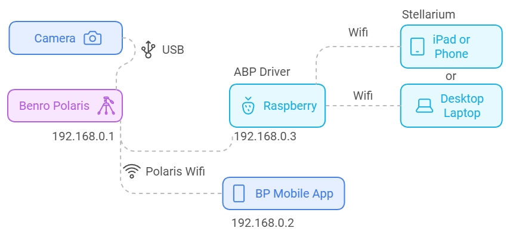
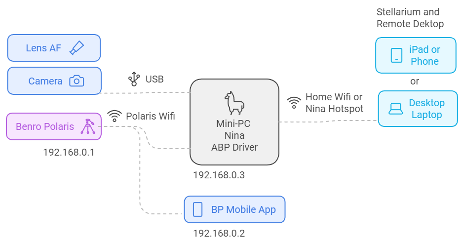
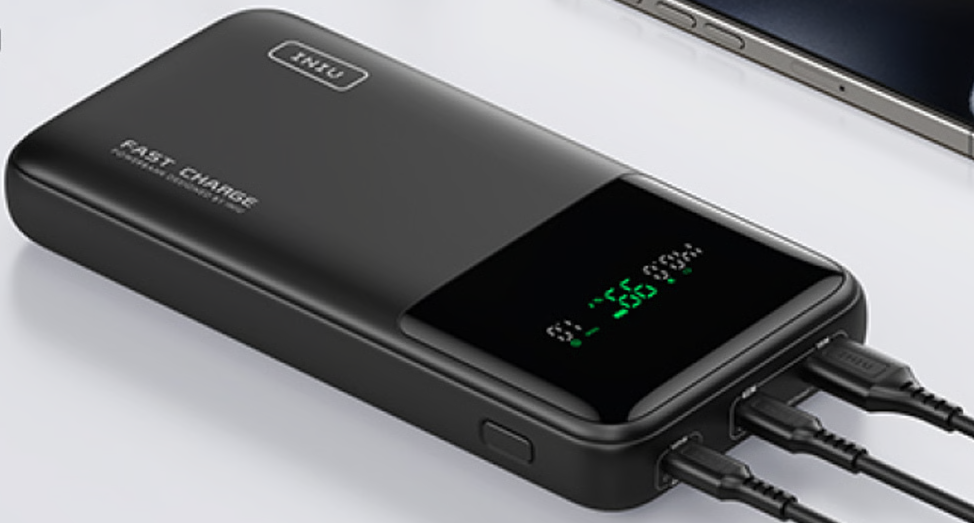

[Home](../README.md) | [Hardware Guide](./hardware.md) | [Installation Guide](./installation.md) | [Using Stellarium](./stellarium.md) | [Using Nina](./nina.md) | [Troubleshooting](./troubleshooting.md) | [FAQ](./faq.md)

# Recommended Hardware Platform
## Using a Laptop with Stellarium Desktop
You can install the Alpaca Benro Polaris Driver on any platform that supports Python and Wifi. Installing it on your laptop or desktop in your Benro Polaris wifi range is an excellent place to start. You'll need to install the ASCOM Platform, Python, and Stellarium. This will allow you to use Stellarium to find Deep Sky objects, command the Benro Polaris to Skew to them, and watch its position update in real-time.


## Using a Raspberry Pi for the driver
You can install the Alpaca Benro Polaris Driver on a Raspberry Pi. This would allow remote applications to control the Benro Polaris. See the [Raspberry Pi Setup Guide](./raspberrypi.md) for more information.



## Using Docker to host the driver
You can create a Docker image with the Alpaca Benro Polaris Driver. See the [Docker Setup Guide](./docker.md) for more information.

## A Mini-PC to control all your astronomy equipment (Recommended)
To leverage more of the capabilities of the Alpaca Benro Polaris Driver, I'd recommend installing it on a mini-PC you can mount or hang from your tripod. This way, you can create an equivalent of a  [ZWO ASIAIR plus](https://www.zwoastro.com/product/asiair-plus/) that can control all your astronomy equipment. Let's call it a `NinaAir` instead of an ASIAir!



You can control everything from an iPad or Phone connected to your Home Wifi or NinaAir Hotspot. The iPad or Phone would be running (a) StellariumPLUS connecting to the Driver, and (b) a Mobile Remote Desktop App connecting to the Mini-PC to control Nina.

Alternatively you could use a Desktop or Laptop to do the same thing. The Desktop or Laptop would be running (a) Stellarium Desktop connecting to the Driver, and (b) Remote Desktop connecting to the Mini-PC to control Nina.

The mini-PC should be small, fan-less, fast, and power efficient. This way, you can mount the mini-PC on your tripod, it won't cause any vibrations, it can store and process your images, and it can run for a whole night on a battery. I'd recommend the [MeLE Mini PC Quieter 4C](https://www.amazon.com/MeLE-Mini-Quieter-4C-Astrophotography/dp/B0CP3YL6J7) (only around US$200 from Amazon on sale). See Cuiv's review of the [Quieter 4C Mini-PC](https://www.youtube.com/watch?app=desktop&v=j8lcDyw1toQ). 


Unfortunately its built in Wifi doesnt support connecting with the Benro Polaris Wifi, so you'll also need something like [TP-Link AC600 USB WiFi Adapter](https://www.amazon.com/wireless-USB-WiFi-Adapter-PC/dp/B07P5PRK7J/) (only US$17 from Amazon). While the NinaAir will be setup to be able to run without internet connectivity, having the extra Wifi Adapter will allow you to connect to both the Benro Polaris and the Internet at once.

## Powering the Mini-PC and Camera overnight
A battery I'd recommend is the [INIU 140W Power Bank](https://www.amazon.com.au/dp/B0CB1FWNMK). What an awesome product, 27000mAh of storage with 140W fast charging and discharging capabilities! I use this powerbank to power the mini-PC and my camera. 



The NinaAir connects to the camera via USB-C, so it can control the lens AF as well as capture and process images. You only need to connect the camera to the Benro Polaris for initial setup and star alignment. Unfortunately the Quieter 4C doesnt provide enough output over USB-C to power the camera, so I run a separate [USB-C Power Adapter for LP-E6](https://www.amazon.com.au/dp/B08PD8Z3JG) from the power bank  directly into the camera for power. 

After one night of failed images with a dewed up lens, I also have a [NEEWER USB Lens Heater](https://www.amazon.com/Telescope-Temperature-Regulator-Condensation-Astrophotography/dp/B0C6Q4YFFC) which I power from a separate power bank, as it can be power hungry, although less critical. If I had more equipment to power, like a cooled astronomy camera or a laptop in the outback, I'd consider upgrading to a [Jackery Portable Power Station 500](https://www.amazon.com.au/Jackery-Portable-Explorer-Generator-Adventure/dp/B08744R27F).


## Setting up the NinaAir platform
The folllowing steps are a high level summary of the required setup for the NinaAir platform. It is not comprehensive and only provided as a guide to how you may wish to setup your mini-PC.

### Local Account
Use a local account with administrative privellages to set everything up. Using a Microsoft Account may have implications on the need for internet connectivity. 

To create a local account:
1. In the Settings app select Accounts > Other users 
2. Under Add other user, select Add account
4. Select the option Add a user without a Microsoft account
5. Select Add a user without a Microsoft account
6. Complete the user details
7. Under Account Options, select Change account type
8. Select Account Type `Administrator` then click `OK`

### Power saver functions
Make sure that your power saver functions are set so that your computer will not go to sleep/hibernate mode. Also its useful to disable your screensaver.
You need to set the Power Management to High Power.

### Remote Desktop Server
Enable Remote Desktop Server to allow access from your laptop.
Open Settings > System > Remote Desktop > Enable, Set Password.
Disable the Require Devices to use Network Level authentication.

### Hosting a Mobile Hotspot (OPTIONAL)
This step is totally optional and only needed if you want to use the NinaAir at a remote location where there is no Wifi connection. Windows 11 allows you to setup your own WiFi hotspot hosted on the NinaAir. This allows you to connect directly to the NinaAir's Wifi and operate it via Remote Desktop.

#### Hotspot: Install Loopback Driver (OPTIONAL)
In order to create a hotspot, Windows 11 needs to create a tether to an existing network connection. When in the outback you may not have internet connectivity so we'll link the hotspot to a Loopback driver

1. Open Device Manager. This can be done by right clicking on the start menu and clicking Device Manager.
2. Select the computer name at the top of the list
3. In the Action menu, select "Add legacy hardware"
4. Click the "Next" button
5. Select "Install the hardware that I manually select from a list"
6. Select "Network Adapters"
7. Click the "Next" button
8. On the left side, select "Microsoft" Note: It may take a moment for these lists to appear and populate, depending on the speed of your mini-PC
9. On the right side, select "Microsoft KM-TEST Loopback Adapter"
10. Click the "Next" button
11. Click the "Next" button
Open the Control Panel This can be done by opening the start menu and searching for "Control Panel"
12. Click "Network and Internet"
13. Click "Network and Sharing Center"
14. Click " Change adapter settings" on the left
15. Rename the KM-TEST loopback adapter to "Loopback"
16. The right click and select "Rename" may not work. If not, you can select the device, press the F2 key, then type the new name
17. Restart the mini-PC

#### Hotspot: Create a Scheduled Task to start mobile hotspot on boot (OPTIONAL)
Because you will want this to run headless and won't have a way to start it manually, this needs to start automatically at boot time. 

1. Run Task Scheduler
2. Create a new Task called StartMobileHotspot
3. Change general to run when user is logged on or not
4. Change trigger to "At system Startup"
5. Change action to "Start a program" linking to 

   `alpaca-benro-polaris\platforms\win\StartMobileHotspot.cmd`

6. Change conditions to uncheck only start if on AC power

#### Hotspot: Fixing Remote Desktop 0x904 error (OPTIONAL)
You may encounter an 0x904 error when using Remote Desktop to connect to NinaAir via its hotspot. If you encounter this issue, you can try downloading Remote Desktop from the Windows Store. This has successfuly resolved the 0x904 issue on some machines.

### Development Setup (OPTIONAL)
The follow steps are totaly optional and only required if you want to use VS Code to help make changes to the driver.
No support is  provided for changed drivers.

#### Setting up OpenSSH Server on Win11 (for Remote VS Code)
Using Powershell as Administrator run the following commands
```
Add-WindowsCapability -Online -Name OpenSSH.Server
Start-Service sshd
Set-Service -Name sshd -StartupType 'Automatic'
Get-Service sshd
New-NetFirewallRule -Name sshd -DisplayName 'OpenSSH Server (sshd)' -Enabled True -Direction Inbound -Protocol TCP -Action Allow -LocalPort 22
```
#### Download git for Windows
Download git for use with VS Code from https://git-scm.com/download/win
