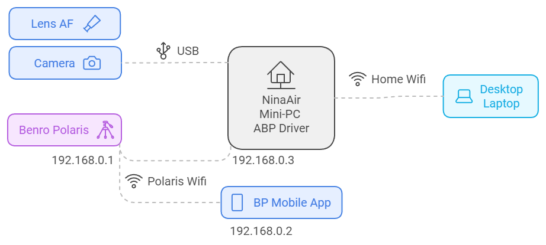

[Home](../readme.md) | [Hardware Guide](./hardware.md) | [Installation Guide](./installation.md) | [Using Stellarim](./stellarium.md) | [Using Nina](./nina.md)

# Recommended Hardware Platform
## Using Just a Laptop with Stellarium
You can install the Alpaca Benro Polaris Driver on any platform that supports Python and Wifi. A good place to start is simply installing it on your laptop or desktop that is in wifi range of your Benro Polaris.  You'll need to install the ASCOM Platform, Python, and Stellarium. This will allow you to use Stellarium to find Deep Sky objects, command the Benro Polaris to Skew to them, and watch its position update in real time.

## A Mini-PC to control all your astronomy equipment
To leverage more of the capabilities from the Alpaca Benro Polaris Driver, I'd recommend installing it on a mini-PC you can mount or hang from your tripod. This way you can create your equivalent of a [ZWO ASIAIR plus](https://www.zwoastro.com/product/asiair-plus/) that can control all your astronomy equipment. Lets call it a `NinaAir` instead of an ASIAir!

The mini-PC should be small, fan-less, fast and power efficient. This way you can mount the mini-PC on your tripod, it wont cause any vibrations, it can store and process your images, and it can run for a whole night on a battery. The mini-PC I'd recommend is the [MeLE Mini PC Quieter 4C](https://www.amazon.com/MeLE-Mini-Quieter-4C-Astrophotography/dp/B0CP3YL6J7) (only around US$200 from Amazon on sale). See Cuiv's review of the [Quieter 4C Mini-PC](https://www.youtube.com/watch?app=desktop&v=j8lcDyw1toQ). 

Unfortunately its built in Wifi doesnt support connecting with the Benro Polaris Wifi, so you'll also need something like [TP-Link AC600 USB WiFi Adapter](https://www.amazon.com/wireless-USB-WiFi-Adapter-PC/dp/B07P5PRK7J/) (only US$17 from Amazon). While the NinaAir will be setup to be able to run without internet connectivity, having the extra Wifi Adapter will allow you to connect to both the Benro Polaris and the Internet at once.

## Powering the Mini-PC and Camera overnight
A battery I'd recommend is the [INIU 140W Power Bank](https://www.amazon.com.au/dp/B0CB1FWNMK). What an awesome product, 27000mAh of storage with 140W fast charging and discharging capabilities! I use this powerbank to power the mini-PC and my camera. 

The NinaAir connects to the camera via USB-C, so it can control the lens AF as well as capture and process images. You only need to connect the camera to the Benro Polaris for initial setup and star alignment. Unfortunately the Quieter 4C doesnt provide enough output over USB-C to power the camera, so I run a separate [USB-C Power Adapter for LP-E6](https://www.amazon.com.au/dp/B08PD8Z3JG) from the power bank  directly into the camera for power. 

After one night of failed images with a dewed up lens, I also have a [NEEWER USB Lens Heater](https://www.amazon.com/Telescope-Temperature-Regulator-Condensation-Astrophotography/dp/B0C6Q4YFFC) which I power from a separate power bank, as it can be power hungry, although less critical. If I had more equipment to power, like a cooled astronomy camera or a laptop in the outback, I'd consider upgrading to a [Jackery Portable Power Station 500](https://www.amazon.com.au/Jackery-Portable-Explorer-Generator-Adventure/dp/B08744R27F).

