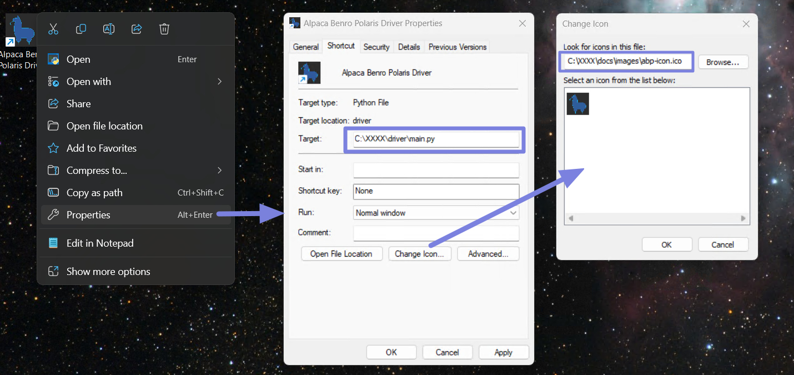
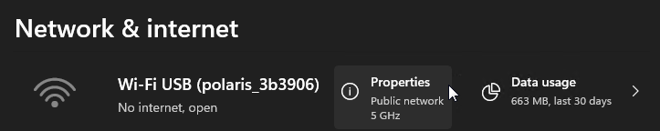
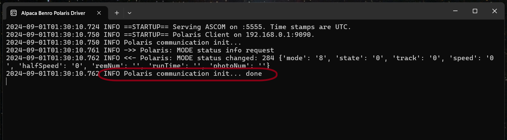

[Home](../README.md) | [Hardware Guide](./hardware.md) | [Installation Guide](./installation.md) | [Using Stellarium](./stellarium.md) | [Using Nina](./nina.md) | [Troubleshooting](./troubleshooting.md) | [FAQ](./faq.md)

# Installation Guide 


## Software Installation

### Installing Alpaca Benro Polaris and its pre-requisites
#### To install on MAC
Please refer to the separate [MAC installation guidelines](./installation_macos.md).

#### Windows 11 Installation Video Demonstration
You can view a demonstration of parts of this documentation in the following YouTube Video.
[](https://www.youtube.com/watch?v=ipbWT54afhY)

#### To Install on Windows 11
The Alpaca Benro Polaris requires Python 3+ and some libraries to be installed before it can run.

1. Download and install Python 3+ from the [Microsoft Store](ttps://apps.microsoft.com/detail/9nrwmjp3717k)
 or [Python website](https://www.python.org/downloads/).

2. Download the [Alpaca Benro Polaris zip file ](https://github.com/ogecko/alpaca-benro-polaris/archive/refs/heads/main.zip) from this Github repository.

3. Expand the zip file to a location of your choice. We reccommend `C:\Users\`Username`\Documents`. Using Windows Explorer, right-click on the folder you just expanded to, and select `Open in Terminal` to open a Command Window. Enter the following: 
  
    ```
    C:\Users\Nina\Documents\alpaca-benro-polaris-main> pip install -r platforms/win/requirements.txt
    ```
4. Optionally, you can copy the file `platforms\win\Alpaca Benro Polaris Driver.lnk` to your desktop, right-click to modify properties, and change the fields `Target`, and `Icon` to point to the location you expanded the zip file. Note the `Target` has two XXXX paths you need to modify.
    ```
    Target: C:\XXXX\driver\main.py --logdir C:\XXXX\driver
    Icon: C:\XXXX\docs\images\abp-icon.ico
    ```

    


### Running the Alpaca Benro Polaris Driver

There are a few preliminary steps before you start the driver. You'll need to do the following:
1. Setup your Benro Polaris tripod head, camera, mini-pc, and power.
2. Remove your lens cap (I often forget this step!).
3. Level the Benro Polaris as accurately as possible (important. See [Troubleshooting B3](./troubleshooting.md)). 
4. Turn on the Benro Polaris (how many times doesn't it turn on? See [Troubleshooting B1](./troubleshooting.md)).
5. Using the Benro Polaris App, connect and change to `Astro Mode`.
6. Start the `Calibrate Compass` and tap `Confirm`.
7. Select a star to align with, tap `Goto`, wait, then tap `Confirm`. 
8. Turn on the mini-pc and connect it to your camera via USB.
9. Using the USB Wifi adapter, connect your mini-PC to the polaris-###### hotspot.
10. Choose `Connect Automatically` and click `Connect`.
11. Wait for connection. It should show: `No internet, open`. 
    
 

12. If it isnt already, we recommend changing the Polaris Hotspot connection on the Mini-PC to Public Network. From Win11 Network & Internet Settings, click Polaris Wifi Properties, then choose Public Network.


13. IMPORTANT: One last step is to review the file  `driver/config.toml`. You will need to change the `site_latitude` and `site_longitude` to ensure the driver calculates the correct slewing co-ordinates for your location. All other settings can be left as default or tweaked. 

14. Now you can start the Alpaca Benro Polaris driver using the shortcut or the following command.
    ```
    C:\Users\Nina\Documents\alpaca-benro-polaris-main> python driver\main.py
    ```

Fingers crossed, you can now start the Alpaca Benro Polaris Driver (as above).

The Alpaca Benro Polaris Driver window should look like this.


Once the driver is running, you can close the Benro Polaris App. Now you can start exploring ASCOM applications like Stellarium and Nina, or even write your own REST-based application.

### Troubleshooting
If you don't see the `communications init... done` message then you may want to check the [Troubleshooting Guide](./troubleshooting.md) for steps to diagnose and fix any issues.

### Updating the Driver
To update the Alpaca Benro Polaris Driver to the latest version:
1. Download the latest [Alpaca Benro Polaris zip file](https://github.com/ogecko/alpaca-benro-polaris/archive/refs/heads/main.zip) from this Github repository.
2. Stop the driver by selecting its Window and pressing Ctrl+C.
3. Extract the files, overwriting the old files.
4. Restart the Driver.
5. If you can complete steps 2-4 within a minute, you won't need to use the BP App to re-establish the Polaris Wifi.
   
### Installing the ASCOM Platform (OPTIONAL)
ASCOM stands for Astronomy Common Object Model. It is a universal standard for Astronomy and used by many different applications and equipment manufacturers. The standard was modernised with a HTTP/REST API in 2018 under the ASCOM Alpaca initiative. This `Alpaca Benro Polaris Driver (ABP) commplies with the ASCOM ITelescopeV3 interface and provides an Alpaca ASCOM  REST API. 

You may need to install the ASCOM Platform software for compatibility with some astronomry equipment or applications. You will need to install the ASCOM Platform with Stellarium as it is not bundled by default. You do not need to install the ASCOM Platform on a laptop that uses Remote Desktop to access the NinaAir. 

#### To install the ASCOM Platform.
1. Download the ASCOM Platform from https://ascom-standards.org/ (Download buttton on the top-right-hand side of the home page).
2. The remaining instructions assume you are using ASCOM Platform 6.6SP2 
3. Open the installation .exe file and click `Yes` on the User Account Control dialog.
4. Click `Next` to install any pre-requisites eg Microsoft .nett Framework 3.5 Service Pack 1 
5. This can take quite some time to download and install (5 min for me)
6. Once the blue window shows the operation has completed successfully, press any `key` to continue.
7. Accept the ASCOM Platform Installer default options and click `Install`.
8. Click `Finish`.

You can also download other versions from the [ASCOM GitHub Releases Site](https://github.com/ASCOMInitiative/ASCOMPlatform/releases).

### Installing Stellarium (OPTIONAL)
Stellarium is a free open-source planetarium for your computer. 
While there are free and paid Mobile Stelarium Apps and free Web versions, 
I'd recommend using the desktop version as it is full-featured and has been 
tested with ABP.

#### To install the desktop version of Stellarium
1. Download the relevant desktop version from https://stellarium.org/en/
2. The remaining instructions assume you are using v24.2 of the Windows x86 64bit version for Windows 10+
3. Open the installation .exe file and click `Yes` on the User Account Control dialog.
4. Select your language and click `OK`.
5. Select `I accept the agreement` and click `Next`.
6. Choose your installation folder and click `Next`.
7. Select `Start Menu Folder` and click `Next`.
8. Select `For all users` and click `Next`.
9. Click `Install`.
10. Check `Launch Stellarium` and click `Finish`.

#### To Setup Stellarium for initial use
1. Press `F11` to exit full-screen mode.
2. Press `A` to remove the Atmosphere. Press `D`to see Deep Sky Objects.
3. Press `F2` to open the Configuration Dialog.
4. Select the `Extras` tab on the Configuration Dialog menu bar.
5. Click `Get Catalog 5 of 9` and repeat for `6`,`7`,`8` and `9 of 9`.
6. If you are copying Oculars settings, duplicate the following file:
   `C:\Users\XXXXX\AppData\Roaming\Stellarium\modules\Oculars\ocular.ini`

## Installing Nina (OPTIONAL)
Nina is an open-source free software application covering image capture, autofocus, plate-solving, centering, star detection, guiding, and a lot more. Much of this now works with the Benro Polaris (well not guiding yet). The open-source nature makes it a bit more complicated to install and setup, but it's worth the effort - and it's free.

The [Astro What](https://astrowhat.com/) website has a good set of instructions for [Installing Nina and its Pre-requisiites](https://astrowhat.com/articles/setting-up-a-pc-with-n-i-n-a.18/page/installing-n-i-n-a.45/). 

## Software Architecture
The following diagram is provided as a reference to help you undersdtand how the different software modules fit together.

