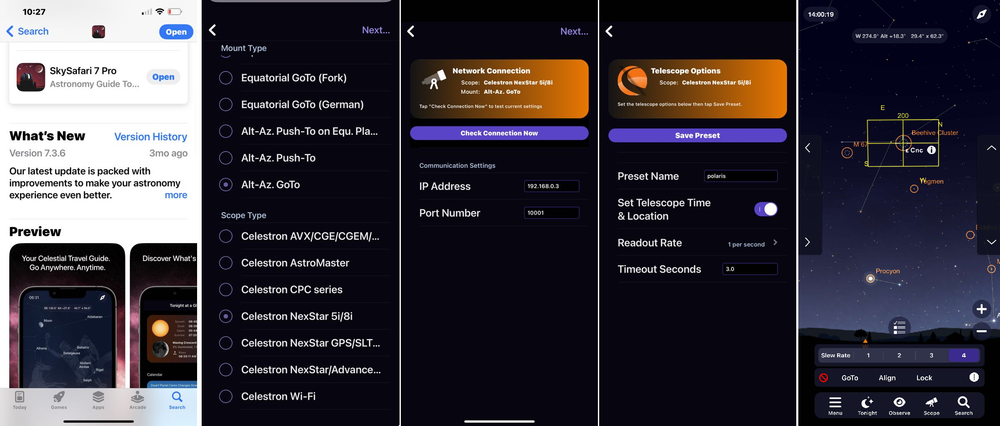
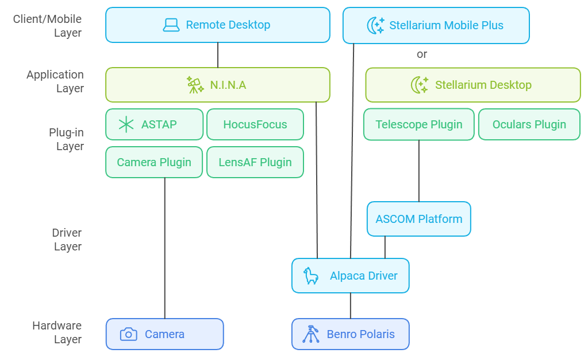

[Home](../README.md) | [Hardware](./hardware.md) | [Installation](./installation.md) | [Pilot](./pilot.md) | [Control](./control.md) | [Stellarium](./stellarium.md) | [Nina](./nina.md) | [CCDciel](./ccdciel.md) | [Guiding](./guiding.md) | [Troubleshooting](./troubleshooting.md) | [FAQ](./faq.md)

# Installation Guide 
[Alpaca Win11](#installing-alpaca-benro-polaris-and-its-pre-requisites) | [Alpaca MacOS](./installation_macos.md) | 
[Startup](#starting-the-alpaca-pilot-app) | 
[Workflow](#imaging-with-alpaca-driver-v20-and-nina) | 
[Stellarium](#installing-stellarium-optional) | 
[Sky Safari](#seting-up-sky-safari-pro-optional) | 
[Nina](#installing-nina-optional) | 
[Architecture](#software-architecture) 


## Software Installation

### To install on a MAC
Please refer to the separate [MAC installation guide](./installation_macos.md).

### To install on a Raspberry Pi
Please refer to the separate [Raspberry Setup guide](./raspberrypi.md).


### To Install on Windows 10/11

You can view a demonstration of parts of this documentation in the following YouTube Video (TODO - change URL when video has been updated).

[](https://www.youtube.com/watch?v=qXRiTLS2EaY)

The `setup.bat` script installs and configures the Alpaca Benro Polaris Driver. It uses [uv](https://docs.astral.sh/uv/) to install Python and the required libraries, and [Git](https://git-scm.com/) to download and update the driver. The setup script also configures the required network ports in Windows Firewall, offers to start the driver automatically when Windows starts, and places a shortcut to the driver on your desktop.

1. **Logon to Windows with an administrator account**

   Use an administrator account so `setup.bat` can offer to start the driver automatically at Windows startup (see Step 4).

   Before continuing, enable Windows Location permissions. The driver needs Location access to scan for and connect to the Polaris Wi-Fi network. Without it, Windows may block the Wi-Fi scan and the driver may report "No Wi-Fi interfaces found".
   
   Open **Settings > Privacy & security > Location** <br>
   Enable **Location services**, as well as **Let apps access your location**, and **Let desktop apps access your location**.
   
2. **Open a Command Prompt**

   Press **Windows + R**, type `cmd`, and press **Enter**.

3. **Download the setup script**
   
   Copy and paste the following command into the Command Prompt, then press **Enter**: 

   ```text
   curl -fL -o setup.bat https://raw.githubusercontent.com/ogecko/alpaca-benro-polaris/dev2_2/platforms/win/setup.bat
   ```

4. **Run the setup script**

   Run the setup script, optionally specifying the version or Git branch to install. In this example, `dev2_2` selects the v2.2 development branch:

   ```text
   setup.bat dev2_2
   ```

   During installation:

   * You will be asked **Start the Alpaca Driver automatically when Windows starts? [N/y]**. Press Enter (the default) to start the driver manually from the desktop shortcut. Type **y** and press Enter to start it automatically; you will then need to enter your **Windows password**.
   * If you chose automatic startup, also accept the **User Account Control** prompt. It is needed to set up the startup task and to open the Windows Firewall for the driver.
   * Wait a few minutes while the required files and software are downloaded and installed.

   When installation is complete, the driver should be up and running, and the script displays the address of the Alpaca Pilot App.

   By default, the driver is installed in `C:\Users\<Username>\alpaca-benro-polaris`

   If the driver does not start automatically, see [Troubleshooting A8](./troubleshooting.md#a8---the-driver-does-not-start-at-boot).

   <details>
   <summary>Advanced options</summary>

   You can provide additional options when running `setup.bat`. For example:

   ```text
   setup.bat -d D:\Astro\Bin\alpaca-benro-polaris dev2_2
   ```

   | Option        | Description                                                                        |
   | ------------- | ---------------------------------------------------------------------------------- |
   | `-d folder`   | Install the driver in the specified folder instead of the default location. The folder is remembered, so later runs use it again without `-d`. |
   | `-p password` | Specify the Windows password on the command line instead of being prompted for it. |
   | `-s`          | Do not configure the driver to start automatically at Windows startup.             |
   | `-y`          | Run unattended and do not pause when the installation finishes.                    |
   | `-v`          | Show every detail on screen. Without it only the steps and any errors are shown, and the details are saved to `%TEMP%\alpaca-setup.log`. |
   | `-h`          | Display the built-in help.                                                         |

   **Starting the driver manually**

   If you skipped automatic startup by using `-s` or by pressing **Enter** at the password prompt, you can start the driver manually in either of the following ways.

   - **Using the desktop shortcut**

      Double-click the **Alpaca Benro Polaris Driver** shortcut that `setup.bat` placed on your desktop.

   - **Using a Command Prompt**

      Run the following command:

      ```text
      cd %USERPROFILE%\alpaca-benro-polaris
      .venv\Scripts\python.exe driver\main.py
      ```

      A console window will remain open while the driver is running.

      The first time the driver runs, Windows may ask whether to allow it through the firewall. Click **Allow access**.

   </details>

### Starting the Alpaca Pilot App

Once the Alpaca Benro Polaris Driver is running, you can access the Alpaca Pilot App from any web browser.

5. **Open a web browser**

   Open **Chrome**, **Edge**, **Firefox**, or another supported web browser.

6. **Open the Alpaca Pilot App**

   Enter the following address in the browser's address bar:

   ```text
   http://ap.local
   ```

7. **Verify that the app opens**

   The Alpaca Pilot App should display the startup screen and switch to the dashboard shown below.

   

### Connecting the Driver to Polaris

Before you can use the Polaris, complete the following steps.

7. **Open the Connect page**

   Click **Connect** in the top toolbar of the Alpaca Pilot window. The Connect page guides you through the steps required to connect the driver to your Benro Polaris device.

8. **Set up and power on the Polaris**

   Set up your Benro Polaris tripod head and turn on the device.

   If you cannot turn on the Polaris, see [Troubleshooting B1](./troubleshooting.md#b1---cannot-start-the-benro-polaris-device).

9. **Complete the connection procedure**
    
   On the **Connect** page in the Alpaca Pilot App, follow each step indicated by a checkmark.

   For detailed instructions, see the [Pilot User Guide – Connecting Devices](./pilot.md#ii-connecting-devices).

   Make sure all applicable checkmarks are green. The final **Multi-Point Alignment** step will remain incomplete until you have successfully aligned on three or more stars.

10. **Verify the connection**

      After the driver has successfully connected to the Polaris, the Alpaca Pilot log — or the driver's console window if you started it manually — should contain:

      ```text
      communications init... done
      ```

      The log should look similar to the following:

      

## Troubleshooting

If you do not see the `communications init... done` message, see [Troubleshooting C1](./troubleshooting.md#c1a---cannot-see-communications-init-done-in-the-log-wi-fi-2-not-connected) for steps to diagnose and resolve connection problems.

## Updating the Driver

To update the Alpaca Benro Polaris Driver to the latest version, repeat **steps 1–3** above.

The update process will:

1. Stop the currently running driver.
2. Download the latest version.
3. Install any required updates.
4. Restart the driver.

Your existing settings and data, including alignment and calibration data, are preserved.


## Imaging with Alpaca Driver V2.0 and NINA

This workflow outlines a typical imaging session using **Alpaca Driver V2.0** with **NINA** and the **Benro Polaris** mount. It assumes you’re already familiar with operating **Alpaca Pilot** and **NINA**. For additional setup and operational guidance on these topics, refer to the documentation for [Alpaca Pilot](./pilot.md) and [NINA](./nina.md).

### Setup and Initialization

1. **Start Alpaca Driver**  
   The driver starts by itself when the PC starts. If you skipped that during installation, launch it by double-clicking the desktop shortcut.

2. **Open Alpaca Pilot**  
   In your browser, navigate to the Alpaca Pilot App.

3. **Power On Polaris**  
   Use a short press followed by a long press to power on the mount.

4. **Confirm Wi-Fi Connectivity**  
   Monitor your Mini-PC wifi and confirm it maintains a stable connection to Polaris.

5. **Connect and Configure Polaris**  
   In the Pilot Connect page:
   - Set **Astro Mode**
   - **Reset all axes** and wait for completion
   - **Skip compass alignment**
   - **Skip single-star alignment**

### Focusing, Alignment and Targeting

6. **Point to Celestrial Polar Area**  
   Using Pilot Alpaca or Nina:
   - Slew the mount to approximately point towards your Celestrial Pole (either North or South)
   - This initial orientation does not need to be accurate
   - Having a high or low Declination reduces star movement for the next step

7. **Initial Focus**  
   - Use your **Camera and lens** to achieve a rough focus
   - Run **NINA’s Autofocus** process for a precise focus.
   - Optionally, if you are using guiding, focus and align your Guide Scope as well.

8. **First Plate Solve (anywhere for Single Point Alignment)**  
   In NINA’s Image tab, 
   - Click on **Start Tracking**
   - Open the Plate Solving panel
   - Manually plate-solve and sync to achieve intial alignment.
   
9. **Second Plate Solve (at Pole for Multi Point Alignment)**  
   In Alpaca Pilot:
   - Enable **Multi-Point Alignment**
   - Search for 'pole' in the Alpaca Pilot Catalog
   - GOTO your local Celestrial Pole and wait for the mount to settle.
   
   Using Nina:
   - Initiate a second plate solve at the Celestrial Pole

10. **Third Plate Solve (at Future Target for Multi-Point Alignment)**  
   In Alpaca Pilot:
    - GOTO your imaging target from the catalog
    - Decrease the Right Ascensian axis by 1 or 2 hours 
    - Once settled, run a third plate-solve in NINA

11. **Fourth Plate Solve (framing Your Target)**  
    Use NINA’s Sky Atlas or Stellarium to locate your target.  
    - Send it to **Framing Assistant**, and view it on Nina's **Offline Sky Map**
    - Use **Slew and Center** to refine positioning via iterative plate-solves.
    - Select **Add Target to Sequence**, **Legacy Sequencer**

### Imaging Sequence

12. **Create a Sequence**  
    In NINA’s Legacy Sequencer:
    - Define image count (e.g., 150) and exposure time (e.g., 30 s)  
    - If not guiding, enable **Slew and Center Target** every 20–30 frames (manually or via Advanced Scheduler)

13. **Start the Imaging Sequence**  
    Begin the sequence from NINA’s Image tab and monitor the first few frames. Let the process settle and zoom into the image view to monitor roundness of stars and tracking quality.

14. **Refine Tracking and Alignment**  
    You can assess and refine tracking performance using the **Alpaca PID Tuning** and **Alignment** pages:

    * PID Tuning Page
        - **Angular Position (PV vs SP)**: PV should closely follow a steady SP ramp on all axes for accurate tracking. Changing to equatorial co-ordinate view will show a steady horizontal SP for Right Ascension, Declination, Position Angle.
        - **Angular Velocity (OP)**: OP should appear as a steady horizontal line, large oscillations may indicate instability. The PID controller will attempt to close any gaps.
        - **RMS Error**: This is a key performance statistic that provides a quick understanding of the tracking performance over the last 30 seconds. A value near **2 arcseconds** is ideal for high-quality tracking.
        - **Pulse Guiding**: Use **equatorial coordinates** to monitor corrections from guiding software. You should see the SP being "bumped" up and down to correct for guide star movement.
        - **Advanced Tuning**: Experienced users can adjust PID parameters to reduce oscillations and improve responsiveness.

    * Alignment Page
        - **Sync Point Residuals**: Review residuals to identify misaligned points.
        - **Model Refinement**: Delete sync points with large residuals to improve the Multi-Point Alignment model.

## Optional Installations
   
### Installing Stellarium (OPTIONAL)
Stellarium is a free open-source planetarium for your computer. 
While there are free and paid Mobile Stelarium Apps and free Web versions, 
I'd recommend using the desktop version as it is full-featured and has been 
tested with ABP.

#### To install the desktop version of Stellarium
1. Download the relevant desktop version from https://stellarium.org/en/
2. The remaining instructions assume you are using v24.2 of the Windows x86 64bit version for Windows 10+
3. Open the installation .exe file and click `Yes` on the User Account Control dialog.
4. Select your language and click `OK`.
5. Select `I accept the agreement` and click `Next`.
6. Choose your installation folder and click `Next`.
7. Select `Start Menu Folder` and click `Next`.
8. Select `For all users` and click `Next`.
9. Click `Install`.
10. Check `Launch Stellarium` and click `Finish`.

#### To Setup Stellarium for initial use
1. Press `F11` to exit full-screen mode.
2. Press `A` to remove the Atmosphere. Press `D`to see Deep Sky Objects.
3. Press `F2` to open the Configuration Dialog.
4. Select the `Extras` tab on the Configuration Dialog menu bar.
5. Click `Get Catalog 5 of 9` and repeat for `6`,`7`,`8` and `9 of 9`.
6. If you are copying Oculars settings, duplicate the following file:
   `C:\Users\XXXXX\AppData\Roaming\Stellarium\modules\Oculars\ocular.ini`

### Seting up Sky Safari Pro (OPTIONAL)
The following screen captures show the settings you need to use for Sky Safari Pro to work with the Alpaca Driver. Choose an Mount as Alt-Az , Brand as Celestron NexStar 5i/i8 , IP Address 192.168.0.3, Port 10001, Preset Name as Polaris and Save Preset.



### Installing Nina (OPTIONAL)
Nina is an open-source free software application covering image capture, autofocus, plate-solving, centering, star detection, guiding, and a lot more. Much of this now works with the Benro Polaris (well not guiding yet). The open-source nature makes it a bit more complicated to install and setup, but it's worth the effort - and it's free.

The [Astro What](https://astrowhat.com/) website has a good set of instructions for [Installing Nina and its Pre-requisiites](https://astrowhat.com/articles/setting-up-a-pc-with-n-i-n-a.18/page/installing-n-i-n-a.45/). 

### Software Architecture
The following diagram is provided as a reference to help you undersdtand how the different software modules fit together.

