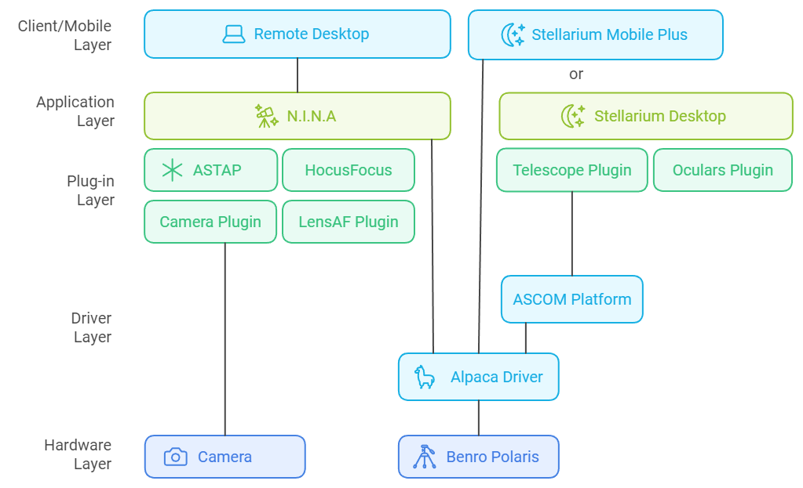

[Home](../README.md) | [Hardware](./hardware.md) | [Installation](./installation.md) | [Pilot](./pilot.md) | [Control](./control.md) | [Stellarium](./stellarium.md) | [Nina](./nina.md) | [Troubleshooting](./troubleshooting.md) | [FAQ](./faq.md)

# Installation Guide 
[Alpaca Win11](#installing-alpaca-benro-polaris-and-its-pre-requisites) | [Alpaca MacOS](./installation_macos.md) | 
[Startup](#running-the-alpaca-benro-polaris-driver) | 
[Workflow](#imaging-with-alpaca-driver-v20-and-nina) | 
[Stellarium](#installing-stellarium-optional) | 
[Sky Safari](#seting-up-sky-safari-pro-optional) | 
[Nina](#installing-nina-optional) | 
[Architecture](#software-architecture) 


## Software Installation

### Installing Alpaca Benro Polaris and its pre-requisites
#### To install on MAC
Please refer to the separate [MAC installation guidelines](./installation_macos.md).

#### Windows 11 Installation Video Demonstration
You can view a demonstration of parts of this documentation in the following YouTube Video.
[](https://www.youtube.com/watch?v=ipbWT54afhY)

#### To Install on Windows 11
The Alpaca Benro Polaris requires Python 3+ and some libraries to be installed before it can run.

1. Download Python 3.13.9 from the [Python website](https://www.python.org/ftp/python/3.13.9/python-3.13.9-amd64.exe). Run the installation file downloaded. You must check the field `Add python.exe to PATH`, then click `Install Now`. 
   >Note: Python 3.14 is not supported as of December 2025, as pyephem has not yet been compiled for this release.


2. Download the [Alpaca Benro Polaris v2.0.0.zip file ](https://github.com/ogecko/alpaca-benro-polaris/archive/refs/tags/v2.0.0.zip) from this Github repository.

3. Expand the zip file to a location of your choice. We reccommend `C:\Users\`Username`\Documents`. Using Windows Explorer, right-click on the folder you just expanded to, and select `Open in Terminal` to open a Command Window. If you cant see `Open in Terminal` try right clicking a second time. Enter the following: 
  
    ```
    C:\Users\Nina\Documents\alpaca-benro-polaris-main> pip install -r platforms/win/requirements.txt
    ```


4. (Optional) Create a Shortcut. You can copy the file `platforms\win\Alpaca Benro Polaris Driver.lnk` to your desktop and edit it so it points to the folder where you extracted the ZIP file.

   1. Right-click the shortcut → **Properties**
   2. Update both the **Target** and **Icon** paths to match your installation

      ```
      Target: C:\XXXX\driver\main.py
      Icon:   C:\XXXX\docs\images\abp-icon.ico
      ```

      


### Running the Alpaca Driver

To start the Polaris Driver, you can either:

#### A. Use the Desktop Shortcut

Just double-click the `.lnk` file you configured in Step 4.

#### B. Run from the Command Line

1. Open **File Explorer** and navigate to the folder where you extracted the ZIP file.
2. Hold **Shift** and **Right-click** the `driver` folder. (You may need to try twice for “Open in Terminal” to appear.)
3. Select **Open in Terminal**.
4. In the new Terminal Window, run the driver with:

   ```
   python main.py
   ```

No matter which method you used to launch the Alpaca Driver, a console window will appear. When the Driver is running correctly, it should look like this:


### Starting the Alpaca Pilot App

With the Alpaca Driver running you can now start the Alpaca Pilot App from any browser. 
1. Open **Chrome**, **Edge**, **Firefox**, or your preferred browser.
2. Enter the following into the address bar, where hostname is the name of the MiniPC you are running the Driver on. 
   ```
   http://hostname
   ```
   > Note you can find the hostname of a machine by typing the command `hostname` into a terminal window.
3. The Alpaca Pilot App should look like this:

4. Click **Connect** on the top toolbar of the Alpaca Pilot Window. This page will allow you to follow through the steps to connect the Driver to the Benro Polaris device.

### Connecting the Driver to Polaris
There are a few preliminary steps before you can use the Polaris. You'll need to do the following:
1. Setup your Benro Polaris tripod head and turn on the Benro Polaris. If you cant turn it on, see [Troubleshooting B1](./troubleshooting.md#b1---cannot-start-the-benro-polaris-device).
2. Using the USB Wifi adapter, connect your mini-PC to the `polaris-xxxxxx` hotspot.
3. Choose `Connect Automatically` and click `Connect`.
4. Wait for connection. It should show: `No internet, open`. If you cannot connect, see [Troubleshooting C0](./troubleshooting.md#c0---cannot-connect-win11-computer-or-laptop-to-benro-polaris-wifi).
    
 

5. Using the Alpaca Pilot App Connect Page, follow the checkmark steps to complete the setup of the Polaris. Refer to the [Pilot Users Guide - Connecting Devices](./pilot.md#ii-connecting-devices) for more details and a full step by step procedure.

6. Once the Driver has connected successfully to the Polaris the Alpaca Driver window should look like this.


### Troubleshooting
If you don't see the `communications init... done` message then you may want to check the [Troubleshooting Guide C1](./troubleshooting.md#c1a---cannot-see-communications-init-done-in-the-log-wi-fi-2-not-connected) for steps to diagnose and fix any issues.

### Updating the Driver
To update the Alpaca Benro Polaris Driver to the latest version:
1. Download the latest [Alpaca Benro Polaris zip file](https://github.com/ogecko/alpaca-benro-polaris/archive/refs/heads/main.zip) from this Github repository.
2. Stop the driver by selecting its Window and pressing Ctrl+C.
3. Extract the files, overwriting the old files.
4. Install any new pre-requisites using `pip install -r platforms/win/requirements.txt`
4. Restart the Driver.


## Imaging with Alpaca Driver V2.0 and NINA

This workflow outlines a typical imaging session using **Alpaca Driver V2.0** with **NINA** and the **Benro Polaris** mount. It assumes you’re already familiar with operating **Alpaca Pilot** and **NINA**. For additional setup and operational guidance on these topics, refer to the documentation for [Alpaca Pilot](./pilot.md) and [NINA](./nina.md).

### Setup and Initialization

1. **Start Alpaca Driver**  
   Launch the driver by double-clicking the shortcut you created earlier.

2. **Open Alpaca Pilot**  
   In your browser, navigate to the Alpaca Pilot App.

3. **Power On Polaris**  
   Use a short press followed by a long press to power on the mount.

4. **Confirm Wi-Fi Connectivity**  
   Monitor your Mini-PC wifi and confirm it maintains a stable connection to Polaris.

5. **Connect and Configure Polaris**  
   In the Pilot Connect page:
   - Set **Astro Mode**
   - **Reset all axes** and wait for completion
   - **Skip compass alignment**
   - **Skip single-star alignment**

### Focusing, Alignment and Targeting

6. **Point to Celestrial Polar Area**  
   Using Pilot Alpaca or Nina:
   - Slew the mount to approximately point towards your Celestrial Pole (either North or South)
   - This initial orientation does not need to be accurate
   - Having a high or low Declination reduces star movement for the next step

7. **Initial Focus**  
   - Use your **Camera and lens** to achieve a rough focus
   - Run **NINA’s Autofocus** process for a precise focus.
   - Optionally, if you are using guiding, focus and align your Guide Scope as well.

8. **First Plate Solve (anywhere for Single Point Alignment)**  
   In NINA’s Image tab, 
   - Click on **Start Tracking**
   - Open the Plate Solving panel
   - Manually plate-solve and sync to achieve intial alignment.
   
9. **Second Plate Solve (at Pole for Multi Point Alignment)**  
   In Alpaca Pilot:
   - Enable **Multi-Point Alignment**
   - Search for 'pole' in the Alpaca Pilot Catalog
   - GOTO your local Celestrial Pole and wait for the mount to settle.
   
   Using Nina:
   - Initiate a second plate solve at the Celestrial Pole

10. **Third Plate Solve (at Future Target for Multi-Point Alignment)**  
   In Alpaca Pilot:
    - GOTO your imaging target from the catalog
    - Decrease the Right Ascensian axis by 1 or 2 hours 
    - Once settled, run a third plate-solve in NINA

11. **Fourth Plate Solve (framing Your Target)**  
    Use NINA’s Sky Atlas or Stellarium to locate your target.  
    - Send it to **Framing Assistant**, and view it on Nina's **Offline Sky Map**
    - Use **Slew and Center** to refine positioning via iterative plate-solves.
    - Select **Add Target to Sequence**, **Legacy Sequencer**

### Imaging Sequence

12. **Create a Sequence**  
    In NINA’s Legacy Sequencer:
    - Define image count (e.g., 150) and exposure time (e.g., 30 s)  
    - If not guiding, enable **Slew and Center Target** every 20–30 frames (manually or via Advanced Scheduler)

13. **Start the Imaging Sequence**  
    Begin the sequence from NINA’s Image tab and monitor the first few frames. Let the process settle and zoom into the image view to monitor roundness of stars and tracking quality.

14. **Refine Tracking and Alignment**  
    You can assess and refine tracking performance using the **Alpaca PID Tuning** and **Alignment** pages:

    * PID Tuning Page
        - **Angular Position (PV vs SP)**: PV should closely follow a steady SP ramp on all axes for accurate tracking. Changing to equatorial co-ordinate view will show a steady horizontal SP for Right Ascension, Declination, Position Angle.
        - **Angular Velocity (OP)**: OP should appear as a steady horizontal line, large oscillations may indicate instability. The PID controller will attempt to close any gaps.
        - **RMS Error**: This is a key performance statistic that provides a quick understanding of the tracking performance over the last 30 seconds. A value near **2 arcseconds** is ideal for high-quality tracking.
        - **Pulse Guiding**: Use **equatorial coordinates** to monitor corrections from guiding software. You should see the SP being "bumped" up and down to correct for guide star movement.
        - **Advanced Tuning**: Experienced users can adjust PID parameters to reduce oscillations and improve responsiveness.

    * Alignment Page
        - **Sync Point Residuals**: Review residuals to identify misaligned points.
        - **Model Refinement**: Delete sync points with large residuals to improve the Multi-Point Alignment model.

## Optional Installations
   
### Installing Stellarium (OPTIONAL)
Stellarium is a free open-source planetarium for your computer. 
While there are free and paid Mobile Stelarium Apps and free Web versions, 
I'd recommend using the desktop version as it is full-featured and has been 
tested with ABP.

#### To install the desktop version of Stellarium
1. Download the relevant desktop version from https://stellarium.org/en/
2. The remaining instructions assume you are using v24.2 of the Windows x86 64bit version for Windows 10+
3. Open the installation .exe file and click `Yes` on the User Account Control dialog.
4. Select your language and click `OK`.
5. Select `I accept the agreement` and click `Next`.
6. Choose your installation folder and click `Next`.
7. Select `Start Menu Folder` and click `Next`.
8. Select `For all users` and click `Next`.
9. Click `Install`.
10. Check `Launch Stellarium` and click `Finish`.

#### To Setup Stellarium for initial use
1. Press `F11` to exit full-screen mode.
2. Press `A` to remove the Atmosphere. Press `D`to see Deep Sky Objects.
3. Press `F2` to open the Configuration Dialog.
4. Select the `Extras` tab on the Configuration Dialog menu bar.
5. Click `Get Catalog 5 of 9` and repeat for `6`,`7`,`8` and `9 of 9`.
6. If you are copying Oculars settings, duplicate the following file:
   `C:\Users\XXXXX\AppData\Roaming\Stellarium\modules\Oculars\ocular.ini`

### Seting up Sky Safari Pro (OPTIONAL)
The following screen captures show the settings you need to use for Sky Safari Pro to work with the Alpaca Driver. Choose an Mount as Alt-Az , Brand as Celestron NexStar 5i/i8 , IP Address 192.168.0.3, Port 10001, Preset Name as Polaris and Save Preset.


### Installing Nina (OPTIONAL)
Nina is an open-source free software application covering image capture, autofocus, plate-solving, centering, star detection, guiding, and a lot more. Much of this now works with the Benro Polaris (well not guiding yet). The open-source nature makes it a bit more complicated to install and setup, but it's worth the effort - and it's free.

The [Astro What](https://astrowhat.com/) website has a good set of instructions for [Installing Nina and its Pre-requisiites](https://astrowhat.com/articles/setting-up-a-pc-with-n-i-n-a.18/page/installing-n-i-n-a.45/). 

### Software Architecture
The following diagram is provided as a reference to help you undersdtand how the different software modules fit together.

