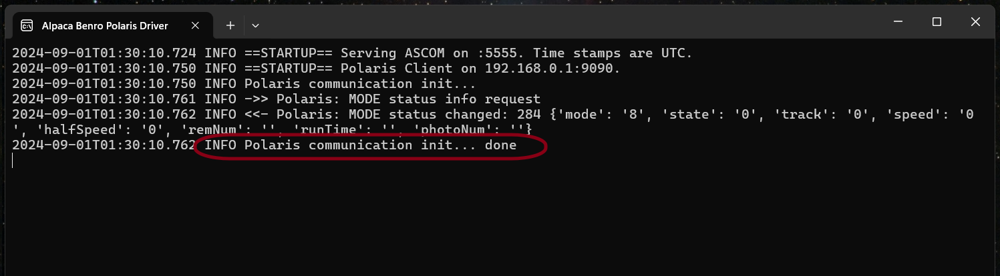
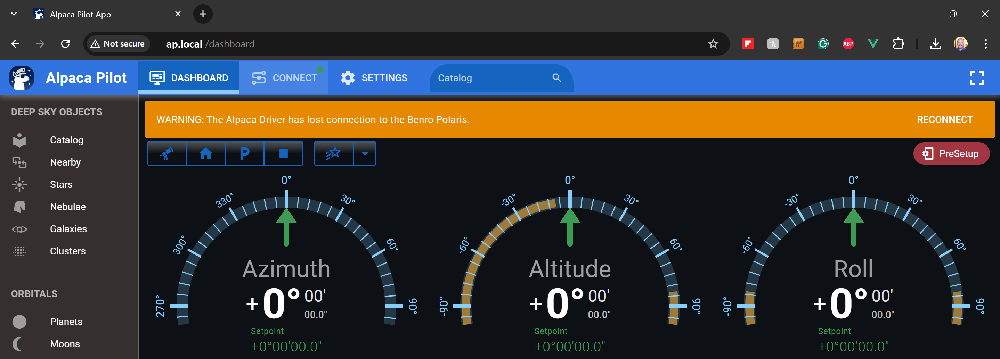

[Home](../README.md) | [Hardware](./hardware.md) | [Installation](./installation.md) | [Pilot](./pilot.md) | [Control](./control.md) | [Stellarium](./stellarium.md) | [Nina](./nina.md) | [Guiding](./guiding.md) | [Troubleshooting](./troubleshooting.md) | [FAQ](./faq.md)

# Mac Setup Guide

## MacOS Installation Video Demonstration
You can view a demonstration of parts of this documentation in the following YouTube Video.
[](https://www.youtube.com/watch?v=ZT91dpLObP8)

## Overview
For the first release of the Alpaca Benro Polaris driver would be provided as a bundle of Python scripts and will need the usage of the command line with the help of the Terminal application.

A recent MacOS release with Python 3 is recommanded as the Alpca Benro Polaris requires Python 3+ to be run, upgrading the preinstalled Python release on older MacOS is out of the scope of this guide.

## Installing

### Checking Python version
Open a terminal window and type the following command to check the preinstalled Python version:

```
$ python --version
Python 3.9.6
```

On MacOS the minimal tested version is `3.9.6` 

### Installing the Alpca Benro Polaris Driver code
1. Download the [Alpaca Benro Polaris v2.0.0.zip file ](https://github.com/ogecko/alpaca-benro-polaris/archive/refs/tags/v2.0.0.zip) from this Github repository.

2. Expand the zip file to a location of your choice (like in your home directory) and from a command prompt enter the following:

	```
    cd alpaca-benro-polaris
    
    pip3 install -r platforms/macos/requirements.txt
	```

### Running the Alpaca Benro Polaris Driver

3. Start the Alpaca Benro Polaris driver with the following command from within the installation directory:

    ```
    python3 driver/main.py
    ```

4. The Alpaca Benro Polaris Driver window should look like this.



### Starting the Alpaca Pilot App

With the Alpaca Driver running you can now start the Alpaca Pilot App from any browser. 

5. Open **Safari**, **Firefox**, **Chrome**, or your preferred browser.
6. Enter the following into the address bar, where hostname is the name of the machine you are running the Driver on. 
   ```
   http://hostname
   ```

7. The Alpaca Pilot App should look like this:

8. Click **Connect** on the top toolbar of the Alpaca Pilot Window. This page will allow you to follow through the steps to connect the Driver to the Benro Polaris device.

### Connecting the Driver to Polaris
There are a few preliminary steps before you can use the Polaris. You'll need to do the following:

9. Setup your Benro Polaris tripod head and turn on the Benro Polaris. If you cant turn it on, see [Troubleshooting B1](./troubleshooting.md#b1---cannot-start-the-benro-polaris-device).
10. Turn on the Mac and connect it to your camera via USB.
11. Connect your Mac to the polaris-###### hotspot using WIFI (this will disconnect you from the previous WIFI and you'll loose the Internet connection)
12. Wait for connection.
13. Using the Alpaca Pilot App Connect Page, follow the checkmark steps to complete the setup of the Polaris. Refer to the [Pilot Users Guide - Connecting Devices](./pilot.md#ii-connecting-devices) for more details and a full step by step procedure. Make sure all checkmarks are green (except for the final Multi-Point Alignment step, which will only turn green after you’ve aligned on three or more stars).

14. Once the Driver has connected successfully to the Polaris the Alpaca Driver window should look like this.


### Troubleshooting
If you don't see the `communications init... done` message then you may want to check the [Troubleshooting Guide C1](./troubleshooting.md#c1a---cannot-see-communications-init-done-in-the-log-wi-fi-2-not-connected) for steps to diagnose and fix any issues.

### Stellarium
If you want to use the Stellarium application on Mac and its Remote Telescope control protocol you'll have to edit the  `driver/config.toml` file, set the `stellarium_port` to a value other than `0`, for example `10001`, restart the ABP driver script and configure the telescope link in Stellarium.
