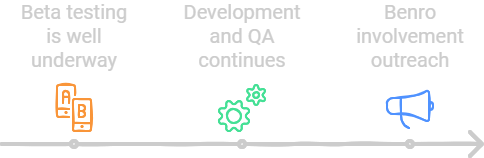

### 5-Sep-2024, Dev Update 02 
# Beta Testing is Underway, Development Continues, Benro Involvement
We are making excellent progress on the Alpaca Benro Polaris Project. This technical update will discuss our Beta testing process (and how you can join to get early access), what's been happening in development, an update on Benro engagement, and finally, funding.

## Beta Testing
The GitHub repository has been created and is our main point of collaboration across the team. While in Beta, it has restricted access, but it will soon become public.

We have the Australians, French and New Zealanders hard at work, testing the product. If you have mentioned you'd like to beta test already, please check for a direct message from me. If you havent received anything, I may have missed you in the forum comments. My appologies. Please use the process below if you are still interested to help.

### Beta Testing Guidelines
You must follow the following informal guidelines to become a Beta Tester. You agree that you will:
* Need a GutHub account (or willing to create one).
* Document your test environment, focus areas annd results in [docs/betatest.md](./betatest.md).
* Keep a record of what tests you perform and the results.
Report any confirmed problems noticed as issues in GitHub.
* Try reproducing and documenting the steps to reproduce, isolate what is causing the issue, and diagnose yourself if you can.
* Test the documentation where possible; if it's missing something, help the author or improve it.
* Complete your tests and provide a final summary of feedback by 17-Sep-2024.
* Confirm you will not share any pre-release code or docs without permission.

### Call for more Beta Testing

We need more Beta testers. Please join our project if you have a GitHub account and want to contribute. Please message me on Facebook with your GitHub account name and a note that you agree to the guidelines.

Once reviewed, I'll add you to the repository. It will help if you are technical, but you don't have to be. Ideally, you'd have a Benro Polaris, can work around a computer, and understand there may be open issues. If you join up, you will be immortalized on the project and can get early access to the software.

## Development Continues
### Goto RA/Dec, Goto Alt/Az, Plate Solving, Autofocus
All these features are working and essentially feature complete.

### Move Axis, Park
We are attempting to incorporate the Benro Polaris App axis movement commands into the ASCOM standard, and we are nearing completion.

### MacOS support
I dont have any Apple gear, so Vladimir has been helping develop support for MacOS. He has made changes to allow the driver to run and is helping test with Stellarium and a MacOS equivalent of Nina called CCDiel. Much appreciate his continued contribution.

### Three Point Alignment
I have completed a Nina Three-Point Alignment run and quantified the alignment error. I'm in the process of hooking the realignment steps into the BP Alignment process. We will see.

### Connection Management
Getting your machine connected to the Benro Polaris WiFi network is probably the most frustrating thing you will encounter in Beta testing. We have improved its reliability, exception handling, diagnostics, and automatic retries on Windows. More to come for MacOS.

## Documentation
We are authoring as comprehensive documentation as we can. We will cover recommended equipment, setup, installation, use, and troubleshooting of the driver. We have also started using the faq on Kickstarter, which will be transferred to the documentation.

### Call to compile "Awesome List" of resources
We are including links to other resources to help build a knowledge base for Astrophotography with the Benro Polaris in mind. What resources and tools have you found awesome? Let us know so we can add them to the documentation. Thanks to everyone who has contributed already.

## Benro Outreach
I have the utmost respect for the Benro team and their offerings. I would highly welcome their involvement in this project.

On 1-Sep-2024, I wrote to Benro, asking if they could acknowledge and "approve" this project. I also asked if they could (a) consider having a representative join the team and (b) keep the platform open and the team informed of any protocol changes. I'm yet to receive a reply.

Working for Honeywell, I know integrating open-source projects into a business can be challenging. There are implications with licensing, funding, maintenance, and intellectual property, to name a few. I'm willing to help ensure we consider Benro's perspective if we can.

Ideally, this driver would be embedded in the Benro Polaris device itself. Maybe they have no interest, I'm not sure. Whatever happens, as a user and advocate of the Benro Polaris, I aim to do what is in the community's best interests.

## Funding
I want to thank everyone who has pledged to the Kickstarter project. Your support and encouragement are very much appreciated. 

As the team expands, other people contribute their time and effort to the community project. We are not Benro employees and are doing this as volunteers. I want to send some Kickstarter funds to encourage and recognize team members who are contributing to GitHub pull requests.

* All MacOS users will owe Vladimir something, as we wouldn't have its support without his efforts. Make a pledge for him. Any pledge directed to a team member will be forwarded.
* Once we get a Pentax user on the Beta test team contributing, the same goes for them. Pentax users are very passionate about their cameras and keen to get support. 

We are using this Kickstarter project to assess the importance of the time we contribute. Pledge to help encourage someone to do the work.

## Next Feature Peek
The next feature peek, coming soon, will be on Nina's autofocus capabilities. I hope you'll watch it and give us some feedback.

Bye for now

Dave
