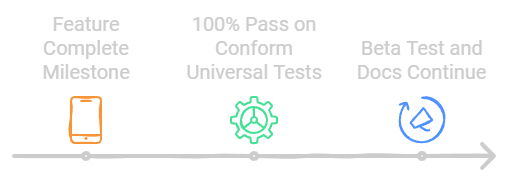
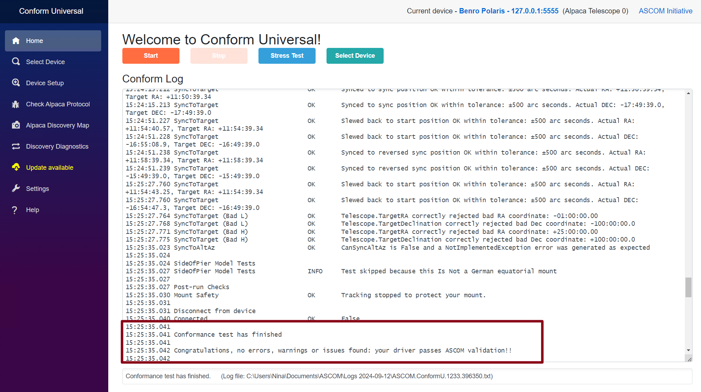
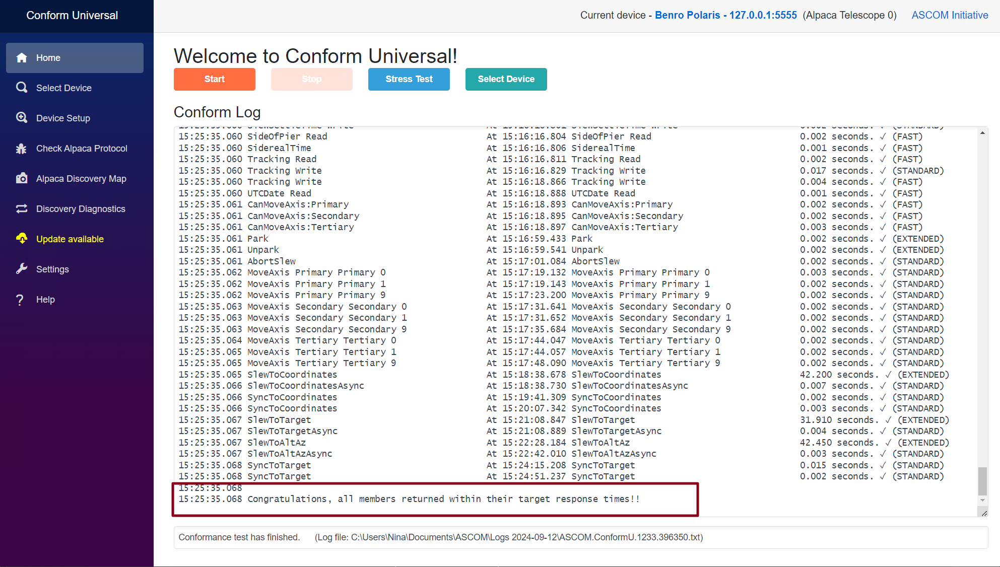

### 12-Sep-2024, Dev Update 03 
# Feature Complete, 100% Conformance Test, Beta Test Continues
We have passed a significant milestone on the Alpaca Benro Polaris Project: We are now feature complete. This technical update will discuss what feature complete means, how we have confirmed our compliance, specific work items completed since our last update, and further plans for continued Beta testing.

## Feature Complete and Compliance
A feature-complete (FC) version of the software has all its planned or primary features implemented but is not yet final due to further potential quality, performance, or stability improvements.

We have essentially completed all the planned ASCOM ITelescopeV3 properties and methods. ASCOM provides a comprehensive test suite to confirm compliance with its standards, including thoroughly testing API functionality, performance, and boundary conditions.

I'm glad we are now passing 100% of their tests.

This includes all the performance tests of the synchronous and asynchronous API methods.

## Work Items completed since last update
Since the previous update, we have completed the following:
* Move Fast and Slow commands
* Park and UnPark commands (uses the Benro Polaris axis reset feature)
* Goto Alt/Az, RA/Dec, and Target command
* A learning algorithm was built into the driver to improve Benro Polaris GOTO accuracy.
* Vladimir and I confirmed plate-solving works, and now we know where it's pointing!
* Sync commands (allows you to correct BP offset on visual or plate solve confirmation of actual pointing position)
* A subset of SynScan protocol to support Stellarium PLUS mobile users.
* A binary protocol to support Stellarium MacOS users.
* A Periodic Error report to quantify your Benro Polaris tracking accuracy.
* MacOS, RaspberryPi, and Docker platform support (some yet untested)
* Improved BP connection robustness and recovery.
* Addressed some issues from Beta Test.
* Further refinement of the documentation, including troubleshooting and FAQ sections.

## Continuing Beta Testing
Beta Testing is proceeding well, especially considering everyone does this in their spare time. Again, I want to thank everyone for their help. All feedback is greatly appreciated.

We are still looking for more Beta testers. Part of the challenge is that some tests require clear skies and a blue moon. If you want to join, please send me your GitHub account and agree to the following guidelines.

Further feedback is pending, so we may consider an Open Beta test phase later this month.

### Beta Testing Guidelines
You must follow the following informal guidelines to become a Beta Tester. You agree that you will:
* Need a GutHub account (or willing to create one).
* Document your test environment, focus areas annd results in [docs/betatest.md](./betatest.md).
* Keep a record of what tests you perform and the results.
Report any confirmed problems noticed as issues in GitHub.
* Try reproducing and documenting the steps to reproduce, isolate what is causing the issue, and diagnose yourself if you can.
* Test the documentation where possible; if it's missing something, help the author or improve it.
* Complete your tests and provide a final summary of feedback by 17-Sep-2024.
* Confirm you will not share any pre-release code or docs without permission.

## What's Next
The focus is shifting to primarily QA work. However, there is further exploration on whether we can feedback 3-point alignment to Benro Polaris and whether Benro can modify the firmware to support MoveAxis commands while in sidereal tracking without a backlash dance—all for guiding.

Cheers
Dave
