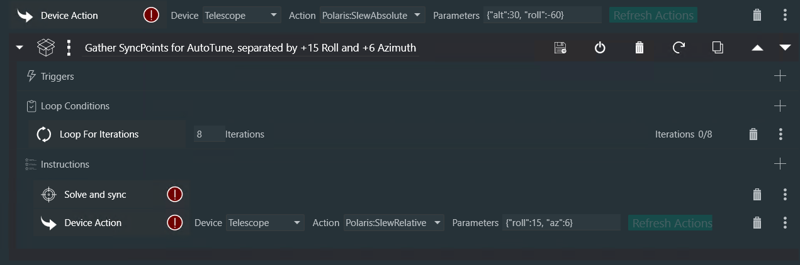
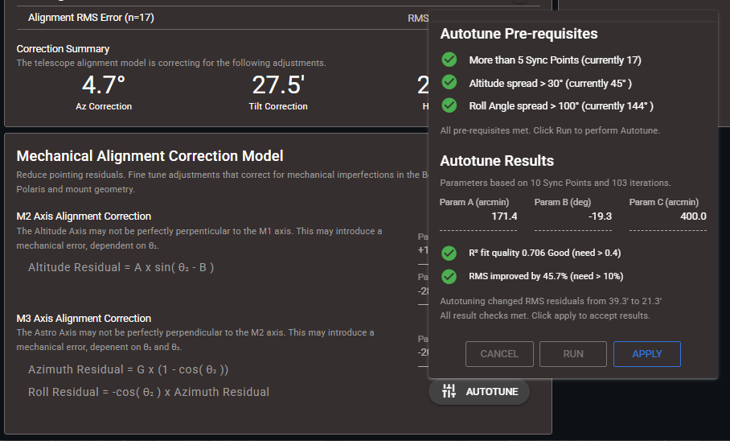
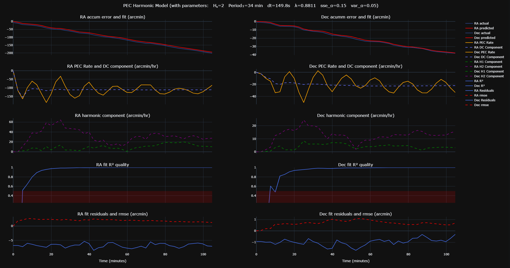
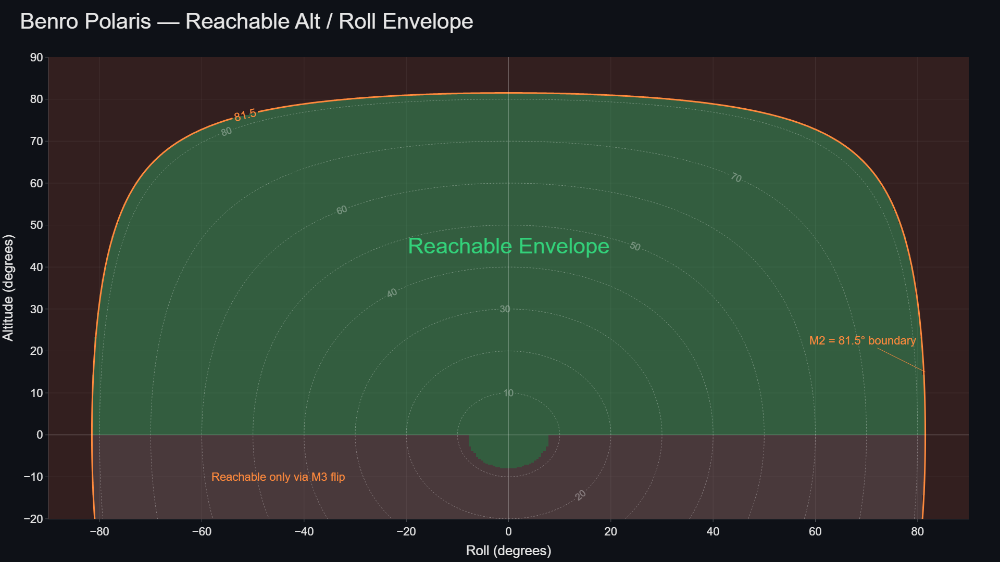

[Home](../README.md) | [Hardware](./hardware.md) | [Installation](./installation.md) | [Pilot](./pilot.md) | [Control](./control.md) | [Stellarium](./stellarium.md) | [Nina](./nina.md) | [CCDciel](./ccdciel.md) | [Guiding](./guiding.md) | [Troubleshooting](./troubleshooting.md) | [FAQ](./faq.md)


# Alpaca Benro Polaris Driver — Kinematics Reference
[Overview](#1-overview) | 
[QUEST](#21-quest-alignment-optimisation) |
[SCC](#22-slew--center-correction) |
[MAC](#23-mechanical-alignment-corrections) |
[PEC](#26-predictive-error-correction-pec) |
[Sync Guiding](#24-plate-solvedsync-guiding) |
[Pulse Guiding](#25-pulse-guiding) |
[Base Frame](#31-base-frame-b---representations-and-conversions) | 
[Topo Frame](#32-topocentric-frame-t---representations-and-conversions) | 
[Equatorial Frame](#33-equatorial-frame-e---representations) | 
[Forward Flow](#41-forward-kinematics--motors--sky-angular-position) | 
[Inverse Flow](#42-inverse-kinematics--sky--motors-angular-position) | 
[Feed Forward](#43-inverse-kinematics--sky--motors-angular-velocity-feed-forward) | 


## 1. Overview

The Benro Polaris is a three-axis motorised camera mount designed for precision tracking and pointing. Accurate operation requires compensating for multiple sources of mechanical, optical, and dynamic error while transforming between four distinct reference frames: the camera sensor frame, the mount base frame, the local sky frame, and the celestial reference frame. This document defines these reference frames, along with the variables, rotation matrices, and quaternions associated with each, and describes the kinematic chains that relate them.

The document also outlines the principal mitigation techniques used to reduce tracking and pointing errors, including alignment correction, calibration, guiding, and dynamic compensation methods. These error sources and their corresponding mitigation strategies are summarised in the table below.


| Category        | Error Type              | Specific Cause                                 | Description and Effect                                                                                                                                 | Mitigation                                         |
| --------------- | ----------------------- | ---------------------------------------------- | ------------------------------------------------------------------------------------------------------------------------------------------------------ | -------------------------------------------------- |
| Measurement Errors  | Sensor Noise            | IMU / Encoder Noise and Drift                  | IMU or encoder noise introduces inaccurate motion estimation, causing small random pointing fluctuations.                                               | Kalman Filter (v2.0)                                     |
| Physical Errors | Polar Misalignment      | Tripod Bearing                                 | An inaccurate tripod bearing introduces a rotational offset around the vertical axis, causing systematic pointing errors across the sky.               | Multi-Point Alignment (QUEST v2.0)                      |
| Physical Errors | Polar Misalignment      | Tripod Tilt                                    | A tilted tripod means the mount's azimuth axis is not truly vertical, causing the effective polar alignment to vary across different pointing positions. | Multi-Point Alignment (QUEST v2.0)                      |
| Physical Errors | Polar Misalignment      | Cone Error                               | A misalignment between the camera boresight and other axes means the boresight traces a small circle around the true target position rather than pointing directly at it. The resulting pointing error varies systematically with Az/Alt. | Multi-Point Alignment (QUEST v2.0)           |
| Physical Errors | Roll Angle Misalignment | Mount Encoder / Camera Orientation Offset      | A fixed offset between the mount's reported roll angle and the true camera orientation on the sky. If uncalibrated, corrupts the PID roll setpoint and subtly degrades pointing and tracking across all coupled axes. | Position Angle Sync (v2.0)                  |
| Physical Errors | Motor Axis Misalignment | M2/M3 Axis Non-Perpendicularity                | A tilt or cant in the M2 and M3 motor axes creates systematic pointing and tracking inaccuracies that vary with pointing direction.                     | Mechanical Alignment Correction (MAC v2.2)              |
| Dynamic Errors  | Motor Backlash                | Loose Gear Mesh / Gear Play                    | Mechanical slack causes delayed or reversed response during direction changes, particularly affecting pulse guiding corrections.                         | Speed Controller defaults to continuous Motor Engagement (v2.0)                |
| Dynamic Errors  | Slew and Center Cycling | Local Residual Pointing Error                 | After QUEST alignment, a small residual pointing error remains at the last sync point due to the global nature of the QUEST fit. This can cause Slew and Center to continuously cycle to reach the target orientation                       | Slew and Center Correction: Zero Last Residual (ZLR), Local Gaussian Adjustment (LGA), or Sync Guiding Adjustment (SGA) (v2.2)|
| Dynamic Errors  | Post-Slew Motor Oscillation           |   Motion Dynamics and PID Tuning                   | After a slew, the PID controller requires time to stabilise at the new position. Starting an exposure before settling completes may cause plate solves to fail or star trails on the first image. | Nina Settings: Settle Time and Pointing Tolerance; Pilot Settings: Kc Goto Tollerance (v2.0); Goto Progress (v2.2) |
| Dynamic Errors  | Tracking Motor Oscillation           |   PID Steady State                | A slight timing shift between measurement and control can cause a periodic jump in motor control to catchup.  | Synchronous Control (v2.2) |
| Dynamic Errors  | Kinematic Constraints   | Motor Axis Solution Choice | Some pointing orientations have multiple solutions and may effect slew duration, windup limits, and motion paths.                                                      | Motion Planner (v2.2)                     |
| Dynamic Errors  | Kinematic Constraints   | Gimbal Lock / Axis Range | Certain pointing orientations can introduce gimbal lock or near-singular kinematic configurations, resulting in the loss of a degree of freedom and reduced controllability.                                                       | Kinematics Refactor (v2.2) and Gimbal Lock Status Indication (v2.2)                     |
| Guiding Errors  | Tracking Drift          | Drift During Exposure                          | Tracking drift accumulates during longer exposures due to Periodic Error, RA/Dec drift, and residual alignment errors. Long exposures require correction while active.                | Pulse Guiding (v2.0) with Guide Camera and PHD2 or equivalent                 |
| Guiding Errors  | Tracking Drift          | Drift of Celestrial Pole                          | In v2.0 Guide Pulses changed target setpoints (SP), causing the PID to track a different RA/Dec location, effectively drifting the celestrial pole. In v2.2 all auto-guiding commands now change the target's present values (PV) instead.                  | Pulse Guiding (v2.2)                 |
| Guiding Errors  | Tracking Drift          | Drift Between Plate Solves         | Tracking drift accumulates even further over extended imaging sessions, potentially losing the target as it drift out of frame.                                              | Sync Guiding (v2.2) no guide-camera needed                                     |
| Guiding Errors  | Periodic Error          | Worm Gear Imperfections                        | Sinusoidal cyclic tracking error in RA and Dec with a period matching the worm gear cycle (~35 min). Can also include accumulated residual tracking errors.                  | Periodic Error Correction (PEC v2.2)                    |
| Optical Errors  | Focus Drift             | Temperature / Mechanical Changes               | Temperature or mechanical changes alter optical focus during imaging, degrading star shape and plate solve reliability.                                  | NINA Hocus Focus Plugin                            |
| Optical Errors  | Lens Tilt             | Sensor / Lens Plane Non-Parallelism              | A tilt between the camera sensor plane and the optical focal plane causes uneven focus across the image and elongated or bloated stars in the corners                                  | Aluminium Foil Tape                            |


---
## 2. Kinematics Corrections
The Alpaca Driver achieves superior tracking performance through a multi-layered suite of kinematic corrections that address both global and local mechanical errors. At its foundations is the QUEST model in Multi-Point Alignment. Layered on top of this are corrections for Mechanical imperfections, Periodic and Local residual errors.

### 2.1 QUEST Alignment Optimisation

#### **I. What it is and What it Solves**
**QUEST (QUaternion ESTimator)** is an advanced mathematical framework used in Multi-Point Alignment (MPA) to calculate the most accurate relationship between your Polaris mount and the night sky. In the context of the Alpaca Driver, it is a **closed-form, quaternion-based solution** designed to solve "Wahba’s problem": determining the optimal rotation that aligns a set of predicted sensor vectors with observed "ground-truth" vectors from plate solving.

Because the Benro Polaris is an **Alt/Az/Roll mount**, it lacks a physical axis naturally aligned with Earth’s rotation. This makes tracking complex, as all three motors must coordinate perfectly to follow a target. QUEST solves several critical hardware and environmental challenges that standard software cannot:
*   **Mechanical Imperfections:** It compensates for **cone error, polar misalignment, and general mechanical offsets**.
*   **Tripod Tilt:** A major advantage of QUEST is that **users no longer need to obsess over leveling their tripod**, as the model mathematically detects and corrects for tilt.
*   **Tracking Accuracy:** It minimizes the angular residuals (errors) between where the mount *thinks* it is pointing and where it *actually* is, leading to superior sidereal tracking for long-exposure deep-sky photography.

#### **II. Integration with Single Point Alignment (SPA)**
The Alpaca Driver supports two distinct modes: **Single-Point Alignment (SPA)** and **Multi-Point Alignment (QUEST/MPA)**. 
*   **SPA (The Foundation):** This mirrors the standard Polaris method by syncing to one known celestial position. While simple, it relies on **precise tripod leveling** and is highly susceptible to drift because it cannot account for complex geometric errors.
*   **QUEST (The Advanced Layer):** QUEST fits "on top" of the basic alignment by utilizing **three or more sync points** to build a detailed 3D correction model. Instead of a single global offset, QUEST finds the **optimal rotation (alignQ_B2T)** that transforms the mount's "Base Frame" into the true "Topocentric Frame" (the actual sky). 

By using QUEST, the driver can correct for the fact that a sync point taken in the East might require a slightly different correction than one taken in the West due to tripod tilt or mechanical flex.

#### **III. The Mathematics of the Model (Briefly)**
QUEST operates by minimizing a **quadratic loss function**, which is essentially the sum of the squared differences between pairs of reference vectors (stars) and measured vectors (mount sensors). 
1.  **Vector Pairing:** Each sync point provides a pair of vectors: the **predicted direction** from the mount's internal sensors and the **observed direction** from a plate solve.
2.  **Davenport Matrix:** The algorithm constructs a specialized matrix (known as a **Davenport Matrix**) from the weighted outer products of these vector pairs.
3.  **Eigenvector Solution:** The "optimal" alignment is found by identifying the **eigenvector with the largest eigenvalue** of that matrix. This provides a **unit quaternion** that represents the best-fit rotation for the entire system.

#### **IV. How to Use QUEST and Get the Best Results**
To achieve high-precision results, you must move from simply "syncing" to **strategic modeling**:

*   **Enable MPA:** Ensure Multi-Point Alignment is enabled in the Alpaca Pilot App settings or alignment page.
*   **Point Selection (The Rule of Three):** You must provide **at least three sync points** to allow the QUEST algorithm to begin building a model.
*   **Strategic Geometry:** 
    *   **Celestial Pole:** Always perform a plate solve and sync at the **Celestial Pole** (North or South). This ensures the model has an anchored reference for Earth’s rotation axis.
    *   **Target Trajectory (DSO Arc):** For the highest accuracy during imaging, place additional sync points **along the trajectory (arc)** that your target object will follow during the night. QUEST provides the best results when it is interpolating between points rather than extrapolating far away from them.
*   **Monitor Residuals:** Use the **Alignment page in Alpaca Pilot** to review "model residuals". This shows how well the QUEST model fits each sync point. Aim for residuals in the **arc-seconds**; if a point shows residuals of whole degrees, it should be deleted as it is likely a bad solve.
*   **Persistence:** From version 2.2 onwards, your QUEST model is **saved to disk**. You can restart the driver or your MiniPC mid-session without losing your refined alignment.


---
### 2.2 Slew & Center Correction

#### **I. What it is and What it Solves**
In astrophotography, the **Slew & Center** operation is a critical workflow where the mount slews to a target, performs a plate-solve to verify its position, and then makes a corrective slew to center the object, repeating the process until it is centered perfectly. The primary aim of **Slew & Center Correction** is to speed up this process by **reducing the number of correction slews** needed to zero in on a target. 

Without this correction, even a high-quality global alignment model (like QUEST) may have a small residual error at any given sky position. When a controlling application (such as NINA) performs a corrective slew based on a residual error, it may require several iterations to narrow in on the target. If the residual at the target is large and you have configured a very low pointing tollerance, the Slew & Center operation may struggle to complete.

#### **II. The Challenge: Global vs. Local Accuracy**
The QUEST algorithm finds a global optimum by fitting a single rigid-body rotation across all available sync points. While this provides excellent average accuracy across the entire sky, it cannot perfectly satisfy every individual sync point simultaneously. 

This leaves a **residual pointing error**, the difference between the model's predicted position and the actual observed plate-solved position. To achieve near-instant centering, the driver must account for this residual immediately after a sync occurs.

#### **III. Three Approaches to Correction**
The Alpaca Driver utilizes three distinct strategies to handle these residuals, ensuring the mount's "Present Value" matches the sky as accurately as possible:

1.  **Zero Last Residual (ZLR):**
    In this approach, the driver forces the QUEST model to ensure the **last sync point always has a zero residual**. When a new sync is performed, the model essentially "shifts" its understanding of the sky so that the current orientation is perfectly anchored to the observed coordinates. This provides an immediate, absolute correction for the current target but can affect the global fit of the rest of the model.

2.  **Local Gaussian Adjustment (LGA):** 
    LGA is a more advanced method that corrects the residual **locally around the most recent sync point** without disrupting the global integrity of the QUEST model. It applies the full correction at the exact sync location, then gracefully fades that correction both spatially and temporally. As the mount moves aways from the last sync point (σ = 10 degrees), the adjustment automatically decays back to the pure QUEST model. This ensurs the system smoothly returns to the underlying global solution.

3.  **Sync Guiding Adjustment (SGA):** (Recommended)
    SGA is the most sophisticated approach. It seeds the **Sync Guiding** system with the residual of the last QUEST sync point. By integrating all local pointing residuals into a single, unified quaternion, SGA addresses both local alignment errors and **Periodic Error Correction (PEC)** simultaneously. You can further refine this alignment by performing additional syncs without slewing the mount. Each sync will refine the model further.
    

#### **IV. The Mathematics of LGA**
LGA uses a **Gaussian weighting function** to determine how much of the local residual should be applied based on the angular distance from the last sync point. The correction fades to identity (zero additional correction) as the distance increases.

The formula for the weight is:

    weight = exp(−angular_distance² / (2 · sigma²))

*   **angular_distance:** The angular separation between the current pointing orientation and the orientation recorded at the last sync point.
*   **sigma:** This is the "spread" of the correction, with a **default value of 15°**.
*   **At the Sync Point:** The weight is 1.0, meaning the **full residual correction** is applied.
*   **At 15° Away:** The weight drops to approximately 0.61 (61% correction).
*   **At 30° Away:** The weight drops to approximately 0.14 (14% correction).
*   **Beyond 45°:** The weight is less than 0.05, meaning the LGA is effectively inactive and the mount relies solely on the QUEST model.

#### **V. Operational Benefits**
*   **Faster Centering:** By eliminating the local residual at the target, the first "corrective slew" issued by imaging software is more accurate.


---
### 2.3 Mechanical Alignment Corrections

#### **I. What it is and What it Solves**
**Mechanical Alignment Corrections** is a specialized pointing model that compensates for systematic, non-rigid errors caused by physical axis misalignments within the Benro Polaris mount. Unlike global errors like tripod tilt or polar misalignment, which are "rigid" and affect the entire sky equally, these mechanical errors are **orientation-dependent**. The magnitude of the error fluctuates based on the mount's orientation, specifically its **Altitude** and **Roll Angle** positions.

Without these corrections, sync points taken at different rotation angles or altitudes would provide contradictory data, preventing the **QUEST** alignment algorithm from converging on a stable solution. By modeling these hardware-specific traits, the driver ensures the alignment model receives "clean" data for high-precision pointing across the entire sky.

### **II. Benefits of the Model**

Enabling the **Mechanical Alignment Corrections** within the Alpaca Driver will improve the precision of the Benro Polaris platform. By layering **Mechanical Alignment Corrections** and **QUEST Alignment**, the system achieves a level of pointing and tracking fidelity that overcomes the inherent geometric limitations of the Alt/Az/Roll hardware.

#### **A. High-Precision Multi-Point Alignment**
The primary effect of enabling the model is a **significant increase in the accuracy of Multi-Point Alignment (MPA)**. 
*   **Smaller Residuals:** Without these corrections, mechanical misalignments (such as axis tilts) cause the mount to report contradictory data depending on its orientation. This prevents the QUEST algorithm from converging on a stable global solution. 
*   **Consistent Data:** By applying mechanical corrections at the measurement stage, the driver provides "clean," consistent data to the alignment model. This allows the QUEST estimator to find a tighter mathematical fit, resulting in **considerably smaller residuals**

#### **B. Enhanced Slew and Center Accuracy**
The secondary effect is that **Slew and Center operations become more accurate across the entire sky**, especially at challenging orientations.
*   **Extreme Orientations:** The magnitude of mechanical errors in the Polaris hardware grows dramatically as the mount points upwards or utilizes large roll angles, sometimes reaching errors of over 200 arcminutes. The model predicts and negates these errors in real-time within the kinematic chain.
*   **Reduced Iterations:** Because the model accounts for these complex deviations, the mount's predicted position aligns much more closely with the true celestial coordinates. This ensures that imaging applications like N.I.N.A. can center a target with far **fewer corrective slews**, often achieving a perfect center on the first attempt.
*   **Global Reliability:** This increased precision is not limited to the area around a single sync point; the combined model ensures reliable pointing even when moving between targets in different parts of the sky or at large roll angles.

#### **C. Improved Guiding Performance**
For users employing a **guide scope** and auto-guiding software (such as PHD2), the advanced model provides a superior foundation for fine tracking corrections.
*   **Precise Pulse Translation:** Auto-guiding relies on the driver to translate equatorial (RA/Dec) pulse commands into coordinated motor-level adjustments (M1, M2, and M3). The acculation of pulse quaternions ensures this coordinate transformation is highly accurate regardless of the mount’s orientation.
*   **Reduced Axis Cross-Coupling:** Because the Polaris is not a traditional equatorial mount, RA and Dec pulses must be carefully decomposed into multi-axis motor movements. The refined model minimizes "cross-coupling", where a correction in one axis causes an unintended shift in another, which is a common challenge for Alt/Az mounts.
*   **Lower RMS Error:** This mathematical precision allows guiding applications to settle faster and maintain a **lower overall RMS error** (often between 1.3 to 3.0 arc-seconds), which is essential for capturing sharp stars during long-exposure imaging.

Ultimately, these benefits provide the stable foundation required for professional-grade sidereal tracking and long-exposure imaging.

#### **III. The Mechanical Model Parameters**
The model identifies several fixed mechanical parameters of the mount hardware, derived from extensive analysis of "sky survey grids" (large-scale plate-solved datasets), captured at various roll angles. These fitted parameters are stored as coefficients in the `config.toml` and key parameters can be viewed and edited from the Alignment Page in Alpaca Pilot.

*   **M2 (Altitude) Axis Tilt:** The physical M2 motor rotatation axis may not be perfectly perpendicular to M1 (Azimuth), and can produces a sinusoidal altitude error.
    *   **Amplitude (`m2_tilt_dm2_amp`):** The peak magnitude of the altitude error. Introduces residual errors into the Altitude in a sinusoidal manner as M2 rotates.
    *   **Zero Point (`m2_tilt_dm2_zero`):** The altitude angle where the M2 error is zero, typically near or above the horizon.
*   **M3 (Astro) Axis Tilt:** The physical M3 motor rotation axis may be slightly tilted from the ideal camera vertical axis. It may be tilted or cantered towards the boresight or M2 Axis. This tilt is decomposed into three components:
    *   **Altitude Component (`m3_tilt_dm2`):** Sweeps the camera boresight in altitude as the M3 axis rotates. Introduces residual errors into the M2 axis.
    *   **Azimuth Component (`m3_tilt_dm1`):** Sweeps the camera boresight in azimuth as the M3 axis rotates, an effect modulated by the current altitude. Introduces residual errors into the M1 axis.
    *   **Roll Component (`m3_tilt_dm3`):** Sweeps the camera boresight in roll, geometrically linked to the Azimuth Axis residual. Introduces residual errors into the M3 axis.

#### **IV. Autotuning the MAC parametrers**

Although the Mechanical Alignment Correction (MAC) parameters can be enabled and adjusted manually from the Alpaca Pilot Alignment page, the driver also provides an **Autotune** feature that can refine these parameters for your specific mount.

Autotune works by optimizing the MAC parameters to **minimize** the QUEST model's total residual error. The process iteratively adjusts individual parameters, recalculates the QUEST model, and evaluates whether the change improves the fit. It then continues refining other parameters until a locally optimal solution is found. While the final solution may not be the global optimum, it is often sufficient to significantly improve alignment accuracy.

To autotune the MAC parameters:

1. Open the **Alpaca Pilot Alignment** page.

2. Click the **Autotune** button in the **Mechanical Alignment Correction Model** section.

3. The driver will verify that the prerequisites for autotuning have been met:

   * At least **5 sync points** are required (**10 or more** are recommended).
   * The sync points must be distributed across different **altitudes** and **roll angles**.
   * You can use a N.I.N.A. Advanced Sequence similar to the example below to generate additional sync points.

   

4. Ensure all prerequisite checks show **three green checkmarks** before proceeding.

5. Click **Run** to start the autotuning process.

6. Review the proposed results:

   * Verify that the fit quality is acceptable.
   * Verify that the improvement in the QUEST RMS residual is satisfactory.
   * Click **Apply** to activate the new parameters.

   

7. Applying the results makes the new parameters active immediately, but they are **not yet saved**. 
8. To persist the changes, click **Save** on the **Alpaca Pilot Settings** page.


#### **V. Calibrating the MAC parameters**
In addition to the **Autotune** feature, the driver also provides a `fits_extract.py` utility to emperically fit the MAC Parameters to plate-solved images taken with your mount. You will need an astro camera capable of storing FITS file. This is intended for advanced users only.

The workflow to calibrate your mount includes:

1. **Data Collection:** Using a pano grid with roll variation, capture FITS images covering a wide range of altitude, azimuth, and roll positions. Aim for full coverage of the roll range (±50°) at multiple altitudes (20°–65°). Ensure all corrections are disabled while collecting the images ie only SPA, disable MPA, SCC, LGA, ZLR, MAC, PEC.
2. **Plate Solving:** Run **ASTAP** in batch mode to solve all captured images. ASTAP must write the WCS solution directly into the FITS headers.
3. **Extraction:** Run `python fits_extract.py -extract`. This processes a directory of FITS images to read WCS (World Coordinate System) headers from plate solves and creates a permanent CSV of raw observations comparing Polaris's predicted position (`p_*`) with the solved truth (`s_*`). 
4. **Modelling:** Run `python fits_extract.py -model`. This uses the extracted CSV to fit the mechanical coefficients listed above alongside the QUEST alignment. It generates a `{prefix}model.txt` containing the optimized parameters (`m3_tilt_dm2`, `m3_tilt_dm1`, `m2_tilt_dm2_amp`, `m2_tilt_dm2_zero`).
5.  **Validation** Run `python fits_extract.py -validate`. Compares the fitted model against the original data (or a subset of "out-of-sample" data) to confirm the reduction in residuals before you commit the values to your configuration.
6. **Application:** Copy the fitted parameters into your **`config.toml`** file.


#### **VI. Important Implementation Details**
*   **Stability:** These coefficients reflect the physical manufacturing of your specific unit; they are independent of your site's level or polar alignment and do not need frequent recalculation.
*   **Forward Kinematics:** Corrections are applied within the **forward kinematic model** (`apply_mechanical_corrections`) before sky coordinates are calculated. This ensures the QUEST algorithm receives consistent data regardless of the mount's orientation.
*   **Persistence:** Once defined in the configuration, these corrections are applied automatically at the measurement/telemetry stage of the control loop.


#### **VII. Mechnical Correction Magnitude (arcmin) at specific Roll and Altitude Orientations**

|              Roll |   -70° |   -60° |   -50° |   -40° |   -30° |   -20° |   -10° |    +0° |   +10° |   +20° |   +30° |   +40° |   +50° |   +60° |   +70° | 
|-------------------|--------|--------|--------|--------|--------|--------|--------|--------|--------|--------|--------|--------|--------|--------|--------|
|**Altitude 70°**   |   514' |    82' |    80' |    77' |    75' |    73' |    72' |    72' |    72' |    73' |    75' |    77' |    80' |    82' |   514' | 
|**Altitude 60°**   |    87' |    82' |    76' |    71' |    66' |    62' |    60' |    60' |    60' |    62' |    66' |    71' |    76' |    82' |    87' | 
|**Altitude 50°**   |    96' |    87' |    77' |    66' |    57' |    51' |    47' |    46' |    47' |    51' |    57' |    66' |    77' |    87' |    96' | 
|**Altitude 40°**   |   114' |   101' |    85' |    68' |    52' |    40' |    33' |    31' |    33' |    40' |    52' |    68' |    85' |   101' |   114' | 
|**Altitude 30°**   |   141' |   124' |   103' |    79' |    54' |    32' |    18' |    15' |    18' |    32' |    54' |    79' |   103' |   124' |   141' | 
|**Altitude 20°**   |   175' |   155' |   130' |   100' |    67' |    35' |    10' |     1' |    10' |    35' |    67' |   100' |   130' |   155' |   175' | 
|**Altitude 10°**   |   214' |   193' |   165' |   131' |    93' |    54' |    21' |    18' |    21' |    54' |    93' |   131' |   165' |   193' |   214' | 
|**Altitude  0°**   |   257' |   235' |   206' |   172' |   132' |    89' |    48' |    34' |    48' |    89' |   132' |   172' |   206' |   235' |   257' | 


### 2.4 **Plate-Solved/Sync Guiding**

#### **I. What it is and What it Solves**
**Plate-Solved/Sync Guiding** is an innovative, hardware-free approach to auto-guiding that eliminates the need for a separate guide scope and camera. It solves the persistent problem of tracking drift and periodic error in the Benro Polaris by using the main imaging camera to periodically update its dynamic local alignment model. 

Traditionally, the Polaris suffers from **periodic error (PEC)**, mechanical oscillations caused by gear irregularities, which have been measured at approximately **14+ arc minutes** with a primary period of **35 minutes**. Without constant correction, this error leads to noticeable star trails and tracking drift during long exposures. Plate-Solved/Sync Guiding solves this by integrating periodic plate-solve data directly into the motion control loop, acting as a high-precision pulse guide without additional hardware.

#### **II. The Mechanism: From Sync to Pulse Guide**
The core of this feature lies in how the Alpaca Driver interprets synchronization commands. When a user performs a **plate-solve sync without slewing the telescope**, the driver no longer treats it a new position to add to the QUEST model.

Instead, the driver interprets the resulting residual error as a **guiding correction**. Each of these guiding corrections feed into a recursive least squares model to predict the instantaneous local RA and Dec drift rates. The PID Controller then applies these drift rates every 200ms as a continuously refining quaternion correction. This integrated model addresses both local alignment issues and the long-term periodic error cycle simultaneously, ensuring the mount's "Present Value" is continuously refined to match the true sky, even between each plate-solve.

#### **III. Integration with QUEST and PID Control**
This guiding method allows the **QUEST (QUaternion ESTimator)** algorithm to function at its highest potential. 
*   **Dynamic Refinement:** By feeding the model fresh "ground-truth" data every few minutes, any local errors can be corrected for dynamically. 
*   **Drift Reduction:** The residual data is fed into the **PID Controller**, which automatically adjusts motor speeds to "kill" the drift. 
*   **Reduced Star Trails:** By proactively correcting for the 35-minute PEC cycle and inherent drift, exposures remain sharp even during lengthy imaging sessions.

#### **IV. Recommended Workflow: The Plate-Solve/Sync Guiding**
To get the best results and maintain perfect centering without manual intervention, a simple automated workflow is recommended:
1.  **Reset Multi-Point-Alignment** - To reset MPA, clear all old Sync points, or toggle MPA off then back on (this will clear all sync points). Enable Tracking.
2.  **Perform Multi-Point-Alignment** - Slew and capture at least three sync-points. Ideally, at your celestial pole and along the future path of your DSO Target.
3.  **Slew and Center on your target** - Use Nina to Slew and Center on your target.
4.  **Initialise Sync Guiding Model** - On the Nina Image tab, use the Plate Solving Tool to manually perform several plate-solves, 30s apart. This is optional, but it can help initialise the PEC model faster.
5.  **Configure your capture session** - Use Nina's Advanced Scheduler to perform "Smart Exposures", then a "Solve and Sync" every **2 to 5 minutes**.
6.  **Monitor the Kinematics page** - use Alpaca Pilot's kinematics page to monitor the PEC Rate correction and the models R² quality.

#### **V. Primary Benefits**
*   **No Additional Hardware:** Eliminates the cost and weight of a dedicated guide scope and camera.
*   **Superior Accuracy:** Plate-solves provide significantly more information and higher resolution than traditional guide star pulses.
*   **Streamlined Operations:** No more repetitive "Slew and Center" iterations are needed; the guiding happens "in-place" as part of the normal imaging sequence.


### 2.5 **Pulse Guiding**

#### **I. What it is and What it Solves**
**Pulse Guiding** is a high-speed feedback mechanism that allows external guiding software to make micro-adjustments to the mount's tracking in real-time. While **QUEST Alignment** and **Mechanical Corrections** provide a robust global model, they cannot account for dynamic, unpredictable factors such as atmospheric refraction, subtle mechanical "sticktion," or high-frequency periodic error.

Pulse guiding solves these issues by acting as a **fine correction tool**. It continuously monitors the position of a guide star and sends small "pulses" to the driver to nudge the mount back into perfect alignment, ensuring that the imaging target remains stationary on the sensor at a sub-pixel level.

#### **II. The Mechanism: From Pulse to Motion**
The Alpaca Driver exposes pulse-guiding commands through the **ASCOM Alpaca ITelescopeV3 Interface**. When a guiding application (like PHD2) detects a deviation, it calculates the required correction and sends a pulse of a specific duration and direction to the driver.

The driver interprets this input as a **corrected position change**. In the PID control loop, this appears as a "jump" in RA and/or Dec co-ordinates in proportion to the duration of the pulse and the pulse guide rate. This allows the driver to translate equatorial corrections into coordinated, multi-axis motor movements (M1, M2, and M3) without interrupting the underlying sidereal tracking.

#### **III. The Mathematical Model (Briefly)**
Starting with version 2.2, the driver utilizes a refined mathematical approach to ensure these pulses are executed with extreme fidelity:
*   **PID Feed-Forward Control:** The driver incorporates feed-forward logic specifically for pulses, allowing the motors to reach the required correction velocity almost instantaneously.
*   **Integral Suspension:** To prevent "overshoot"—where the mount continues moving after a pulse ends—the driver **temporarily suspends the integration of the error term** (KI) during an active pulse. This ensures the correction is crisp and does not introduce new oscillations.

#### **IV. How to Use and Get the Best Results**
For a comprehensive guide on hardware selection and software configuration, please refer to the **Guiding Users Guide** (`guiding.md`). To optimize the kinematic response of pulse guiding:
*   **Set the Guide Rate:** A guide rate of **0.75x to 1.0x sidereal** is recommended. If the mount appears to "hunt" or oscillate, lowering this rate in the Alpaca Pilot settings can smooth the response.
*   **Multi-Star Guiding:** Always enable "Use Multiple Stars" in your guiding software. This averages out atmospheric turbulence (seeing), providing the PID controller with a cleaner signal that represents true mechanical drift rather than "chasing the wind".
*   **Monitor the PID Loop:** You can visualize pulse commands in real-time on the **PID Tuning page** in Alpaca Pilot, where they appear as dynamic shifts in the RA and Dec setpoints.

#### **V. Primary Benefits**
*   **Sub-Exposure Correction:** The main benefit of pulse guiding is the ability to correct tracking errors **within a single exposure**. This prevents small drifts from turning stars into "footballs" or trails before the frame is completed.
*   **Longer Exposures:** By eliminating cumulative drift, pulse guiding enables the Benro Polaris to maintain pinpoint stars over much longer imaging sessions than would be possible unguided.
*   **Reduced RMS Error:** With a well-tuned PID loop and proper calibration, pulse guiding can reduce the mount's tracking error to an **RMS of 1.5 to 3.0 arc-seconds**, meeting the requirements for high-resolution deep-sky imaging.


### **2.6 Periodic Error Correction (PEC)**

#### **I. What it is and What it Solves**
**Periodic Error Correction (PEC)** is a specialized technique used to mitigate systematic tracking drift and periodic errors that change over time. These errors typically stem from mechanical imperfections in the mount’s drive system, such as irregularities in the worm gear teeth or motor inconsistencies. In the Benro Polaris, this manifests as a sinusoidal cyclic tracking error in Right Ascension (RA) and Declination (Dec) with a primary period of approximately **35 minutes** and a magnitude of **14+ arc minutes**.

Without correction, these mechanical oscillations lead to irregular star shapes and trails, severely limiting effective exposure lengths. PEC solves this by "learning" these repeating patterns and applying proactive, fine-grained corrections every **200ms** to ensure smooth sidereal tracking.

#### **II. Implementation: Dual Guiding Support**
Unlike simpler implementations, the Alpaca Driver’s PEC is layered on top of auto-guiding corrections and **supports both primary guiding techniques**:
*   **Pulse Guiding:** PEC monitors corrections sent from external applications like **PHD2**.
*   **Sync Guiding:** PEC learns from the residuals generated during periodic **plate-solve syncs**.

As corrections are received, PEC develops a **recursive least squares model** to estimate the current instantaneous drift rates for both RA and Dec. This allows the system to anticipate mechanical movement and counteract it before the error becomes visible in your image.

#### **III. The Predictive Model and Convergence**
To ensure high-fidelity tracking, the PEC system filters incoming data and only applies corrections once the model has mathematically converged. 
*   **Filtering Logic:** The system ignores any corrections larger than **10 arc minutes** to prevent the model from being "poisoned" by bad data, and it employs a "forget horizon" of **35 minutes** to keep the model relevant to the current gear cycle.
*   **Convergence Requirements:** The model will only begin applying corrections to sidereal tracking once it meets three strict statistical criteria:
    1.  **Observations:** A minimum of **3 corrections** received.
    2.  **Accuracy:** A root mean square error (RMSE) below **6 arc minutes**.
    3.  **Reliability:** An R-squared (R²) statistic greater than **0.500**.

#### **IV. Comparison with External Models**
While software like PHD2 offers its own "Predictive PEC," the Alpaca Driver's implementation is considered superior for the Benro Polaris. External models often only operate on the RA axis and have slower corrective cycles. In contrast, the Alpaca PEC is **fully integrated into the PID control loop** of the driver's motion strategy, correcting all axes simultaneously with extreme precision.

#### **V. How to Use and Monitor PEC**
1.  **Enabling:** Ensure "Predictive Error Correction (PEC)" is toggled **ON** in the Alpaca Pilot Settings page.
2.  **Guiding Strategy:** Choose either **Sync Guiding** (performing a "Solve and Sync" every 2 to 5 minutes in NINA) or **Pulse Guiding** (using a dedicated guide camera).
3.  **Monitoring Status:** Use the **Kinematics Page** in Alpaca Pilot to view real-time RA/Dec drift rates and model quality. The **R² value** will provide status messages if the model is inhibited:
    *   **Warmup/Adapt:** Insufficient or high-variance data.
    *   **RMSE/Poor:** High model error or low quality.
    *   **Active (Numeric Value):** When the model is being applied, it displays a value between 0 and 1, where values closer to 1 indicate a near-perfect fit.
4. **PEC Analysis:** The utilities folder includes a Jupyter Notebook to analyse a log file's PEC data. This can show the accumulated drift error and how well the PEC fitted it. It also shows the Instantaneous PEC Rate and its various components, the R2 quality and rmse plots.


#### **VI. Important Considerations**
PEC is designed exclusively for **sidereal tracking** of Deep Sky Objects (DSOs) and stars. It is not suitable for tracking Lunar, Solar, or custom orbital targets. Additionally, while PEC is a powerful tool for fine mechanical correction, it cannot compensate for gross mechanical failures such as cable drag, tripod instability, or wind effects.

### **2.7 Reachable Altitude and Roll Envelope**
#### I. What it is and What it Solves

The Benro Polaris's second motor axis (`M2` or `theta2`) has a mechanical range of only **-8° to +81.5°**, which directly constrains how far the mount can point in Altitude and Roll — the two are coupled by `cos(theta2) = cos(alt) · cos(roll)`, so the more roll a shot needs, the less altitude range is available, and vice versa. Because this trade-off is a genuine hardware limit rather than a software one, any target orientation outside it must either be resolved to the nearest reachable point, or reached by an alternate mechanical path. The chart below shows this envelope: the green area is directly reachable.



Near the bottom edges of the envelope, the driver often has a choice between two valid solutions for a given (Altitude and Roll) target: an "unflipped" path, and a "flipped" path where `theta3` (the Astro axis) is rotated by approximately 180° to swing the boresight around from the opposite side. The flipped path trades a large Astro axis movement for access to orientations, particularly steep negative altitudes, that the unflipped path cannot reach at all.

#### II. Related Features

* **[Reachable Targets]**: If you slew or Goto to a target that's just outside what the Polaris can physically reach, the driver automatically adjusts it to the closest position the mount *can* reach, instead of failing the Goto outright.
* **[Graceful Degradation]**: When a shot needs more roll than the mount can deliver at that altitude, the driver keeps your framing/pointing direction correct first, and reduces the roll as needed rather than missing the point entirely. One side effect: while tracking very close to zenith, the roll may not keep up perfectly with sidereal rotation, since holding the pointing steady takes priority.
* **[Negative Azimuth]**: You can now point down to -81° altitude, below the previous -8° limit. The driver does this by swinging the M3 Astro axis around to the other side, so very low, steep-down shots (e.g. foreground-heavy landscapes) are now possible where they weren't before.
* **[Panoramas]**: Pano grids can now continue past zenith instead of stopping there. If a grid step calls for an altitude of, say, 100°, the driver recognizes that's "80° on the other side of the sky" and continues the pattern on the opposite Azimuth; so your grid keeps progressing smoothly through and past straight-up instead of clipping.
* **[Scale Warnings]**: The Roll, RA, and Dec displays on the Dashboard now show a warning markers in real time as you approach the mount's mechanical limits. You can see a limit coming before a Goto or tracking move actually hits it.


---

## 3. Reference Frames

Each frame has a fixed set of basis axes. The scale of each reference frame is arbitrary, since Polaris kinematic mathematics is angle-based, and quaternions are defined on a unit sphere. Vectors and quaternions are tagged with
the frame they are expressed in.

| Frame | Name | Description | `+X` axis | `+Y` axis | `+Z` axis |
|-------|------|-------------|-----------|-----------|-----------|
| **C** | Camera Frame | Camera sensor geometry, independent of pointing direction, negative Z axis is camera boresight, looking skywards.  |  Image "up"             | Image "left"          | -ve boresight            |
| **B** | Base Frame   | Mechanical frame as bolted to tripod (assuming Az 180, Alt 45 after All Axis Reset). Differs from T by Multi-Point Alignment (`alignQ_B2T`)| Axis 2 red button side | Back SD card side     | Axis 1 up            |
| **T** | Topo Frame  | True local sky frame at observing site, with all corrections applied. Home of Az, Alt, Roll   | East                   | North                 | Zenith               |
| **E** | Equatorial Frame   | Earth-centred celestial frame, with all corrections applied. Home of RA, Dec, PA       | RA = 0h, Dec = 0°      | RA = 6h, Dec = 0°     | North Celestial Pole |
| **G** | Galactic Frame   | Sun-centred galactic frame, with all corrections applied. Home of l, b, GPA       | toward Galactic Center      | toward l = 90°     | North Galactic Pole |

---

### 3.1 Base Frame (B) - Representations and Conversions

#### Mechanical Orientation and Angular Velocity
The Base Frame represents the mechanical orientation of the mount as either motor angles
or a quaternion. Both are equivalent, the choice is purely pragmatic. Angular velocity in the Base Frame drives individual motor speeds. The Jacobian `J(theta)` is a matrix that, for a given orientation `(theta)`, describes how small changes in the motor axis angles `(theta_dot)`, produce motion of the camera. It maps between motor axis rates and B frame angular velocity.

| Representation | Type       | Description  | Use for |
|----------------|------------|--------------|---------|
| `theta`        | angles     | Mechanical orientation as motor angles `(theta1, theta2, theta3)` | Jacobian, PID error signal, Kalman Filter state |
| `theta1`        | angle     | Motor 1 angular position [0 to 360); equal to az when theta3=0, diverges otherwise. +ve=cw (looking down towards mount, 0=North)| PID error signal |
| `theta2`        | angle     | Motor 2 angular position (-8 to +83); equal to alt when theta3=0, diverges otherwise; +ve=upwards (looking side on to mount, 0=Horizontal). | PID error signal |
| `theta3`        | angle     | Motor 3 (Astro) angular position (-180 to +180); rotation around camera up +X_C, swinging camera side to side; +ve=cw (looking down towards mount. 0=Level) | PID error signal |
| `motorQ_C2B`   | quaternion | Mechanical orientation as quaternion rotating vectors from C→B; equivalent to theta    | Composition, interpolation, kinematic chain     |
| `omega_base`   | vector | Angular velocity in Base frame `(omega1, omega2, omega3)` deg/s   | Jacobian input, feed-forward solve   |
| `omega_raw`    | vector | Raw angular velocity from device (proxy = `omega_ref`)            | Kalman Filter observation            |
| `omega_op`     | vector | Control output velocity sent to motors                            | Motor commands     

#### Conversion Functions

| From           | To             | Function                           | Notes |
|----------------|----------------|------------------------------------|-------|
| `motorQ_C2B`   | `theta`        | `= q_to_theta(motorQ)`             | Two solutions possible (elbow up/down). Resolved by proximity to last position. |
| `theta`        | `motorQ_C2B`   | `= theta_to_q(*theta)`      |  Determine quaternion that represents a given set of motor angles.                                                                        |
| `theta_dot`    | `omega_base`      | `= J(theta) · theta_dot` | joint rates → B frame angular velocity.  |
| `omega_base`   | `theta_dot`      | `= J⁻¹(theta) · omega_base` | B frame angular velocity → joint rates. Used to calculate FF joint rates. |

#### Variable Suffixes

Suffixes distinguish the level of processing applied to a mechanical orientation variable.

| Suffix   | Applies to  | Meaning                                                          |
|----------|-------------|------------------------------------------------------------------|
| `_raw`   | orientation | Uncorrected value direct from device                             |
| `_state` | orientation | Kalman Filter smoothed/estimated value                           |
| `_adj`   | orientation | Mechanically adjusted after KF + PEC + MAC                       |
| `_pv`    | orientation | Process Variable after KF + PEC + MAC + QUEST + LGA + Roll       |
| `_sp`    | orientation | User Set Point target value (pre slew offset and pulse guiding)  |
| `_ref`   | orientation | Final Reference target value for the control loop                |
| `_op`    | velocity    | Control output velocity for the motors                           |


---

### 3.2 Topocentric Frame (T) - Representations and Conversions

#### Sky Orientation and Angular Velocity

The Topocentric Frame represents the camera's sky orientation as either Az/Alt/Roll angles
or a quaternion. Both are equivalent, the choice is purely pragmatic. The Topocentric Frame Angluar Velocity typically represents the sidereal or orbital tracking velocity of a target object.


| Representation | Type       | Description  | Use for |
|----------------|------------|--------------|---------|
| `alpha`        | angles     | Sky orientation as topocentric angles `(az, alt, roll)`        | Display, ephem, PID setpoints, sync history        |
| `az`          | angle  | Azimuth — Measured in the horizon plane (0-360), from North toward East        | Target coordinate              |
| `alt`          | angle  | Altitude — Measured from horizon plane (-90 to +90), up toward Zenith        | Target coordinate              |
| `roll`          | angle  | Roll — rotation around boresight (-75 to +75), relative to the local horizon plane;  0=horizontal, +ve=camera rotates CCW when viewed from rear          | Target coordinate              |
| `cameraQ_C2T`  | quaternion | Sky orientation as quaternion rotating vectors from C→T; equivalent to alpha         | Composition, interpolation, kinematic chain, SLERP |
| `omega_topo`      | vector | Angular velocity in Topocentric frame, computed from `cameraQ_C2T` change over time | Feed-forward starting point |

#### Conversion Functions

| From           | To             | Function                           | Notes |
|----------------|----------------|------------------------------------|-------|
| `cameraQ_C2T`  | `alpha`         | ` = q_to_azaltroll(cameraQ)`   |   Determine sky angles for a given quaternion                             |
| `alpha`         | `cameraQ_C2T`  | ` = azaltroll_to_q(*alpha)`    |   Determine quaternion that represents a given set of sky                 |

---

### 3.3 Equatorial Frame (E) - Representations

#### Equatorial Orientation
| Representation | Type   | Description                                                                                  | Use for                        |
|----------------|--------|----------------------------------------------------------------------------------------------|--------------------------------|
| `delta`        | angles | Equatorial orientation as `(RA, Dec, PA)`                                                    | Target coordinates, tracking   |
| `ra`           | angle  | Right Ascension — sidereal time the DSO will pass the meridian, eastward from vernal equinox (hours)       | Target coordinate              |
| `dec`          | angle  | Declination — angle from celestial equator: −90° (south), 0° (equator), +90° (north)        | Target coordinate              |
| `pa`           | angle  | Position Angle — angle from celestial north pole to camera up (+X_C); PA = parallactic + roll | Target coordinate             |
| `para`         | angle  | Parallactic Angle — angle between celestial north pole and zenith at the target RA/Dec       | Derived, used to compute PA    |
| `LST`          | time   | Local Sidereal Time — the RA currently on the meridian at the observing site. LST = RA + HA  | Time reference for tracking    |
| `HA`           | time   | Hour Angle — how far a target has travelled past the meridian. HA = LST − RA. Negative before meridian, positive after | Derived, used in ephem |


Conventions:
 - Positive RA rotation: boresight moves eastward along celestrial equator (increasing RA)
 - Positive Dec rotation: boresight moves toward north celestial pole (increasing Dec)
 - Positive PA rotation: camera rotates counter-clockwise (increasing PA)

Conversion between T and E frames is handled by `pyephem` using the observer's site
coordinates and time. Angles are always used in practice for the E frame.


### 3.4 Galactic Frame (G) - Representations and Conversions

#### Galactic Orientation 

The Galactic Frame represents the camera's orientation in the Milky Way reference system as *(l, b, GPA)* angles. This frame is centered on the Sun, aligned with the IAU-defined Galactic coordinate system.

A key distinction in this system is that **gamma_sp** and **gamma_pv** is used as the internal canonical representation of Galactic coordinates. They are direct conversions of **delta_sp** and **delta_pv**

| Representation | Type       | Description                                                                                                                            | Use for                                          |
| -------------- | ---------- | -------------------------------------------------------------------------------------------------------------------------------------- | ------------------------------------------------ |
| `gamma`        | vector     | Canonical Galactic coordinate representation `(l, b, gpa)` used as the internal transform space between Equatorial and Galactic frames | Frame conversion, interpolation, control targets |
| `l`            | angle      | Galactic Longitude — angular position around the Milky Way disk (0–360°)                                                               | Target coordinate                                |
| `b`            | angle      | Galactic Latitude — angular distance above/below the Galactic plane (−90° to +90°)                                                     | Target coordinate                                |
| `gpa`          | angle      | Galactic Position Angle — rotation of the camera about the boresight relative to Galactic North                                        | Frame rotation / image alignment                 |


---

#### Conversion Functions

| From         | To           | Function                  | Notes                                                    |
| ------------ | ------------ | ------------------------- | -------------------------------------------------------- |
| `delta`      | `gamma`      | `= delta_to_gamma(delta)`    | Converts Equatorial (E) → Galactic (G) via IAU transform |
| `gamma`      | `delta`      | `= gamma_to_delta(gamma)`       | Converts Galactic (G) → Equatorial (E)                   |

---


---
## 4. Kinemtaics Flows


### 4.1 Forward Kinematics — Motors → Sky Angular Position

Converts the raw IMU quaternion from the Polaris device into a fully corrected sky
orientation. 

```
motorQ_raw              Raw C→B quaternion from Polaris IMU (q1, from 518 message)
theta_raw               Raw motor angles = q_to_theta(motorQ_raw) used in KF
omega_raw               Raw angular velocity (proxy = omega_ref)
    │
    ▼ Kalman Filter(theta_raw, omega_raw)
theta_state             KF smoothed motor morientation angles
motorQ_state            KF smoother motor orientation quaternion C→B
alpha_state             KF sky angles = q_to_azaltroll(motorQ_state) used in QUEST (p_az,p_alt,p_roll)
    │
    ▼ Mechanical Corrections             (corrQ_RBC)      B Frame
    ▼ Sync Guiding Accum Corrections     (q_syncguide_B)  B Frame
    ▼ Pulse Guiding Accum Corrections    (q_pulse_B)      B Frame
    ▼ Periodic Error Correction
motorQ_pv              MAC, Pulse and PEC corrected only (B Frame)
theta_pv               MAC, Pulse and PEC corrected only (B Frame)
    │
    ▼ Frame Transform baseQ_to_topoQ = corrQ_roll ∘ corrQ_LGA ∘ alignQ_B2T ∘ motorQ_pv
    ▼     QUEST Alignment                (alignQ_B2T) B→T
    ▼     Local Gaussian Correction      (corrQ_LGA)      T Frame
    ▼     Roll Sync Adjustment           (corrQ_roll)     T Frame
cameraQ_pv             Fully corrected C→T pointing quaternion
alpha_pv               (a_az, a_alt, a_roll) = q_to_azaltroll(cameraQ_pv)
delta_pv               (a_ra, a_dec, a_pa)   = pyephem(az, alt, roll), used as ASCOM co-ordinates
```

### 4.2 Inverse Kinematics — Sky → Motors Angular Position

Converts a target sky orientation into the motor angles required to achieve it. Undoes
corrections in exact reverse order of the forward chain. 

```
delta_sp                DSO Target equatorial coordinates (RA, Dec, PA)
    │
    ▼     Slewing       delta_offst  += delta_v_sp * dt
    ▼     Add offset    delta_ref    =  delta_sp + delta_offst
delta_ref               DSO Target adjusted equatorial coordinates (RA, Dec, PA)
    │
    │ ---  SIDEREAL  ---OR--- ORBITAL ---
    ▼   delta2body() ---OR--- pyephem.body(Orbital Parameters) 
  body                  Target pyephem body
    │
    │ --- TRACK MODE ---OR--- AUTO MODE --- (ie goto or slew with no tracking)
    ▼     body2alpha ---OR--- alphar_ref = alpha_sp + alpha_offst 
alpha_ref               Target topocentric angles (az, alt, roll)
cameraQ_ref             Target C→T quaternion = azaltroll_to_q(*alpha_ref)
    │
    ▼ Shortest Path SO(3) slerp from cameraQ_pv to cameraQ_ref
cameraQ_step
    │
    ▼ Frame Transform topoQ_to_baseQ = corrQ_roll⁻¹ ∘ corrQ_LGA⁻¹ ∘ alignQ_B2T⁻¹ ∘ corrQ_MAC⁻¹ ∘ cameraQ_step
    ▼    Undo Roll Sync Adjustment      (corrQ_roll⁻¹, T frame)
    ▼    Undo Local Gaussian Correction (corrQ_LGA⁻¹, T frame)
    ▼    QUEST Alignment inverse        (alignQ_B2T_inv, T→B)
    ▼    No Undo Mechanical Correction  (PID works in corrected B Frame)
motorQ_ref              Target C→B quaternion
theta_ref               Target motor angles (θ1, θ2, θ3) = q_to_theta(motorQ_ref)
    │                        two solutions possible (elbow up/down).
    │                        resolved by proximity to last known position.
    ▼  PID Error Signal
error_signal            = theta_ref - theta_pv
    │
    ├── omega_kp        = +Kp · error_signal             Proportional
    ├── omega_ki        = +Ki · ∫ error_signal dt        Integral
    ├── omega_kd        = -Kd · omega_op                 Derivative (velocity damping)
    ├── omega_ff        = -Kf · omega_ff                 Tracking joint rates
    │
    ▼  PID + Feed Forward
omega_tgt               = omega_kp + omega_ki + omega_kd + omega_ff
    │
    ▼  Constrain (acceleration limit Ka, velocity limit Kv, position limit Config.z_min/max_limit)
omega_ctl                Desired motor control velocities
omega_op                 Requested motor Speed Controller outputs
    │
    ▼  Motor Speed Controller (interpolate speed commands and SLOW_PWM)
polaris_protocol         Slew SLOW and FAST commands
```

---

### 4.3 Inverse Kinematics — Sky → Motors Angular Velocity (Feed Forward)

Converts the rate of change of the sky target into motor joint rates for sidereal tracking
feed-forward. The Jacobian `J(theta_pv)` is expressed in the **B frame**, so `omega_topo`
must be converted to `omega_base` before the solve. No `corrQ_MAC⁻¹` is needed — MAC is
already accounted for in `theta_pv` and therefore in the Jacobian.

```
cameraQ_ref             Target C→T quaternion (from last two control steps)
    │
    ▼  Frame Transform topoQ_to_baseQ 
motorQ_ref              Target C→B quaternion (current)
motorQ_ref_last         Target C→B quaternion (one control step in the past)
    │
    ▼  calculate_angular_velocity(motorQ_ref_last, motorQ_ref, dt)
omega_base              Angular velocity in B frame
    │
    ▼  Inverse Jacobian Solution = J⁻¹(theta_pv) · omega_base
theta_dot               Motor joint rates (radians)
    │
    ▼  degrees(theta_dot)
omega_ff                Feed-forward motor joint rates
```


---
## 5. Summary — Full Kinematic Chain

```
motorQ_raw          (C→B, raw from IMU)
theta_raw / alpha_raw / omega_raw
    │
    ▼  KF + PEC            Kalman Filter                B Frame
    ▼  corrQ_RBC           Mechanical Correction        B frame
theta_pv / motorQ_adj    (B frame, mechanically adjusted)
    │
    ▼  alignQ_B2T          QUEST Alignment              B → T
    ▼  corrQ_LGA           Local Gaussian Correction    T frame
    ▼  corrQ_roll          Roll Sync Adjustment         T frame
    │
cameraQ_C2T_pv      (C→T, fully aligned, process variable)
alpha_pv            (T frame sky angles)
    │
    ▼  pyephem             Topocentric → Equatorial
    │
delta_pv            (RA, Dec, PA)
```

The inverse chain (`topoQ_to_baseQ`) undoes the frame transforms in exact reverse order.
MAC is handled at the measurement/PEC stage and does not appear in the inverse chain.

---