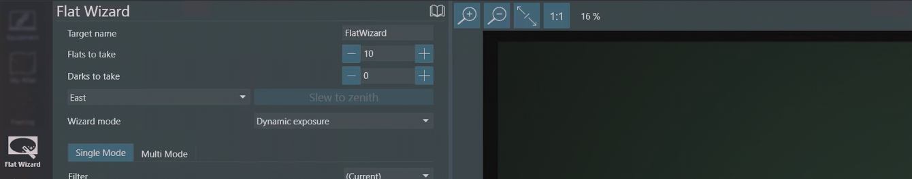

[Home](../README.md) | [Hardware Guide](./hardware.md) | [Installation Guide](./installation.md) | [Using Stellarim](./stellarium.md) | [Using Nina](./nina.md)

# Using Nina with Benro Polaris
## 1. Capturing Images
The Benro Polaris App does a great job controlling your camera to take sequences of images for panoramas, time-lapse, and astrophotography. It exposes many camera features and makes them easy to setup and use. Unfortunately, it doesn't stretch or process images, show RAW files, or make it easy to customize file names or copy them off for stacking.

If you want to go beyond the native app, several software options provide more tailored control of your camera, especially for astrophotography. Some include:

* [BackyardEOS](https://www.otelescope.com/store/category/2-backyardeos/) (no mount control)
* [APT](https://www.astrophotography.app/) - Astro Photography Tool (paid, ASCOM support)
* [SGPro](https://www.sequencegeneratorpro.com/sgpro/) - Sequence Generator Pro (paid, ASCOM Support)
* [Nina](https://nighttime-imaging.eu/) - Nighttime Imaging 'N' Astronomy (free, ASCOM support, Win)
* [CCDciel](https://ap-i.net/ccdciel/en/start/) - (free, ASCOM support, MacOS/Linux/Win)

We are focusing on using Nina, since it is the recommended solution. 

Upon opening Nina, the Equipment tab allows you to discover and connect to all your various astronomy equipment. The first thing you are likely to setup, is your Camera. Nina supports Nikon and Canon cameras natively, and many other cameras through the ASCOM platform.

The Sky Atlas tab allows you to search for various objects in the sky using its own database of deep sky objects. You can filter the list by object type, size, brightnness, and even how far it rises in the sky tonight. You can add a target to a sequence, set it up for framing, or slew the Benro Polaris to point at it. 

The Framing Assistant tab allows you to visualize how you frame up your target. It can download an image of the target and frames your shot given a particular focal length, pixel size, and resolution. It also allows you to plan panoramas with multiple overlapping panels that end up as separate targets in your sequence. The Alpaca Benro Polaris Driver does not currently support rotation.

The Flat Wizard tab helps you take flat images by finding the optimal exposure settings for your camera. It takes a set of exposures and attempts to calculate the best exposure using extrapolation. It then takes a sequence of flats used with your stacking software.

The Sequence tab helps you plan the set of images to capture on each target. You can choose to slew the Benro Polaris and center the image using plate solving (see below). You can also refine the autofocus initially or whenever it drifts out of focus. You can define how many lights, darks, bias, and flat frames are taken at each target.

The Imaging tab is where you will spend most of your time. Across the top, a set of buttons, show or hide information and tool panels. The layout is customizable by dragging and dropping any of the tabs or frames into drop targets around the screen. You can request a live view of stretched, low-resolution captures, one after another. You can also request a high-resolution, longer exposure; that is stretched, debayered and processed. Finally, you get an overview of the current sequence target and can start or stop the sequence.

The imaging tab's main image panel allows you to zoom, rotate, or flip the image. You can also see a zoomed-in-mosiac of the image's center sides and corners. You can enable a crosshair for centering the image. You can also enable star detection annotations, helping you identify focusing and tracking issues. Finally, there is a panel where you can review the images captured so far.

The options tab includes a set of sub-tabs. On the Imaging sub-tab you to customize the directory where all the images will be saved. There is also a flexible approach to changing the naming convention of the images. You can capture additional metadata into a set of csv files using a plug-in called Session Metadata. Finally, you can copy images directly from the storage location to anywhere on your network. No more ejecting SD cards.

All of these image capture features are independent of the Alpaca Benro Polaris (except for slewing of course).

## 2. Selecting Targets
While Ninas Sky Atlas is good for when you dont have an internet connection, other options you may want to consider include:
* [Stellarium](https://stellarium.org/en/) - Has a hidden feature `F10` Astro Calcs > `WUT` Whats up Tonight.
* [Telescopius](https://telescopious.com/) - A website with Astronomy Tools and a great catalog.
* [The Sky Live](https://theskylive.com/whatsvisible) - A website that lists potential targets live.

Other sites that I've found helpful include:
* [Clear Outside](https://clearoutside.com/forecast) - Planning the best night to shoot.
* [Light Polution Map](https://www.lightpollutionmap.info) - Planning where to shoot from.
* [White Screen Online](https://www.whitescreen.online/) - For taking FLAT images

## 3. Star Detection and Autofocus
One key part in mastering astrophotography is ensuring your optics are optimally focused. Modern cameras have fast, super accurate, and intelligent automated focusing systems. They yeild amazing results but less so for astrophotography. Many of the astrophotography apps fill this gap with their own autofocusing systems. They either drive the focuser of a telescope with a motor and belt or drive your camera's lensAF to take pin sharp images of the night sky.

While Nina has its own star detection and autofocus module, I'd recommend installing `Hocus Focus`, a third party star detection plug-in included in the Nina package. You can change Nina's Options > `Imaging` subtab, to use `Hocus Focus` over its own module. If you have a Canon camera, you should also install the Canon LensAF plug-in as well. 

`Hocus Focus` has one of the best star detection algorithms around. It identifies potential stars in your image; assesses them for shape, intensity, size, location; then rejects any outliers; and then measures the remaining stars individual HFR (Half Flux Radius), the smaller the better. Its advanced rejection approach improves the reliability of the summary HFR statistic and summary # stars detected statistic.

Once these plug-ins are installed, use the Equipment > `Focuser` sub-tab to discover and connect to your Cameras Len AF system. Use the Image > `Manual Focus Targets` tool panel to pick a target to focus on. Use the Image > `Focuser` info panel, while in live view, to get your lens roughly into focus. Take a manual Exposure.

After you take an image, you can use the Image > `Star Detection Results` info panel (jigsaw piece) to see how many stars were identified, rejected and detected. The stats on the number of rejeted stars of each type provides clues into what might be wrong with our optics, mount or setup.

You can overlay star detection annotations over the image to see how each individual star has been classified. You can fine tune the annotations on the Image > `Star Annotations Option` panel. Hocus Focus is very detailed and flexible. You also can use Image > `Star Detection Options` subtab to fine tune the Star Detection algorithm if you are not happy with what you see. 

With stars detected and analysed, Nina can then take the HFR statistic as an indicator of how well your optics are focused. Use the Image > `Autofocus` tool panel to manually initate an autofocus run. Nina will move the lens out of focus, then take images, gradually moving the lens back through its focusing range. Nina plots the HFR at each of these images and fits a hyperbolic line to find the optimal focus point.

As every optics system is different, you may need to adjust how Nina drives your lens. On the Options > `Autofocus` sub-tab, you can fine tune Nina's autofocus run process, including how far Nina steps out of focus, how large the steps are, how long to expose for, etc. From the Image > `Autofocus` tool panel you can even re-run past data to see how these changes effect the focus run.

In addition to manually initiated autofocus runs, you can perform them within a sequence. On the `Sequence` tab, you can instruct Nina to perform a run at the start, after # images, after temeratures change, or it notices a HFR shift. 

On the Image > `HFR History` info panel you can also keep a eye on the HFR and # stars detected while you are monitoring a sequence. You may notice drops in star counts when images become blocked by trees or buildings; when wind picks up; when you drift out of frame frame. You may notice increases in HFR as clouds roll in, dew forms on your lens, you change you Camera's battery and its lens focus point shifts, you've left Lens AF or Image Stabilisation on. All anoying things.

`Hocus Focus` and Nina's autofocus system are not perfect. You will get frustrated with them. But it is a game changer over trying to manully do it or squeze the lens AF to spot a star, or flying blind on a sequence. It will dramatically help you improve your keeper rate, preventing the collection of a whole bunch of bad images that are later thrown away in your stacking process.

## 4. Goto Co-ordinates, Aiming accuracy and Tracking
Slew to here.

## 5. Plate Solving, Aiming validity, Drift and Centering
Where am I pointing?

## 6. Three Point Alignment and Tracking
Longer exposures, Longer focal lengths.

## 7. Putting it all together
Example of a real world trip.

