[Home](../README.md) | [Hardware Guide](./hardware.md) | [Installation Guide](./installation.md) | [Using Stellarium](./stellarium.md) | [Using Nina](./nina.md) | [Troubleshooting](./troubleshooting.md) | [FAQ](./faq.md)

# Using Nina with Benro Polaris

## Capturing Images -  Video Demonstration
You can view a demonstration of parts of this documentation in the following YouTube Video.

## 1. Capturing Images
The Benro Polaris App does a great job controlling your camera to take sequences of images for panoramas, time-lapse, and astrophotography. It exposes many camera features and makes them easy to setup and use. Unfortunately, it doesn't stretch or process images, show RAW files, or make it easy to customize file names or copy them off for stacking.

If you want to go beyond the native app, several software options provide more tailored control of your camera, especially for astrophotography. Some include:

* [BackyardEOS](https://www.otelescope.com/store/category/2-backyardeos/) (no mount control)
* [APT](https://www.astrophotography.app/) - Astro Photography Tool (paid, ASCOM support)
* [SGPro](https://www.sequencegeneratorpro.com/sgpro/) - Sequence Generator Pro (paid, ASCOM Support)
* [Nina](https://nighttime-imaging.eu/) - Nighttime Imaging 'N' Astronomy (free, ASCOM support, Win)
* [CCDciel](https://ap-i.net/ccdciel/en/start/) - (free, ASCOM support, MacOS/Linux/Win)

We are focusing on using Nina, the recommended solution, due to its price (free), and excellent user interface (improved user experience).

### Equipment Setup
Upon opening Nina, the Equipment tab allows you to discover and connect to all your various astronomy equipment. The first thing you are likely to setup, is your Camera. Nina supports Nikon and Canon cameras natively, and many other cameras through the ASCOM platform.
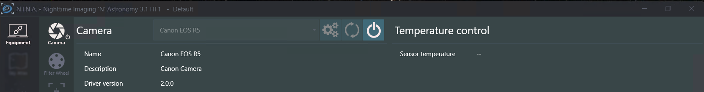

### Finding Targets
The Sky Atlas tab allows you to search for various objects in the sky using its own database of deep sky objects. You can filter the list by object type, size, brightnness, and even how far it rises in the sky tonight. You can add a target to a sequence, set it up for framing, or slew the Benro Polaris to point at it. 
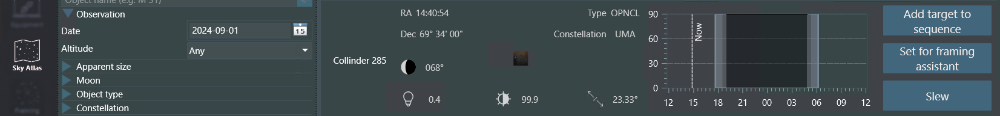

### Framing Images
The Framing Assistant tab allows you to visualize how you frame up your target. It can download an image of the target and frames your shot given a particular focal length, pixel size, and resolution. It also allows you to plan panoramas with multiple overlapping panels that end up as separate targets in your sequence. The Alpaca Benro Polaris Driver does not currently support rotation.
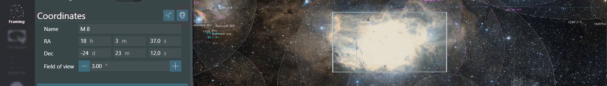

### Taking Flat Images
The Flat Wizard tab helps you take flat images by finding the optimal exposure settings for your camera. It takes a set of exposures and attempts to calculate the best exposure using extrapolation. It then takes a sequence of flats used with your stacking software.

### Sequencing Image Targets
The Sequence tab helps you plan the set of images to capture on each target. You can choose to slew the Benro Polaris and center the image using plate solving (see below). You can also refine the autofocus initially or whenever it drifts out of focus. You can define how many lights, darks, bias, and flat frames are taken at each target.
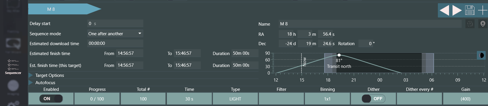

### Controlling Image Capture
The Imaging tab is where you will spend most of your time. Across the top, a set of buttons, show or hide information and tool panels. The layout is customizable by dragging and dropping any of the tabs or frames into drop targets around the screen. You can request a live view of stretched, low-resolution captures, one after another. You can also request a high-resolution, longer exposure; that is stretched, debayered and processed. Finally, you get an overview of the current sequence target and can start or stop the sequence.
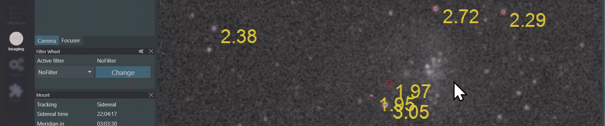

The imaging tab's main image panel allows you to zoom, rotate, or flip the image. You can also see a zoomed-in-mosiac of the image's center sides and corners. You can enable a crosshair for centering the image. You can also enable star detection annotations, helping you identify focusing and tracking issues. Finally, there is a panel where you can review the images captured so far.

### Telescope Control
The Benro Polaris can be controlled from the Equipment/Mount tab as well as the Image tab in Nina. To enable Telescope Control from the Image tab you will need to install the `Scope Control` plugin. 

This plugin provides the ability to MoveAxis, Stop/Stop Tracking, Park/UnPark, Slew to RA/Dec, Slew to Alt/Az, Abort Slew. It also adds two new views to visualise the current position of the Benro Polaris (a) top down view called `Azimulth Chart` and (b) Side View called `Altitude Chart`. These views can be enhanced to show where obstructions are located at your site with the `Horizon Creator` plug-in.

### Customising Settings
The options tab includes a set of sub-tabs. On the Imaging sub-tab you to customize the directory where all the images will be saved. There is also a flexible approach to changing the naming convention of the images. You can capture additional metadata into a set of csv files using a plug-in called Session Metadata. Finally, you can copy images directly from the storage location to anywhere on your network. No more ejecting SD cards.
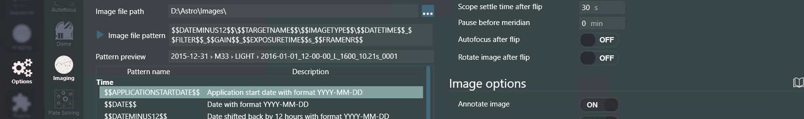

All of these image capture features are independent of the Alpaca Benro Polaris (except for slewing of course).

## 2. Selecting Targets
While Ninas Sky Atlas is good for when you dont have an internet connection, other options you may want to consider include:
* [Stellarium](https://stellarium.org/en/) - Has a hidden feature `F10` Astro Calcs > `WUT` Whats up Tonight.
* [Telescopius](https://telescopious.com/) - A website with Astronomy Tools and a great catalog.
* [The Sky Live](https://theskylive.com/whatsvisible) - A website that lists potential targets live.

Other sites and tools that I've found helpful include:
* [Clear Outside](https://clearoutside.com/forecast) - Planning the best night to shoot.
* [Light Polution Map](https://www.lightpollutionmap.info) - Planning where to shoot from.
* [White Screen Online](https://www.whitescreen.online/) - For taking FLAT images
* [PhotoPills Mobile App](https://www.photopills.com/) - Planning any photography shoot.

## Autofocus - Video Demonstration
You can view a demonstration of parts of this documentation in the following YouTube Video.

## 3. Star Detection and Autofocus
Mastering astrophotography requires ensuring that your camera lens is optimally focused. While modern cameras have fast, accurate, and intelligent focusing systems, they may not produce the best results for astrophotography. To address this, many astrophotography applications, like Nina, have their own autofocusing modules. These modules drive a telescope's focuser or your camera's lens-focusing system to capture sharp night sky images.

### Setup Hocus Focus
While Nina has its own star detection and autofocus module, I'd recommend installing `Hocus Focus`, a third party star detection plug-in included in the Nina package. You can change Nina's Options > `Imaging` subtab, to use `Hocus Focus` over its own module. If you have a Canon camera, you should also install the Canon LensAF plug-in as well. 

`Hocus Focus` has one of the best star detection algorithms around. It identifies potential stars in your image; assesses them for shape, intensity, size, location; then rejects any outliers; and then measures the remaining stars individual HFR (Half Flux Radius), the smaller the better. Its advanced rejection approach improves the reliability of the summary HFR statistic and summary # stars detected statistic.

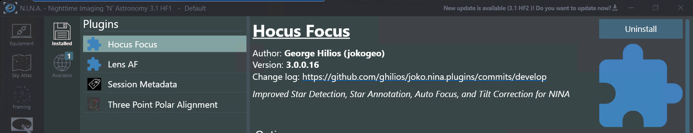

### Initial Manual Focus
Once these plug-ins are installed, use the Equipment > `Focuser` sub-tab to discover and connect to your Cameras Len AF system. Use the Image > `Manual Focus Targets` tool panel to pick a target to focus on. Use the Image > `Focuser` info panel, while in live view, to get your lens roughly into focus. Take a manual Exposure.

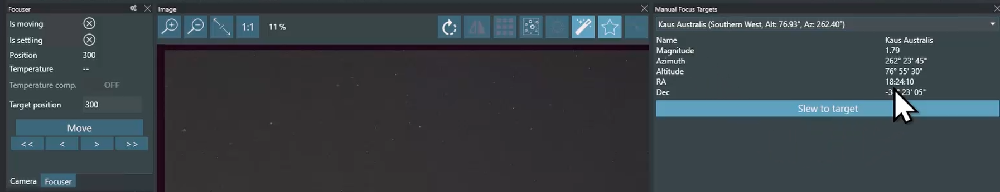

### Star Detection Results
After you take an image, you can use the Image > `Star Detection Results` info panel (jigsaw piece) to see how many stars were identified, rejected and detected. The stats on the number of rejeted stars of each type provides clues into what might be wrong with our optics, mount or setup.

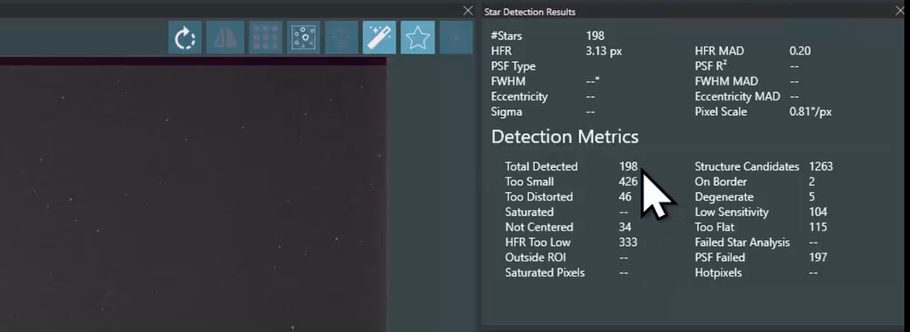

### Star Detection Annotions and Options
You can overlay star detection annotations over the image to see how each individual star has been classified. You can fine tune the annotations on the Image > `Star Annotations Option` panel. Hocus Focus is very detailed and flexible. You also can use Image > `Star Detection Options` subtab to fine tune the Star Detection algorithm if you are not happy with what you see. 

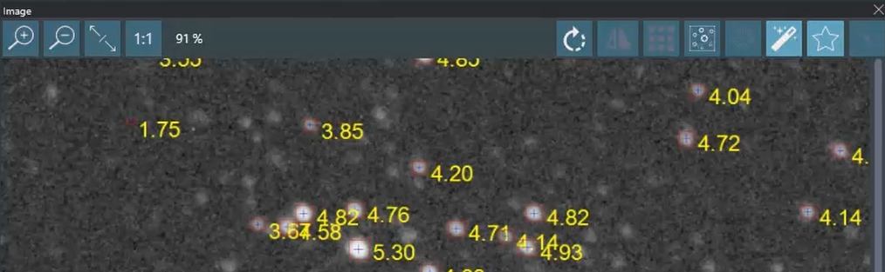

### Manualy Initiated Autofocus Run
With stars detected and analysed, Nina can then take the HFR statistic as an indicator of how well your optics are focused. Use the Image > `Autofocus` tool panel to manually initate an autofocus run. Nina will move the lens out of focus, then take images, gradually moving the lens back through its focusing range. Nina plots the HFR at each of these images and fits a hyperbolic line to find the optimal focus point.

As every optics system is different, you may need to adjust how Nina drives your lens. On the Options > `Autofocus` sub-tab, you can fine tune Nina's autofocus run process, including how far Nina steps out of focus, how large the steps are, how long to expose for, etc. From the Image > `Autofocus` tool panel you can even re-run past data to see how these changes effect the focus run.

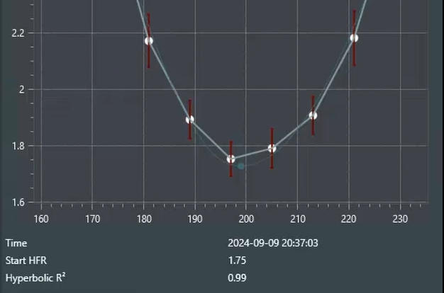

### Sequenced Autofocus Run
In addition to manually initiated autofocus runs, you can perform them within a sequence. On the `Sequence` tab, you can instruct Nina to perform a run at the start, after # images, after temeratures change, or it notices a HFR shift. 

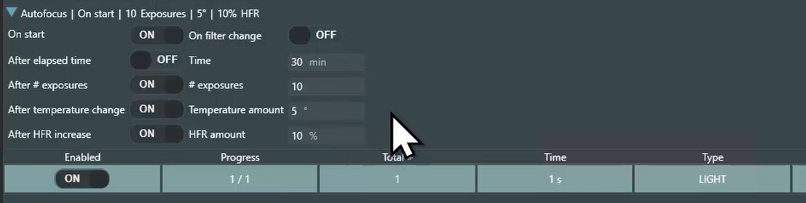

### HFR and Star Detection History
On the Image > `HFR History` info panel you can also keep a eye on the HFR and # stars detected while you are monitoring a sequence. You may notice drops in star counts when images become blocked by trees or buildings; when wind picks up; when you drift out of frame frame. You may notice increases in HFR as clouds roll in, dew forms on your lens, you change you Camera's battery and its lens focus point shifts, you've left Lens AF or Image Stabilisation on. All anoying things.

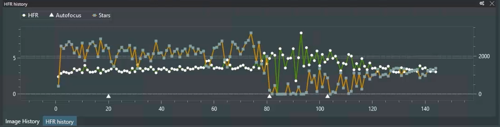

### Autofocus Conclusions
`Hocus Focus` and Nina's autofocus system are not perfect. You will get frustrated with them. But it is a game changer over trying to manully do it or squeze the lens AF to spot a star, or flying blind on a sequence. It will dramatically help you improve your keeper rate, preventing the collection of a whole bunch of bad images that are later thrown away in your stacking process.

## Plate Solving and Alignment - Video Demonstration
You can view a demonstration of parts of this documentation in the following YouTube Video.

## 4. Plate Solving and N Point Alignment
Nina supports a range of Plate-Solving applications to help identify where your mount points in the night sky. Our recommended application is [ASTAP, the Astrometric STAcking Program](https://www.hnsky.org/astap.htm), which includes an astrometric solver. If you have used [Astronomy.net](https://nova.astrometry.net/upload) in the past, you will be amazed at ATAP's speed and ease of integration with Nina.

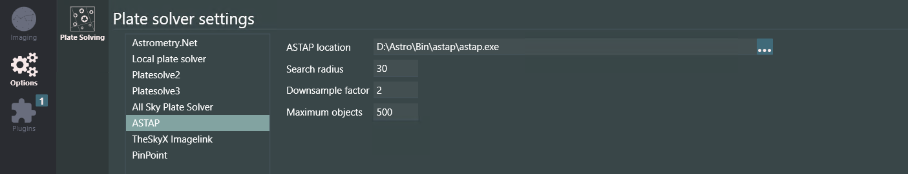

The Alpaca Benro Polaris Driver allows you to integrate the Plate-Solving Sync feature with the alignment process of the Benro Polaris. The driver automatically aligns the Benro Polaris with the resolved coordinates whenever you perform a Sync. The more Plate-Solves you perform, the more accurate the alignment.  

This can help eliminate the need to perform an initial compass alignment. It also eliminates using the BP App's joysticks to align your first star manually. Polar alignment with Benro Polaris was already relatively easy, and plate-solving makes it even easier.

### Setting up ASTAP

ASTAP is not bundled with Nina, so you must download and install the application from the ASTAP website. You will also need to install one or more STAR Databases, which are also available on the website. 

In Nina, on the Options/Plate-Solving tab, you must select ASTAP from the Plate Solver and Blind Solver drop-downs. In the Plate Solver settings panel, choose ASTAP, then set the ASTAP location to where you installed astap.exe. We recommend a short 1-second Exposure Time to facilitate plate-solving when the Benro Polaris is misaligned.

On the Options/Equipment tab, you must set the Camera Pixel Size and Telescope Focal Length to their correct values. If these do not match your equipment, the plate-solve will likely fail. We recommend also setting the Mount Coordinates Sync option to On. This will cause the Driver to align the Benro Polaris on each sync.

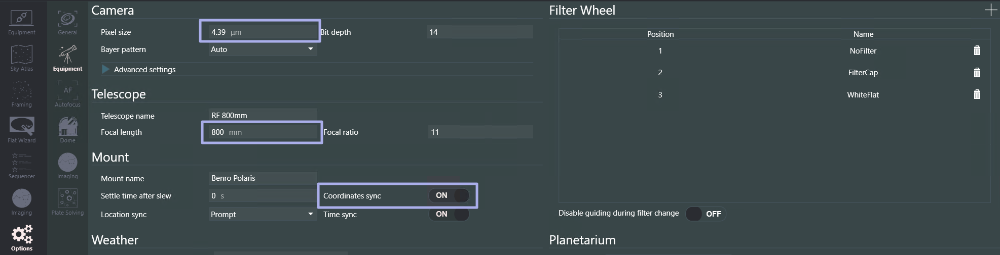

You must also ensure your lens is in focus before attempting a plate-solve. It's a good idea to perform a manually initiated autofocus run.

### Manualy Initiated Plate Solving

Plate solving can be manually initiated from Nina's Imaging tab, Plate Solving Tool Panel. Press the Play button, and Nina will take an exposure and attempt a plate-solve with ASTAP. It will update the Center RA and Center DEC fields on the Plate Solving Tool Panel if successful. You can also choose to Sync from the Plate Solving Tool Panel. This is a quick way to initiate an alignment of the Benro Polaris to its current position.

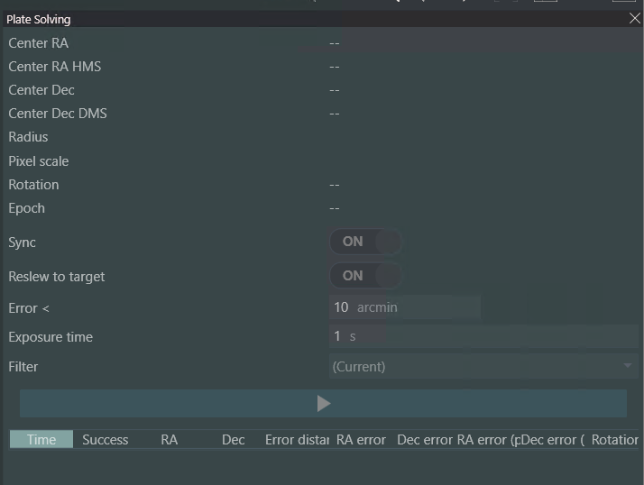

The Imaging tab's main image panel has a button to initiate a Plate Solve from a recently exposed image. This does not allow a sync.

### Sequence Target Centering and Aligning

One of Nina's best features is automated target centering and aligning. From Nina's Sequencer tab, under Target Options, you can enable a Slew to Target and Center Target. 

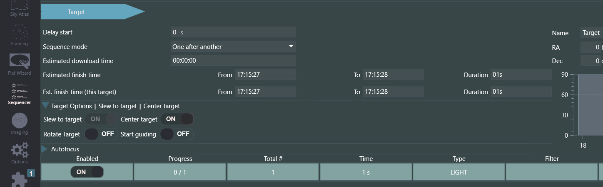

When both these settings are enabled, Nina will do the following at the start of each sequence target:

1. Slew Polaris to the target coordinates.
2. Take an exposure and perform a plate-solve to identify where the Polaris is pointing.
3. Perform a sync to correct all applications upstream of the Driver. 
4. Push the sync through to align the Polaris with its actual orientation.
5. Attempt to slew closer to the target, repeating the process until it is within tolerance.

Once the target is centered, Nina will continue with the sequence, conducting an optional autofocus run and then taking your set of Light images of the target. You can add additional targets to the sequence while it is running, and Nina will repeat the slewing and centering once the first target is complete. 

The Benro Polaris can have a habit of drifting off target. You can address this issue by simply pausing the sequence momentarily. Whenever Nina starts a sequence again, it will perform a Slew to Target and Center Target operation.

### Nina 3 Point Polar Alignment

Nina includes a 3-Point Polar Alignment plugin that can optionally be installed. The Alpaca Benro Polaris includes an "easter egg" feature that allows you to conduct manual 3-Point Polar Alignments using this plug-in. Note that we don't recommend this procedure as it tends to be more tedious than the existing Benro Polaris alignment, and you can get better results with the next section. 

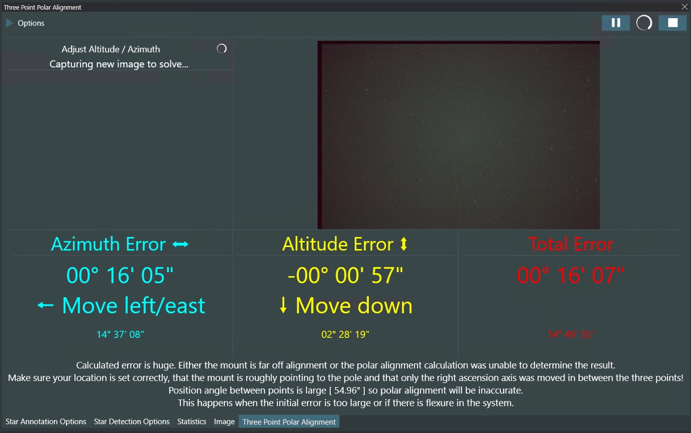

To conduct a three-point polar Alignment, install the plugin, navigate to the main Imaging tab, and open the three-point polar Alignment Tool Panel. Enable the Manual Model and set a Measure Point Distance of 20 degrees. Press the Start Button.

Nina will take an exposure, plate solve, and ask you to rotate the telescope 20 degrees around the RA axis. To do this, navigate to the Equipment/Mount tab, enter 1.2 into the Primary Rate field, click the Secondary Rate field, and then click the W or E move button once. A decimal rate between 1 and 2 will cause the Driver to rotate around the RA axis.

Nina will take its second exposure, plate solve, and ask you to rotate another 20 degrees around the RA axis. Navigate to the Equipment/Mount tab and click the W or E move buttons. The Driver will rotate again.

Once settled, Nina will take its third exposure, plate solve, and calculate your polar alignment error. Nina will continue taking and plate-solving exposures to update the alignment error values. 

Now, the painful part. You must rotate and adjust your leveling base to reduce the RA and Dec errors. I have had success in improving the alignment with this process. In my opinion, the benefit was not worth the pain. Your luck may vary. 

### Alpaca N Point Alignment

The Polaris is an Alt/Az mount, not an equatorial mount. While we initially performed the Sync Offset in RA/Dec coordinates, we have added a second pointing model that performs the Sync Offset in Alt/Az coordinates. This offset is more consistent between different plate solves and is the recommended pointing model for the Driver.

You don't need to do anything extra to perform N-point alignments with the Driver. Just perform multiple synced plate solves. Each new sync will add to the Driver's knowledge of how the Polaris was aligned at different orientations and times. It groups all the results around the Az axis in 15-degree segments. 

You can review the altitude offsets in each of the 15-degree segments to help understand whether the Polaris is within tolerance or tilted. If it is not level, you may need to make some fine adjustments to the leveling base.

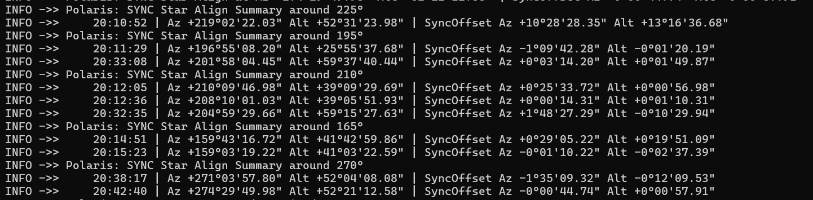

At every plate-solve and sync, the Polaris will be re-aligned. This means that each target will be aligned with coordinates very close to the target.

### Polaris Setup using N Point Alignment

This new alignment process dramatically improves the setup of the Benro Polaris. These are the steps I take now to start an imaging session include:

* Start the BP App and connect to Polaris.
* Switch to Astro Mode, then skip through the Compass Align and Star Align Steps.
* Connect the Alpaca Driver, then turn off the BP App.
* Using Nina, click Park in the Equipment/Mount tab. This is equivalent to double-tapping both BP App joysticks.
* Mount the camera, place the tripod outside, and level it accurately.
* Perform a Nina Autofocus run.
* Perform a manually initiated plate-solve and sync. The Polaris is now aligned.
* Set up a sequence of targets and let the night begin.
* The alignment will automatically improve with each plate-solve, narrowing in on the targets.

I hope you agree this is much easier than using the Benro Polaris App to perform alignment.