[Home](../README.md) | [Hardware](./hardware.md) | [Installation](./installation.md) | [Pilot](./pilot.md) | [Control](./control.md) | [Stellarium](./stellarium.md) | [Nina](./nina.md) | [Troubleshooting](./troubleshooting.md) | [FAQ](./faq.md)

# Alpaca Pilot App
[Purpose](#what-is-alpaca-pilot) | 
[Launching](#i-launching-the-alpaca-pilot-application) | 
[Connect](#ii-connecting-devices) | 
[Dashboard](#iii-using-the-dashboard) | [Catalog](#iv-using-the-catalog)  

## What is Alpaca Pilot?

>VIDEO DEMO - [21 - Alpha Preview Demonstration of V2.0](https://youtu.be/0QSKD1GCzOc)

The **Alpaca Pilot App** is a responsive, single-page web application designed to streamline the startup, configuration and operation of the **Alpaca Driver** when used with the Benro Polaris Mount. It unlocks many of the Driver’s advanced features, enabling users to fully leverage its capabilities.

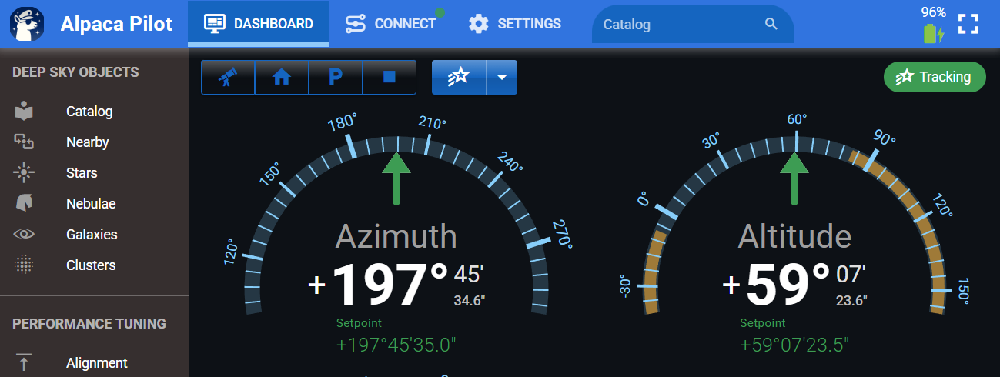

The Pilot App is completely optional. You can continue using Stellarium, NINA and CCDCiel with the Alpaca Driver just as you did in version 1.0, no changes required. However, choosing not to use the Pilot App means missing out on a range of enhancements that are available to you. 

The Pilot App was built to:
- Simplify the Polaris connection and startup process, eliminating the need to use the official Benro Polaris app on startup
- Make it easy to set the observing site’s latitude and longitude
- Eliminate manual editing of the config.toml configuration file
- Offer an expanded Deep Sky Catalog that surpasses Benro’s default catalog
- Enable precise motion control using geographic or equatorial coordinates
- Provide insight into the performance and diagnostics of Driver features
- Allow advanced users to fine-tune Driver performance parameters

---

### Pilot Main Menu

The main menu of the **Alpaca Pilot** application provides centralized access to key functions, status indicators, and configuration tools for managing your Polaris mount. Each element is designed to streamline your workflow and provide intuitive control over the system.

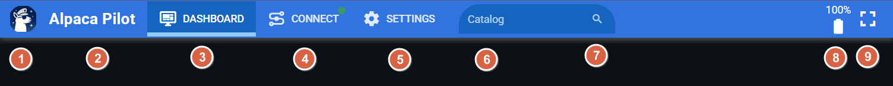

- **① Sidebar Menu:**  Opens the collapsible side navigation menu, giving access to additional modules such as Deep Sky Objects, Performance Tuning and Documentation.

- **② Startup Page:**  Clicking the Title will display the initial startup page of the Alpaca Pilot App.

- **③ Dashboard:**  Provides real-time control and feedback for mount operations. Includes radial dials, setpoint controls, status indicators, and visual feedback for guiding, tracking, and slewing.

- **④ Connect:**  Initiates or terminates the connection to the Alpaca Driver and Polaris mount. This button reflects current connection status.

- **⑤ Settings:** Opens the configuration panel where you can set observing site latitude/longitude, define the park position, adjust preferences, and enable standard and advanced features.

- **⑥ Search Entry:** A text input field for searching catalog entries and targets. Supports shorthand formats and intelligent parsing for quick access to celestial objects.

- **⑦ Search Toggle:** Toggles the visibility of the search entry field. On narrow screens, it also expands the search input area for easier access. When a search term is present, this button acts as a quick-clear control to reset the entry.

- **⑧ Polaris Battery:** Displays the current battery level of the Polaris mount. Includes color-coded indicators or warnings when battery levels are low. Also indicates charging status. On narrow screens, it can also be used to toggle fullcscreen.

- **⑨ Fullscreen:** Toggles fullscreen mode for immersive operation. This is especially useful during outdoor sessions or when using compact displays, allowing maximum space for control and feedback elements.

---

## I. Launching the Alpaca Pilot Application

>VIDEO DEMO - [22 - Launching Alpaca Pilot](https://youtu.be/Wv_ZvBtZZ4Q?t=0m7s)

The Alpaca Pilot App can be accessed via external imaging software or directly through a web browser on a desktop, tablet, or phone.

### Method A: Launching from NINA (Nighttime Imaging 'N' Astronomy)

If you are using NINA, you can launch the Alpaca Pilot App directly from the NINA equipment setup interface:

1.  **Access Equipment Setup:** Navigate to NINA's Equipment setup.
2.  **Mount Connection:** Choose the device for the ABP driver.
3.  **Use Settings Cog:** Before connecting, click the **settings cog button**.
4.  **Fire Up App:** Clicking the settings cog will fire up the Alpaca Pilot application, allowing you to monitor the connection process in detail.

### Method B: Launching via Web Browser

You can access the Alpaca Pilot App directly from any browser using the driver's hostname or IP address.

1. **Start Driver:** Ensure the driver is running on your Mini-PC
1. **Open Browser:** On your phone, table, or laptap that has network access to your Mini-PC, open a Browser of your choice. You can use Chrome, Firefox, Safari, Edge or any modern browser.
1.  **Use Hostname:** Enter the Mini-PC hostname into the address bar
2.  **Use IP Address:** Alternatively, you can type in the IP address of the Mini-PC.
4.  **Full Screen Feature:** On a phone, you can click on the battery icon to make the application go **full screen** to take up the full real estate available.

### Method C: Launching Multiple Instances

The Pilot application is very flexible, allowing users to open up multiple windows simultaneously to facilitate operations and monitoring. To achieve this, you can right-click or hover on any of the navigation links across the top of the application (such as Dashboard, Connections, or Settings) and choose to open them in a new tab or a new window. 

For example, you might choose to open the Catalog as a new window and position it off to the right, while keeping the main Dashboard open on the left. This configuration allows for streamlined workflows, such as performing quick searches for celestial objects in the Catalog while monitoring the mount's status and coordinates on the Dashboard as you navigate to the selected target.

---

## II. Connecting Devices

>VIDEO DEMO - [21 - Connecting to the Driver and Polaris](https://youtu.be/0QSKD1GCzOc?t=0m51s)

When you start the Alpaca Driver, it will automatically attempt to try and connect to the Benro Polaris. The normal sequence of startup events using Alpaca Pilot are as follows:

- A. Start Alpaca Driver
- B. Launch Alpaca Pilot
- C. Power-on the Polaris ane enable Wifi
- D. Connect to the Polaris
- E. Setup the Polaris for Astro Mode

### A. Start Alpaca Driver
After you have installed the Alpaca Driver, you can start the Driver either from a terminal or from the shortcut link you setup. 

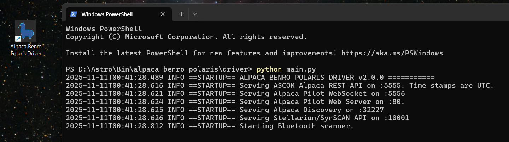

### B. Launch Alpaca Pilot
Follow the instructions from the previous section to launch the Alpaca Pilot Application. Navigate to the Connect page to monitor the startup process.

When you launch the **Alpaca Pilot** application, it attempts to automatically connect to the **Alpaca Driver**. In most cases, this connection is established without user intervention. However, if the Driver is not running or network connectivity is lost, you may need to reconnect manually.

If a connection issue is detected, a warning banner will appear. You can then navigate to the **Connect** page to re-establish communication with the Driver.

- **① Driver Host Name / IP Address:**  Enter the hostname or IP address of the mini-PC where the Alpaca Driver is running.  
**Note:** This is *not* the IP address of the Polaris device. 

- **② Driver Port:** Specifies the port used by the Alpaca Driver’s ASCOM REST API. The default is **5555**.  If you’ve changed this value in the network services, be sure to update it here as well.

- **③ Initiate Connection:**  Click this button to manually initiate or retry a connection to the Alpaca Driver.

- **④ Driver Connection Checkbox:** Toggles the connection status with the Alpaca Driver.  
   - When **disconnected**, it functions the same as the *Initiate Connection* button.  
   - When **connected**, clicking this will disconnect the session.

### C. Power-on the Polaris ane enable Wifi

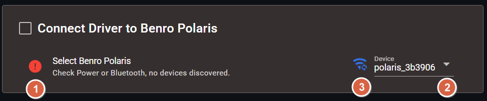

- **① Power On the Polaris:** The Alpaca Driver uses Bluetooth Low Energy (BLE) to discover nearby Benro Polaris Devices. If none are discovered, check the power of your Benro Polaris Device.

   *Note: Bluthooth is only used for discovery and enabling Wifi. It is entirely optional. It is not used in normal operation of the Polaris.*

- **② Select a Device:**  Detected devices appear in the **Device** dropdown. The first discovered device is selected automatically. If multiple devices are listed, choose the one you wish to connect to.

- **③ Enable Wi-Fi:** The Driver will attempt to enable the selected Polaris’s Wi-Fi hotspot automatically.  
   - You can also manually trigger this by clicking the **Wi-Fi button** next to the device dropdown.  
   - If the Blue LED on the Polaris does not illumunate after 30s, you may need to use the **Benro Polaris App** to discover nearby devices, and enable its Wifi. 
   - Once Wi-Fi is successfully enabled, the Blue LED on the Polaris should illumunate.

- **Confirm Wifi Connection:** On Win11, monitor the Wifi List for a polaris_xxxxxx hotspot. Click on the polaris hotspot, enable automatic connection, and click Connect. Once the Mini-PC has connected to the Polaris Wifi Hotspot, it should appear as follows:

   

### D. Connect to Polaris

Once Wifi network connectivity has been established to the Polaris, the Driver should automatically connect. If you have problems connecting to the Polaris, the following fields allow you to manually initiate a connection with custom settings.

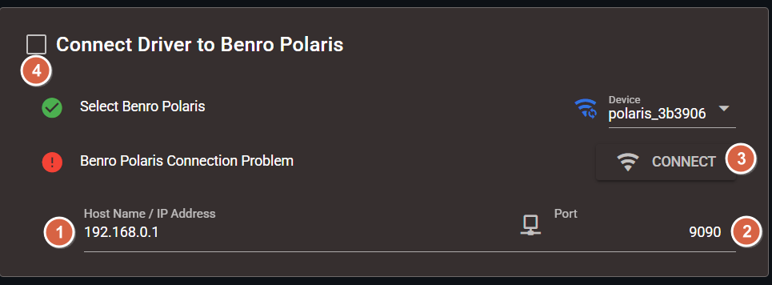

- **① Polaris Host Name / IP Address:** This will typically remain as **192.168.0.1**. Enter the hostname or IP address of the Polaris Device.   
   *Note: This is *not* the IP address of the Alpaca Driver.* 

- **② Polaris Port:** This will typically remain as **9090**. Specifies the port used by the Polaris. 

- **③ Initiate Connection:**  Click this button to manually initiate or retry a connection to the Polaris. 

- **④ Polaris Connection Checkbox:** Toggles the connection status with the Polaris.  
   - When **disconnected**, it functions the same as the *Initiate Connection* button.  
   - When **connected**, clicking this will disconnect from the Polaris.

 

   > **Troubleshooting Guide**
   If you continue to experience issues connecting to the Polaris, consult the [Troubleshooting Guide](./troubleshooting.md) for diagnostic steps and solutions.

 

### E. Setup the Polaris for Astro Mode

Follow these steps to prepare your Benro Polaris mount for Astro Mode using the Alpaca Pilot App:

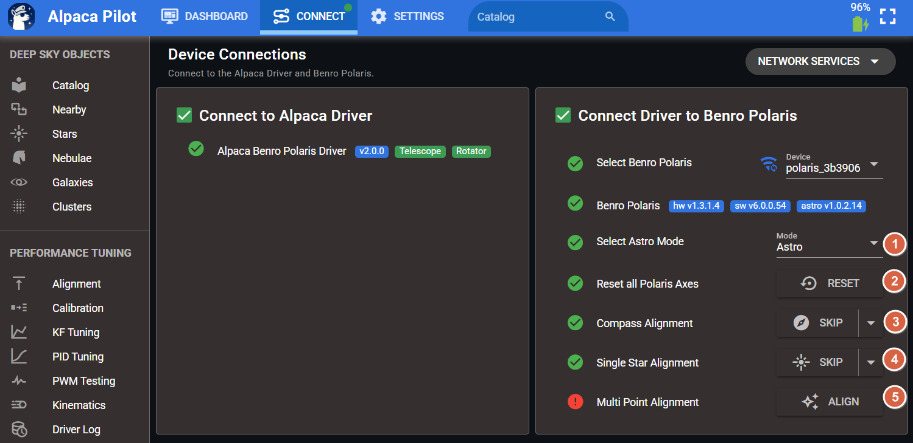

- **① Switch to Astro Mode:** When the Pilot App launches, it will display the current Polaris mode. This is typically **Photo Mode** on first power-up. Use the dropdown menu to switch to **Astro Mode**.

- **② Initiate Axis Reset:** Click the **Reset** button to command the Polaris to reset all three axes. This replicates the double-tap gesture on each joystick in the Benro Polaris App.

   >**Wait for Reset Completion**  
   Allow the mount to finish its reset sequence. Wait until all axes reach their final positions and all motion ceases.

- **③ Skip Compass Alignment:** Normally, entering Astro Mode requires a Compass Alignment via the Benro Polaris App. With Pilot, you can bypass this by pressing **Skip**.  
   - The default Azimuth is **180°**, but you can manually set it to approximate the mount’s current camera direction.  
   - Note: This Azimuth setting is not equivalent to the Compass Align direction used in the Benro app. It is 180° offset.

- **④ Skip Single Star Alignment:** Astro Mode also typically requires a Single Star Alignment. You can skip this step in Pilot by pressing **Skip**.  
   - Defaults: Azimuth **180°**, Altitude **45°**  
   - You may adjust these to match the camera’s current orientation.

- **⑤ Multi Point Alignment:** Click this Button to navigate to the Alignment Page. This will allow you to enable to Multi-Point Alignment and review model residuals. After 3 or more Sync Points are added to the model this indicator will turn green. If you are using Single Point Alignment, you can ignore this red indicator on the connect page.

- **Set Observing Site Location:** If the app displays a warning that **latitude and longitude are unset**, go to **Settings** in the menu bar.  
   - Use the map to locate your observing site and click to set it.  
   - The app will attempt to auto-fill altitude, pressure, and location name via a web service.

- **Begin Plate Solving:** With setup complete, you're ready to use the Driver and perform your first plate solve.

### F. Network Services
The **Network Services Dialog** on the **Connect** page is optional, but provides advanced control over how the Alpaca Driver exposes its network services. You can selectively disable specific services or change the network port they use.

This is primarily useful for:
- Reducing the network surface area of the Driver for security or performance reasons  
- Resolving port conflicts with other services running on the same system

Additionally, this dialog allows you to modify the Driver’s behavior regarding automatic reconnection to the Polaris mount. You can disable auto-reconnect if manual control is preferred or if the mount is temporarily unavailable.

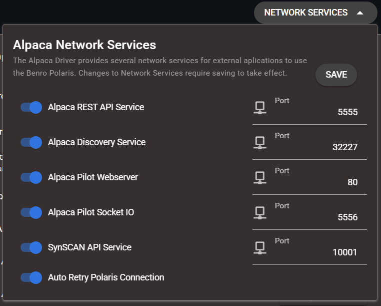

 
 

## III. Using the Dashboard
>VIDEO DEMO - [21 - Dashboard introduction](https://youtu.be/0QSKD1GCzOc?t=4m55s)

>VIDEO DEMO - [22 - Dashboard Status and Setpoint Entry](https://youtu.be/Wv_ZvBtZZ4Q?t=3m18s)

### Purpose of the Dashboard
The dashboard is the central component of the Alpaca Pilot App. It basically shows you the current **orientation of the telescope** and any **activity on the motors**. It provides **real-time telemetry** of the mount's current coordinates, including Azimuth, Altitude, Roll or Right Ascension, Declination, Position Angle. The Dashboard also provides direct control of the mount through action buttons and interaction into zoomable radial dials for each co-ordinate.

### Action Buttons
The action buttons in the top-left corner of the Dashboard offer quick access to global mount controls.

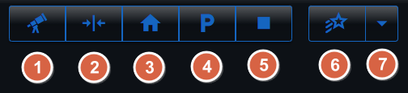

-   **① Co-ordinate Mode:** This feature allows you to **quickly switch** between two primary coordinate systems for viewing and control:
    *   **Geographical** - Azimuth, Altitude, and Roll.
    *   **Equatorial** - Right Ascension, Declination, and Position Angle.
-   **② Reset SP (Set Point):** This button appears when the mount’s actual position (Present Value) has deviated from the desired target position (Set Point). This may occur when the mount is controlled by a non Alpaca Application or when the mount is not physically able to reach the setpoint. Clicking the **Reset Set Point button** instructs all set points to reline up with the current physical values of the device.
-   **③ Find Home:** When clicked, it moves the motors and changes the orientation of the mount to wind the motor angles (**M1, M2, M3**) back to zero. If the mount is set up pointing south, this typically results in an Azimuth of 180°, an Altitude of 45°, and a Roll of 0°. If the mount cannot complete this movement within 
-   **④ Park:** This function moves the mount into a designated park position.  You can **customize and save** the park position motor angles from the settings page. Once the mount reaches the park location, a yellow banner will appear, and most functions are disabled; you must click a button to **unpark** to resume use.
-   **⑤ Stop:** This button allows you to **immediately stop** the mount. This is equivalent to an **Abort Slew** operation and will stop motion across all axes.
-   **⑥ Tracking:** This action button controls the mount's sidereal tracking state. It allows you to **initiate tracking** or **turn tracking off**. Ensure you have tracking enabled for plate-solving or imaging deep sky objects as it is no longer automatically enabled after gotos
-   **⑦ Tracking Rate:** This control allows you to **adjust the tracking rate** of the mount. The Alpaca Driver version 2.0 supports ASCOM Alpaca Drive Rates, including 0=Sidereal, 1=Lunar, 2=Solar, 3=King and 4=Custom. 

### Status Indicator
The Status Indicator (a status chip in the top right-hand corner of the Dashboard) gives the **state of the motion controller** in the Alpaca driver. Only one state is given at a time, but they are all listed here for explaination purposes.

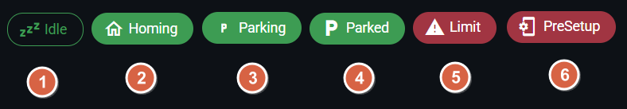

-   **① Idle:** This state means **no commands are currently being issued** from the driver to the Polaris. In this state, the Benro Polaris (BP) app can be used without the driver interfering.
-   **② Homing:** The mount is actively moving its motors back to the zero position (0, 0, 0 motor angles).
-   **③ Parking:** The mount is moving into the customized park motor angle position.
-   **④ Parked:** The mount has reached the set park location. A banner appears, and most functions are disabled until the mount is unparked.
-   **⑤ Limit:** This indication appears on the dashboard when a **motor angle limit has been exceeded**. All control to the Polaris will be stopped. The user must click the reset button to acknowledge the limit.
-   **⑥ PreSetup:** This flag or alarm indication appears when the **observing site location (latitude, longitude)** has not been set. No action can be taken with the mount until the location is set.

These indicators reflect the mount’s current motion or tracking mode:
-   **① Gotoing:** The mount is slewing to a target position following a GOTO command.
-   **② Slewing:** The mount is executing a manual slew operation.
-   **③ Rotating:** The mount is actively adjusting its rotation or position angle.
-   **④ Guiding:** The mount is responding to pulse-guiding commands to refine its tracking.
-   **⑤ Sidereal:** - Sidereal tracking is enabled. The mount is following the apparent motion of the stars, maintaining fixed equatorial coordinates.

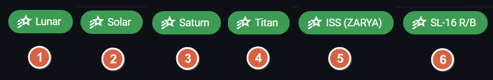

When tracking an orbital object, the motion deviates from sidereal tracking. The indicator will instead display the name of the object being tracked:
-   **① Lunar:** Tracking the Moon’s motion.
-   **② Solar:** Tracking the Sun’s motion.
-   **③ Saturn:** Tracking a planetary target.
-   **④ Titan:** Tracking a planetary moon.
-   **⑤ ISS (ZARYA):** Tracking the International Space Station.
-   **⑥ SL-16 R/B:** Tracking a rocket body (spent stage).

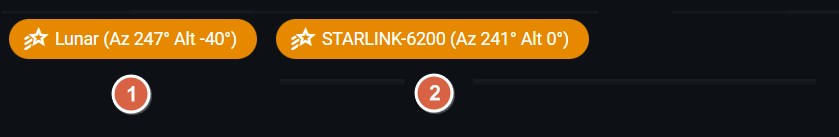

When an orbital object is below 10° altitude, the status indicator turns orange, and its current position is appended to the tracking chip. In this state, the mount does not update its setpoint, allowing you to preselect and monitor targets before they become visible. Once the object rises above 10°, the mount will automatically slew to its position and begin tracking.

-   **① Lunar below the Horizon:** The Moon is currently at −40° altitude. The mount is standing by and will begin tracking once it rises.
-   **② Starlink below 10°:** The communications satellite is below the 10° threshold. The mount is waiting to initiate tracking.

### Motor Indicators

The dashboard shows any **activity on the motors** and the current **M1, M2, and M3 motor angles**. These angles show the **actual physical rotation** of each motor from its home position. Importantly, unlike coordinate axes (like azimuth), the motor angle **does not wrap around** at 360 degrees; it keeps recording how far the motor has moved. 

-   **① Motor Label:** The labels M1, M2 and M3 represent the Azimuth, Altitude and Astro axis accordingly.
-   **② Angular Offset:** The signed angular rotation in decimal degrees that each motor has traveled from its home or zero position.
-   **③ Motor Activity:** The orbiting dot, represents motion in the corresponding axis. It rotates in the direction and speed of the motors motion. The speed is exegerated for slow motion so very fine movement can be seen. 

### Radial Dials
The radial dials are a core part of the dashboard, designed to be flexible and interactive. They provide a quick representation of the current orientation of the mount, either in geographic or equatorial co-ordinates. 

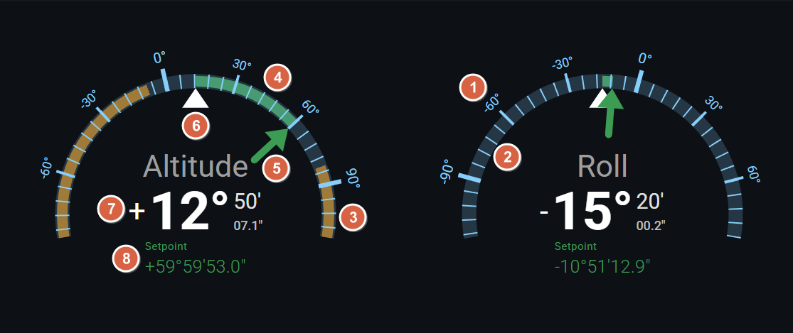
-   **① Scale Label:** Displays the rounded numeric values associated with a major tick on the radial dial. Clicking or Tapping on the numeric label will change the Setpoint of that co-ordinate to the given value.
-   **② Scale Bar:** The cyan arc indicates an angular scale, marked with 5 minor ticks of equal distance dividing the major ticks. Clicking or tapping on the scale bar will change the Setpoint to the exact value at that point. 
-   **③ Warning Bar:** A orange arc that highlights regions of the scale where values exceed safe or expected limits. If a pointer enters this zone, it may indicate that the angle is not reachable.
-   **④ Deviation Bar:** A green arc that indicates the real-time difference between the setpoint (SP) and the present value (PV). The arc represents the path that the mount will travel to close the deviation to zero.
-   **⑤ SP Pointer:** A green arrow pointing to the current Setpoint target value the system is trying to achieve. It remains fixed unless the setpoint is adjusted.
-   **⑥ PV Pointer:** A white triangle pointing to the Present Value of the axis. This pointer will always point to the top center of the arc. As the mount moves in real time, the scale will rotate around this pointer. 
-   **⑦ PV Readout:** A numeric display of the Present Value in Degrees, Arc-Minutes and decimal Arc-Seconds (except for Right Ascension which is in Hours, Minutes and Seconds). 
-   **⑧ SP Readout:** A numeric display of the current Set Point. This value reflects the target the system is actively trying to maintain.

 

When you hover your mouse or tap your finger on a radial dial, additional buttons will appear allowing you to interact with that co-ordinate.

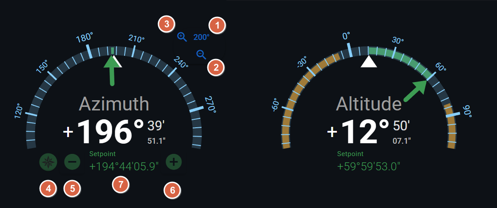

- **① Range Readout:** Displays the total angular span of the radial dial, measured from left to right. This value also determines the slew rate when adjusting the Set Point using controls ⑤ or ⑥. Specifically, the slew rate is equal to (Range ÷ 20) degrees per second. As a result, it takes approximately 20 seconds to move the Set Point across the full range of the dial.
- **② Increase Range:** - Expands the scale range to accommodate larger values. Use this when the current range is too narrow or when values are changing too rapidly to interpret clearly. Scrolling the mouse wheel upward has the same effect as this control.
- **③ Decrease Range:** Narrows the scale range to enhance resolution and visual precision. This is especially useful when movements are subtle and you want finer detail in the display.
Scrolling the mouse wheel downward performs the same action as this control.
- **④ Floating Action Buttons:** - Toggles the visibility of context-sensitive presets for quickly adjusting the Set Point. The available presets depend on the coordinate type of the active radial dial:
   - Azimuth: North 0°, East 90°, South 180°, West 270°
   - Altitude: 0°, 30°, 45°, 60°
   - Roll: –75°, 0°, +70°
- **⑤ SP Decrease**  
  Decreases the current setpoint (SP) by a fixed increment, determined by the active Range setting. Use this to manually slew the target value downward.  
 *Note: The mount may take a moment to respond and align with the new setpoint.*
- **⑥ SP Increase**  
  Increases the current setpoint (SP) by a fixed increment, based on the current Range. Use this to manually slew the target value upward.  
  *Note: The mount may take a moment to respond and align with the new setpoint.*
- **⑦ SP Data Entry**  
  Enables direct numeric input of the setpoint value. Ideal for precise adjustments or bypassing incremental steps. After entering the desired value, confirm to apply it. The input field supports a variety of formats:

  **Absolute Setpoint Formats**
  - `90.234` — Decimal degrees (or hours for Right Ascension)  
  - `90:30` — Degrees and minutes  
  - `90:30:25.2` — Degrees, arcminutes, and decimal arcseconds  
  - `:30.5` — Decimal arcminutes  
  - `-90` — Negative decimal degrees  

  **Relative Setpoint Formats**
  - `d-2` — Decrease by 2 degrees (or hours for Right Ascension)  
  - `d:30` — Increase by 30 arcminutes  
  - `d::40` — Increase by 40 arcseconds  
  - `d2.5` — Increase by 2.5 decimal degrees

## IV. Using the Catalog

>VIDEO DEMO - [22 - Alpaca Pilot Catalog](https://youtu.be/Wv_ZvBtZZ4Q?t=6m42s)

The Alpaca Pilot application features an expanded and intuitive catalog designed to simplify the selection and targeting of celestial objects for astrophotography. This guide details the catalog's contents, how to navigate, filter, and use it for slewing and alignment.

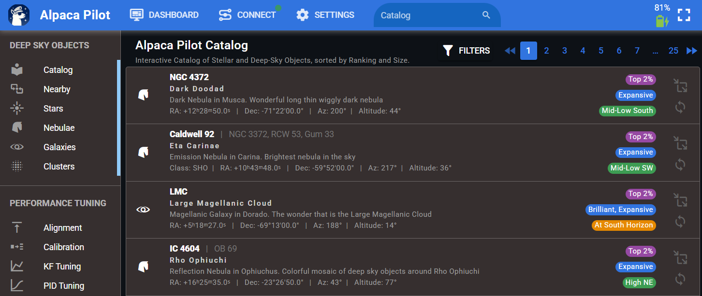

### What the Catalog Includes

The catalog in the Alpaca Pilot App has been **significantly expanded** beyond the original Benro Polaris catalog.

1.  **Curated Content:** Instead of listing thousands of objects, the catalog focuses on **quality**. It includes a curated selection of over **500 premium deep sky objects**. These targets highlight the top 25% of imaging targets, based on input from experienced astrophotographers.
2.  **Object Types:** The entries include a selection of Nebulae, Galaxies, Clusters, Stars, Planets, Moons, and Satellites.
3.  **Ratings and Notes:** Each entry provides helpful notes and community ratings to guide your choices. To keep the application footprint small, items categorized as "typical," "hard," or "avoid" are excluded from the base catalog.
4. **Cross Referenced:** Each entry is cross referenced to over 25 master catalogs like Messier, Caldwell, NGC, IC, H400, Sh2, LDN etc. 

### Understanding Catalog Visual Indicators (Chips)

Each target listing features three coloured chips that provide a quick visual summary of the object's characteristics and current position:

| Chip Colour | Name | Information Provided | Examples of Categorization |
| :--- | :--- | :--- | :--- |
| **Purple** | **Rating** | Indicates the item's imaging rating. By default, the catalog is searched with the most highly rated items listed first. | Categories are used to filter to the top 25% of targets for imaging suitability. |
| **Blue** | **Visibility** | Shows the brightness (apparent magnitude) and angular size of the object. | **Size:** Greater than 100 arc minutes (e.g., Carina Nebula), Extended (30-100 arc minutes), etc.. **Brightness:** Brilliant (magnitude < 2), Bright (2–4), Visible, Dim, Faint (up to magnitude 10). |
| **Yellow** | **Position** | Gives a quick, readable sense of the target's position in the sky (azimuth and altitude). | Examples include "mid low in the southwest," "high in the north," or "near the horizon". Items high above 82 degrees (near zenith) or "below the horizon" are flagged as red. |

### Searching the Catalog
The search system is designed to be fast, intuitive, and efficient for target selection. You can find any object by simply **typing a few letters or numbers** of its name or catalogue reference.

1. **Search by Name:**
   Enter part of the object’s **common name**.

   * Example: **“rig”** →  *Rigil Kentaurus*.
   * Example: **“pole”** →  *North Celestial Pole*.

2. **Search by Reference:**
   Enter part of the object’s **catalogue designation**.

   * Example: **“M8”** → *Lagoon Nebula*
   * Example: **“NGC 5139”** → *Omega Centauri*

Common catalogue prefixes include **M**, **NGC**, **IC**, **C (Caldwell)**, **Abell**, **Arp**, **H (Herschel)**, **LDN**, and others.
For a full list of supported catalogues, see the **Reference Catalogues** section.

### Filtering Results
You can filter targets by various key attributes that affect imaging suitability, including **Type, Proximity, Quality Rating, Altitude, Classification, Angular size, Apparent magnitude (brightness)**.

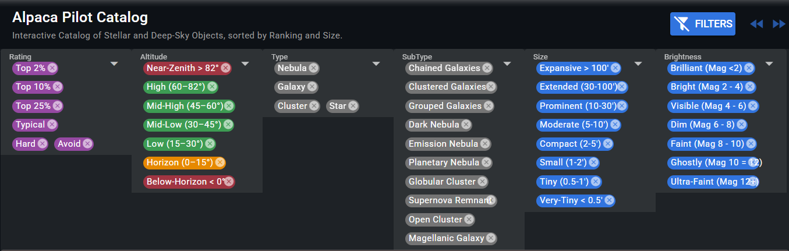

1.  **Filtering by Type (Side Menu):** Use the side menu to limit results by broad object type, such as Nebula, Galaxy, Cluster, or Star.
1.  **Filtering by Proximity (Side Menu):** Displays objects sorted by angular proximity to the telescope’s current pointing or the mount’s orientation. Ideal for finding nearby targets without slewing far.
2.  **Filtering by Quality Rating (Dropdown):** Filter by the visual and imaging quality rating of each object, eg Top 2%, 10%, 25%.
3.  **Filtering by Altitude (Dropdown):** Limit the list based on the height of the object in the sky.
3.  **Filtering by Classification (Dropdown):** Filter by fine grained classification of the subtype of the object.
3.  **Filtering by Size (Dropdown):** Filter by apparent angular size of the object
3.  **Filtering by Brightness (Dropdown):** Filter by visual brightness (magnitude) for selecting objects suited to your observing or imaging conditions

### GoTo (Slew) to the Target
To move the mount to a target's location, simply **click the GoTo button** associated with the item, and the mount will start moving to that location.

*   **Tracking State Preservation:** When you issue a GoTo command, the driver will preserve **whatever the tracking state was** at the time; it does not automatically turn tracking on.
*   **Roll Angle Preservation:** When you issue a GoTo command, the driver will preserve **whatever the roll angle state** at the time; it does not reset back to zero. When in equitorial model, the Roll Angle is still preserved, and the corresponding Position Angle for that orientation is selected.

### Sync with a Target
If the object you have selected is **already visible in your camera’s field of view**, you can use the sync function to align the mount's coordinates precisely. Syncing helps the Driver understand where the telescope is pointing compared to where Polaris thinks it is, correcting any upstream misalignment.

### Orbitals

The catalog supports a range of orbital objects whose motion deviates from sidereal tracking and whose equatorial coordinates are not fixed. To accommodate these, the Driver includes additional tracking rates beyond standard sidereal motion, including the ASCOM standard rates of Lunar, Solar and Custom (to cater for many orbitals)

#### Solar System Objects

This category includes natural bodies such as the Sun, Moon, planets, and planetary moons. These objects are built directly into the catalog and can be searched and filtered like any other entry.

Because their equatorial coordinates change over time, the Driver recalculates their positions at startup for catalog display. When tracking is active, their positions are updated every 200 ms to maintain accuracy.

#### Artificial Satellites

The catalog enables search and tracking of over 32,000 artificial objects, including satellites, space stations, rocket bodies, and orbital debris; using their standard NORAD ID. These objects are not stored locally but are dynamically retrieved when queried. Upon searching by NORAD ID, the Driver fetches the satellite’s orbital elements and begins tracking, updating its position every 200 ms.

Unlike fixed stars, artificial satellites can move rapidly across the sky. Some crossing from horizon to horizon in just a few minutes. Their dynamic trajectories present unique challenges for real-time tracking and observation.

#### Typical Pass Duration of Artificial Objects by Orbit Type

| Orbit Type         | Altitude Range | Pass Duration | Example Satellites         |
|--------------------|----------------|---------------|----------------------------|
| Low Earth Orbit (LEO) | 200–2,000 km   | 2–10 minutes   | ISS, Starlink, Hubble      |
| Medium Earth Orbit (MEO) | ~20,000 km     | 10–20 minutes  | GPS, Galileo               |
| Geostationary Orbit | ~35,786 km     | Continuous     | Weather, communications    |

- **LEO satellites** like the ISS typically take **4–6 minutes** to cross from horizon to horizon when visible.
- **Inclination and observer latitude** affect how high and long the pass appears. Near-equatorial orbits may skim the horizon at high latitudes.
- **Elevation angle** matters: passes directly overhead (high elevation) are longer and brighter than low-angle ones.

---

#### Finding NORAD IDs to track

- **Resources for prediction**:
  - [Heavens-Above](https://www.heavens-above.com): precise pass times, RA/Dec, and sky charts.
  - [N2YO](https://www.n2yo.com): live tracking with azimuth/elevation and magnitude.
  - [CelesTrak](https://celestrak.org/NORAD/elements/): list of orbital elements by numerous categories.
  - [SatelliteMap.space](https://satellitemap.space/): advanced visualisation of artificial satellites around the globe.
- **Best viewing times**: 1–2 hours after sunset or before sunrise, when the satellite is sunlit but your location is dark.

### Reference Catalogs

Alpaca Pilot’s select list of objects are cross-referenced with more than 25 master catalogues, encompassing the most popular and scientifically significant deep-sky objects observed by both amateur and professional astronomers.

| Catalogue                       | Description                                                                       | Objects |
| ------------------------------- | --------------------------------------------------------------------------------- | ------- |
|| **General Catalogues** |
||
| **Messier (M)**                 | Classic list of 110 bright deep-sky objects compiled by Charles Messier (~1774).  | 110     |
| **Caldwell (Caldwell)**                | Patrick Moore’s 1995 complement to Messier, covering both hemispheres.            | 109     |
| **Herschel 400 (H)**        | 400 of William Herschel’s best nebulae and clusters from his 18th-century survey. | 400     |
| **New General Catalogue (NGC)** | The main reference catalogue for deep-sky objects (~1888).                        | 7,840   |
| **Index Catalogue (IC)**        | Supplement to the NGC with later discoveries (~1912).                             | 5,386   |
| **Henry Draper (HD)** | Comprehensive stellar catalogue listing over 225,000 stars, compiled at Harvard College Observatory (1918–1924). Each star is identified by spectral type and magnitude.| 225,300+ |
||
|| **Galaxy Catalogues** |
||
| **Abell**         | Clusters of galaxies—the largest bound structures in the universe (~1958). | 4,073   |
| **Arp**           | Atlas of 338 “peculiar” or interacting galaxies (~1966).                   | 338     |
| **Hickson** | Compact groups of small, closely packed galaxies (~1982).                  | 100     |
| **PGC**           | Principal Galaxies Catalogue—comprehensive all-sky galaxy list (~1995).    | 73,197  |
| **UGC**           | Uppsala General Catalogue—northern hemisphere galaxies (~1973).            | 12,921  |
||
|| **Planetary Nebulae Catalogues** |
||
| **Abell**         | Old planetary nebulae from Palomar Sky Survey (~1966).     | 86      |
| **Minkowski** | PNe discovered in the 1940s; includes the M 1–4 series.    | 207     |
| **Kohoutek**  | Extensive PN survey by Luboš Kohoutek (~1967).             | 1,500   |
| **Griffiths**     | Modern visual selection of bright, interesting PN (~2012). | 45      |
||
|| **Nebulae Catalogues** |
||
| **Barnard**     | Classic dark nebulae photographed by E.E. Barnard (~1927). | 349     |
| **LDN**             | Lynds Dark Nebulae from Palomar survey (~1962).            | 1,802   |
| **LBN**             | Lynds Bright Nebulae—bright diffuse nebulosity (~1965).    | 1,025   |
| **Sharpless (Sh 2-)** | Emission nebulae and H II regions (~1959).                 | 313     |
| **RCW**             | Southern emission nebulae (~1960).                         | 182     |
| **Gum**         | Southern H II regions catalogue (~1955).                   | 85      |
| **vdB**             | Reflection nebulae (~1966).                                | 159     |
| **SNR**             | Galactic Supernova Remnants (~1984).                       | 294     |
||
|| **Other Special Catalogues** |
||
| **Hidden Treasures (HT)**  | Stephen O’Meara’s list of 109 overlooked but beautiful objects (~2007).        | 109     |
| **Secret Deep (SD)**       | Further 109 deep-sky highlights not in Messier or Caldwell (~2011).            | 109     |
| **Orphaned Beauties (OB)** | Astrophotography-focused list of 109 large, under-appreciated objects (~2020). | 109     |
| **Small Packages (SP)**    | 109 compact but fascinating small targets (~2020).                             | 109     |
| **Satellites (ID)**    | NORAD-tracked artificial objects with known brightness and motion (~ongoing).  | 32k+    |
| **Solar System Bodies (IAU)**  | IAU-designated planetary and lunar objects including Sun, Moon, Planets, Moons | 30+     |

 
 

