[Home](../README.md) | [Hardware](./hardware.md) | [Installation](./installation.md) | [Pilot](./pilot.md) | [Control](./control.md) | [Stellarium](./stellarium.md) | [Nina](./nina.md) | [Guiding](./guiding.md) | [Troubleshooting](./troubleshooting.md) | [FAQ](./faq.md)

# Alpaca Pilot App
[Purpose](#what-is-alpaca-pilot) | 
[Launching](#i-launching-the-alpaca-pilot-application) | 
[Connect](#ii-connecting-devices) | 
[Dashboard](#iii-using-the-dashboard) | 
[Catalog](#iv-using-the-catalog) | 
[Panoramas](#capturing-panoramas-with-the-alpaca-driver) 

## What is Alpaca Pilot?

>VIDEO DEMO: [21 - Alpha Preview Demonstration of V2.0](https://youtu.be/0QSKD1GCzOc)

The **Alpaca Pilot App** is a responsive, single-page web application designed to streamline the startup, configuration and operation of the **Alpaca Driver** when used with the Benro Polaris Mount. It unlocks many of the Driver’s advanced features, enabling users to fully leverage its capabilities.

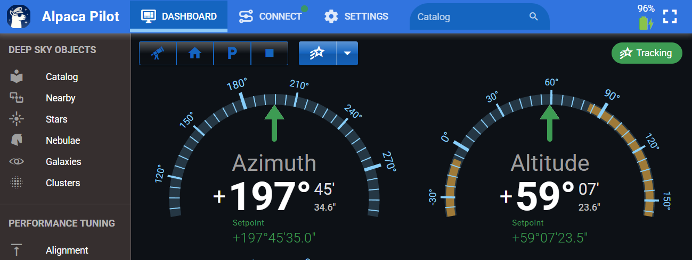


The Pilot App is completely optional. You can continue using Stellarium, NINA and CCDCiel with the Alpaca Driver just as you did in version 1.0, no changes required. However, choosing not to use the Pilot App means missing out on a range of enhancements that are available to you. 

The Pilot App was built to:
- Simplify the Polaris connection and startup process, eliminating the need to use the official Benro Polaris app on startup
- Make it easy to set the observing site’s latitude and longitude
- Eliminate manual editing of the config.toml configuration file
- Offer an expanded Deep Sky Catalog that surpasses Benro’s default catalog
- Enable precise motion control using geographic or equatorial coordinates
- Provide insight into the performance and diagnostics of Driver features
- Allow advanced users to fine-tune Driver performance parameters


---

### Pilot Main Menu

The main menu of the **Alpaca Pilot** application provides centralized access to key functions, status indicators, and configuration tools for managing your Polaris mount. Each element is designed to streamline your workflow and provide intuitive control over the system.

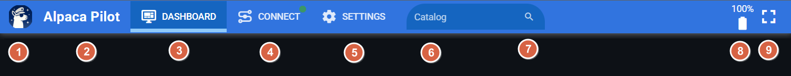


- **① Sidebar Menu:**  Opens the collapsible side navigation menu, giving access to additional modules such as Deep Sky Objects, Performance Tuning and Documentation.

- **② Startup Page:**  Clicking the Title will display the initial startup page of the Alpaca Pilot App.

- **③ Dashboard:**  Provides real-time control and feedback for mount operations. Includes radial dials, setpoint controls, status indicators, and visual feedback for guiding, tracking, and slewing.

- **④ Connect:**  Initiates or terminates the connection to the Alpaca Driver and Polaris mount. This button reflects current connection status.

- **⑤ Settings:** Opens the configuration panel where you can set observing site latitude/longitude, define the park position, adjust preferences, and enable standard and advanced features.

- **⑥ Search Entry:** A text input field for searching catalog entries and targets. Supports shorthand formats and intelligent parsing for quick access to celestial objects.

- **⑦ Search Toggle:** Toggles the visibility of the search entry field. On narrow screens, it also expands the search input area for easier access. When a search term is present, this button acts as a quick-clear control to reset the entry.

- **⑧ Polaris Battery:** Displays the current battery level of the Polaris mount. Includes color-coded indicators or warnings when battery levels are low. Also indicates charging status. On narrow screens, it can also be used to toggle fullcscreen.

- **⑨ Fullscreen:** Toggles fullscreen mode for immersive operation. This is especially useful during outdoor sessions or when using compact displays, allowing maximum space for control and feedback elements.


---

## I. Launching the Alpaca Pilot Application

>VIDEO DEMO: [22 - Launching Alpaca Pilot](https://youtu.be/Wv_ZvBtZZ4Q?t=0m7s)


The Alpaca Pilot App can be accessed via external imaging software or directly through a web browser on a desktop, tablet, or phone.

### Method A: Launching from NINA (Nighttime Imaging 'N' Astronomy)

If you are using NINA, you can launch the Alpaca Pilot App directly from the NINA equipment setup interface:

1.  **Access Equipment Setup:** Navigate to NINA's Equipment setup.
2.  **Mount Connection:** Choose the device for the ABP driver.
3.  **Use Settings Cog:** Before connecting, click the **settings cog button**.
4.  **Fire Up App:** Clicking the settings cog will fire up the Alpaca Pilot application, allowing you to monitor the connection process in detail.

### Method B: Launching via Web Browser

You can access the Alpaca Pilot App directly from any browser using the driver's hostname or IP address.

1. **Start Driver:** Ensure the driver is running on your Mini-PC
1. **Open Browser:** On your phone, table, or laptap that has network access to your Mini-PC, open a Browser of your choice. You can use Chrome, Firefox, Safari, Edge or any modern browser.
1.  **Use Hostname:** Enter the Mini-PC hostname into the address bar. eg http://hostname
2.  **Use IP Address:** Alternatively, you can type in the IP address of the Mini-PC. eg http://192.168.10.250
4.  **Full Screen Feature:** On a phone, you can click on the battery icon to make the application go **full screen** to take up the full real estate available.

### Method C: Launching Multiple Instances

The Pilot application is very flexible, allowing users to open up multiple windows simultaneously to facilitate operations and monitoring. To achieve this, you can right-click or hover on any of the navigation links across the top of the application (such as Dashboard, Connections, or Settings) and choose to open them in a new tab or a new window. 

For example, you might choose to open the Catalog as a new window and position it off to the right, while keeping the main Dashboard open on the left. This configuration allows for streamlined workflows, such as performing quick searches for celestial objects in the Catalog while monitoring the mount's status and coordinates on the Dashboard as you navigate to the selected target.

---

## II. Connecting Devices

>VIDEO DEMO: [21 - Connecting to the Driver and Polaris](https://youtu.be/0QSKD1GCzOc?t=0m51s)

When you start the Alpaca Driver, it will automatically attempt to try and connect to the Benro Polaris. The normal sequence of startup events using Alpaca Pilot are as follows:

- A. Start Alpaca Driver
- B. Launch Alpaca Pilot
- C. Power-on the Polaris ane enable Wifi
- D. Connect to the Polaris
- E. Setup the Polaris for Astro Mode

### A. Start Alpaca Driver
After you have installed the Alpaca Driver, you can start the Driver either from a terminal or from the shortcut link you setup. 

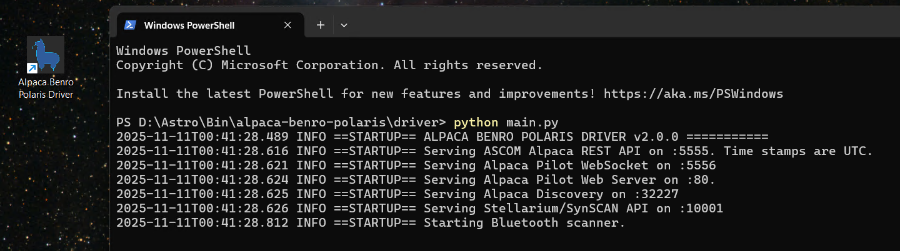

### B. Launch Alpaca Pilot
Follow the instructions from the previous section to launch the Alpaca Pilot Application. Navigate to the Connect page to monitor the startup process.

When you launch the **Alpaca Pilot** application, it attempts to automatically connect to the **Alpaca Driver**. In most cases, this connection is established without user intervention. However, if the Driver is not running or network connectivity is lost, you may need to reconnect manually.

If a connection issue is detected, a warning banner will appear. You can then navigate to the **Connect** page to re-establish communication with the Driver.

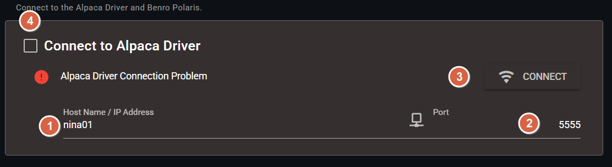


- **① Driver Host Name / IP Address:**  Enter the hostname or IP address of the mini-PC where the Alpaca Driver is running.  
**Note:** This is *not* the IP address of the Polaris device. 

- **② Driver Port:** Specifies the port used by the Alpaca Driver’s ASCOM REST API. The default is **5555**.  If you’ve changed this value in the network services, be sure to update it here as well.

- **③ Initiate Connection:**  Click this button to manually initiate or retry a connection to the Alpaca Driver.

- **④ Driver Connection Checkbox:** Toggles the connection status with the Alpaca Driver.  
   - When **disconnected**, it functions the same as the *Initiate Connection* button.  
   - When **connected**, clicking this will disconnect the session.


### C. Power-on the Polaris ane enable Wifi

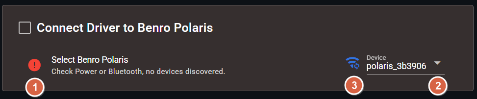

- **① Power On the Polaris:** The Alpaca Driver uses Bluetooth Low Energy (BLE) to discover nearby Benro Polaris Devices. If none are discovered, check the power of your Benro Polaris Device.

   *Note: Bluthooth is only used for discovery and enabling Wifi. It is entirely optional. It is not used in normal operation of the Polaris.*

- **② Select a Device:**  Detected devices appear in the **Device** dropdown. The first discovered device is selected automatically. If multiple devices are listed, choose the one you wish to connect to.

- **③ Enable Wi-Fi:** The Driver will attempt to enable the selected Polaris’s Wi-Fi hotspot automatically.  
   - You can also manually trigger this by clicking the **Wi-Fi button** next to the device dropdown.  
   - If the Blue LED on the Polaris does not illumunate after 30s, you may need to use the **Benro Polaris App** to discover nearby devices, and enable its Wifi. 
   - Once Wi-Fi is successfully enabled, the Blue LED on the Polaris should illumunate.

- **Confirm Wifi Connection:** On Win11, monitor the Wifi List for a polaris_xxxxxx hotspot. Click on the polaris hotspot, enable automatic connection, and click Connect. Once the Mini-PC has connected to the Polaris Wifi Hotspot, it should appear as follows:

   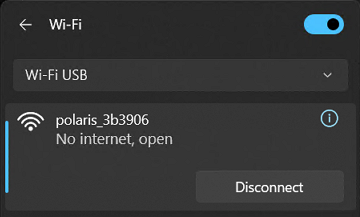

### D. Connect to Polaris

Once Wifi network connectivity has been established to the Polaris, the Driver should automatically connect. If you have problems connecting to the Polaris, the following fields allow you to manually initiate a connection with custom settings.

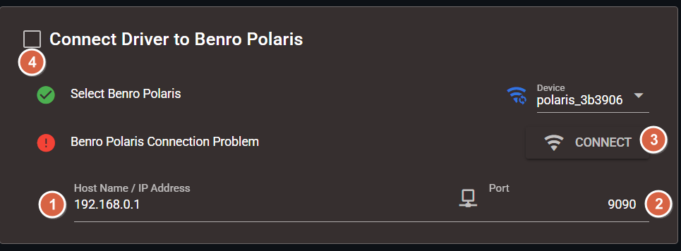


- **① Polaris Host Name / IP Address:** This will typically remain as **192.168.0.1**. Enter the hostname or IP address of the Polaris Device.   
   *Note: This is *not* the IP address of the Alpaca Driver.* 

- **② Polaris Port:** This will typically remain as **9090**. Specifies the port used by the Polaris. 

- **③ Initiate Connection:**  Click this button to manually initiate or retry a connection to the Polaris. 

- **④ Polaris Connection Checkbox:** Toggles the connection status with the Polaris.  
   - When **disconnected**, it functions the same as the *Initiate Connection* button.  
   - When **connected**, clicking this will disconnect from the Polaris.

<br>

   > **Troubleshooting Guide**
   If you continue to experience issues connecting to the Polaris, consult the [Troubleshooting Guide](./troubleshooting.md) for diagnostic steps and solutions.

<br>

### E. Setup the Polaris for Astro Mode

Follow these steps to prepare your Benro Polaris mount for Astro Mode using the Alpaca Pilot App:

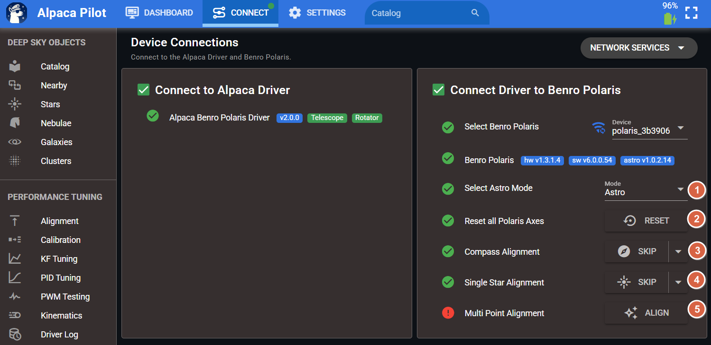

- **① Switch to Astro Mode:** When the Pilot App launches, it will display the current Polaris mode. This is typically **Photo Mode** on first power-up. Use the dropdown menu to switch to **Astro Mode**.

- **② Initiate Axis Reset:** Click the **Reset** button to command the Polaris to reset all three axes. This replicates the double-tap gesture on each joystick in the Benro Polaris App.

   >**Wait for Reset Completion**  
   Allow the mount to finish its reset sequence. Wait until all axes reach their final positions and all motion ceases.

- **③ Skip Compass Alignment:** Normally, entering Astro Mode requires a Compass Alignment via the Benro Polaris App. With Pilot, you can bypass this by pressing **Skip**.  
   - The default Azimuth is **180°**
   - You may adjust this to approximate the camera’s initial pointing direction, based on how the tripod is oriented.
   - Note: This value represents *true Azimuth* and is different from the Compass Align direction used in the Benro app.
   - Azimuth reference: 0°=North, 90°=East, 180°=South, 270°=West.
   - Saving Alpaca Pilot Settings will store this value.

- **④ Skip Single Star Alignment:** Astro Mode also typically requires a Single Star Alignment. You can skip this step in Pilot by pressing **Skip**.  
   - The default Azimuth is **180°**, and Altitude is **45°**  
   - You may adjust these to match the camera’s iniital pointing direction, based on how the tripod is oriented. 
   - Azimuth reference: 0°=North, 90°=East, 180°=South, 270°=West. 
   - Altitude reference: 0°=Horizontal, 10°=Slight upward tilt, 45°=Moderately upward, 82°=Near maximum upward tilt of Polaris.
   - Saving Alpaca Pilot Settings will store these values.


- **⑤ Multi Point Alignment:** Click this Button to navigate to the Alignment Page. This will allow you to enable to Multi-Point Alignment and review model residuals. After 3 or more Sync Points are added to the model this indicator will turn green. If you are using Single Point Alignment, you can ignore this red indicator on the connect page.

- **Set Observing Site Location:** If the app displays a warning that **latitude and longitude are unset**, go to **Settings** in the menu bar.  
   - Use the map to locate your observing site and click to set it.  
   - The app will attempt to auto-fill altitude, pressure, and location name via a web service.

- **Begin Plate Solving:** With setup complete, you're ready to use the Driver and perform your first plate solve.

### F. Network Services
The **Network Services Dialog** on the **Connect** page is optional, but provides advanced control over how the Alpaca Driver exposes its network services. You can selectively disable specific services or change the network port they use.

This is primarily useful for:
- Reducing the network surface area of the Driver for security or performance reasons  
- Resolving port conflicts with other services running on the same system

Additionally, this dialog allows you to modify the Driver’s behavior regarding automatic reconnection to the Polaris mount. You can disable auto-reconnect if manual control is preferred or if the mount is temporarily unavailable.


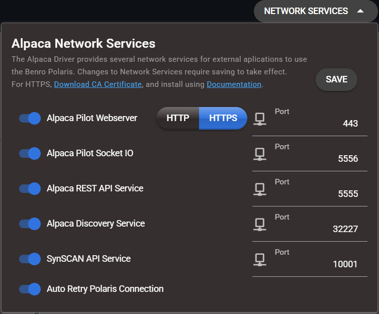


### G. Using Alpaca Pilot over HTTPS

By default, Alpaca Pilot runs as an HTTP-based Single Page Application (SPA). As a result, your browser may display the site as **“Not Secure”** and restrict certain features such as location access and clipboard integration.

Starting with version 2.2, Alpaca Pilot supports HTTPS, allowing secure browser access and full functionality.

#### Enable HTTPS in Alpaca Pilot

1. Open the **Alpaca Pilot Connect** page.
2. Open the **Network Services** dropdown.
3. Select **HTTPS**, then click **Save**.
4. The driver will automatically restart with HTTPS enabled.

#### Download the CA Certificate

1. Refresh your browser after the restart.
2. Return to the **Network Services** dialog.
3. Click **Download CA Certificate**.

#### Install the CA Certificate on Windows

1. Open the downloaded `alpaca_pilot_ca.crt` file.
2. Click **Install Certificate**.
3. Select **Local Machine**, then click **Next**.
4. Choose **Place all certificates in the following store**, then click **Browse**.
5. Select **Trusted Root Certification Authorities**, then click **OK**.
6. Click **Next**, then **Finish**.

#### Install the CA Certificate on macOS

1. Open the downloaded `.crt` file — **Keychain Access** will launch automatically.
2. Add the certificate to the **System** keychain.
3. Locate `alpaca-pilot-ca` in the certificate list and double-click it.
4. Expand the **Trust** section and set **When using this certificate** to **Always Trust**.
5. Close the dialog and enter your password to confirm the changes.

#### Restart Your Browser

* **Chrome:** Navigate to `chrome://restart`
* **Firefox:**

  1. Open `about:config`
  2. Search for `security.enterprise_roots.enabled`
  3. Set the value to `true`
  4. Restart Firefox


<br>
<br>

## III. Using the Dashboard
>VIDEO DEMO: [21 - Dashboard introduction](https://youtu.be/0QSKD1GCzOc?t=4m55s)

>VIDEO DEMO: [22 - Dashboard Status and Setpoint Entry](https://youtu.be/Wv_ZvBtZZ4Q?t=3m18s)

### Purpose of the Dashboard
The dashboard is the central component of the Alpaca Pilot App. It basically shows you the current **orientation of the telescope** and any **activity on the motors**. It provides **real-time telemetry** of the mount's current coordinates, including Azimuth, Altitude, Roll or Right Ascension, Declination, Position Angle. The Dashboard also provides direct control of the mount through action buttons and interaction into zoomable radial dials for each co-ordinate.

### Action Buttons
The action buttons in the top-left corner of the Dashboard offer quick access to global mount controls.

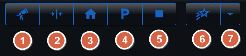

-   **① Co-ordinate Mode:** This feature allows you to **quickly switch** between two primary coordinate systems for viewing and control:
    *   **Geographical** - Azimuth, Altitude, and Roll.
    *   **Equatorial** - Right Ascension, Declination, and Position Angle.
-   **② Reset SP (Set Point):** This button appears when the mount’s actual position (Present Value) has deviated from the desired target position (Set Point). This may occur when the mount is controlled by a non Alpaca Application or when the mount is not physically able to reach the setpoint. Clicking the **Reset Set Point button** instructs all set points to reline up with the current physical values of the device.
-   **③ Find Home:** When clicked, it moves the motors and changes the orientation of the mount to wind the motor angles (**M1, M2, M3**) back to zero. If the mount is set up pointing south, this typically results in an Azimuth of 180°, an Altitude of 45°, and a Roll of 0°. If the mount cannot complete this movement within 
-   **④ Park:** This function moves the mount into a designated park position.  You can **customize and save** the park position motor angles from the settings page. Once the mount reaches the park location, a yellow banner will appear, and most functions are disabled; you must click a button to **unpark** to resume use.
-   **⑤ Stop:** This button allows you to **immediately stop** the mount. This is equivalent to an **Abort Slew** operation and will stop motion across all axes.
-   **⑥ Tracking:** This action button controls the mount's sidereal tracking state. It allows you to **initiate tracking** or **turn tracking off**. Ensure you have tracking enabled for plate-solving or imaging deep sky objects as it is no longer automatically enabled after gotos
-   **⑦ Tracking Rate:** This control allows you to **change the tracking rate** of the mount. The Alpaca Driver version 2.0 supports ASCOM Alpaca Drive Rates, including 0=Sidereal, 1=Lunar, 2=Solar, 3=Custom/King. 

### Status Indicator
The Status Indicator (a status chip in the top right-hand corner of the Dashboard) gives the **state of the motion controller** in the Alpaca driver. Only one state is given at a time, but they are all listed here for explaination purposes.

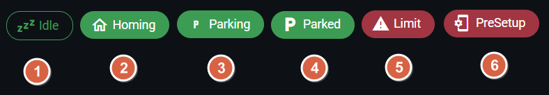


-   **① Idle:** This state means **no commands are currently being issued** from the driver to the Polaris. In this state, the Benro Polaris (BP) app can be used without the driver interfering.
-   **② Homing:** The mount is actively moving its motors back to the zero position (0, 0, 0 motor angles).
-   **③ Parking:** The mount is moving into the customized park motor angle position.
-   **④ Parked:** The mount has reached the set park location. A banner appears, and most functions are disabled until the mount is unparked.
-   **⑤ Limit:** This indication appears on the dashboard when a **motor angle limit has been exceeded**. All control to the Polaris will be stopped. The user must click the reset button to acknowledge the limit.
-   **⑥ PreSetup:** This flag or alarm indication appears when the **observing site location (latitude, longitude)** has not been set. No action can be taken with the mount until the location is set.

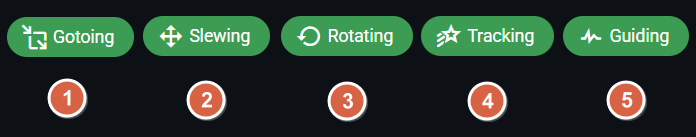

These indicators reflect the mount’s current motion or tracking mode:
-   **① Gotoing:** The mount is slewing to a target position following a GOTO command.
-   **② Slewing:** The mount is executing a manual slew operation.
-   **③ Rotating:** The mount is actively adjusting its rotation or position angle.
-   **④ Guiding:** The mount is responding to pulse-guiding commands to refine its tracking.
-   **⑤ Sidereal:** - Sidereal tracking is enabled. The mount is following the apparent motion of the stars, maintaining fixed equatorial coordinates.


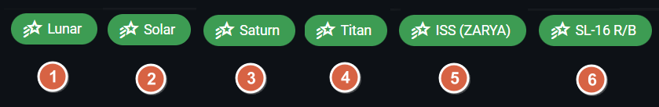

When tracking an orbital object, the motion deviates from sidereal tracking. The indicator will instead display the name of the object being tracked:
-   **① Lunar:** Tracking the Moon’s motion.
-   **② Solar:** Tracking the Sun’s motion.
-   **③ Saturn:** Tracking a planetary target.
-   **④ Titan:** Tracking a planetary moon.
-   **⑤ ISS (ZARYA):** Tracking the International Space Station.
-   **⑥ SL-16 R/B:** Tracking a rocket body (spent stage).


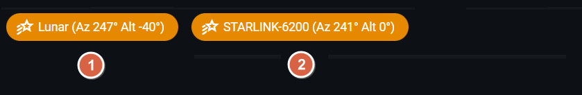

When an orbital object is below 10° altitude, the status indicator turns orange, and its current position is appended to the tracking chip. In this state, the mount does not update its setpoint, allowing you to preselect and monitor targets before they become visible. Once the object rises above 10°, the mount will automatically slew to its position and begin tracking.

-   **① Lunar below the Horizon:** The Moon is currently at −40° altitude. The mount is standing by and will begin tracking once it rises.
-   **② Starlink below 10°:** The communications satellite is below the 10° threshold. The mount is waiting to initiate tracking.


### Motor Indicators

The dashboard shows any **activity on the motors** and the current **M1, M2, and M3 motor angles**. These angles show the **actual physical rotation** of each motor from its home position. Importantly, unlike coordinate axes (like azimuth), the motor angle **does not wrap around** at 360 degrees; it keeps recording how far the motor has moved. 

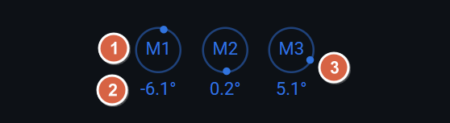

-   **① Motor Label:** The labels M1, M2 and M3 represent the Azimuth, Altitude and Astro axis accordingly.
-   **② Angular Offset:** The signed angular rotation in decimal degrees that each motor has traveled from its home or zero position.
-   **③ Motor Activity:** The orbiting dot, represents motion in the corresponding axis. It rotates in the direction and speed of the motors motion. The speed is exegerated for slow motion so very fine movement can be seen. 


### Radial Dials
The radial dials are a core part of the dashboard, designed to be flexible and interactive. They provide a quick representation of the current orientation of the mount, either in geographic or equatorial co-ordinates. 

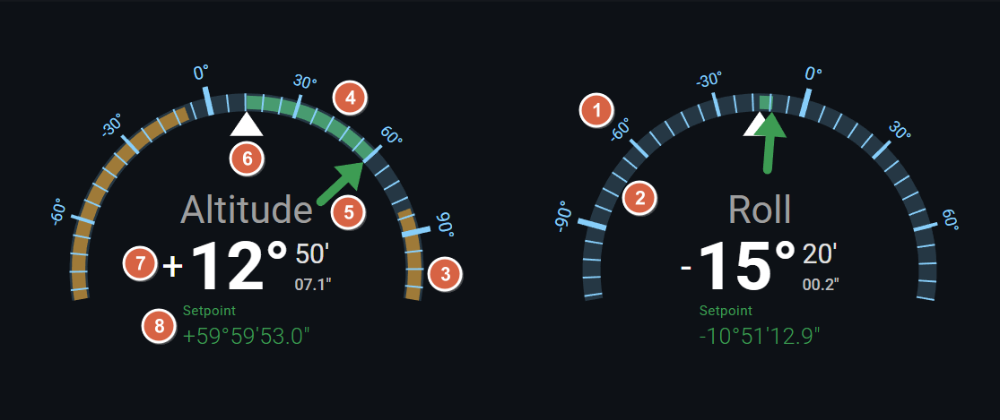
-   **① Scale Label:** Displays the rounded numeric values associated with a major tick on the radial dial. Clicking or Tapping on the numeric label will change the Setpoint of that co-ordinate to the given value.
-   **② Scale Bar:** The cyan arc indicates an angular scale, marked with 5 minor ticks of equal distance dividing the major ticks. Clicking or tapping on the scale bar will change the Setpoint to the exact value at that point. 
-   **③ Warning Bar:** A orange arc that highlights regions of the scale where values exceed safe or expected limits. If a pointer enters this zone, it may indicate that the angle is not reachable.
-   **④ Deviation Bar:** A green arc that indicates the real-time difference between the setpoint (SP) and the present value (PV). The arc represents the path that the mount will travel to close the deviation to zero.
-   **⑤ SP Pointer:** A green arrow pointing to the current Setpoint target value the system is trying to achieve. It remains fixed unless the setpoint is adjusted.
-   **⑥ PV Pointer:** A white triangle pointing to the Present Value of the axis. This pointer will always point to the top center of the arc. As the mount moves in real time, the scale will rotate around this pointer. 
-   **⑦ PV Readout:** A numeric display of the Present Value in Degrees, Arc-Minutes and decimal Arc-Seconds (except for Right Ascension which is in Hours, Minutes and Seconds). 
-   **⑧ SP Readout:** A numeric display of the current Set Point. This value reflects the target the system is actively trying to maintain.

<br>

When you hover your mouse or tap your finger on a radial dial, additional buttons will appear allowing you to interact with that co-ordinate.

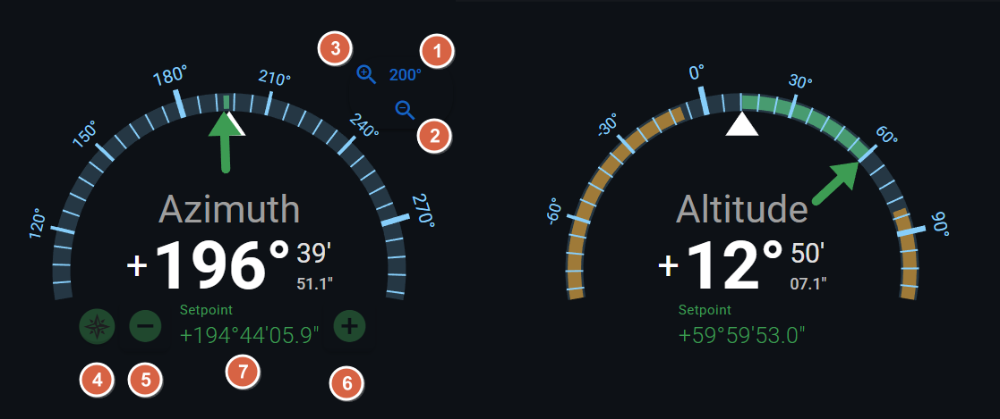


- **① Range Readout:** Displays the total angular span of the radial dial, measured from left to right. This value also determines the slew rate when adjusting the Set Point using controls ⑤ or ⑥. Specifically, the slew rate is equal to (Range ÷ 20) degrees per second. As a result, it takes approximately 20 seconds to move the Set Point across the full range of the dial.
- **② Increase Range:** - Expands the scale range to accommodate larger values. Use this when the current range is too narrow or when values are changing too rapidly to interpret clearly. Scrolling the mouse wheel upward has the same effect as this control.
- **③ Decrease Range:** Narrows the scale range to enhance resolution and visual precision. This is especially useful when movements are subtle and you want finer detail in the display.
Scrolling the mouse wheel downward performs the same action as this control.
- **④ Floating Action Buttons:** - Toggles the visibility of context-sensitive presets for quickly adjusting the Set Point. The available presets depend on the coordinate type of the active radial dial:
   - Azimuth: North 0°, East 90°, South 180°, West 270°
   - Altitude: 0°, 30°, 45°, 60°
   - Roll: –75°, 0°, +70°
- **⑤ SP Decrease**  
  Decreases the current setpoint (SP) by a fixed increment, determined by the active Range setting. Use this to manually slew the target value downward.  
 *Note: The mount may take a moment to respond and align with the new setpoint.*
- **⑥ SP Increase**  
  Increases the current setpoint (SP) by a fixed increment, based on the current Range. Use this to manually slew the target value upward.  
  *Note: The mount may take a moment to respond and align with the new setpoint.*
- **⑦ SP Data Entry**  
  Enables direct numeric input of the setpoint value. Ideal for precise adjustments or bypassing incremental steps. After entering the desired value, confirm to apply it. The input field supports a variety of formats:

  **Absolute Setpoint Formats**
  - `90.234` — Decimal degrees (or hours for Right Ascension)  
  - `90:30` — Degrees and minutes  
  - `90:30:25.2` — Degrees, arcminutes, and decimal arcseconds  
  - `:30.5` — Decimal arcminutes  
  - `-90` — Negative decimal degrees  

  **Relative Setpoint Formats**
  - `d-2` — Decrease by 2 degrees (or hours for Right Ascension)  
  - `d:30` — Increase by 30 arcminutes  
  - `d::40` — Increase by 40 arcseconds  
  - `d2.5` — Increase by 2.5 decimal degrees


## IV. Using the Catalog

>VIDEO DEMO: [22 - Alpaca Pilot Catalog](https://youtu.be/Wv_ZvBtZZ4Q?t=6m42s)

The Alpaca Pilot application features an expanded and intuitive catalog designed to simplify the selection and targeting of celestial objects for astrophotography. This guide details the catalog's contents, how to navigate, filter, and use it for slewing and alignment.

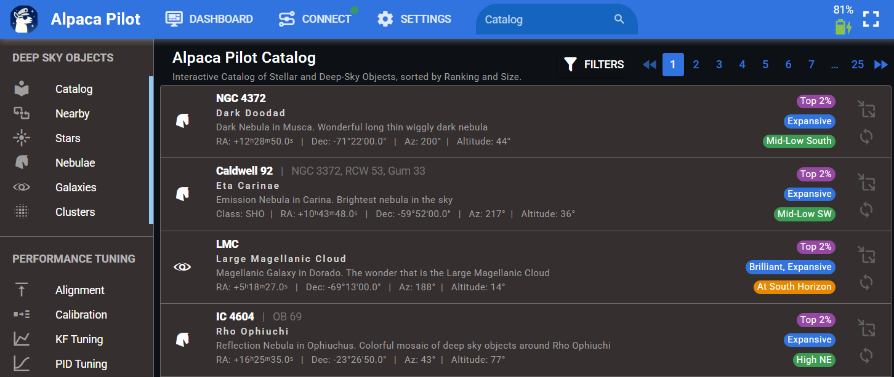

### What the Catalog Includes

The catalog in the Alpaca Pilot App has been **significantly expanded** beyond the original Benro Polaris catalog.

1.  **Curated Content:** Instead of listing thousands of objects, the catalog focuses on **quality**. It includes a curated selection of over **500 premium deep sky objects**. These targets highlight the top 25% of imaging targets, based on input from experienced astrophotographers.
2.  **Object Types:** The entries can include a selection of Nebulae, Galaxies, Clusters, Stars, Planets, Moons, Satellites, Comets, Asteroids and Landmarks.
3.  **Ratings and Notes:** Each entry provides helpful notes and community ratings to guide your choices. To keep the application footprint small, items categorized as "typical," "hard," or "avoid" are excluded from the base catalog.
4. **Cross Referenced:** Each entry is cross referenced to over 25 master catalogs like Messier, Caldwell, NGC, IC, H400, Sh2, LDN etc. 

### Understanding Catalog Visual Indicators (Chips)

Each target listing features three coloured chips that provide a quick visual summary of the object's characteristics and current position:

| Chip Colour | Name | Information Provided | Examples of Categorization |
| :--- | :--- | :--- | :--- |
| **Purple** | **Rating** | Indicates the item's imaging rating. By default, the catalog is searched with the most highly rated items listed first. | Categories are used to filter to the top 25% of targets for imaging suitability. |
| **Blue** | **Visibility** | Shows the brightness (apparent magnitude) and angular size of the object. | **Size:** Greater than 100 arc minutes (e.g., Carina Nebula), Extended (30-100 arc minutes), etc.. **Brightness:** Brilliant (magnitude < 2), Bright (2–4), Visible, Dim, Faint (up to magnitude 10). |
| **Yellow** | **Position** | Gives a quick, readable sense of the target's position in the sky (azimuth and altitude). | Examples include "mid low in the southwest," "high in the north," or "near the horizon". Items high above 82 degrees (near zenith) or "below the horizon" are flagged as red. |

### Searching the Catalog
The search system is designed to be fast, intuitive, and efficient for target selection. You can find any object by simply **typing a few letters or numbers** of its name or catalogue reference.

1. **Search by Name:**
   Enter part of the object’s **common name**.

   * Example: **“rig”** →  *Rigil Kentaurus*.
   * Example: **“pole”** →  *North Celestial Pole*.

2. **Search by Reference:**
   Enter part of the object’s **catalogue designation**.

   * Example: **“M8”** → *Lagoon Nebula*
   * Example: **“NGC 5139”** → *Omega Centauri*

Common catalogue prefixes include **M**, **NGC**, **IC**, **C (Caldwell)**, **Abell**, **Arp**, **H (Herschel)**, **LDN**, and others.
For a full list of supported catalogues, see the **Reference Catalogues** section.

### Filtering Results
You can filter targets by various key attributes that affect imaging suitability, including **Type, Proximity, Quality Rating, Altitude, Classification, Angular size, Apparent magnitude (brightness)**.

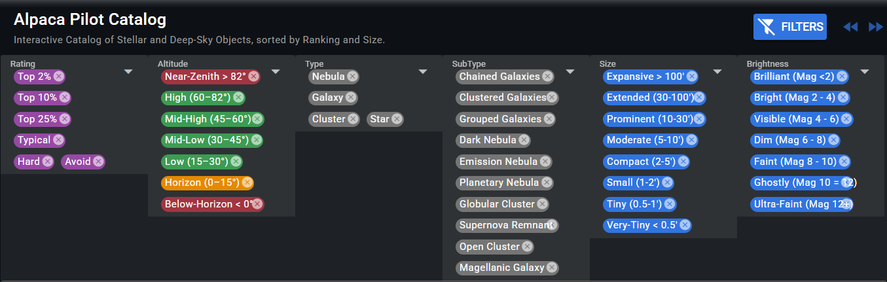

1.  **Filtering by Type (Side Menu):** Use the side menu to limit results by broad object type, such as Nebula, Galaxy, Cluster, Star, Planet, Moon, Satellite, Comet, Asteroid or Landmark.
1.  **Filtering by Proximity (Side Menu):** Displays objects sorted by angular proximity to the telescope’s current pointing or the mount’s orientation. Ideal for finding nearby targets without slewing far.
2.  **Filtering by Quality Rating (Dropdown):** Filter by the visual and imaging quality rating of each object, eg Top 2%, 10%, 25%.
3.  **Filtering by Altitude (Dropdown):** Limit the list based on the height of the object in the sky.
3.  **Filtering by Classification (Dropdown):** Filter by fine grained classification of the subtype of the object.
3.  **Filtering by Size (Dropdown):** Filter by apparent angular size of the object
3.  **Filtering by Brightness (Dropdown):** Filter by visual brightness (magnitude) for selecting objects suited to your observing or imaging conditions

### GoTo (Slew) to the Target
To move the mount to a target's location, simply **click the GoTo button** associated with the item, and the mount will start moving to that location.

*   **Tracking State Preservation:** When you issue a GoTo command, the driver will preserve **whatever the tracking state was** at the time; it does not automatically turn tracking on.
*   **Roll Angle Preservation:** When you issue a GoTo command, the driver will preserve **whatever the roll angle state** at the time; it does not reset back to zero. When in equitorial model, the Roll Angle is still preserved, and the corresponding Position Angle for that orientation is selected.


### Sync with a Target
If the object you have selected is **already visible in your camera’s field of view**, you can use the sync function to align the mount's coordinates precisely. Syncing helps the Driver understand where the telescope is pointing compared to where Polaris thinks it is, correcting any upstream misalignment.


### Reference Catalogs

Alpaca Pilot’s select list of objects are cross-referenced with more than 25 master catalogues, encompassing the most popular and scientifically significant deep-sky objects observed by both amateur and professional astronomers.


| Catalogue                       | Description                                                                       | Objects |
| ------------------------------- | --------------------------------------------------------------------------------- | ------- |
|| **General Catalogues** |
||
| **Messier (M)**                 | Classic list of 110 bright deep-sky objects compiled by Charles Messier (~1774).  | 110     |
| **Caldwell (Caldwell)**                | Patrick Moore’s 1995 complement to Messier, covering both hemispheres.            | 109     |
| **Herschel 400 (H)**        | 400 of William Herschel’s best nebulae and clusters from his 18th-century survey. | 400     |
| **New General Catalogue (NGC)** | The main reference catalogue for deep-sky objects (~1888).                        | 7,840   |
| **Index Catalogue (IC)**        | Supplement to the NGC with later discoveries (~1912).                             | 5,386   |
| **Henry Draper (HD)** | Comprehensive stellar catalogue listing over 225,000 stars, compiled at Harvard College Observatory (1918–1924). Each star is identified by spectral type and magnitude.| 225,300+ |
||
|| **Galaxy Catalogues** |
||
| **Abell**         | Clusters of galaxies—the largest bound structures in the universe (~1958). | 4,073   |
| **Arp**           | Atlas of 338 “peculiar” or interacting galaxies (~1966).                   | 338     |
| **Hickson** | Compact groups of small, closely packed galaxies (~1982).                  | 100     |
| **PGC**           | Principal Galaxies Catalogue—comprehensive all-sky galaxy list (~1995).    | 73,197  |
| **UGC**           | Uppsala General Catalogue—northern hemisphere galaxies (~1973).            | 12,921  |
||
|| **Planetary Nebulae Catalogues** |
||
| **Abell**         | Old planetary nebulae from Palomar Sky Survey (~1966).     | 86      |
| **Minkowski** | PNe discovered in the 1940s; includes the M 1–4 series.    | 207     |
| **Kohoutek**  | Extensive PN survey by Luboš Kohoutek (~1967).             | 1,500   |
| **Griffiths**     | Modern visual selection of bright, interesting PN (~2012). | 45      |
||
|| **Nebulae Catalogues** |
||
| **Barnard**     | Classic dark nebulae photographed by E.E. Barnard (~1927). | 349     |
| **LDN**             | Lynds Dark Nebulae from Palomar survey (~1962).            | 1,802   |
| **LBN**             | Lynds Bright Nebulae—bright diffuse nebulosity (~1965).    | 1,025   |
| **Sharpless (Sh 2-)** | Emission nebulae and H II regions (~1959).                 | 313     |
| **RCW**             | Southern emission nebulae (~1960).                         | 182     |
| **Gum**         | Southern H II regions catalogue (~1955).                   | 85      |
| **vdB**             | Reflection nebulae (~1966).                                | 159     |
| **SNR**             | Galactic Supernova Remnants (~1984).                       | 294     |
||
|| **Other Special Catalogues** |
||
| **Hidden Treasures (HT)**  | Stephen O’Meara’s list of 109 overlooked but beautiful objects (~2007).        | 109     |
| **Secret Deep (SD)**       | Further 109 deep-sky highlights not in Messier or Caldwell (~2011).            | 109     |
| **Orphaned Beauties (OB)** | Astrophotography-focused list of 109 large, under-appreciated objects (~2020). | 109     |
| **Small Packages (SP)**    | 109 compact but fascinating small targets (~2020).                             | 109     |
| **Satellites (ID)**    | NORAD-tracked artificial objects with known brightness and motion (~ongoing).  | 32k+    |
| **Solar System Bodies (IAU)**  | IAU-designated planetary and lunar objects including Sun, Moon, Planets, Moons | 30+     |

<br>
<br>

## Extending the Alpaca Pilot Catalog

Alpaca Pilot includes a built-in deep-sky catalog, planetary data, and live orbital objects.
However, you may also **extend the catalog with your own custom entries**, including local landmarks, favourite observing targets, or additional DSOs not included in the standard database.

Custom items are defined in a file named **`catalog.json`** placed in the Alpaca Driver’s *data directory*.

Whenever Alpaca Pilot loads or you refresh a catalog page (via **F5**), the Pilot application requests this file from the Driver. If it exists and contains valid entries, those entries are **merged directly into the main catalog** and displayed alongside all standard objects. 

Once loaded, your user-defined entries are fully integrated into Alpaca Pilot. They appear alongside the standard catalog and support all normal features, including search, filtering, sorting, and object interaction.

### File Format Overview

A sample file named **`catalog.sample.json`** is included in the *data directory* to help you get started.

To create your own custom catalog entries, simply copy this file to **`catalog.json`** and edit/add the values as needed. The sample outlines the required structure and field names, making it easy to add, remove, or modify entities with confidence.

Your custom **`catalog.json`** file must follow standard JSON rules:

* The **top-level structure must be an array** (`[...]`)
* Each catalog entry must be an **object** with quoted field names (`"Name": "Example`")
* **Field Names and Strings** must be quoted
* **Commas** are required between fields and entries
* **full-line comments** beginning with `//` are allowed
* **trailing commas** on the last field or entry are allowed


### Required Structure of an Entry

Each entry in `catalog.json` must follow the structure below.
All fields are optional except `MainID`, `Name`, and at least one co-ordinate pair 
* `RA_hr`, `Dec_deg` - Equatorial Co-ordinates of the entity 
* `Az_deg`, `Alt_deg` - Topocentric Co-ordinates, only relevant for Landmarks ie C1=9

Adding the other fields provides richer detail and better UI integration.

```jsonc
{
  "MainID": string,     // A unique identifier for the object (e.g. "U001")
  "Name": string,       // Short human-readable name
  "Notes": string,      // Longer description shown in the UI
  "Class": string,      // Optional Class Object Classification Codes see below (e.g. "SHO")
  "OtherIDs": string,   // Comma-separated alternate identifiers

  "Rt": integer,        // Rating 0–5 (Showcase → Not recommended)
  "Vz": integer,        // Visibility class 0–7
  "Sz": integer,        // Apparent size class 0–8

  "C1": integer,        // Object Type (Galaxy, Nebula, Planet, Landmark, etc.)
  "C2": integer,        // Subtype (Spiral Galaxy, Emission Nebula, etc.)
  "Cn": integer,        // Constellation index (0–84)

  "RA_hr": float,       // Right Ascension (hours)
  "Dec_deg": float,     // Declination (degrees)

  // OR, for Landmarks where C1=9, fixed non-celestial objects:
  "Az_deg": float,      // Azimuth position (degrees)
  "Alt_deg": float      // Altitude position (degrees)
}
```


### **Catalog Field Enumerations (Full Reference)**

Several fields in the custom catalog use numeric codes rather than text labels. Alpaca Pilot converts these codes into readable descriptions for display. The tables below define every possible value for each enumeration.


## **Rating (Rt)**

Represents an overall “quality” or showcase value of the object.

| Value | Meaning             |
| ----- | ------------------- |
| **5** | Showcase (Top 2%) (Default)  |
| **4** | Excellent (Top 10%) |
| **3** | Good (Top 25%)      |
| **2** | Typical             |
| **1** | Challenging         |
| **0** | Not recommended     |


### **Visibility (Vz)**

Approximate naked-eye or binocular visibility based on magnitude.

| Value | Meaning               |
| ----- | --------------------- |
| **0** | Ultra Faint (Mag 12+) |
| **1** | Ghostly (Mag 10–12)   |
| **2** | Faint (Mag 8–10)      |
| **3** | Dim (Mag 6–8)         |
| **4** | Visible (Mag 4–6)     |
| **5** | Bright (Mag 2–4)      |
| **6** | Brilliant (Mag <2)    |
| **7** | Unknown  (Default)    |


### **Size (Sz)**

Apparent angular size of the object.

| Value | Meaning            |
| ----- | ------------------ |
| **0** | Very Tiny (<0.5′)  |
| **1** | Tiny (0.5–1′)      |
| **2** | Small (1–2′)       |
| **3** | Compact (2–5′)     |
| **4** | Moderate (5–10′)   |
| **5** | Prominent (10–30′) |
| **6** | Extended (30–100′) |
| **7** | Expansive (100′+)  |
| **8** | Unknown  (Default) |


### **Primary Type (C1)**

The high-level category of object.

| Value | Meaning                       |
| ----- | ----------------------------- |
| **0** | Nebula                        |
| **1** | Galaxy                        |
| **2** | Cluster                       |
| **3** | Star                          |
| **4** | Planet                        |
| **5** | Moon                          |
| **6** | Satellite                     |
| **7** | Comet                         |
| **8** | Asteroid                      |
| **9** | Landmark (for Az/Alt)         |
| **10** | Custom (Default)             |

### **Subtype (C2)**

A more specific classification depending on the primary type.
All values are listed for completeness.

| Value | Meaning                   |
| ----- | ------------------------- |
| 0     | Set of Chained Galaxies   |
| 1     | Set of Clustered Galaxies |
| 2     | Set of Grouped Galaxies   |
| 3     | Set of Merging Galaxies   |
| 4     | Pair of Galaxies          |
| 5     | Trio of Galaxies          |
| 6     | Blue Compact Dwarf Galaxy |
| 7     | Collisional Ring Galaxy   |
| 8     | Dwarf Galaxy              |
| 9     | Elliptical Galaxy         |
| 10    | Flocculent Galaxy         |
| 11    | Lenticular Galaxy         |
| 12    | Magellanic Galaxy         |
| 13    | Polar Galaxy              |
| 14    | Spiral Galaxy             |
| 15    | Dark Nebula               |
| 16    | Emission Nebula           |
| 17    | Molecular Cloud Nebula    |
| 18    | Planetary Nebula          |
| 19    | Protoplanetary Nebula     |
| 20    | Reflection Nebula         |
| 21    | Supernova Remnant Nebula  |
| 22    | Globular Cluster          |
| 23    | Herbig–Haro Object        |
| 24    | Nova Object               |
| 25    | Open Cluster              |
| 26    | Star                      |
| 27    | Star Cloud                |
| 28    | Young Stellar Object      |
| 29    | Planet                    |
| 30    | Dwarf Planet              |
| 31    | Martian Moon              |
| 32    | Galilean Moon             |
| 33    | Saturnian Moon            |
| 34    | Natural Satellite         |
| 35    | Space Station             |
| 36    | Satellite                 |
| 37    | Rocket Body               |
| 38    | Space Debris              |
| 39    | Comet                     |
| 40    | Asteroid                  |
| 41    | User-Defined (Default)    |


### **Constellation (Cn)**

Each number corresponds to a constellation by index.

| Value | Constellation                   |
| ----- | ------------------------------- |
| 0     | Andromeda                       |
| 1     | Antlia                          |
| 2     | Apus                            |
| 3     | Aquila                          |
| 4     | Aquarius                        |
| 5     | Ara                             |
| 6     | Aries                           |
| 7     | Auriga                          |
| 8     | Boötes                          |
| 9     | Canis Major                     |
| 10    | Canis Minor                     |
| 11    | Canes Venatici                  |
| 12    | Camelopardalis                  |
| 13    | Capricornus                     |
| 14    | Carina                          |
| 15    | Cassiopeia                      |
| 16    | Centaurus                       |
| 17    | Cepheus                         |
| 18    | Cetus                           |
| 19    | Chamaeleon                      |
| 20    | Circinus                        |
| 21    | Cancer                          |
| 22    | Columba                         |
| 23    | Coma Berenices                  |
| 24    | Corona Australis                |
| 25    | Corona Borealis                 |
| 26    | Crater                          |
| 27    | Crux                            |
| 28    | Corvus                          |
| 29    | Cygnus                          |
| 30    | Delphinus                       |
| 31    | Dorado                          |
| 32    | Draco                           |
| 33    | Eridanus                        |
| 34    | Fornax                          |
| 35    | Gemini                          |
| 36    | Grus                            |
| 37    | Hercules                        |
| 38    | Horologium                      |
| 39    | Hydra                           |
| 40    | Leo Minor                       |
| 41    | Lacerta                         |
| 42    | Leo                             |
| 43    | Lepus                           |
| 44    | Libra                           |
| 45    | Lupus                           |
| 46    | Lynx                            |
| 47    | Lyra                            |
| 48    | Mensa                           |
| 49    | Microscopium                    |
| 50    | Monoceros                       |
| 51    | Musca                           |
| 52    | Norma                           |
| 53    | Octans                          |
| 54    | Ophiuchus                       |
| 55    | Orion                           |
| 56    | Pavo                            |
| 57    | Pegasus                         |
| 58    | Perseus                         |
| 59    | Phoenix                         |
| 60    | Pictor                          |
| 61    | Piscis Austrinus                |
| 62    | Pisces                          |
| 63    | Puppis                          |
| 64    | Pyxis                           |
| 65    | Reticulum                       |
| 66    | Sculptor                        |
| 67    | Scorpius                        |
| 68    | Scutum                          |
| 69    | Serpens                         |
| 70    | Sextans                         |
| 71    | Sagitta                         |
| 72    | Sagittarius                     |
| 73    | Taurus                          |
| 74    | Telescopium                     |
| 75    | Triangulum Australe             |
| 76    | Triangulum                      |
| 77    | Tucana                          |
| 78    | Ursa Major                      |
| 79    | Ursa Minor                      |
| 80    | Vela                            |
| 81    | Virgo                           |
| 82    | Volans                          |
| 83    | Vulpecula                       |
| 84    | Orbit (Ephemeris-based objects) |
| 85    | Space (Default)                 |


### **Class - Object Classification Codes**
Objects in the standard catalog may include a **Class** field that helps guide your imaging strategy. This classification provides insight into the physical characteristics of the target and can inform choices such as filter selection and exposure balance.

For emission nebulae, the **Class** field indicates the narrowband emission types present and their relative signal strengths. For example, the Eagle Nebula (M16) has a Class of `SHO-.2/1/.3`

This means the nebula emits **Sulphur II (SII)**, **Hydrogen-alpha (Hα)**, and **Oxygen III (OIII)** in an approximate **20% / 100% / 30%** ratio. In practical terms, to balance the channels, weaker signals require **more integration time**:
* If you collect **10 minutes of Hα**
* You would need approximately:
  * **50 minutes of SII** (1 / 0.2 × 10)
  * **33 minutes of OIII** (1 / 0.3 × 10)

These ratios are **guidelines**, not strict rules. Actual exposure balance will depend on:
* Optical speed (f-ratio)
* Sensor quantum efficiency per wavelength
* Sky conditions and light pollution
* Target altitude and extinction

The full definition of the Class field depends on the C2 SubType of the target as follows:

#### Individual Galaxies - **Format:** `a/b` where

##### Galaxy Type (`a`)
* **S** — Spiral
* **SB** — Barred Spiral
* **S0** — Lenticular
* **SB0** — Barred Lenticular
* **E** — Elliptical
  * *E0* (nearly spherical) to *E7* (highly elongated)
* Spiral Subtypes
   * **a** — Large bulge, tightly wrapped smooth arms
   * **b** — Medium bulge, moderately open arms
   * **c** — Small bulge, open or patchy arms

##### Galaxy Features (`b`)

**Core**
* **l** — Barlens
* **p** — Peanut-shaped (X-shaped)
* **z** — Barred

**Disk**
* **d** — Edge-on
* **f** — Face-on
* **g** — Grand design (two strong symmetric arms)
* **k** — VV rows
* **t** — Superthin
* **w** — Warped

**Rings**
* **m** — Ring (concentric)
* **n** — Nuclear ring
* **o** — Outer ring
* **r** — Inner ring (mid-region)

**Star Streams**
* **h** — Shells
* **j** — Loops
* **u** — Single tail
* **x** — Dual tails
* **y** — Superlong

---

#### Multiple Galaxies - **Format:** `a` where

##### Number / Arrangement (`a`)
* **Cluster** — More than 12 galaxies
* **Group** — 12 or fewer galaxies
* **Chain** — More than 3 galaxies aligned along the line of sight

---

#### Galaxy Mergers - **Format:** `a/b` where

##### Merger Type (`a`)
* **I** — Long bridge (> 1 galaxy diameter)
* **II** — Short bridge (< 1 galaxy diameter, disks not touching)
* **III** — Two close cores, disks touching
* **IV** — Single core with tails
* **V** — Single core, no visible tails

##### Galaxy Features (`b`)
* Uses the same feature codes listed under *Individual Galaxies*.

---

#### Planetary Nebulae (PN) - **Format:** `abc/d` where

##### Shape (`a`)
* **A** — Ancient
* **B** — Bipolar
* **E** — Elliptical
* **M** — Multipolar
* **P** — Peculiar
* **S** — Spherical
* **X** — Stellar (≤ 0.2 arcmin diameter)

##### Signal (`b`)
* **O** — OIII dominant (cyan)
* **H** — Hα dominant (red)
* **C** — OIII and Hα comparable (gray)
* **R** — Hα rim with OIII interior

##### Progenitor Visibility (`c`)
* **Y** — Visible
* **N** — Not visible

##### PN Features (`d`)
* **c** — Bipolar lobes broken through
* **f** — Bright filaments
* **h** — Hexagonal shape
* **i** — ISM interaction
* **j** — Polar jets
* **o** — Owl (M97-type) / inner voids
* **q** — Opposing brightened rim segments
* **r** — Bright toroidal ring
* **t** — Thin rim
* **y** — Ansae

---

#### Emission Nebulae - **Format:** `a/b` where

##### Emission Type (`a`)
* **SHO** — All narrowband channels present
* **HII** — Hα dominant
* **SS** — Strömgren sphere
* **WR** — Wolf–Rayet nebula

##### Signal Strengths (`b`)
* Comparative strengths of SHO channels, normalized to the strongest signal

---

#### Dark Nebulae - **Format:** `a` where

##### Opacity Rating (`a`)
* **1** — Lightest
* **6** — Darkest
* **0** — Extremely faint

---

#### Globular Clusters - **Format:** `a` where

##### Shapley–Sawyer Concentration (`a`)
* **I** — Highly concentrated core
* **XII** — Very loose concentration

---

#### Open Clusters - **Format:** `a-b-c-d`

##### Trumpler Classification
* **a** — Concentration
  * **I** (strong) to **IV** (none)
* **b** — Brightness Range
  * **1** (uniform brightness) to **3** (wide brightness range)
* **c** — Number of stars
* **d** — Additional designations
  * **a** — Asterism

<br>
<br>

# Capturing Panoramas with the Alpaca Driver 

>VIDEO DEMO: [28 - Panorama Settings](https://youtu.be/k7OoPk98UCk?t=4m57s)

>VIDEO DEMO: [28 - Panoramas Workflows](https://youtu.be/k7OoPk98UCk?t=25m08s)

This guide explains how to plan, configure, and capture panoramas using the **Alpaca Driver**, with optional automation through **NINA Advanced Sequencer**. It is aimed at users who want deterministic, repeatable panorama capture for astrophotography and astro‑landscape imaging.

### 1. Why Use the Alpaca Driver for Panoramas

While the Benro Polaris Standard Panorama and Pro Panorama modes are excellent for capturing wide-field panoramas, more advanced composite panoramas often move beyond this simple model. These workflows may involve mixing tracked and untracked panels, revisiting the same framing over extended periods, or coordinating multiple capture passes with different exposure strategies or even focus stacking. In such cases, the limitations of a fixed, single-pass panorama workflow become apparent.

The Alpaca Driver approaches panoramas from a different perspective. Rather than treating a panorama as a one-shot operation, it defines a deterministic grid of pointings anchored in space, that can be revisited, reordered, and reused. Panel geometry is defined explicitly, slews are repeatable, and camera orientation is controlled in a predictable way. This allows the same panorama definition to be reused hours or even days later, or embedded cleanly into larger automated workflows.

In addition, the Alpaca Driver provides finer control over capture sequencing, tracking state, roll angle, and reference positioning. This makes it possible to deliberately structure separate capture passes. For example, an untracked foreground landscape pass, a tracked sky pass, or even the inclusion of an orbital layer within the same overall composition.

In short, while the Benro Polaris hardware is already capable of producing excellent panoramas, the Alpaca Driver extends that capability by turning panoramas into a first-class, automatable imaging primitive rather than a single-pass capture mode.

## 2. Defining a Panorama Grid

At the core of the Alpaca Driver’s panorama system is the concept of a single, deterministic panorama grid anchored in space. At any given time, exactly one panorama grid is active in the driver. This grid defines the geometry, ordering, tracking behaviour, and reference position for all panorama-related slews.

The active panorama grid can be defined or modified either interactively using Alpaca Pilot, or programmatically using NINA’s Advanced Sequencer. Regardless of how it is configured, the driver always operates against the same internal panorama grid.

### 2.1 Defining the Grid Using Alpaca Pilot

Alpaca Pilot provides a visual and interactive way to define the panorama grid. The Panorama Settings card allows you to configure the grid geometry, panel order, tracking behaviour, and reference position in one place.

Changes made in Alpaca Pilot immediately update the active panorama grid in the driver. This makes it well suited to planning, experimentation, and on-site adjustment when refining framing and overlap.

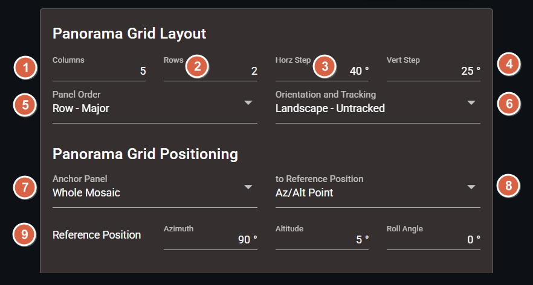


- **① Columns `"cols":`**  Number of horizontal panels across the panorama. Range: **2–14**. 
- **② Rows `"rows":`**  Number of vertical panels in the panorama. Range: **1–3**.

- **③ Panel Spacing Calculator:**  Used to calculate **Sensor Field of View** including recommended Horizontal and Vertical Step. See below.

- **③ Horizontal Step `"hstep":`**  Angular distance, in **decimal degrees**, between the centres of adjacent horizontal panels. Factor in FOV overlap.

- **④ Vertical Step `"vstep":`**  Angular distance, in **decimal degrees**, between the centres of adjacent vertical panels. Factor in FOV overlap.

- **⑤ First Panel `"first":`** Defines which corner of the panorama grid is assigned panel number 1. This determines where the capture sequence begins and, together with the **Panel Order ("order")** setting, controls the rotational step direction in which the panorama progresses. 

   * **0 – Top Left**: Panel 1 is located in the top row and leftmost column.
   * **1 – Top Right**: Panel 1 is located in the top row and rightmost column.
   * **2 – Bottom Left**: Panel 1 is located in the bottom row and leftmost column.
   * **3 – Bottom Right**: Panel 1 is located in the bottom row and rightmost column.

   Selecting the correct first panel is important when photographing moving sky targets. Since celestial objects change position over time due to Earth’s rotation, the capture sequence should be planned to preserve critical details. For example:

   * When capturing a **Milky Way arch** later in the season, you may want to begin with the **top row** to capture the galactic center before it rises too high in the sky. You can then capture the lower row before those same targets move out of optimal framing.
   * For single-row panoramas, it is still advisable to choose the first panel based on the direction of sky movement. In the Northern Hemisphere, when capturing a Milky Way arch, starting on the **right side** of the grid can help prevent Earth’s rotation from moving the galactic center beyond the rightmost panels before they are captured.


- **⑥ Panel Order `"order":`** Defines the sequence in which panels are captured:
   * **0 – Row‑Major**: Complete each row before moving to the next row.
   * **1 – Column‑Major**:  Complete each column before moving to the next column.
   * **2 – Serpentine**:  Alternate direction on each row or column to minimise repositioning time.

- **⑦ Rotation and Tracking `"track":`** Defines how the mount tracks and how camera roll is handled **after moving to each panel**:
   * **0 – Landscape · Untracked**: Tracking is disabled. The camera frame remains fixed relative to the horizon.
   *Use for foreground or landscape panels where star motion is acceptable.*
   * **1 – Sky · Horizon‑Locked**: Sidereal tracking is enabled. The camera roll is reset to **0°** at each panel.
   *Use for horizon‑aligned sky panoramas where consistent framing is required.*
   * **2 – Sky · Celestial**: Sidereal tracking is enabled. Camera roll is **not modified** between panels.
   *Use for astronomical sky mosaics such as large DSOs.*
   * **3 – Sky · Orbital**: Tracking and camera roll are left unchanged.
   *Use for mosaics centred on tracked orbitals.*

- **⑧ Anchor Panel `"anchor":`** Specifies which part of the panorama is placed at the reference position. The **Anchor Panel** and **Reference Position** work together to shift the entire panorama grid to your desired orientation:
   * **0 – Whole Mosaic**:  The entire panorama is centred on the reference position.
   * **n – Panel n**:   This panel is placed at the reference position and all other panels are offset accordingly.


- **⑨ to Reference Position Type `"ref":`** Defines the coordinate system used by the reference position.
   * **0 – Az / Alt / Roll** Topocentric coordinates.
   * **1 – RA / Dec / PA** Equatorial coordinates.
   * **2 – Orbital ID**  Centre the panorama on a tracked orbital object.
   * **3 – Current Orientation** Use the current mount orientation as the reference position.
   If tracking is enabled, the position is stored as equatorial coordinates; otherwise it is stored as topocentric coordinates.


- **&#9321; Reference Position:** Defines the actual reference position:

   * **Reference Axis 1 `"r1":`**: Azimuth, Right Ascension, or Orbital ID
   * **Reference Axis 2 `"r2":`**: Altitude or Declination (decimal degrees)
   * **Reference Axis 3 `"r3":`**: Roll or Position Angle (decimal degrees)


- **&#9322; Copy PanoGrid:** Copies the current Panorama Grid settings to the clipboard in JSON format. After defining the Panorama Grid Layout, use this button to paste the settings directly into the `Polaris:PanoGrid` **Device Action Parameters** field within the NINA Advanced Sequencer. See below for an example.

- **Panel Navigation:** The Panel Navigation grid provides a visual representation of the panorama layout and allows you to click any panel number to slew the mount directly to that position. The grid follows the panorama layout convention where the **bottom-left panel represents the lowest Altitude and lowest Azimuth**. As you move **to the right**, Azimuth increases; as you move **upward**, Altitude increases. The numbering and progression reflect the selected First Panel and Panel Order settings, while symbols indicate the next panel in the capture sequence and the anchor panel tied to the reference position.
 
- **Current Panel: `"panel":`** This represents the active Panel Number being captured and is highlighted in blue on the Panel Navigation grid. This field effects what the next panel in sequence will be.


### 2.2 Defining the Grid Programatically

In addition to configuring the Panorama Grid through Alpaca Pilot, the same grid can be defined programmatically using the `Polaris:PanoGrid` device action. Device actions are custom extensions to the Alpaca Driver that go beyond the ASCOM standard and expose higher-level behaviour.

When executed, `Polaris:PanoGrid` updates the single active Panorama Grid maintained by the driver. Any parameters included in the action override the corresponding values in the current grid, while any parameters that are omitted are left unchanged. This allows a sequence to either fully define a new grid or make small, targeted adjustments to an existing one.

Parameters are supplied in JSON format, enclosed in braces { }. Field names correspond directly to the panorama settings described earlier in this guide. Only the parameters you explicitly specify will be modified.

> Note: Defining or updating the Panorama Grid does not move the mount. The new grid settings are only applied when the driver is instructed to slew to a given panel or to advance to the next panel.

#### **Using NINA Advanced Sequencer**
To access Device Actions from the **Nina Advanced Sequencer** you must first install the **Device Actions and Commands** plug-in for Nina. Once installed, Device Actions become available in the Advanced Sequence Instructions list, located near the bottom of the instruction list under Utility.

The `Polaris:PanoGrid` device action can then be added as an instruction in your sequence and it is typically placed near the beginning to initialise the Panorama Grid for a specific capture pass. When adding the Device Action, set the Device to Telescope, then select `Polaris:PanoGrid` from the action dropdown, where it appears near the bottom of the list.

When used in a sequential instruction block, the block can be given a descriptive name (for example, “50 mm, 5×3,  Horizon-Locked Grid”) and saved as a template. This makes it easy to reuse consistent panorama grid definitions across multiple sessions or combine them into larger, multi-pass workflows.

In the example below, a 5×3 horizon-locked grid for a 50 mm lens is defined using a `Polaris:PanoGrid` action. 

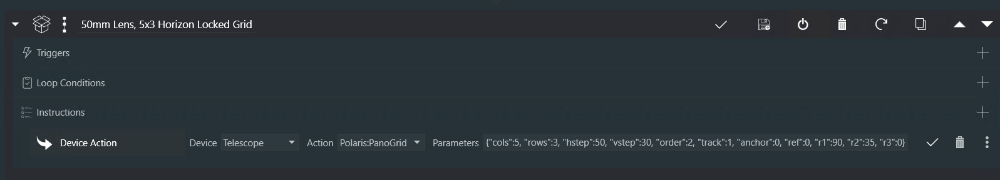

To manually position the grid on site, omit `r1`, `r2`, and `r3` and set `ref` to `3` (current orientation). This uses the mount’s current pointing (at the time PanoGrid is run) as the reference.

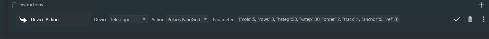

To capture a foreground pass without tracking while retaining the previous grid orientation, set `track` to `0` and remove `anchor` and `ref` fields. This preserves the current grid geometry without redefining the reference position.

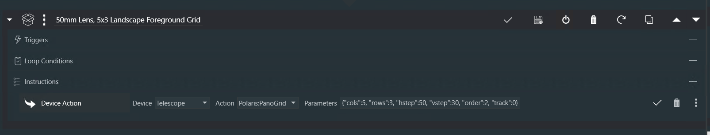

As a reference, the following JSON Parameters example shows all available fields that can be set using the `Polaris:PanoGrid` device action. In practice, you would typically specify only the parameters you need to change.
```
{ "cols":3, "rows":2, "hstep":40, "vstep":30, "first":0, "order":2, "track":0, "anchor":1, "ref":0, "r1":90, "r2":5, "r3":0, "panel":0 }
```
#### **Using CCDCeil Sequencer**
To define a Panorama Grid in CCDCeil, you could use its Sequence Tool and add a Script Step that sends the `Polaris:PanoGrid` device action and parameters to the Alpaca Driver.


## 3. Previewing the Panorama
Once a panorama grid is defined, you will probably want to verify its coverage and panel overlap. You can use the Alpaca Pilot Panel Navigation to do this. This displays a grid of **Rows × Columns**, numbered according to the selected panel order. The currently active panel is highlighted in blue, the next panel with a *, and the anchor panel with a ⚓. Clicking on a panel number will slew the mount to center on that panel.

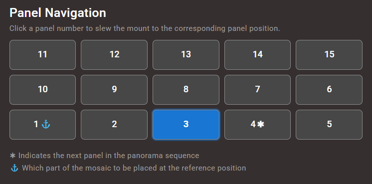

### 3.1 Panel Spacing Calculator
The Panorama Grid is designed to be simple, with the minimum number of parameters. It uses just two angular steps, `hstep` and `vstep` to define the spacing between panels. These fields effect the horizontal and vertical spacing of the panels from the cameras field of view.

A calculator is provided calculate these properties:
* Click on the Calculator icon on the Panorama Settings Card
* Select your sensor size. 
   > You can also enter a custom sensor size by typing `ww x hh` and pressing *Enter*.  For example typing `16 x 9` and pressing *Enter*, sets a 16 x 9 mm sesnor size.
* Select your lens focal length in mm.
* Select the percentage of overlap between each panel
   > You can also enter a custom focal length or overlap value by typing a number and pressing *Enter*. For example, typing `16` and pressing *Enter* in the Focal Length field will set the focal length to 16 mm.
* The calculator with determine the Sensors Field of View in Degrees as well as the Recommended Panel Step, given your desired overlap.
* Click `Apply` to set the Horizontal Step and Vertical Step for the Panorama Grid. This will also store the Sensor Size, Focal Length and Overlap for next time you use the calculator.

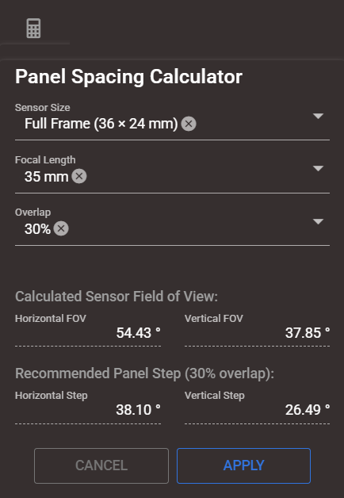

### 3.2 Verifying actual Panel overlap
The actual panel overlap may differ from theoretical calculations, especially with wide-angle lenses. Use the verification procedure below to confirm with your setup before your imaging session begins.

To check the horizontal and vertical overlap:
* Point the mount and camera at a clearly visible scene (e.g., a bookcase or wall).
* Select a panel in Alpaca Pilot Panel Navigation and slew to it.
* Using Nina live view, note the horizontal bounds of the image.
* Slew to the adjacent horizontal panel and check the overlap. Adjust `hstep` as needed.
* Repeat for vertical panels to confirm `vstep` ensures sufficient overlap.

### 3.3 Verifying panorama coverage
Once on site, you can confirm that your panorama grid captures the full scene and desired foreground, and reaches the sky elevation needed for your selected celestial target.

To check the horizontal extent of the scene:
* Align the mount and anchor the panorama grid.
* Slew to the bottom-left panel and then to the bottom-right panel.
* Take some sample exposures at the desired panels to check exposure.
* Confirm that all desired features are within the captured area.
* Adjust the number of columns or reference position if necessary.

To check the vertical extent of the scene:
* Slew to the top row of panels.
* Confirm that the grid reaches the desired altitude for your targets.
* Adjust the number of rows or reference position as needed.

>Note: Because of potential gimbal lock, the Alpaca Driver may not always be able to calculate a fully canonical solution when the mount altitude is exactly 0°. When planning panorama grids, avoid placing rows at Altitude 0°. Instead, offset the grid by a few degrees above or below the horizon.


## 4 Capturing the Panorama

Because the Alpaca Driver does not communicate directly with your camera, the process of slewing between panels and capturing images is handled by your imaging application, such as **NINA** or **CCDCiel**. To support this, the Alpaca Driver provides the `Polaris:PanoSlew` device action, which allows the imaging application to move the mount between panorama panels in a deterministic way.

When executed with no parameters, `Polaris:PanoSlew` advances the mount to the next panel according to the grid’s defined sequence order. After the final panel is reached, the sequence wraps around and returns to panel 1.

If you need to slew to a specific panel, you may supply a JSON parameter to the `Polaris:PanoSlew` device action, with the `panel` field set to the desired panel number. For example: `{"panel": 3}`. 

If you need to change which panel is considered “next” without immediately slewing the mount, you can use the `Polaris:PanoGrid` device action with the `panel` field set to the current (or prior) panel number. This updates the internal panel index without moving the mount. The next time `Polaris:PanoSlew` is executed without parameters, the driver will slew to the panel that follows the one you specified.

The remainder of this section describes how to use `Polaris:PanoSlew` within NINA’s Advanced Sequencer to capture different types of panoramas.

### 4.1 Capturing a set of panels with Nina
A *panorama pass* consists of iterating over each panel in the active panorama grid exactly once and capturing one or more exposures at each position. In NINA, this is typically implemented using a Sequential Instruction Set with a loop.

To configure a sequence that captures all panels:
* Add a `Sequential Instruction Set` to the Advanced Sequencer.
* Add a `Loop for Iterations` as the loop condition.
   * Set the number of iterations to the total number of panels to be captured.
   * In most cases, this will be `rows × cols`. For example 15 = 5 x 3
   * For partial captures (for example, a single-row landscape foreground), you may choose to iterate only over the required subset.
* Add the `Polaris:PanoSlew` device action as the first instruction in the loop. Leave Parameters blank.
* Add a `Smart Exposure` instruction as the next instruction:
   * Set `#` to the number of exposures to capture at each panel.
   * Set the exposure `Time` as required. Must be non-zero.
   * Set the `Type` as required, to store into different folders. For example use LIGHT for foreground, and DARK for background.
   * Set `Dither every #` to `0`.

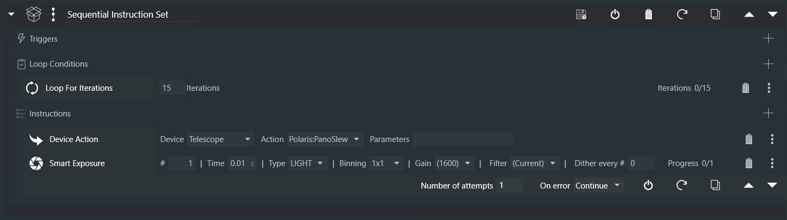

This structure ensures that the mount advances to each panel in turn, captures a consistent set of exposures at that panel, and continues until the pass is complete.

### 4.2 Capturing the Landscape Foreground
The landscape foreground is typically captured as an *untracked*, *horizon-aligned* and usually occupies only the lower rows of the panorama grid. This layer is often captured earlier in the session, such as during twilight, when there is sufficient ambient light in the foreground. In some cases, foreground capture may also involve acquiring panels at multiple focus distances, allowing near and distant landscape features to be combined later using focus stacking techniques.

A common approach is to use a nested Sequential Instruction Set that first configures the panorama grid and then performs the capture. This structure can be saved as a reusable template for future sessions.

A typical panorama foreground workflow includes:
* An outer Sequential Instruction Set, named as a template for your Panorama
   * First instruction is a Device Action `Polaris:PanoGrid`
      * Configure the panorama grid for foreground capture.
      * Set `"cols":5, "rows":3` as desired size of grid.
      * Set `"hstep":16, "vstep":11.2` for desired panel overlap.
      * Set `"track": 0` for Landscape - Untracked.
      * Set `"panel": 0` to change current panel to beginning of sequence
      * Omit reference fields if you want to reuse the existing grid placement.
   * Second instruction is a Sequential Instruction Set
* The Inner Sequential Instruction Set, loops through panels.
   * Set Loop Condition as a `Loop for Iterations` and use total number of panels.
   * First instruction is a Device Action `Polaris:PanoSlew` with no Parameters
   * Remaining instructions in the loop are for the exposure at each panel.
      * Optional `Move Focuser` if you are doing focus stacking of the foreground.
      * A Smart Exposure instruction to capture one or more foreground frames at each panel.

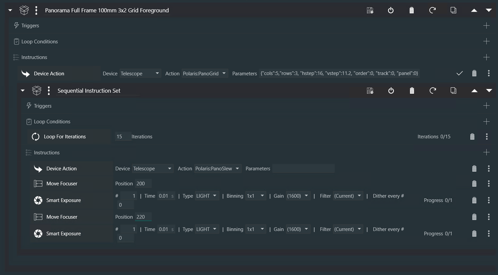

### 4.3 Capturing the Sky Background

The sky background pass is usually captured later in the session and is typically tracked, allowing longer exposures and improved signal-to-noise. Depending on the composition, this pass may reuse the same grid geometry as the foreground or extend to additional rows at higher altitude. It may be horizon-locked to aid in aligning panels between foreground and background.

The sequence structure is similar to the foreground pass, with key differences in PanoGrid and SmartExposure configuration.  A typical panorama sky workflow includes:
* An outer Sequential Instruction Set, named as a template for your Panorama
   * First instruction is a Device Action `Polaris:PanoGrid`
      * Configure the panorama grid for foreground capture.
      * No need to set cols, rows, hstep, vstep, if they are the same as foreground.
      * Set `"track": 1` for Sky - Horizon-Locked.
      * Set `"panel": 0` to change current panel to beginning of sequence
   * Second optional instruction `Wait for Time` set to `Nautical Dark`
   * Third instruction is a Sequential Instruction Set
* The Inner Sequential Instruction Set, loops through panels.
   * Set Loop Condition as a `Loop for Iterations` and use total number of panels.
   * First instruction is a Device Action `Polaris:PanoSlew` with no Parameters
   * A Smart Exposure instruction to capture one or more tracked frames at each panel.

Because the panorama grid is deterministic and persistent, the sky background pass will revisit the same panel centres as the foreground pass, even if the two passes are captured hours apart. This greatly simplifies later alignment, compositing, and stitching.

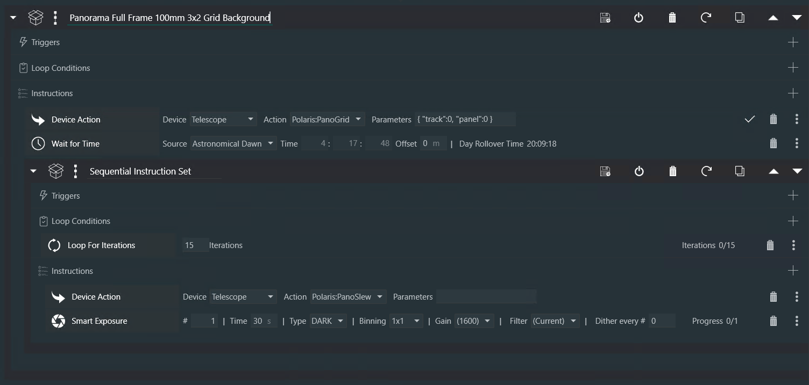

### 4.4 Capturing the Moon or Other Orbitals

You can capture the Moon or other orbitals using the special Device Action **`Polaris:TrackOrbital`**, which instructs the mount to start tracking a specific celestial body. This action requires two parameters:

* **`"category"`** – The type of orbital to track. For example `"category": 5` for moons

  * **4 – Planets:** Any solar system planet.
  * **5 – Moons:** Any Earth or planetary moon.
  * **6 – Satellites:** Any Earth satellite; searches Celestrak by name.
  * **7 – Comets:** Any comet; searches JPL Horizons by name.
  * **8 – Asteroids:** Any asteroid; searches JPL Horizons by name.

* **`"name"`** – The name of the orbital, enclosed in quotes. Examples include:
  * `"name": "Moon"`
  * `"name": "Jupiter"`
  * `"name": "C/2025 A1"`

A typical use case is to place this instruction within an outer loop so that, for example, the Moon can be captured after a certain number of panels. After executing **`Polaris:TrackOrbital`**, you should follow up with a **Smart Exposure** action to complete the capture.


## 5. Stitching the Panorama

Once you have captured all of the images for the panorama, you will need to use a dedicated **stitching application** to combine the individual panels into a single mosaic. These applications align overlapping frames, correct perspective, and blend exposure and color differences. There are many capable options available, depending on your workflow and experience level.

* **Kolor Autopano Giga** – A powerful, fully automatic stitcher with advanced projection models and excellent handling of complex panoramas.
* **Hugin** – An open-source alternative with extensive manual controls, ideal for users who want fine-grained adjustment. Based on same library as PTGui.
* **PTGui** – A professional-grade panorama stitcher offering precise control, robust optimization tools, and excellent results for large mosaics.
* **Adobe Photoshop** – Provides basic panorama stitching via *Photomerge*, suitable for simple mosaics and users already in the Adobe ecosystem.
* **Adobe Lightroom Classic** - Provides basic panorama stitching via *Photomerge*, only three basic projection types.
* **Microsoft ICE** – A lightweight and easy-to-use tool that works well for straightforward panoramas with minimal manual control.
* **PixInsight** – Designed primarily for astrophotography, offering advanced tools for stitching wide-field night-sky mosaics with high precision.

You may want to try **Kolor Autopano Giga**, as some users report better results due to its wide range of perspective mappings and advanced features. Further details can be found on HDRMaps:
**AutoPano Giga Is Now Free** [https://hdrmaps.com/blog/autopano-giga-is-now-free/](https://hdrmaps.com/blog/autopano-giga-is-now-free/)

To register the free version
* Download and install the application. Windows Installer at https://download.hdrmaps.com/AutopanoGiga_x64_442_2018-09-10.exe
* Run the application as Administrator the first time to ensure the registration details are saved.
   * User: freecopy@kolor.com
   * Registration code: KAPG7-K3A9X-IZJHX-FIIT7-C5IM8-MQF2N
* Once registered, the application can be launched normally without Administrator privileges.

## 6. Closing Notes

The Alpaca Driver’s panorama system is designed to provide precise, repeatable control rather than fully automatic results. Complex panoramas benefit from rehearsal and careful planning, especially for time‑critical events like solar and lunar eclipses. Unlike native solutions that may "forget" lens sizes or panorama boundaries if a menu is exited, the Alpaca Driver maintains exactly one active panorama grid.

With a well‑defined panorama grid and sequenced capture passes, the Alpaca Driver enables workflows that are difficult or impossible with traditional panorama tools. With Horizon-Locked tracking, the driver prevents the significant horizon tilt, often 7.5 degrees or more, ensuring your raw frames maintain a consistent ground level, drastically easing stitching.

The Alpaca Driver V2.1 is a community-driven project designed to unlock the latent potential of the Benro Polaris hardware. As you push the limits of what this device can capture, from guided DSO mosaics, 270° Milky Way arches to composite lunar eclipses, we encourage you to share your results and feedback with the community to help refine these tools for the next generation of astrophotographers
