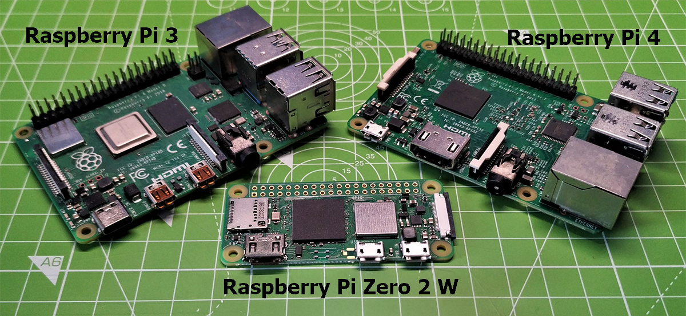

[Home](../README.md) | [Hardware](./hardware.md) | [Installation](./installation.md) | [Pilot](./pilot.md) | [Control](./control.md) | [Stellarium](./stellarium.md) | [Nina](./nina.md) | [Troubleshooting](./troubleshooting.md) | [FAQ](./faq.md)

# Raspberry Pi Setup Guide

## Overview



Raspberry Pi are a series of small single-board computers (SBCs) developed in the United Kingdom by the Raspberry Pi Foundation in association with Broadcom.

Note that these instructions assume some basic knowledge of linux systems, and is not intended to be a general tutorial on how to use a Raspberry Pi system running Linux.

## Which Pi should I buy?

Most Raspberry Pi models with networking support will work. Avoid Pico boards and the original Raspberry Pi Zero.
The Alpaca Driver has been validated on the following platforms:
- **Raspberry Pi Zero 2 W / WH** running Raspbian (Debian Bullseye)
- **Raspberry Pi 4 (8 GB)** running Raspberry Pi OS (Debian Trixie)

## Install Raspberry Pi OS
1. Download the Raspberry Pi Imager from the [official website](https://www.raspberrypi.com/software/)
2. Open the imager_2.0.0.exe and follow the installation instructions, choosing to run the program at the finish of installation.
3. Using the imaging program
    1. Select your Raspberry Pi Device eg Raspberry Pi Zero 2 W, then click **NEXT**
    2. Scroll down and Choose your Operating System as **Raspberry Pi OS (other)**, then choose **Raspberry Pi OS Lite (64-bit)**, then click **NEXT**
    3. Select your Storage Device that will hold the OS, then click **NEXT**
    4. Enter the device hostname eg **alpaca**, then click **NEXT**
    5. Choose your localisation settings, then click **NEXT**
    6. Choose your user name and password, then click **NEXT**
    7. Choose your local wifi network you want the Pi to connect to, then click **NEXT**
    8. Use default password authtication, then click **NEXT**
    9. Use default disabled Raspberry Pi Connect, then click **NEXT**
    10. Write the image to the SD Card, click **WRITE**

## Installation of Pre-Requisites
These insructions are based from a fresh install of Raspberry Pi OS Lite, written by the [Raspberry Pi imager](https://www.raspberrypi.com/software/)

1. Update your system 
    ```Bash
    sudo apt update && sudo apt upgrade -y
    ```
2. Create a virtual Python Environment  
    1. Check your Python version is 3.9.2 or greater
        ```Bash
        python --version
        ```
    2. Update your verion of pip
        ```Bash
        python3 -m pip install --upgrade pip
        ```
    3. Create a Python virtual environment for the Alpaca Driver.
        ```Bash
        sudo apt-get install python3-venv
        cd alpaca-benro-polaris
        python -m venv ./pyenv
        export PATH=~/.pyenv/bin:$PATH
        ```
3. Install Alpaca Driver pre-requisites
    ```Bash
    pip install -r platforms/raspberry_pi/requirements.txt
    ```

4. Optionally install build tools  
    On some Raspberry Pi platforms you may encounter issues when installing the `requirements.txt`, where a package is not available for your platform. You may need to install build tools to generate the package from scratch.
    ```Bash
    sudo apt install gfortran
    sudo apt install libopenblas-dev
    ```

    
## Installing TPLink Driver on Pi Zero 2 (OPTIONAL)
The TPLink Wifi Adapter chipset may not be supported natively on the Pi Zero 2 kernel. We may meed to install the proper driver.

1. Connect the TPLink to the Raspberry Pi Zero 2 and list the usb devices connected. This is to confirm the chipset is RTL8821AU.
    ```Bash
    $ lsusb
    Bus 001 Device 002: ID 2357:0120 TP-Link Archer T2U PLUS [RTL8821AU]
    Bus 001 Device 001: ID 1d6b:0002 Linux Foundation 2.0 root hub
    ```
2. Install the build tools
    ```Bash
    sudo apt update
    sudo apt install -y dkms git raspberrypi-kernel-headers build-essential
    ```

3. Get the drivers source code
    ```Bash
    git clone https://github.com/aircrack-ng/rtl8812au.git
    cd rtl8812au
    ```

4. Build and install with DKMS
    ```Bash
    sudo dkms add .
    dkms status
    ```
    Use the registered name from `dmks status` to build and install
    ```Bash
    sudo dkms build realtek-rtl88xxau/5.6.4.2~20230501
    sudo dkms install realtek-rtl88xxau/5.6.4.2~20230501
    ```
5. Load the module
    ```Bash
    MODULE=$(basename $(ls /lib/modules/$(uname -r)/updates/*.ko* | head -n1) .ko.xz)
    sudo modprobe $MODULE
    ````
6. Verify the network interface is active  
    You should see wlan0, and another auto-generated name like wlxe4fac4e6dea5.
    ```Bash
    $ ip link show
    1: lo: <LOOPBACK,UP,LOWER_UP> mtu 65536 qdisc noqueue state UNKNOWN mode DEFAULT group default qlen 1000
        link/loopback 00:00:00:00:00:00 brd 00:00:00:00:00:00
    2: wlan0: <BROADCAST,MULTICAST,UP,LOWER_UP> mtu 1500 qdisc pfifo_fast state UP mode DORMANT group default qlen 1000
        link/ether d8:3a:dd:65:71:2e brd ff:ff:ff:ff:ff:ff
    3: wlxe4fac4e6dea5: <BROADCAST,MULTICAST,UP,LOWER_UP> mtu 2312 qdisc mq state UP mode DORMANT group default qlen 1000
        link/ether e4:fa:c4:e6:de:a5 brd ff:ff:ff:ff:ff:ff

    ````


## Identify Wifi Interface and Polaris SSID
1. List all Wifi Network Interfaces/Adapters available. It should show `wlan0` for the standard Pi Zero interface and something like `wlxe4fac4e6dea5` for the TPLink. Remember the TPLink interface name for the next section.
    ```Bash
    iw dev | grep Interface
    ```
4. Ensure the Polaris is powered on and list all Wifi Networks SSID visible, relacing `wlan0` with your TPLINK Interface name. Look for a Polaris SSID of `polaris_xxxxxxx`. Remember the Polaris SSID for the next section.
    ```Bash
    sudo iw wlan0 scan | grep SSID
    ```


## Setup of Wifi Connection to Polaris
The following procedure describes how to setup a Raspberry Pi Zero 2 with a TPLINK adapter, to connect to the Polaris automatically.

1. Edit lines 6 and 7 of `platforms/raspberry_pi/wifi.sh` to match your adapter and hotspot.
    ```
    INTERFACE="wlxe4fac4e6dea5"
    SSID="polaris_3b3906"
    ```

2. Run the wifi.sh setup script.
    ```
    cd platforms/raspberry_pi
    sudo ./wifi.sh
    ```
3. Verify that the Polaris wpa_supplicant is running  
    ```
    $ ps aux | grep wpa_supplicant
    root     23296  0.0  1.5  11900  6988 ?        Ss   13:35   0:00 /sbin/wpa_supplicant -i wlxe4fac4e6dea5 -c /etc/wpa_supplicant/wpa_supplicant-polaris.conf -D nl80211

    ```
4. Check connectivity to the Polaris device
    ```
    $ ping 192.168.0.1
    PING 192.168.0.1 (192.168.0.1) 56(84) bytes of data.
    64 bytes from 192.168.0.1: icmp_seq=1 ttl=64 time=3.94 ms
    64 bytes from 192.168.0.1: icmp_seq=2 ttl=64 time=1.63 ms
    64 bytes from 192.168.0.1: icmp_seq=3 ttl=64 time=1.59 ms
    64 bytes from 192.168.0.1: icmp_seq=4 ttl=64 time=1.59 ms
    ```
5. Utility commands to control the polaris-wifi.service

    1. Stop the Polaris wifi Service
        ```
        sudo systemctl stop polaris-wifi.service
        ```

    2. Restart the Polaris wifi Service
        ```
        sudo systemctl restart polaris-wifi.service
        ```

    3. Status of the Polaris wifi Service
        ```
        sudo systemctl status  polaris-wifi.service
        ```
    
## Manual Configuration of Alpaca Driver
On Linux (including Raspberry Pi OS), ports below 1024 (like port 80) require root privileges. We need to change the default Web Server Port for Alpaca Pilot to a free port number. 

This is done automatically in wifi.sh, but if you did not use this method, then use the following manual procedure.

1. Update Web Server Port  
     Change the setting in the file  `driver/config.toml` to the following.
    ```driver/config.toml
    alpaca_pilot_port = 8080
    ```


## Upgrading Bluez Bluetooth Library to v5.66 (DOESNT FIX IT)
If you are using an older version of the Bluetooth library then you may need to upgrade.

1. Check version of Bluetooth. If you are using v5.55-1 then proceed to upgrade.
    ```Bash
    $ bluetoothd --version
    Version: 5.66-1
    ```

1. Install prerequisites
    ```Bash
    sudo apt-get install libglib2.0-dev libdbus-1-dev libudev-dev libreadline-dev libical-dev libtool python3-docutils autoconf automake make gcc
    ```

2. Perform the upgrade and install
    ```Bash
    wget http://www.kernel.org/pub/linux/bluetooth/bluez-5.66.tar.xz
    tar xf bluez-5.66.tar.xz
    cd bluez-5.66
    ./configure --prefix=/usr --mandir=/usr/share/man --sysconfdir=/etc --localstatedir=/var
    make
    sudo make install
    ```


## Service status

The `polaris` service is controlled via `systemd`. 

Super user access(root) is not needed for getting status.

The command to run is:

`systemctl status polaris`

## Service control (start, stop, restart)

The `polaris` service can be started/stopped/restarted using the appropriate verb via the following command:

`sudo systemctl stop polaris`

Replace the `stop` verb with the appropriate action that you are trying to achieve.

## Persistent logs

Should you find the need to look over systemd logs across boots, you can use `journalctl` to do so.

Eg:

`journalctl -u polaris`

