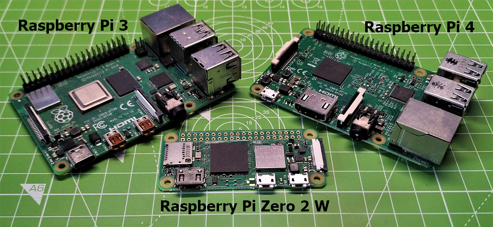

[Home](../README.md) | [Hardware](./hardware.md) | [Installation](./installation.md) | [Pilot](./pilot.md) | [Control](./control.md) | [Stellarium](./stellarium.md) | [Nina](./nina.md) | [Troubleshooting](./troubleshooting.md) | [FAQ](./faq.md)

# Raspberry Pi Setup Guide

## Overview



Raspberry Pi are a series of small single-board computers (SBCs) developed in the United Kingdom by the Raspberry Pi Foundation in association with Broadcom.

Note that these instructions assume some basic knowledge of linux systems, and is not intended to be a general tutorial on how to use a Raspberry Pi system running Linux.

## Which Pi should I buy?

Most Raspberry Pi models with networking support will work. Avoid Pico boards and the original Raspberry Pi Zero.
The Alpaca Driver has been validated on the following platforms:
- **Raspberry Pi Zero 2 W / WH** running Raspbian Pi OS Lite (64-bit) - Debian Trixie
- **Raspberry Pi 4 (8 GB)** running Raspberry Pi OS (64-bit) - Debian Trixie

## Install Raspberry Pi OS
1. Download the Raspberry Pi Imager from the [official website](https://www.raspberrypi.com/software/)
2. Open the imager_2.0.0.exe and follow the installation instructions, choosing to run the program at the finish of installation.
3. Using the imaging program
    1. Select your Raspberry Pi Device eg Raspberry Pi Zero 2 W, then click **NEXT**
    2. Choose your Operating System as **Raspberry Pi OS (64-bit)**, then click **NEXT**. If you are using a Raspberry Pi Zero 2 W and want a "headless Pi", select **Raspberry Pi OS (other)**, then choose **Raspberry Pi OS Lite (64-bit)**, then click **NEXT**
    3. Select your Storage Device that will hold the OS, then click **NEXT**
    4. Enter the device hostname eg **alpaca**, then click **NEXT**
    5. Choose your localisation settings, then click **NEXT**
    6. Choose your user name and password, then click **NEXT**
    7. Choose your local wifi network you want the Pi to connect to, then click **NEXT**
    8. Enable SSH. Use default password authtication, then click **NEXT**
    9. Use default disabled Raspberry Pi Connect, then click **NEXT**
    10. Write the image to the SD Card, click **WRITE**

## Installation of Pre-Requisites and Alpaca Driver
These insructions are based from a fresh install of Raspberry Pi OS Lite, written by the [Raspberry Pi imager](https://www.raspberrypi.com/software/). Connect a **keyboard** and **monitor** directly to the Raspberry Pi, or setup a remote terminal program such as **MobaXterm** or **VS Code**. Login with the username and password you configured during image creation, and then follow the instructions below.


4. Download the setup script
    ```Bash
    cd ~
    wget https://raw.githubusercontent.com/ogecko/alpaca-benro-polaris/dev2_0/platforms/raspberry_pi/setup.sh -O setup.sh
    ```
5. Make it executable and Run the setup script
    ```Bash
    chmod +x ./setup.sh
    ./setup.sh
    ```
    Note that if you want to fetch a specific branch from the Git-Hub repository you can pass the Branch name as the first argument to setup.sh. For example, the following command will fetch the **dev2_0** branch.
    ```
    ./setup.sh dev2_0
    ```
6. Wait for the following tasks to complete
    * ==SETUP== 1. Update the software on the system, and install dependencies needed for git
    * ==SETUP== 2. Clone/Fetch the alpaca-benro-polaris software from Git-Hub.
    * ==SETUP== 3. Create a pyenv and add to ~/.bashrc.
    * ==SETUP== 4. Install the python dependencies needed for the application.
    * ==SETUP== 5. Updating config.toml with 'alpaca_pilot_port = 8080'
    * ==SETUP== 6. Set up [systemd] services to start the polaris.service at boot time
    * ==SETUP== 7. Starts the service.

7. The Alpaca Driver should now be installed and setup

## Monitoring and Diagnostic commands

8. To activate the pyenv created by the setup script and added to the .bashrc
    ```Bash
    source ~/.bashrc
    ```
9. To monitor and control the status of the Alpaca Driver Daemon Service
    ```Bash
    sudo systemctl status polaris       # Check the service status 
    sudo systemctl stop polaris         # Stop the service 
    sudo systemctl start polaris        # Start the service  
    journalctl -u polaris -f            # View the logs
    ```

10. Optionally install build tools  
    On some Raspberry Pi platforms you may encounter issues when installing the `requirements.txt`, where a package is not available for your platform. You may need to install build tools to generate the package from scratch.
    ```Bash
    sudo apt install gfortran
    sudo apt install libopenblas-dev
    ```

    
## Installing TPLink Driver on Pi Zero 2 (OPTIONAL)
The TPLink Wifi Adapter chipset may not be supported natively on the Pi Zero 2 kernel. We may meed to install the proper driver.

11. Connect the TPLink to the Raspberry Pi Zero 2 and list the usb devices connected. This is to confirm the chipset is RTL8821AU.
    ```Bash
    $ lsusb
    Bus 001 Device 002: ID 2357:0120 TP-Link Archer T2U PLUS [RTL8821AU]
    Bus 001 Device 001: ID 1d6b:0002 Linux Foundation 2.0 root hub
    ```
12. Install the build tools
    ```Bash
    echo "deb http://archive.raspberrypi.org/debian/ trixie main" | sudo tee /etc/apt/sources.list.d/raspi.list
    sudo apt update
    sudo apt install -y dkms git build-essential linux-headers-rpi-v8r
    ```

13. Get the drivers source code
    ```Bash
    git clone https://github.com/aircrack-ng/rtl8812au.git
    cd rtl8812au
    ```

14. Build and install with DKMS
    ```Bash
    sudo dkms add .
    dkms status
    ```
    Use the registered name from `dmks status` to build and install
    ```Bash
    sudo dkms build realtek-rtl88xxau/5.6.4.2~20230501
    sudo dkms install realtek-rtl88xxau/5.6.4.2~20230501
    ```
    If the build fails half way through on a Raspberry Pi Zero 2 W, you may need to increase the zram swap size with the following commands, then repeat the build and install commands above.
    ```
    sudo systemctl stop polaris
    sudo swapoff /dev/zram0
    echo $((1024*1024*1024)) | sudo tee /sys/block/zram0/disksize
    sudo mkswap /dev/zram0
    sudo swapon /dev/zram0
    swapon --show
    ``` 
15. Load the module
    ```Bash
    sudo modprobe 88XXau
    ````
16. Verify the network interface is active  
    You should see wlan0, and another auto-generated name like **wlan0** or **wlxe4fac4e6dea5**.
    ```Bash
    $ ip link show
    1: lo: <LOOPBACK,UP,LOWER_UP> mtu 65536 qdisc noqueue state UNKNOWN mode DEFAULT group default qlen 1000
        link/loopback 00:00:00:00:00:00 brd 00:00:00:00:00:00
    2: wlan0: <BROADCAST,MULTICAST,UP,LOWER_UP> mtu 1500 qdisc fq_codel state UP mode DORMANT group default qlen 1000
        link/ether d8:3a:dd:65:71:2e brd ff:ff:ff:ff:ff:ff
    3: wlan1: <NO-CARRIER,BROADCAST,MULTICAST,UP,LOWER_UP> mtu 2312 qdisc mq state DORMANT mode DORMANT group default qlen 1000
        link/ether e4:fa:c4:e6:de:a5 brd ff:ff:ff:ff:ff:ff
    ````


## Identify Wifi Interface and Polaris SSID
17. List all Wifi Network Interfaces/Adapters available. It should show `wlan0` for the standard Pi Zero interface and something like `wlan1` for the TPLink. Remember the TPLink interface name for the next section.
    ```Bash
    iw dev | grep Interface
    ```
18. Ensure the Polaris is powered on and list all Wifi Networks SSID visible, replacing `wlan1` with your TPLINK Interface name (if it is different). Look for a Polaris SSID of `polaris_xxxxxxx`. Remember the Polaris SSID for the next section.
    ```Bash
    sudo iw wlan1 scan | grep SSID
    ```


## Setup of Wifi Connection to Polaris
The following procedure describes how to setup a Raspberry Pi Zero 2 with a TPLINK adapter, to connect to the Polaris automatically.

19. Change to the platforms/raspberry_pi directory and make the wifi.sh script executable.
    ```
    cd platforms/raspberry_pi
    chmod +x wifi.sh
    ```
20. Run the WiFi Setup script, chaning the interface **wlan1** and SSID name **polaris_3b3906** according
    ```
    sudo ./wifi.sh wlan1 polaris_3b3906
    ```

21. Verify that the Polaris wpa_supplicant is running  
    ```
    $ ps aux | grep wpa_supplicant-polaris
    root     23296  0.0  1.5  11900  6988 ?        Ss   13:35   0:00 /sbin/wpa_supplicant -i wlan1 -c /etc/wpa_supplicant/wpa_supplicant-polaris.conf -D nl80211

    ```
    If this process is not running, you may need to disable the default wpa_supplicant on wlan1.
    ```
    sudo systemctl stop wpa_supplicant@wlan1
    sudo systemctl disable wpa_supplicant@wlan1
    sudo rm -f /var/run/wpa_supplicant/wlan1
    sudo systemctl daemon-reload
    sudo systemctl restart polaris-wifi.service
    ```
22. Check connectivity to the Polaris device
    ```
    $ ping 192.168.0.1
    PING 192.168.0.1 (192.168.0.1) 56(84) bytes of data.
    64 bytes from 192.168.0.1: icmp_seq=1 ttl=64 time=3.94 ms
    64 bytes from 192.168.0.1: icmp_seq=2 ttl=64 time=1.63 ms
    64 bytes from 192.168.0.1: icmp_seq=3 ttl=64 time=1.59 ms
    64 bytes from 192.168.0.1: icmp_seq=4 ttl=64 time=1.59 ms

    $ ip addr show wlan1
    3: wlan1: <BROADCAST,MULTICAST,UP,LOWER_UP> mtu 2312 qdisc mq state UP group default qlen 1000
        link/ether e4:fa:c4:e6:de:a5 brd ff:ff:ff:ff:ff:ff
        inet 192.168.0.100/24 scope global wlan1
        valid_lft forever preferred_lft forever

    $ iw dev
    phy#1
            Interface wlan1
                    ifindex 3
                    wdev 0x100000001
                    addr e4:fa:c4:e6:de:a5
                    ssid polaris_3b3906
                    type managed
                    channel 36 (5180 MHz), width: 80 MHz, center1: 5210 MHz
                    txpower 20.00 dBm
    phy#0
            Unnamed/non-netdev interface
                    wdev 0x2
                    addr da:3a:dd:65:71:2e
                    type P2P-device
                    txpower 31.00 dBm
            Interface wlan0
                    ifindex 2
                    wdev 0x1
                    addr d8:3a:dd:65:71:2e
                    ssid atlas_6G
                    type managed
                    channel 7 (2442 MHz), width: 20 MHz, center1: 2442 MHz
                    txpower 31.00 dBm

    ```
5. Utility commands to control the polaris-wifi.service

    1. Stop the Polaris wifi Service
        ```
        sudo systemctl stop polaris-wifi.service
        ```

    2. Restart the Polaris wifi Service
        ```
        sudo systemctl restart polaris-wifi.service
        ```

    3. Status of the Polaris wifi Service
        ```
        sudo systemctl status  polaris-wifi.service
        ```
    
## Manual Configuration of Alpaca Driver
On Linux (including Raspberry Pi OS), ports below 1024 (like port 80) require root privileges. We need to change the default Web Server Port for Alpaca Pilot to a free port number. 

This is done automatically in setup.sh, but if you did not use this method, then use the following manual procedure.

1. Update Web Server Port  
     Change the setting in the file  `driver/config.toml` to the following.
    ```driver/config.toml
    alpaca_pilot_port = 8080
    ```


## Upgrading Bluez Bluetooth Library to v5.66 (DOESNT FIX ISSUE)
If you are using an older version of the Bluetooth library then you may need to upgrade.

1. Check version of Bluetooth. If you are using v5.55-1 then proceed to upgrade.
    ```Bash
    $ bluetoothd --version
    Version: 5.66-1
    ```

1. Install prerequisites
    ```Bash
    sudo apt-get install libglib2.0-dev libdbus-1-dev libudev-dev libreadline-dev libical-dev libtool python3-docutils autoconf automake make gcc
    ```

2. Perform the upgrade and install
    ```Bash
    wget http://www.kernel.org/pub/linux/bluetooth/bluez-5.66.tar.xz
    tar xf bluez-5.66.tar.xz
    cd bluez-5.66
    ./configure --prefix=/usr --mandir=/usr/share/man --sysconfdir=/etc --localstatedir=/var
    make
    sudo make install
    ```

