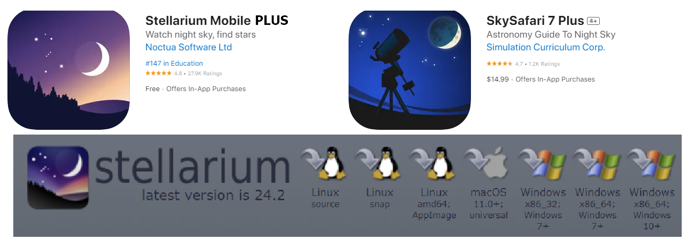
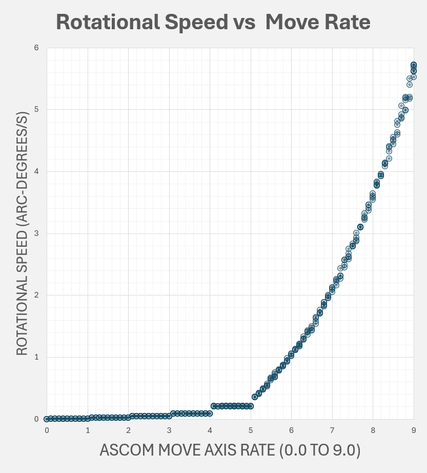

[Home](../README.md) | [Hardware](./hardware.md) | [Installation](./installation.md) | [Pilot](./pilot.md) | [Control](./control.md) | [Stellarium](./stellarium.md) | [Nina](./nina.md) | [Troubleshooting](./troubleshooting.md) | [FAQ](./faq.md)


# Using Stellarium and Sky Safari Pro
[Applications Supported](#telescope-control-compatibility) | [Stellarium Mobile](#1-using-stellarium-mobile-plus) | [Stellarium Desktop](#2-using-stellarium-desktop) | [Sky Safari Pro](./installation.md#seting-up-sky-safari-pro-optional) | [Aiming Accuracy](#3-improving-aiming-accuracy) 

## Telescope Control Compatibility
The Alpaca Benro Polaris Driver supports both the Alpaca ASCOM and SynScan protocols. This opens up a wide range of Telescope Control applications now compatible with the Benro Polaris. Out of all those listed, we recommend Stellarium PLUS and Stellarium Desktop.



### Supported and Tested

* [Stellariium Mobile PLUS](https://stellarium-labs.com/stellarium-mobile-plus/) (IOS, Android) - paid, telescope control via SynScan protocol.
* [Stellarium Desktop](https://stellarium.org/) (Win) - free, telescope control via Alpaca ASCOM
* [Stellarium Desktop](https://stellarium.org/) (MacOS, Linux) - free, telescope control via a binary protocol
* [Sky Safari 7 Plus and Pro](https://skysafariastronomy.com/) - paid, telescope control via Alpaca 
* [Nina](https://nighttime-imaging.eu/) (Win) - free, telescope control via Alpaca
* [CCDciel](https://www.ap-i.net/ccdciel/en/start) (MacOS) - free, telescope control via Alpaca

### Not supported

* [Stellariium Web](https://stellarium-web.org/) - free, no telescope control
* Stellarium Mobile (IOS, Android) - free, no telescope control
* Sky Safari 7 Basic - free, no telescope control
* [Skyportal](https://www.celestron.com/pages/skyportal-mobile-app) - Celestron’s free version of Skysafari
* [SynScan App and SynScan Pro App](https://skywatcher.com/download/software/) - Not currently supported

## Stellarium - Video Demonstration
You can view a demonstration of parts of this documentation in the following YouTube Video.
[](https://www.youtube.com/watch?v=Cra0FBuDxlY)

## 1. Using Stellarium Mobile PLUS
Stellarium Mobile PLUS is ideal for use on a tablet or mobile phone, either Android or IOS. It includes more features than the free Stellarium Web and the free Stellarium Mobile offerings.

### Connecting to the Driver
Stellarium Plus connects to the driver over the network using SynScan protocol. It is the most straightforward setup; you only need to do this once. To connect Stellarium PLUS: 
1. Select the Hamburger menu from the top left
2. Select Observing Tools > Telescope Control
3. Toggle it off/ and on to bring up the popup at the bottom left
4. In the Host field, enter the IP Address of the ABP Driver.
5. In the Port field, leave a default of 10001.
6. Click the Link toggle to start the connection.
7. Stellarium will attempt to connect to the driver.
8. Choose Sync Location (Stellarium site alt/az will be sent to the driver)
9. Choose Sync Time (Stellariam will send its time to the driver)

A Yellow Not Aligned flag indicates that the driver has not completed initializing its communications with the Benro Polaris and may still be out of alignment.

### Goto Co-ordinates
Commanding the Benro Polaris to move is as simple as Selecting the Target Object and clicking the Goto Icon. The icon will flash red while the mount is slewing and re-establishing sidereal tracking.

### Changing Field of View
As the telescope sweeps across the sky, you will see a reticule marking its path. You can tailor the size of the reticule to match your camera and lens setup, allowing you to visualize your framing easily.

If you lose sight of where the mount is pointing in Stellarium, simply click this second icon, and the view will immediately pan to your reticle.

### Move Axis Commands
The third icon on the Telescope Popup allows you to move the primary and secondary axes of the Benro Polaris. The Driver supports move commands on the third (Astro) axis of the Benro Polaris, but we have not found any applications that support the third axis at this stage.

Speeds 1 to 5 match the slow Move Axis speeds of the Polaris. Speeds 6 to 9 map to a variable faster speed ranging from 1 to 2000 units. The table below gives you an approximate speed for each value.

 

| Rate | Rotational Speed |
| ---- | ---------------- |
|   1  | 21.5 arcsec/s    |
|   2  | 1.1 arcmin/s     |
|   3  | 2.8 arcmin/s     |
|   4  | 5.3 arcmin/s     |
|   5  | 12.5 arcmin/s    |
|   6  | 1.0 degree/s     |
|   7  | 2.0 arcdeg/s     |
|   8  | 3.6 degree/s     |
|   9  | 5.5 degree/s     |
|      |                  |

Note that Move Axis in Nina allows you to enter fractional speeds. Due to Benro Polaris, these only have effect from 5.1 to 9.0 (i.e., for the Benro Polaris Fast Move commands).

The Driver also implements Equatorial rotation move around the RA and Dec Axes. By setting the Rate to a decimal value between 1 and 2, you can control how far the driver will rotate on the next axis move call. A rate of 1.30 on the primary axis will move the Right Ascention axis 30°. A rate of -1.15 on the secondary axis will move the Declination axis -15°.

### Sync Co-ordinates
You can help improve the aim of the Benro Polaris by Syncing with a known object in the sky.

* Using the Move Axis controls, aim the telescope with the known object in the center of the eyepiece or image.
* Find the known object in Stellarium and select it.
* Tap the Sync icon on the Telescope Control Popup.
* The Reticle should immediately shift to your selected target.
* This amount will now offset all RA/Dec coordinates sent and received from Polaris.

To reset the RA/Dec Offset, simply tap the disconnect and reconnect icons on the Telescope Control Popup in Stellarium. For a better understanding of how this works, refer to Section 3 below.

## 2. Using Stellarium Desktop
Stellarium Desktop has the broadest set of features of all versions of Stellarium. It is flexible, allowing you to customize what is shown (deep sky objects, satellites, meteor showers, planets, etc.) and how it is revealed (annotations, projections, landscapes, etc.), including numerous sky surveys.

It includes an extensive What's Up Tonight tool for planning imaging targets. It also includes an extensive library of plug-ins that add more functionality to the application. It's a very powerful platform.


### Connecting to the Driver on MacOS/Linux
Stellarium Desktop on MacOS and Linux does not support native Alpaca or ASCOM. We have implemented a simple External Software Binary Protocol that only allows GOTO functionality. You can add an External Software Telescope by using the following procedure:
1.  Select the `Plug-ins` tab on the Configuration Dialog menu bar.
2.  Scroll down the list of plugins and find the `Telescope Control plugin`.
3.  Check `Load at startup` on the Telescope Control Dialog.
4.  Close Stellarium and Restart Stellarium from the Desktop.
5.  Press `Ctrl+0` (Windows) or `Command+0` (MacOS) to open the Slew Telescope Dialog
6.  Click the `Configure Telescopes` button at the bottom of this dialog.
7.  Click on the `Add Telescope` button (3rd one at the bottom of the Telescope Control Configure dialog).
8.  Choose Telescope controlled by `External software or a remote computer` and enter `Benro Polaris` into the Name field.
9.  In the Host field, enter the IP Address of the ABP Driver.
10. In the TCP Port field, leave a default of 10001.
11. Click OK

### Connecting to the Driver on Windows
Unfortunately, Stellarium Desktop does not include native Alpaca support. You must install the ASCOM Platform if you haven't already done so. After the ASCOM platform has been installed, you can add an ASCOM Telescope by using the following procedure:
1.  Select the `Plug-ins` tab on the Configuration Dialog menu bar.
2.  Scroll down the list of plugins and find the `Telescope Control plugin`.
3.  Optionally, if you want to always use the ABP telescope, check `Load at startup` on the Telescope Control Dialog. To browse Stellarium without Polaris, leave it unchecked, and just connect on demand from the `Ctrl+0` (Windows) or `Command+0` (MacOS) dialog.
4.  Close Stellarium and Restart Stellarium from the Desktop.
6.  Press `Ctrl+0` (Windows) or `Command+0` (MacOS) to open the Slew Telescope Dialog
7.  Click the `Configure Telescopes` button at the bottom of this dialog.
8.  Click on the `Add Telescope` button (3rd one at the bottom of the Telescope Control Configure dialog).
9.  Choose Telescope controlled by `ASCOM` and enter `Benro Polaris` into the Name field.
10. Leave the Coordinate System as `J2000 (default)`, 
11. Check `Start/Connect on Startup`.
12. Scroll down to the ASCOM Settings.
13. Click `Choose ASCOM Telescope`
14. Click the `Alpaca` tab on the ASCOM Telescope Chooser dialog box.
15. Click `Enable Discovery` from the Alpaca tab
16. Click `Discover Now` from the Alpaca tab
17. For a local APB, Choose `Benro Polaris` from the drop down-menu, then click `OK`.
18. For a remote APB, Click `Create Alpaca Driver (Admin)` from the drop-down.
    a. Click `Yes` for  User Account Control.
    b. Enter the name `Benro Polaris`, then click `OK`.
    c. Click `Properties` on the ASCOM Telescope Chooser dialog box.
    d. Change the Remote Device Host Name/IP address (`127.0.0.1` when running ABP on same machine as Stellarium, otherwise enter the IP address of the machine running ABP (dont use `192.168.0.x`).
    e. Change the Alpaca Port to `5555`.
    f. Click `OK`.
19.  Click `OK` on ASCOM Telescope chooser dialog.
20.  Click `OK` on Add a New Telescope dialog.
21.  Click `Connect` and close the Telescopes dialog.
22.  You have now added the Benro Polaris telescope and connected it.

### Goto Co-ordinates
Commanding the Benro Polaris to move is as simple as Selecting the Target Object and pressing `Ctrl+1` (Windows) or `Command+1` (MacOS).

You can also bring up the `Slew Telescope To` dialog by pressing `Ctrl+0` (Windows) or `Command+0` (MacOS). This dialog allows:
* Manually enter the co-ordinates
* Select the Current Object
* Select the Center of the Screen
* Select from a customisable list of Targets
* Initiate the Slew of the Benro Polaris.

### Changing Field of View
On Windows, as the telescope sweeps across the sky, you will see a reticule marking its path. You can tailor the size of the reticule to match your camera and lens setup, allowing you to visualize your framing easily.

If you lose site of your selected target, press `SPACE`, and the window will immediately pan to your selected object.

### Using a Custom Landscape and Horizon Image
Stellarium Desktop allows you to create a custom Landscape to match your own observation site, including the image of the horizon overlaid into Stellarium.

To create your own custom Landscape:
* Create a 4096 x 2048 pixel image of your location's 360 degree horizon
  * If you have an Insta360 X3 camera, take a 360 Photo from your tripod, with the screen facing. Open the image in Insta360Studio, change to a 2:1 FOV Ratio, and export the image.
  * Take multiple images with a wide angle lens. Use Photoshop to merge the images into a 2:1 ratio image with the horizon in the middle and the 360 degrees spanning the width of the image.
* Use Photoshop to edit the 4096 x 2048 pixel image and convert the background into a single layer. Select the Sky, modify the selection shrinking it 15 pixels, feathering it 15 pixels, then deleting the sky selection. Save the image as a transparent png called `horizon.png`.
* Create a file called `location.ini` with the following contents, setting the name, latitude, longitude, altitude and timezone correctly.  
  ```
  [landscape]
  name = Your Sites Observation Location
  type = spherical
  maptex = horizon.png
  angle_rotatez = 0.0

  [location]
  planet = Earth
  latitude = -33.000
  longitude = 151.000
  altitude = 39
  timezone = Australia/Sydney
  ```
* Using Windows Explorer, select both files `location.ini` and `horizon.png`, then Right Click and select Compress To... Zip File.
* Using Stellarium, open the 'Sky and viewing options' window by clicking F4, select the Landscape tab, click the Add/remote Landscapes button, then install the zip file you just created.
* Check the orientation of the image in Stellarium. You may need to fine tune the `angle_rotatez` value to correctly align the image with reality.
* You can now align your Benro Polaris during the day by syncing with a known spot in the horizon image.

### Pulling Stellarium Desktop Targets into Nina
You can use the Stellarium Desktop `Remote Control` Plug-in to further integrate Stellarium with Nina. Using this plug-in, Nina can pull any selected Stellarium Target into the Framing Tab on Nina. 
To setup this integration:
* Using Stellarium
   * Press `F2` to callup the Configuration Dialog and navigate to the Plug-ins tab
   * Scroll down to Remote Control Plug-in and enable Load at startup.
   * Restart Stellarium navigate back to its Configuration Dialog.
   * Enable the Server and Enable the Server on Startup.
   * Restart Stellarium
* Using Nina
  * Navigate to the Options/Equipment tab
  * Under the Planetarium, select Stellarium
  * Enter the Host IP address of `localhost` or its remote IP address.

Now on the Framing tab you can click on a small pin icon next to the Coordinates Heading and Nina will ask Stellarium for the currently selected Target Co-ordinates. Much better than Nina's Sky Atlas.
  
### Sync Co-ordinates
On Windows, you can help improve the aim of the Benro Polaris by Syncing with a known object in the sky. 
1. Using the Benro Polaris App, aim the telescope with the known object in the center of the eyepiece or image
2. Find the know object in Stellarium Desktop and select it.
3. Press `Ctrl+0` (Windows) or `Command+0` (MacOS) to bring up the `Slew Telescope To` dialog and click `Sync`.
4. The Reticle should imediately shift to your selected target
5. This amount will now offset all RA/Dec coordinates sent and received from Polaris.

To reset the RA/Dec Offset, restart the driver. Refer to Section 3 below for a better understanding of how this works.

