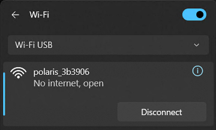
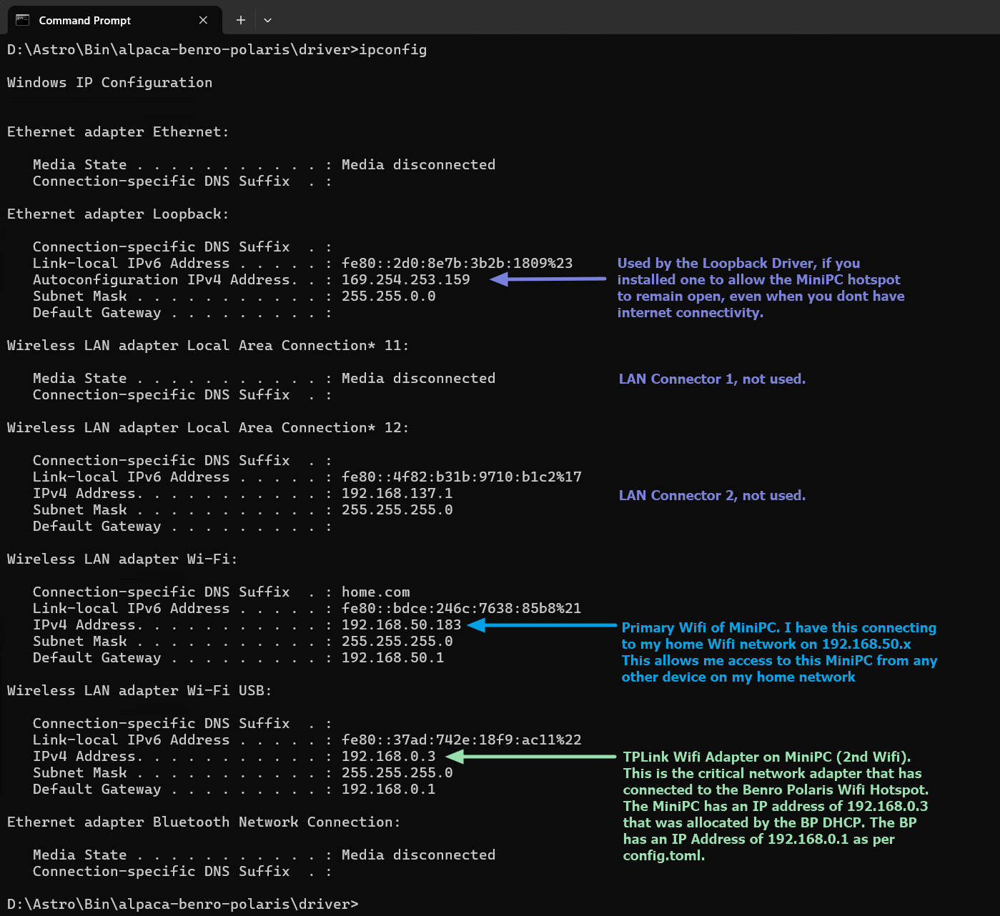
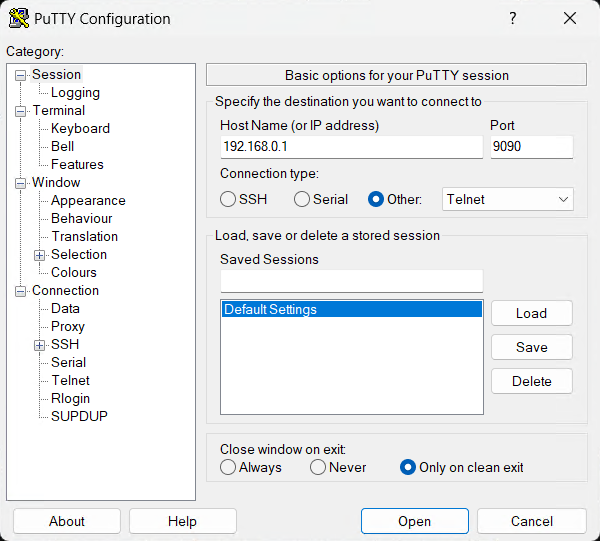
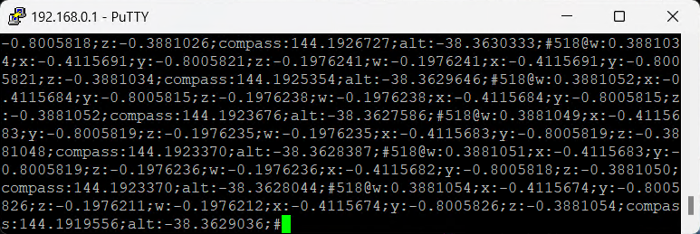

[Home](../README.md) | [Hardware Guide](./hardware.md) | [Installation Guide](./installation.md) | [Using Stellarium](./stellarium.md) | [Using Nina](./nina.md) | [Troubleshooting](./troubleshooting.md) | [FAQ](./faq.md)

# Troubleshooting
[Alpaca Install](#alpaca-install-troubleshooting) | [Benro Problems](#benro-polaris-troubleshooting) | [Comms Problems](#alpaca-communications--troubleshooting) | [Nina Problems](#nina-troubleshooting) | [Stellarium Problems](#stellarium-troubleshooting) 

## Alpaca Install Troubleshooting

### A1 - Cannot Run pip to Install Prerequisites
Check that you have installed Python 3.13.1 and pip 24.3.1. You can verify that python and pip are installed and accessible with the following commands:

```
python --version
pip --version
```
Sometimes, pip might not be installed with Python by default. You can install it manually using the ensurepip module. Run the following command:
```
python -m ensurepip --default-pip
```

If the above step doesn't work, try reinstalling Python and ensure that the option to install pip is checked during the installation process.

1. Download the Python 3.13.1 installer from the official Python website.
2. Run the installer and make sure to check the box that says “Add Python to PATH.”
3. Select “Customize installation” and ensure that the option to install pip is checked.

### A2 - Pip fails to install pre-requisite packages listed in requirements.txt
In some countries, your ISP's Domain Name Servers may redirect traffic to invalid Python Package servers. If you encounter the following errors when running pip.
```
$ pip install -r platforms/win/requirements.txt
WARNING: Retrying (Retry (total=0 to 4.........
ERROR: Could not find a version that satisfies the requirement falcon==4.0.2
```
You can force Windows to resolve the host names for the Python Package servers to their correct IPv4 addresses. Using Administrator, edit the file `hosts` in the directory 
`C:\Windows\System32\drivers\etc`. Add the following two lines to the end of the `hosts` file.
```
151.101.0.223 pypi.org
151.101.0.233 files.pythonhosted.org

```

## Benro Polaris Troubleshooting

### B1 - Cannot start the Benro Polaris Device.
There is a known issue with the recommended Benro Polaris device startup procedure. "Power On. In the off state, double press and hold the [Power Button], and release it after hearing “beep beep beep” three times to turn on the device. ".  Its worse than an old lawnmower at starting. If your device doesnt start, try the following:
1. Remove Power cable - Dont have the Benro Polaris charging, while trying to start.
2. Send to Park - use a Long Press to send the Benro Polaris to the parked position and ensure Power LED is off.
3. Short Press - Every second or so (but no faster), until Power LED is illuminated.
4. Long Press - As soon as its illuminated, do a long press, releasing after "beep, beep beep".

Another word of caution. Do not travel with the Astro USB cable or Camera USB Cable plugged into the Benro Polaris. There is a chance that movement within your bag may damage the cable. This can even lead to damage of the Benro Polaris and costly repairs.

### B2 - Cannot connect BP App to the Benro Polaris Device
Sometimes the BP App cannot search and connect to the BP over Bluetooth or Wifi. The Searching for device might list your device in white but it never turns green or connects or shows a green check-mark.
* Fully exit close the BP App on your phone.
* Reset all Bluetooth and Wifi communications on your phone. Easiest way to do this is to toggle `Airplane/Flight Mode`  on and off. 
* Restart the BP App and it should find and connect to your BP.

### B3 - Polaris has poor quality Sidereal Tracking
As an Alt/Az mount, the leveling of the Benro Polaris Tripod Head is a critical factor in the accuracy of your star tracking. To adjust the Polaris so it is as level as possible：
* Double-tap both virtual joysticks on the BP app to center the Polaris axes.
* Place a circular spirit level on top of the Astro Kit's quick-release plate and adjust the tripod to achieve a level of ±0.3 degrees or better.
* A [HACCURY Luminous 1° Round level bubble](https://www.aliexpress.com/item/4000457838875.html) can help you achieve accurate leveling. 
* A [Sunwayfoto DYH-68B Leveling Base](https://www.amazon.com/Sunwayfoto-DYH-68B-Profile-Leveling-Butterfly/dp/B09ZT3HVMN/) and [LEOFOTO
QS-50K 50mm Quick Link Set](https://www.amazon.com/Leofoto-QS-50K-Plates-Tripod-Release/dp/B0981C36RX) can ease the leveling process AND as act as a standoff to provide extra clearance for the Benro Polaris knobs!

### B4 - The Polaris cannot connect to my Home Wifi
The current firmware of the Benro Polaris does not allow connection to other WiFi networks. It can only host its own Wi-Fi hotspot.

This is no longer a limitation. The Alpaca Benro Polaris Driver can serve as a proxy for the Polaris. It is capable of connecting to both the Polaris Wi-Fi Hotspot and your home Wi-Fi network. This allows you to manage the Polaris from any device connected to your home Wi-Fi, including an iPad, a phone, a desktop, or a laptop.

### B5 - The Polaris is at 1% Battery and wont charge
Multiple people have had issues charging the Benro Polaris after it has drained its battery down to 1%. If you cannot recharge the Benro Polaris from 1% try the following
* Benro recommends to charge using a 5V/2A charger, rather than some more advanced PD chargers.
* Try charging with a different cable.
* Try turning the cable upside down.
* Try charging with a different power bank.

### B6 - How can you reset the Benro Polaris password?
To reset the password of your Benro Polaris
1. Download the [Password Resetting Package](https://www.benro.com/en/downloads/page/polaris-reset-password.html) and place on to your SD card; 
2. Insert your SD card into Polaris, and power cycle the Polaris. 
3. When the Polaris powers up, it will read the SD card and reset your password.
4. After resetting your password, please take the SD card out and delete the password resetting package from the SD card.


### B7 - Where can I find the Benro Polaris manual?
The user manual can be found at the following link - [Polaris User Manual English](https://resource.benro.com/assets/benro/manual/polaris/polaris_user_manual_en.pdf).


## Alpaca Communications  Troubleshooting
### C0 - Cannot connect Win11 Computer or Laptop to Benro Polaris Wifi
There appears to be an issue with some types of Wifi Adapters being able to conenct with the Benro Polaris Wifi. If you cannot get Win11 to form a connection with the polaris_XXXXX Wifi, you may want to try using a USB Wifi Adapter. The following adapter is known to connect with Benro Polaris, [TP-Link AC600 USB WiFi Adapter](https://www.amazon.com/wireless-USB-WiFi-Adapter-PC/dp/B07P5PRK7J/). 

### C1 - Cannot see "`communications init... done`" in the log.
* Use the Alpaca Benro Polaris Driver log window to help diagnose your problem. The messages aim to help point you in the right direction. The driver will continue to retry connecting until you have resolved any issues.
* Confirm the Benro Polaris is in Astro Mode.
* Confirm the Benro Polaris Compass and Star Alignment steps are complete.
* Confirm the Benro Polaris App is still running (we hope to remove this requirement).
* Confirm your Cammera hasn't gone to power save mode.
* Confirm the mini-PC has connected with the polaris-XXXXX hotspot. It should look like the following:
 

  
### C2 - Cannot see any log message except two `INFO ==STARTUP==` lines
* Check your device doesnt have any IT policy to not allow connecting to an open WIFI like the Polaris Hotspot.
* Check which Wifi adapter is being used. There is a known issue with the Mele Quieter 4C not being able to connect to the Polaris Wifi. Do not use the MediaTek RZ616 Wi-Fi 6E 160MHz (Driver version 3.3.0.595) built in Wifi Adapter. Use the [TP-Link AC600 USB WiFi Adapter](https://www.amazon.com/wireless-USB-WiFi-Adapter-PC/dp/B07P5PRK7J/) instead.
* Check your IP Configuration using a Command Prompt to run `ipconfig.exe`. Ensure your Mini-PC has a valid IP Address from the Benro Polaris DHCP server. It should look like the following:
  
 


### C3 - Connection from Mini-PC to Polaris Wifi drops out
* We originally required the BP App to remain running in the background. This is no longer the case. You can close the BP App once you have the Polaris WiFi established and the Driver connected. With the BP app closed you can save on Battery usage. The Driver will keep the Polaris Wifi up and continue to allow operation.
* Check for RF interference. eg. Turn off your microwave in the kitchen.
* Check for RF signal strength. Move your remote desktop machine closer to the mini-pc. 
* Check resouce usage on mini-PC. Ensure it has plenty of free ram and CPU.

### C4 - Still cannot get communications with Polaris Wifi
To further help diagnose communication problems between ABP and the Polaris, you can use `Telnet` or `PuTTY` to directly connect to the Polaris. This will isolate whether the problem is ABP related or not.

On Win11:
* Use the following link to [Download PuTTY](https://www.putty.org/) (a telnet client) to your device running the Driver.
* Select the 64-bit x86 version for the Windows installer.
* Double click on the file you downloaded to install PuTTY.
* Perf the normal BP App setup (a) Search for Device (b) Connect to polaris_xxxxxx (c) Select Atro Mode (d) Align Compass (e) Align Star (f) Confirm.
* Connect the Device running ABP to the Polaris Wifi Hotspot.

 

* Run the PuTTY app.
  


* Enter `192.168.0.1` into the HostName (or IP address) field.
* Enter `9090` into the Port field.
* Select Connection Type `Other` and drop down `Telnet`.
* Click `Open`
* Select `Yes` when asked by User Account Control, Do you want to allow this app to make changes to your device? This opens the firewall to allow PuTTY to communicate with BP.

The PuTTY application should show a window with the raw communications from the Benro Polaris. If your connection is working it should look like the following, constantly scrolling.



### C5 - No Telnet/PuTTY communications with Polaris Wifi
If you cannot see the raw communications scrolling in PuTTY from Troubleshooting Step C4, then there is a problem communicating with your device that is independant of Alpaca Benro Polaris Software.
* Check the Signal Strength of the Polaris WiFi hotspot at your ABP device. You may need to move the device running ABP closer to the Benro Polaris.
* Check you are not running AntiVirus Software that may block open Wifi Connections
* Check you do not have an IT or Windows policy blocking open Wifi Connections.
* Check you do not have a Virtual Private Network (VPN) enabled.
* Check for IP connectivity to the Polaris by using a Command Window to ping the Benro Polaris.
```
C:\Users\Astro> ping 192.168.0.1
Reply from 192.168.0.1: bytes=32 time=1ms TTL=64
Reply from 192.168.0.1: bytes=32 time=2ms TTL=64
Reply from 192.168.0.1: bytes=32 time=2ms TTL=64
Reply from 192.168.0.1: bytes=32 time=2ms TTL=64

Ping statistics for 192.168.0.1:
    Packets: Sent = 4, Received = 4, Lost = 0 (0% loss),
Approximate round trip times in milli-seconds:
    Minimum = 1ms, Maximum = 2ms, Average = 1ms
C:\Users\Astro> 
```
* If the ping does not respond within a few milliseconds, go back through C1-C3 to double check the setup. 

## Nina Troubleshooting

### N1 - Cannot Remote Desktop to MiniPC running Nina
* There are a range of remote desktop applications avalable which you might want to try:
  * Microsoft Remote Desktop - Free with Windows 11 Pro. Some testers have had issues connecting via MS Remote desktop. I've been using it quite successfully.
  * AnyDesk - "Best remote desktop solution for occasional users" - Techradar. 
   Successfully used by a beta tester.
  * Splashtop - "Powerful remote desktop with impressive features" - Techradar. I've used this on my home network successfully.
  * TeamViewer - "Best remote PC software for cross-platform compatibility" - Techradar.
  * RemotePC - Short free trial.
  * LogMeIn - Lacks a free trial.
  * Zoho Assist - Free tier very limited.
* When using AnyDesk and certain other programs, you might need to use an [HDMI Dummy Plug](https://www.amazon.com/dp/B0CKKLTWMN) to get video output from the mini PC if a monitor is not connected. Microsoft Remote Desktop Client does not require this, but it may not be available for some mobile devices.

### N2 - I still cannot remotely connect to the MiniPC running Nina
* Windows Updates can be delivered every month that may effect the state of the device.
* Check Mini-PC state. Reconnect a monitor and Keyboard to the Mini-PC and check that it is up and running. 

### N3 - I have a Mini-PC running without internet access. I cannot remotely connect to it.
* This type of configuration is more challenging and can be confusing, but it is possible.
* There are two Wifi Hotspots in this configuration, the BP Hotspot and the Mini-PC Hotspot. 
* Check that your laptop has not dropped connection to the Mini-PCs hotspot.
* Check IP connectivity. From a command prompt, use `ping <hostname>` to ensure you have IP connectivity and DNS lookup to your Mini-PC. 
* You may find using the Mini-PC's `IP4-address` in Remote Desktop rather than `<hostname>` may make it easier to connect.
* Check that the MiniPC Hotspot is not using the TPLink. You can unplug the TPlink to force the MiniPC hotspot to use the embedded Wifi of the Mele. 
* Once you have connected to the Mini-PC via Remote Desktop, then re-plug in the TPLink, to allow ABP to use it to connect with the BP Hotspot.

### N4 - Which Mount should I select in Nina's Equipment Tab, it lists 8 Benro Polaris Mounts?
* The ABP defaults to broadcasing `ASCOM Alpaca` services on all network interfaces on the MiniPC. 
* If you have the ASCOM Platform installed, Nina will also detect all the `ASCOM direct` interfaces to the ABP. 
* We recommend connecting to the ABP via `ASCOM Apaca` services rather than `ASCOM`. Choose one of the Mounts under `ASCOM Alpaca`.
* You can limit what IP Address the driver exposes the `ASCOM Alpaca` Service on, by setting the field `alpaca_ip_address` in `driver/config.toml`. 
* To limit the Alpaca Service only to applications that are running on the Mini-PC (ie no remote applications), set it the following.
```
alpaca_ip_address = '127.0.0.1' 
```

### N5 - Cannot obtain a good autofocus run with Nina?
* Check your Lens Stabilisation is off. This interfers with sidereal tracking.
* Check you Lens AutoFocus is off on the Lens and Camera Body. If left on this may cause the camera focusing system to hunt interering with the image capture process.
* Check for Lens Cap not removed. Not kidding.
* Check for clouds.
* Check for haze or smoke.
* Check for occulusion by trees or buildings.
* Check for that you are close to focus before starting a Nina Focus run.

### N6 - Cannot plate solve with Nina and ASTAP?
* Check you are in Focus
* Check to make sure you Camera Pixel Size and Telescope Focal Length is set correctly in Nina's Options > Equipment tab, including any reducer or extender. Plate solving wants an approximately correct field of view as input and frequently fails if not set to the right values. 
* The focal_length and focal_ratio in config.toml are provided because of the ASCOM standard, but are not used by Nina. You do not need to update these when you change lenses.
* When using plate-solving to do the first polar alignment of the Polaris, you need to set the exposure length short so that you dont get star trails. If it is too short you will not get enough stars for the plate solve to work. To overcome this trade off, do a compas alignment so that the Polaris is at least roughly polar aligned.
* Check if you are using any filters. Using a narrow band filter on the camera, like the L-Ultimate Optolong HaOIII filter, can make plate solving more challenging for ASTAP.### R1 - Cannot connect Remote Desktop to Mini-PC
* Check you have downloaded the relevant STAR databases. For 200mm lens and less you may need to download the [Wide field STAR database G05](https://www.hnsky.org/astap.htm)

### N7 - Cannot Connect Sony Camera with Nina
Some later models of Sony cameras (e.g., Sony Alpha 7R IV) are not recognized by the Sony Plug-in that is included with Nina. 
To resolve this:
* You can download more up to date ASCOM Sony drivers from  the [ASCOMSonyCameraDriver GitHub repository](https://github.com/dougfor.../ASCOMSonyCameraDriver/releases).

Alternatively, you can use the following procedure to try and get the Nina Driver to recognise your camera:
* Attach your camera via USB. Configure as you would to connect to the Polaris.
* Turn on your camera.
* Enter Device Manager in the Windows desktop search bar.
* Click on the Device Manager icon to open the Device Manager.
* Check for the linr `libusbK Usb Devices`.
* If the line does not exist, close the Device Manager. You are correctly configured.
* If the line `libusbK Usb Devices` exists:
  * Left-click on the entry to expand the entry. You should now see Sony Remote Control Devices.
  * Right-click on `Sony Remote Control Devices` and select `Update Driver`.
  * Select `Browse my computer for drivers`.
  * Select `Let me pick from a list of available drivers on my computer`.
  * Left-click on `MTP USB Device`.
  * Your driver should now update.  NOTE: Your camera is now listed under `Portable device`. Other software may not function correctly with the Device Manager configured this way. 
  * You can change back to the original setting by following these steps and selecting `libusbK Usb Devices` as the new driver instead of `MTP USB Device`.

Hopefully, Nina will now connect to your camera.

### N8 - Cannot Connect Nikon D850 Camera with Nina
There is a known issue with connecting a D850 via USB2 with Nina. Try connecting the Nikon D850 via a USB3 or USB-C port. See this [Redit Post on the D850 and Nina](https://www.reddit.com/r/AskAstrophotography/comments/169yzsd/nikon_d850_will_not_connect_to_nina/) for more details.

### N9 - Cannot retrieve Remote Stellarium Coordinates to Nina
The Nina Sky Atlas has a feature to allow you to get target coordinates from your configured Planetarium Software. You can set the Options / Planetarium software as Stellarium with a given Host IP Address and Port. 

You need to configure Stellarium, adding the Remote Control Plug-in, enabling it to run at startup. Restarting Stellarium allows you to configure the plug-in to automatically enable the server on startup. 

The Remote Control Plug-in defaults to port 8090. This port can conflict with other software you may have on your computer eg Wonderware RecoverIt. If you cannot get Nina to retreive the coordinates from Stellarium try setting the port number to 8091 in both Stellarium and Nina. This may fix the integration between Nina and Stellarium.

## Stellarium Troubleshooting

### S1 - StellariumPLUS Cannot Connect to ABP
There are three approaches to connect StellariiumPLUS to the ABP, depending on your setup scenario.
* Scenario A: The ABP device conencts to Polaris Hotspot only.
    * Connect your phone to the Polaris Hotspot.
    * In Stellarium's Observing Tools Setup, enter a Network Host of `192.168.0.3` 
    * You may need to disable Mobile Data on your phone to get this to work.
* Scenario B: The ABP device connects to Polaris Hotspot and your Home Wifi.
    * Check that the BP App is closed. This frees the phones Wifi from the Polaris Wifi. 
    * Check that your phone does not autoconnect to the Polaris Wifi.
    * Connect your phone to your Home Wifi.
    * In Stellarium's Observing Tools Setup, enter a Network Host of `192.168.X.XXX`
    * This address needs to match the IP address of your ABP machine on your Home Wifi.
* Scenario C: The ABP device connects to Polaris Hotspot and has its own NinaAir Hotspot.
    * Check that the BP App is closed. This frees the phones Wifi from the Polaris Wifi.
    * Check that your phone does not autoconnect to the Polaris Wifi.
    * Connect your phone to the NinaAir Hotspot.
    * In Stellarium's Observing Tools Setup, enter a Network Host of `192.168.X.XXX`
    * This address needs to match the IP address of your ABP machine on your NinaAir Wifi.

### S2 - Still Cannot Connect StellariumPLUS to ABP
* Check IP connectivity. You must run StellariumPLUS on a mobile device that can communicate with the ABP driver. Use a free mobile Ping app to check that you can ping the ABP driver device. If you cannot ping, then check that you are not using the phone's mobile data, that you are within range of your router's Wi-Fi signal, and that your phone is connected to your home Wi-Fi.
* Check the StellariumPLUS Host field on the Observing Tools settings popup. This needs to be set to the ABP Driver's IP address. Do not use 127.0.0.1 Loopback. 
* Check stellarium_telescope_ip_address in config.toml. This can be left as its default '' to make the Driver serve the SynScan protocol on any network adapter it can find. If you want to limit the IP address servered by the Driver, you can set this to the IP address of the Mini-PC on your home network. 

### S3 - Stellarium Desktop has greyed out ASCOM option
* Stellarium Desktop v24.3 for Windows has two installable versions depending on a third party library it uses, called Qt. 
* The Stellarium Desktop v24.3 Qt6 version no longer has ASCOM drivers enabled. 
* We recommend you install Stellarium Desktop v24.3 Windows x86_64 **Qt5** Windows 7+ version.
* If you installed the incorrect version, simply uninstall it and reinstall the version mentioned above.
  
### S4 - Stellarium Desktop freezes with Remote Desktop
* Check fps settings. Stellarium's default is a crazy 10000 fps. We suggest reducing the default settings in the following file `C:\Users\Nina\AppData\Roaming\Stellarium\config.ini`, where Nina is replaced with your User name.
    ```
    [video]
    ...
    maximum_fps                               = 10
    minimum_fps                               = 10
    ...
    ``` 