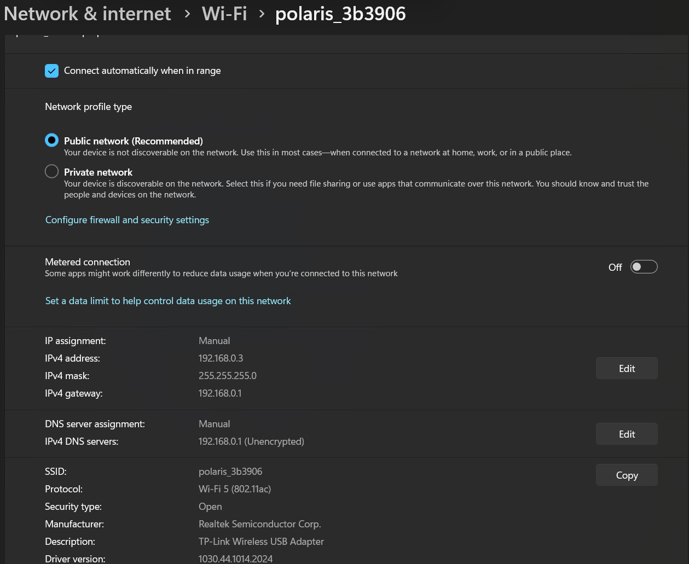
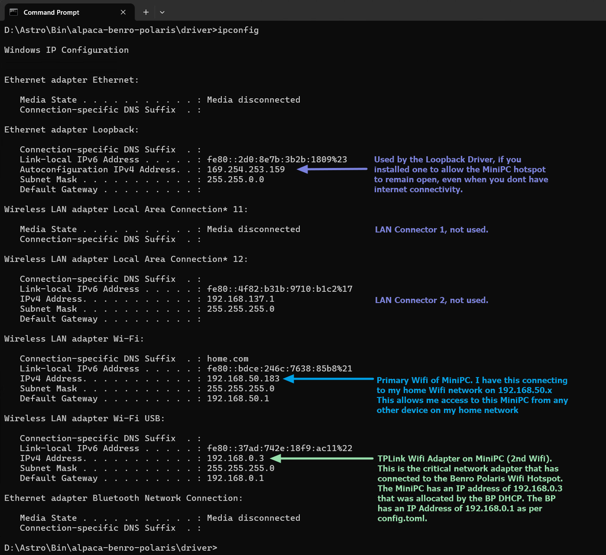
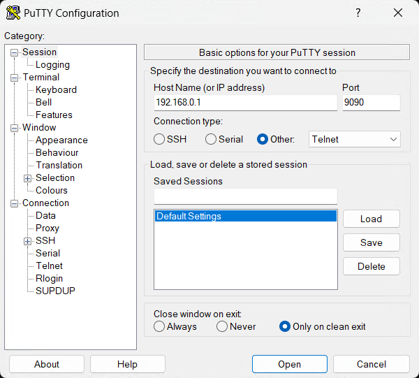
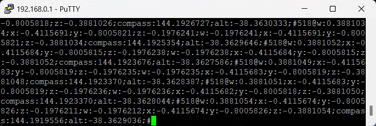

[Home](../README.md) | [Hardware](./hardware.md) | [Installation](./installation.md) | [Pilot](./pilot.md) | [Control](./control.md) | [Stellarium](./stellarium.md) | [Nina](./nina.md) | [Guiding](./guiding.md) | [Troubleshooting](./troubleshooting.md) | [FAQ](./faq.md)

# Troubleshooting
[Alpaca Install](#alpaca-install-troubleshooting) | [Benro Problems](#benro-polaris-troubleshooting) | [Comms Problems](#alpaca-communications--troubleshooting) | [Nina Problems](#nina-troubleshooting) | [Stellarium Problems](#stellarium-troubleshooting) 

## Alpaca Install Troubleshooting

### A1 - Cannot Run pip to Install Prerequisites
Check that you have installed Python 3.13.12 and pip 26.0.x. You can verify that python and pip are installed and accessible with the following commands:

```
python --version
pip --version
```
Sometimes, pip might not be installed with Python by default. You can install it manually using the ensurepip module. Run the following command:
```
python -m ensurepip --default-pip
```

If the above step doesn't work, try reinstalling Python and ensure that the option to install pip is checked during the installation process.

1. Download the Python 3.13.12 installer from the official Python website.
2. Run the installer and make sure to check the box that says “Add Python to PATH.”
3. Select “Customize installation” and ensure that the option to install pip is checked.

### A2 - Pip fails to install pre-requisite packages listed in requirements.txt
In some countries, your ISP's Domain Name Servers may redirect traffic to invalid Python Package servers. If you encounter the following errors when running pip.
```
$ pip install -r platforms/win/requirements.txt
WARNING: Retrying (Retry (total=0 to 4.........
ERROR: Could not find a version that satisfies the requirement falcon==4.0.2
```
You can force Windows to resolve the host names for the Python Package servers to their correct IPv4 addresses. Using Administrator, edit the file `hosts` in the directory 
`C:\Windows\System32\drivers\etc`. Add the following two lines to the end of the `hosts` file.
```
151.101.0.223 pypi.org
151.101.0.233 files.pythonhosted.org

```

### A3 – How to resolve ModuleNotFoundError

The Alpaca Driver requires certain Python packages to be installed before it can run. If you encounter an error like the following when first launching the Driver:

```text
Traceback (most recent call last):
  File "D:\Astro\Bin\alpaca-benro-polaris\driver\main.py", line 38, in <module>
    import discovery
  File "D:\Astro\Bin\alpaca-benro-polaris\driver\discovery.py", line 8, in <module>
    from config import Config
  File "D:\Astro\Bin\alpaca-benro-polaris\driver\config.py", line 36, in <module>
    import os, toml, json
ModuleNotFoundError: No module named 'toml'
```

This indicates that the required dependencies have not yet been installed.

To resolve this, ensure you have completed **Step 3** of the Windows 11 installation procedure and run the following command from the project root:

```command
pip install -r platforms/win/requirements.txt
```

This will install all necessary packages, including `toml`, so the Driver can run successfully.

### A4 - Smart App Control Blocked a File that may be unsafe
This dialog is generated by Smart App Control (SAC), a built-in Windows 11 security feature introduced in the 22H2 update. SAC blocks untrusted or unsigned applications, especially those downloaded from the internet. For the Mini-PC, we recommend turning off Smart App Control.

To turn off Smart App Control

1. Open Settings
2. Go to Privacy & security
3. Select Windows Security
4. Click App & browser control
5. Open Smart App Control settings
6. Set it to Off
7. Windows will ask **Are you sure?**. Confirm **Yes I'm sure**

### A5 - Startup Exception - The Driver fails to bind the socket to 0.0.0.0 or ::  
This may be caused by HTTP.sys, a kernel-mode HTTP listener built into Windows that prevents the Driver from binding to port 80. There are two approaches to resolving this conflict

To change the Port used by Alpaca Pilot:
* You can change the port used by Alpaca Pilot by changing config.toml line
  ```
  alpaca_pilot_http_port = 80                     
  ```
* Choose a free port like 8081. 
* When using a browser to navigate to Alpaca pilot you will need to pass the new port number. For Example: http://hostname:8081

To disable the http.sys driver if you dont need it:
* Disable the HTTP Service (Recommended). This prevents the kernel-mode driver from claiming port 80 upon startup.
* Open Registry Editor: Press Win + R, type regedit, and press Enter.
* Navigate to: HKEY_LOCAL_MACHINE\SYSTEM\CurrentControlSet\services\HTTP.
* Modify "Start": Locate the Start value, double-click it, and change the data to 4 (Disabled).
* Restart: Restart your computer to apply changes.

### A6 - Windows 11 Shortcut Startup Issue
If you have created a Windows shortcut to start the Polaris Alpaca Driver and a message briefly appears but the driver does not launch, follow the steps below to view the full error message:

1. Right-click the shortcut and select **Properties**.
2. In the **Target** field, click inside the text box, then press **Ctrl + A** to select all text.
3. Press **Ctrl + C** to copy the target string.
4. Open **PowerShell** or **Command Prompt**.
5. Press **Ctrl + V** to paste the copied target string, then press **Enter** to execute it.
6. Review any error message displayed in the console.
7. If necessary, correct the **Target** field in the shortcut based on the error details.

This process allows you to see the full error output, which may not remain visible when launching the shortcut normally.


## Benro Polaris Troubleshooting

### B1 - Cannot start the Benro Polaris Device.
There is a known issue with the recommended Benro Polaris device startup procedure. "Power On. In the off state, double press and hold the [Power Button], and release it after hearing “beep beep beep” three times to turn on the device. ".  Its worse than an old lawnmower at starting. If your device doesnt start, try the following:
1. Remove Power cable - Dont have the Benro Polaris charging, while trying to start.
2. Send to Park - use a Long Press to send the Benro Polaris to the parked position and ensure Power LED is off.
3. Short Press - Every second or so (but no faster), until Power LED is illuminated.
4. Long Press - As soon as its illuminated, do a long press, releasing after "beep, beep beep".

Another word of caution. Do not travel with the Astro USB cable or Camera USB Cable plugged into the Benro Polaris. There is a chance that movement within your bag may damage the cable. This can even lead to damage of the Benro Polaris and costly repairs.

### B2 - Cannot connect BP App to the Benro Polaris Device
Sometimes the BP App cannot search and connect to the BP over Bluetooth or Wifi. The Searching for device might list your device in white but it never turns green or connects or shows a green check-mark.
* Fully exit close the BP App on your phone.
* Reset all Bluetooth and Wifi communications on your phone. Easiest way to do this is to toggle `Airplane/Flight Mode`  on and off. 
* Restart the BP App and it should find and connect to your BP.

### B3 - Polaris has poor quality Sidereal Tracking
As an Alt/Az mount, the leveling of the Benro Polaris Tripod Head is a critical factor in the accuracy of your star tracking. To adjust the Polaris so it is as level as possible：
* Double-tap both virtual joysticks on the BP app to center the Polaris axes.
* Place a circular spirit level on top of the Astro Kit's quick-release plate and adjust the tripod to achieve a level of ±0.3 degrees or better.
* A [HACCURY Luminous 1° Round level bubble](https://www.aliexpress.com/item/4000457838875.html) can help you achieve accurate leveling. 
* A [Sunwayfoto DYH-68B Leveling Base](https://www.amazon.com/Sunwayfoto-DYH-68B-Profile-Leveling-Butterfly/dp/B09ZT3HVMN/) and [LEOFOTO
QS-50K 50mm Quick Link Set](https://www.amazon.com/Leofoto-QS-50K-Plates-Tripod-Release/dp/B0981C36RX) can ease the leveling process AND as act as a standoff to provide extra clearance for the Benro Polaris knobs!

### B4 - The Polaris cannot connect to my Home Wifi
The current firmware of the Benro Polaris does not allow connection to other WiFi networks. It can only host its own Wi-Fi hotspot.

This is no longer a limitation. The Alpaca Benro Polaris Driver can serve as a proxy for the Polaris. It is capable of connecting to both the Polaris Wi-Fi Hotspot and your home Wi-Fi network. This allows you to manage the Polaris from any device connected to your home Wi-Fi, including an iPad, a phone, a desktop, or a laptop.

### B5 - The Polaris is at 1% Battery and wont charge
The Polaris may have a design flaw that causes it to reject high-speed or smart chargers when the battery is in a low 1% state. It requires a slow, steady 5V source to restore sufficient power for the charging circuit to work correctly. Once it gets past that initial threshold, you can switch to a faster charger if needed. To fix the issue:
- Use a basic 5V 2.4A charger or an old battery pack via USB-A.
- Avoid smart or high-speed USB-C PD chargers initially.
- Let it charge without interruptions.
- Once it’s above 10–20%, you can switch to your usual power source.


### B6 - How can you reset the Benro Polaris password?
To reset the password of your Benro Polaris
1. Download the [Password Resetting Package](https://www.benro.com/en/downloads/page/polaris-reset-password.html) and place on to your SD card; 
2. Insert your SD card into Polaris, and power cycle the Polaris. 
3. When the Polaris powers up, it will read the SD card and reset your password.
4. After resetting your password, please take the SD card out and delete the password resetting package from the SD card.


### B7 - Where can I find the Benro Polaris manual?
The user manual can be found at the following link - [Polaris User Manual English](https://resource.benro.com/assets/benro/manual/polaris/polaris_user_manual_en.pdf).


## Alpaca Communications  Troubleshooting
### C0 - Cannot connect Win11 Computer or Laptop to Benro Polaris Wifi
There appears to be an issue with some types of Wifi Adapters being able to conenct with the Benro Polaris Wifi. If you cannot get Win11 to form a connection with the polaris_XXXXX Wifi, you may want to try using a USB Wifi Adapter. The following adapter is known to connect with Benro Polaris, [TP-Link AC600 USB WiFi Adapter](https://www.amazon.com/wireless-USB-WiFi-Adapter-PC/dp/B07P5PRK7J/). 

### C1a - Cannot see "`communications init... done`" in the log (Wi-Fi 2 not connected).
* Use the Alpaca Benro Polaris Driver log window to help diagnose your problem. The messages aim to help point you in the right direction. The driver will continue to retry connecting until you have resolved any issues.
* Confirm the mini-PC has connected with the polaris-XXXXX hotspot using the second `Wi-Fi 2` or `Wi-Fi USB` adapter. It should look like the following:
 

### C1b - Cannot see "`communications init... done`" in the log (network conflict).
If you see the `polaris_xxxxxx`, `No internet, open` message on the Wi-Fi 2 adapter, you may have a network issue or conflict. Check each of these steps to see if it can resolve the issue.
* Click `Disconnect`, wait 15s, then Choose `Connect Automatically` and click `Connect` to re-establish connection. Wait 30s for the Driver to attempt reconnection.
* Check that your home network does not conflict with the Polaris IP address of `192.168.0.1`. Some home network routers may default to also using the IP address of `192.168.0.1`. We recommend that you change your home network to an address range of say `192.168.50.xxx`, so that it doesnt conflict with various IP devices that commonly use the address `192.168.0.1`.

### C1c - Cannot see "`communications init... done`" in the log (IPv6 rather than IPv4).
When Windows connects to the Benro Polaris network, sometimes it only sets up an IPv6 network. You can manually set the network settings to help speed up connection and force an IPv4 network. To manually set the network properties.
* From the polaris-XXXXX hotspot dialog, click the i circle for more information
* Under IP Assignment, Automatic (DHCP), Click Edit
* Click the Edit network IP setttings dropdown and choose Manual
* Select IPv4 On and IPv6 off
* Enter an IP address of `192.168.0.3`
* Enter a Subnet mask of `255.255.255.0`
* Enter a Gateway of `192.168.0.1`
* Enter a Preferred DNS of `192.168.0.1`
* Choose DNS over HTTPS to be OFF 
* Click the Save button
 

### C2 - Cannot see any log message except two `INFO ==STARTUP==` lines
* Check your device doesnt have any IT policy to not allow connecting to an open WIFI like the Polaris Hotspot.
* Check which Wifi adapter is being used. There is a known issue with the Mele Quieter 4C not being able to connect to the Polaris Wifi. Do not use the MediaTek RZ616 Wi-Fi 6E 160MHz (Driver version 3.3.0.595) built in Wifi Adapter. Use the [TP-Link AC600 USB WiFi Adapter](https://www.amazon.com/wireless-USB-WiFi-Adapter-PC/dp/B07P5PRK7J/) instead.
* Check your IP Configuration using a Command Prompt to run `ipconfig.exe`. Ensure your Mini-PC has a valid IP Address from the Benro Polaris DHCP server. It should look like the following:
  
 

Here is a revised and expanded version with clearer structure, tighter language, and additional real-world causes we’ve seen in the field.

You can paste this directly into your documentation.

---

## C3 – Connection from Mini-PC to Polaris Wi-Fi Drops Out

When **Alpaca Pilot** displays:

> *“The Alpaca Driver is not receiving position updates from Polaris”*

this means the Driver has not received the expected 200 ms position update from Polaris for more than 2 seconds. An occasional appearance of this message may be normal (e.g., brief RF interference). However, repeated or persistent occurrences indicate a network or system issue.

Another common symptom of a dropped connection is the Alpaca Driver log message:

```
[WinError 1236] The network connection was aborted by the local system
```

This indicates that Windows reset or tore down the TCP connection. This is typically due to a network adapter reset, IP address change, or power management event.

Below are common causes and troubleshooting guidance.

---

### C3-1. Driver CPU Blocking or System Resource Starvation

If the Mini-PC CPU is heavily loaded, the Alpaca Driver may not process incoming messages in time.

#### Check:

* Open **Task Manager → Performance**
* Confirm CPU usage is stable and not near 100%
* Watch for spikes during imaging operations

#### Common causes:

* ASCOM drivers blocking the message loop
* Antivirus scanning during capture
* Windows Update running in background
* Slow storage (SD cards / eMMC systems under load)

#### Recommendations:

* Where possible, connect to cameras natively rather than through ASCOM
* Disable unnecessary startup programs
* Exclude Alpaca directory from antivirus real-time scanning
* Ensure at least 40% CPU headroom during imaging

---

### C3-2. DHCP Lease Rejection (DHCPNACK)

If Windows logs events such as:

> “The IP address lease 192.168.0.2 … has been denied by the DHCP server 192.168.0.1 (DHCPNACK)”

then the Polaris DHCP server has rejected the IP renewal request. When this happens, Windows drops the IP address, the adapter resets, all active TCP connections terminate and the Driver logs `[WinError 1236]`

#### Common causes:

* Two DHCP servers active (router + Polaris)
* IP address conflict
* Lease time set very short
* Another Device previously connected with same IP

#### Check:

Check Windows Event Viewer:

```
Windows Logs → System → Filter for “DHCP”
```

#### Recommended Fix:

The most reliable solution is to eliminate DHCP from this link:

* Set Mini-PC to a unique static IP (e.g., 192.168.0.20)

This removes lease renewal as a failure point.

---

### C3-3. Windows Power Management Resetting the Adapter

Windows aggressively powers down USB Wi-Fi adapters, especially “nano” style adapters. This can silently reset the adapter and terminate connections.

#### Disable Power Saving:

* Using **Device Manager**

* Network Adapters → TP-Link adapter → Properties
* Power Management tab:

  * Uncheck: “Allow the computer to turn off this device to save power”

* Using **Advanced Power Settings**

* Control Panel → Power Options
* Wireless Adapter Settings → Power Saving Mode → Maximum Performance
* USB Settings → USB Selective Suspend → Disabled

---

### C3-4. USB Wi-Fi Adapter Hardware Limitations

Small “nano” adapters are prone to:

* Thermal throttling
* Weak RF performance
* Driver instability on Windows 11
* High packet loss under sustained traffic

We recommend using a full-size USB adapter with an external antenna as listed in the documentation.

If problems persist:

* Try a powered USB hub
* Try a different USB port (avoid front panel ports)
* Install the latest manufacturer driver (not Windows default)

---

### C3-5. RF Signal Strength or Interference

Polaris operates on 2.4 GHz (if applicable), which is highly congested.

#### Symptoms:

* Intermittent dropouts
* Worse performance near homes or star parties
* Better performance at close range

#### Causes:

* Nearby Wi-Fi networks
* Bluetooth devices
* USB 3.0 cables radiating interference
* Metal obstructions or tripods blocking antenna

#### Mitigation:

* Maintain clear line of sight
* Keep Mini-PC within 2–3 m of Polaris
* Move USB 3 cables away from Wi-Fi adapter

---

### C3-6. Network Adapter Driver Instability (Windows 11)

Some Realtek-based adapters are unstable under Windows 11. Symptoms can include: No DHCP errors; Sudden disconnect/reconnect events; “Network adapter reset” events in Event Viewer.

#### Check:

Event Viewer → Windows Logs → System Filter for:

* Netwtw
* Realtek
* WLAN-AutoConfig

#### Fix:

* Install latest driver from manufacturer website
* Roll back driver if problem began after update

---

### C3-7. Roaming or Auto-Switching Networks

If the Mini-PC has:

* Multiple saved Wi-Fi networks
* Ethernet connected simultaneously
* Internet Connection Sharing enabled

Windows may switch interfaces automatically.

#### Fix:

* Disable unused network adapters
* Set Polaris network to “Private”
* Forget other Wi-Fi networks during testing

---


## C4 - Still cannot get communications with Polaris Wifi
To further help diagnose communication problems between ABP and the Polaris, you can use `Telnet` or `PuTTY` to directly connect to the Polaris. This will isolate whether the problem is ABP related or not.

On Win11:
* Use the following link to [Download PuTTY](https://www.putty.org/) (a telnet client) to your device running the Driver.
* Select the 64-bit x86 version for the Windows installer.
* Double click on the file you downloaded to install PuTTY.
* Perf the normal BP App setup (a) Search for Device (b) Connect to polaris_xxxxxx (c) Select Atro Mode (d) Align Compass (e) Align Star (f) Confirm.
* Connect the Device running ABP to the Polaris Wifi Hotspot.

 

* Run the PuTTY app.
  


* Enter `192.168.0.1` into the HostName (or IP address) field.
* Enter `9090` into the Port field.
* Select Connection Type `Other` and drop down `Telnet`.
* Click `Open`
* Select `Yes` when asked by User Account Control, Do you want to allow this app to make changes to your device? This opens the firewall to allow PuTTY to communicate with BP.

The PuTTY application should show a window with the raw communications from the Benro Polaris. If your connection is working it should look like the following, constantly scrolling.



### C5 - No Telnet/PuTTY communications with Polaris Wifi
If you cannot see the raw communications scrolling in PuTTY from Troubleshooting Step C4, then there is a problem communicating with your device that is independant of Alpaca Benro Polaris Software.
* Check the Signal Strength of the Polaris WiFi hotspot at your ABP device. You may need to move the device running ABP closer to the Benro Polaris.
* Check you are not running AntiVirus Software that may block open Wifi Connections
* Check you do not have an IT or Windows policy blocking open Wifi Connections.
* Check you do not have a Virtual Private Network (VPN) enabled.
* Check for IP connectivity to the Polaris by using a Command Window to ping the Benro Polaris.
```
C:\Users\Astro> ping 192.168.0.1
Reply from 192.168.0.1: bytes=32 time=1ms TTL=64
Reply from 192.168.0.1: bytes=32 time=2ms TTL=64
Reply from 192.168.0.1: bytes=32 time=2ms TTL=64
Reply from 192.168.0.1: bytes=32 time=2ms TTL=64

Ping statistics for 192.168.0.1:
    Packets: Sent = 4, Received = 4, Lost = 0 (0% loss),
Approximate round trip times in milli-seconds:
    Minimum = 1ms, Maximum = 2ms, Average = 1ms
C:\Users\Astro> 
```
* If the ping does not respond within a few milliseconds, go back through C1-C3 to double check the setup. 

### C6 - Powershell commands to check the Network setup
You can use the following commands from a PowerShell window, to check the status of your TP-Link adapter and Wifi connection to the Polaris. 
1. To open PowerShell, from the Run menu type `PowerShell` and click the `Windows PowerShell` App
2. To list all interfaces, including MAC Address and current status
    ```
    PS C:\> Get-NetAdapter

    Name                      InterfaceDescription                    ifIndex Status       MacAddress             LinkSpeed
    ----                      --------------------                    ------- ------       ----------             ---------
    Wi-Fi                     Intel(R) Wi-Fi 6 AX201 160MHz                22 Up           80-38-FB-4C-AB-85       1.9 Gbps
    Loopback                  Microsoft KM-TEST Loopback Adapter           21 Up           02-00-4C-4F-4F-50       1.2 Gbps
    Local Area Connection* 15 Microsoft Wi-Fi Direct Virtual Ada...#7      16 Up           A8-29-48-B0-19-0B          0 bps
    Bluetooth Network Conn... Bluetooth Device (Personal Area Netw...      15 Disconnected 80-38-FB-4C-AB-89         3 Mbps
    Ethernet                  Realtek PCIe GbE Family Controller           14 Disconnected 00-CE-39-D1-58-BF          0 bps
    Wi-Fi 2                   TP-Link Wireless USB Adapter                 10 Up           A8-29-48-B0-19-0B      72.2 Mbps
    ```

3. To show driver details.
    ```
    PS C:\> netsh wlan show drivers

    Interface name: Wi-Fi 2

        Driver                    : TP-Link Wireless USB Adapter
        Vendor                    : Realtek Semiconductor Corp.
        Provider                  : Microsoft
        Date                      : 11/07/2011
        Version                   : 1030.38.712.2019
        INF file                  : netrtwlanu.inf
        Type                      : Native Wi-Fi Driver
        Radio types supported     : 802.11n 802.11g 802.11b 802.11ac 802.11n 802.11a
        FIPS 140 mode supported   : Yes
        802.11w Management Frame Protection supported : Yes
        Hosted network supported  : No
        Authentication and cipher supported in infrastructure mode:
        Number of supported bands : 2
                                    2.4 GHz [ 0 MHz - 0 MHz]
                                    5 GHz [ 0 MHz - 0 MHz]

    Interface name: Wi-Fi

        Driver                    : Intel(R) Wi-Fi 6 AX201 160MHz
        Vendor                    : Intel Corporation
        Provider                  : Intel
        Date                      : 1/05/2024
        Version                   : 23.60.1.2
        INF file                  : oem12.inf
        Type                      : Native Wi-Fi Driver
        Radio types supported     : 802.11b 802.11g 802.11n 802.11a 802.11ac 802.11ax
        FIPS 140 mode supported   : Yes
        802.11w Management Frame Protection supported : Yes
        Hosted network supported  : No
        Authentication and cipher supported in infrastructure mode:
        Number of supported bands : 2
                                    2.4 GHz [ 0 MHz - 0 MHz]
                                    5 GHz [ 0 MHz - 0 MHz]
        IHV service present       : Yes
        IHV adapter OUI           : [00 00 00], type: [00]
        IHV extensibility DLL path: C:\WINDOWS\system32\IntelIHVRouter10.dll
        IHV UI extensibility ClSID: {00000000-0000-0000-0000-000000000000}
        IHV diagnostics CLSID     : {00000000-0000-0000-0000-000000000000}
        Wireless Display Supported: Yes (Graphics Driver: Yes, Wi-Fi Driver: Yes)

    ```


4. To show Wi-Fi connection details (SSID, signal strength, bitrate, BSSID)
    ```
    PS C:\> netsh wlan show interfaces

    There are 2 interfaces on the system:

        Name                   : Wi-Fi 2
        Description            : TP-Link Wireless USB Adapter
        GUID                   : 41e960f6-3ef5-49fa-9372-0d229f7e8284
        Physical address       : a8:29:48:b0:19:0b
        Interface type         : Primary
        State                  : connected
        SSID                   : polaris_b83c06
        AP BSSID               : 94:bb:43:c9:e1:f1
        Band                   : 2.4 GHz
        Channel                : 9
        Network type           : Infrastructure
        Radio type             : 802.11n
        Authentication         : Open
        Cipher                 : None
        Connection mode        : Auto Connect
        Receive rate (Mbps)    : 72.2
        Transmit rate (Mbps)   : 72.2
        Signal                 : 100%
        Rssi                   : -29
        Profile                : polaris_b83c06
        QoS MSCS Configured         : 0
        QoS Map Configured          : 0
        QoS Map Allowed by Policy   : 0

        Name                   : Wi-Fi
        Description            : Intel(R) Wi-Fi 6 AX201 160MHz
        GUID                   : b67dddca-5819-4bb0-b2cf-9544bce8334f
        Physical address       : 80:38:fb:4c:ab:85
        Interface type         : Primary
        State                  : connected
        SSID                   : atlas_6G
        AP BSSID               : a0:36:bc:40:77:8c
        Band                   : 5 GHz
        Channel                : 36
        Connected Akm-cipher   : [ akm = 00-0f-ac:02, cipher =  00-0f-ac:04 ]
        Network type           : Infrastructure
        Radio type             : 802.11ax
        Authentication         : WPA2-Personal
        Cipher                 : CCMP
        Connection mode        : Auto Connect
        Receive rate (Mbps)    : 2402
        Transmit rate (Mbps)   : 1633
        Signal                 : 87%
        Rssi                   : -51
        Profile                : atlas_6G
        QoS MSCS Configured         : 0
        QoS Map Configured          : 0
        QoS Map Allowed by Policy   : 0

    ```
4. To show more detailed info on network interfaces, IP addresses (IPv4/IPv6), MAC address, and status.
    ```
    PS C:\> Get-NetIPConfiguration

    InterfaceAlias       : Loopback
    InterfaceIndex       : 21
    InterfaceDescription : Microsoft KM-TEST Loopback Adapter
    NetProfile.Name      : Unidentified network
    IPv4Address          : 169.254.176.36
    IPv6DefaultGateway   :
    IPv4DefaultGateway   :
    DNSServer            : fec0:0:0:ffff::1
                          fec0:0:0:ffff::2
                          fec0:0:0:ffff::3

    InterfaceAlias       : Local Area Connection* 15
    InterfaceIndex       : 16
    InterfaceDescription : Microsoft Wi-Fi Direct Virtual Adapter #7
    NetProfile.Name      : Identifying...
    IPv4Address          : 192.168.137.1
    IPv6DefaultGateway   :
    IPv4DefaultGateway   :
    DNSServer            : fec0:0:0:ffff::1
                          fec0:0:0:ffff::2
                          fec0:0:0:ffff::3

    InterfaceAlias       : Wi-Fi
    InterfaceIndex       : 22
    InterfaceDescription : Intel(R) Wi-Fi 6 AX201 160MHz
    NetProfile.Name      : atlas_6G
    IPv4Address          : 192.168.50.54
    IPv6DefaultGateway   :
    IPv4DefaultGateway   : 192.168.50.1
    DNSServer            : 8.8.8.8

    InterfaceAlias       : Wi-Fi 2
    InterfaceIndex       : 10
    InterfaceDescription : TP-Link Wireless USB Adapter
    NetAdapter.Status    : Disconnected

    InterfaceAlias       : Ethernet
    InterfaceIndex       : 14
    InterfaceDescription : Realtek PCIe GbE Family Controller
    NetAdapter.Status    : Disconnected

    InterfaceAlias       : Bluetooth Network Connection
    InterfaceIndex       : 15
    InterfaceDescription : Bluetooth Device (Personal Area Network)
    NetAdapter.Status    : Disconnected


    ```
5. To show routing table (default gateway + network routes).
    ```
    PS C:\> Get-NetRoute

    ifIndex DestinationPrefix                              NextHop                                  RouteMetric ifMetric PolicyStore
    ------- -----------------                              -------                                  ----------- -------- -----------
    16      255.255.255.255/32                             0.0.0.0                                          256 25       ActiveStore
    16      224.0.0.0/4                                    0.0.0.0                                          256 25       ActiveStore
    22      192.168.50.255/32                              0.0.0.0                                          256 30       ActiveStore
    22      192.168.50.54/32                               0.0.0.0                                          256 30       ActiveStore
    22      192.168.50.0/24                                0.0.0.0                                          256 30       ActiveStore
    10      192.168.0.255/32                               0.0.0.0                                          256 55       ActiveStore
    10      192.168.0.2/32                                 0.0.0.0                                          256 55       ActiveStore
    10      192.168.0.0/24                                 0.0.0.0                                          256 55       ActiveStore
    21      169.254.255.255/32                             0.0.0.0                                          256 25       ActiveStore
    21      169.254.176.36/32                              0.0.0.0                                          256 25       ActiveStore
    21      169.254.0.0/16                                 0.0.0.0                                          256 25       ActiveStore
    1       127.255.255.255/32                             0.0.0.0                                          256 75       ActiveStore
    1       127.0.0.1/32                                   0.0.0.0                                          256 75       ActiveStore
    1       127.0.0.0/8                                    0.0.0.0                                          256 75       ActiveStore
    10      0.0.0.0/0                                      192.168.0.1                                        0 55       ActiveStore
    22      0.0.0.0/0                                      192.168.50.1                                       0 30       ActiveStore

    ```

6. To generate a comprehensive wifi report file in HTML.
    ```
    PS C:\> netsh wlan show wlanreport
    ```
    > NOTE: This command requires Administrator privellages

## Nina Troubleshooting

### N1 - Cannot Remote Desktop to MiniPC running Nina
* There are a range of remote desktop applications avalable which you might want to try:
  * Microsoft Remote Desktop - Free with Windows 11 Pro. Some testers have had issues connecting via MS Remote desktop. I've been using it quite successfully.
  * AnyDesk - "Best remote desktop solution for occasional users" - Techradar. 
   Successfully used by a beta tester.
  * Splashtop - "Powerful remote desktop with impressive features" - Techradar. I've used this on my home network successfully.
  * TeamViewer - "Best remote PC software for cross-platform compatibility" - Techradar.
  * RemotePC - Short free trial.
  * LogMeIn - Lacks a free trial.
  * Zoho Assist - Free tier very limited.
* When using AnyDesk and certain other programs, you might need to use an [HDMI Dummy Plug](https://www.amazon.com/dp/B0CKKLTWMN) to get video output from the mini PC if a monitor is not connected. Microsoft Remote Desktop Client does not require this, but it may not be available for some mobile devices.

### N2 - I still cannot remotely connect to the MiniPC running Nina
* Windows Updates can be delivered every month that may effect the state of the device.
* Check Mini-PC state. Reconnect a monitor and Keyboard to the Mini-PC and check that it is up and running. 

### N3 - I have a Mini-PC running without internet access. I cannot remotely connect to it.
* This type of configuration is more challenging and can be confusing, but it is possible.
* There are two Wifi Hotspots in this configuration, the BP Hotspot and the Mini-PC Hotspot. 
* Check that your laptop has not dropped connection to the Mini-PCs hotspot.
* Check IP connectivity. From a command prompt, use `ping <hostname>` to ensure you have IP connectivity and DNS lookup to your Mini-PC. 
* You may find using the Mini-PC's `IP4-address` in Remote Desktop rather than `<hostname>` may make it easier to connect.
* Check that the MiniPC Hotspot is not using the TPLink. You can unplug the TPlink to force the MiniPC hotspot to use the embedded Wifi of the Mele. 
* Once you have connected to the Mini-PC via Remote Desktop, then re-plug in the TPLink, to allow ABP to use it to connect with the BP Hotspot.

### N4 - Which Mount should I select in Nina's Equipment Tab, it lists 8 Benro Polaris Mounts?
* The ABP defaults to broadcasing `ASCOM Alpaca` services on all network interfaces on the MiniPC. 
* If you have the ASCOM Platform installed, Nina will also detect all the `ASCOM direct` interfaces to the ABP. 
* We recommend connecting to the ABP via `ASCOM Apaca` services rather than `ASCOM`. Choose one of the Mounts under `ASCOM Alpaca`.
* You can limit what IP Address the driver exposes the `ASCOM Alpaca` Service on, by setting the field `alpaca_restapi_ip_address` in `driver/config.toml`. 
* To limit the Alpaca Service only to applications that are running on the Mini-PC (ie no remote applications), set it the following.
```
alpaca_restapi_ip_address = '127.0.0.1' 
```

### N5 - Cannot obtain a good autofocus run with Nina?
* Check your Lens Stabilisation is off. This interfers with sidereal tracking.
* Check you Lens AutoFocus is off on the Lens and Camera Body. If left on this may cause the camera focusing system to hunt interering with the image capture process.
* Check for Lens Cap not removed. Not kidding.
* Check for clouds.
* Check for haze or smoke.
* Check for occulusion by trees or buildings.
* Check for that you are close to focus before starting a Nina Focus run.

### N6 - Cannot plate solve with Nina and ASTAP?
* Check you are in Focus
* Check to make sure you Camera Pixel Size and Telescope Focal Length is set correctly in Nina's Options > Equipment tab, including any reducer or extender. Plate solving wants an approximately correct field of view as input and frequently fails if not set to the right values. 
* The focal_length and focal_ratio in config.toml are provided because of the ASCOM standard, but are not used by Nina. You do not need to update these when you change lenses.
* When using plate-solving to do the first polar alignment of the Polaris, you need to set the exposure length short so that you dont get star trails. If it is too short you will not get enough stars for the plate solve to work. To overcome this trade off, do a compas alignment so that the Polaris is at least roughly polar aligned.
* Check if you are using any filters. Using a narrow band filter on the camera, like the L-Ultimate Optolong HaOIII filter, can make plate solving more challenging for ASTAP.
* Check you have downloaded the relevant STAR databases. For 200mm lens and less you may need to download the [Wide field STAR database G05](https://www.hnsky.org/astap.htm)

### N7 - Cannot Connect Sony Camera with Nina
Some later models of Sony cameras (e.g., Sony Alpha 7R IV) are not recognized by the Sony Plug-in that is included with Nina. 
To resolve this:
* You can download more up to date ASCOM Sony drivers from  the [ASCOMSonyCameraDriver GitHub repository](https://github.com/dougfor.../ASCOMSonyCameraDriver/releases).

Alternatively, you can use the following procedure to try and get the Nina Driver to recognise your camera:
* Attach your camera via USB. Configure as you would to connect to the Polaris.
* Turn on your camera.
* Enter Device Manager in the Windows desktop search bar.
* Click on the Device Manager icon to open the Device Manager.
* Check for the linr `libusbK Usb Devices`.
* If the line does not exist, close the Device Manager. You are correctly configured.
* If the line `libusbK Usb Devices` exists:
  * Left-click on the entry to expand the entry. You should now see Sony Remote Control Devices.
  * Right-click on `Sony Remote Control Devices` and select `Update Driver`.
  * Select `Browse my computer for drivers`.
  * Select `Let me pick from a list of available drivers on my computer`.
  * Left-click on `MTP USB Device`.
  * Your driver should now update.  NOTE: Your camera is now listed under `Portable device`. Other software may not function correctly with the Device Manager configured this way. 
  * You can change back to the original setting by following these steps and selecting `libusbK Usb Devices` as the new driver instead of `MTP USB Device`.

Hopefully, Nina will now connect to your camera.

### N8 - Cannot Connect Nikon D850 Camera with Nina
There is a known issue with connecting a D850 via USB2 with Nina. Try connecting the Nikon D850 via a USB3 or USB-C port. See this [Redit Post on the D850 and Nina](https://www.reddit.com/r/AskAstrophotography/comments/169yzsd/nikon_d850_will_not_connect_to_nina/) for more details.

### N9 - Cannot retrieve Remote Stellarium Coordinates to Nina
The Nina Sky Atlas has a feature to allow you to get target coordinates from your configured Planetarium Software. You can set the Options / Planetarium software as Stellarium with a given Host IP Address and Port. 

You need to configure Stellarium, adding the Remote Control Plug-in, enabling it to run at startup. Restarting Stellarium allows you to configure the plug-in to automatically enable the server on startup. 

The Remote Control Plug-in defaults to port 8090. This port can conflict with other software you may have on your computer eg Wonderware RecoverIt. If you cannot get Nina to retreive the coordinates from Stellarium try setting the port number to 8091 in both Stellarium and Nina. This may fix the integration between Nina and Stellarium.

## Stellarium Troubleshooting

### S1 - StellariumPLUS Cannot Connect to ABP
There are three approaches to connect StellariiumPLUS to the ABP, depending on your setup scenario.
* Scenario A: The ABP device conencts to Polaris Hotspot only.
    * Connect your phone to the Polaris Hotspot.
    * In Stellarium's Observing Tools Setup, enter a Network Host of `192.168.0.3` 
    * You may need to disable Mobile Data on your phone to get this to work.
* Scenario B: The ABP device connects to Polaris Hotspot and your Home Wifi.
    * Check that the BP App is closed. This frees the phones Wifi from the Polaris Wifi. 
    * Check that your phone does not autoconnect to the Polaris Wifi.
    * Connect your phone to your Home Wifi.
    * In Stellarium's Observing Tools Setup, enter a Network Host of `192.168.X.XXX`
    * This address needs to match the IP address of your ABP machine on your Home Wifi.
* Scenario C: The ABP device connects to Polaris Hotspot and has its own NinaAir Hotspot.
    * Check that the BP App is closed. This frees the phones Wifi from the Polaris Wifi.
    * Check that your phone does not autoconnect to the Polaris Wifi.
    * Connect your phone to the NinaAir Hotspot.
    * In Stellarium's Observing Tools Setup, enter a Network Host of `192.168.X.XXX`
    * This address needs to match the IP address of your ABP machine on your NinaAir Wifi.

### S2 - Still Cannot Connect StellariumPLUS to ABP
* Check IP connectivity. You must run StellariumPLUS on a mobile device that can communicate with the ABP driver. Use a free mobile Ping app to check that you can ping the ABP driver device. If you cannot ping, then check that you are not using the phone's mobile data, that you are within range of your router's Wi-Fi signal, and that your phone is connected to your home Wi-Fi.
* Check the StellariumPLUS Host field on the Observing Tools settings popup. This needs to be set to the ABP Driver's IP address. Do not use 127.0.0.1 Loopback. 
* Check stellarium_telescope_ip_address in config.toml. This can be left as its default '' to make the Driver serve the SynScan protocol on any network adapter it can find. If you want to limit the IP address servered by the Driver, you can set this to the IP address of the Mini-PC on your home network. 

### S3 - Stellarium Desktop has greyed out ASCOM option
* Stellarium Desktop v24.3 for Windows has two installable versions depending on a third party library it uses, called Qt. 
* The Stellarium Desktop v24.3 Qt6 version no longer has ASCOM drivers enabled. 
* We recommend you install Stellarium Desktop v24.3 Windows x86_64 **Qt5** Windows 7+ version.
* If you installed the incorrect version, simply uninstall it and reinstall the version mentioned above.
  
### S4 - Stellarium Desktop freezes with Remote Desktop
* Check fps settings. Stellarium's default is a crazy 10000 fps. We suggest reducing the default settings in the following file `C:\Users\Nina\AppData\Roaming\Stellarium\config.ini`, where Nina is replaced with your User name.
    ```
    [video]
    ...
    maximum_fps                               = 10
    minimum_fps                               = 10
    ...
    ``` 