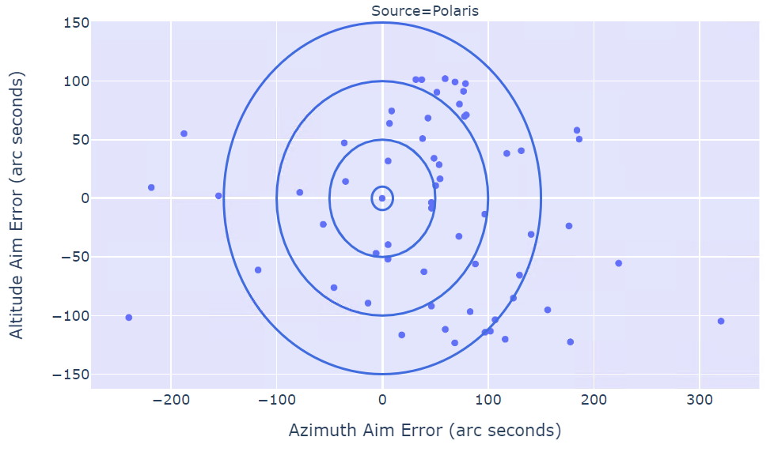
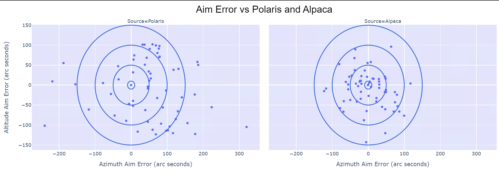
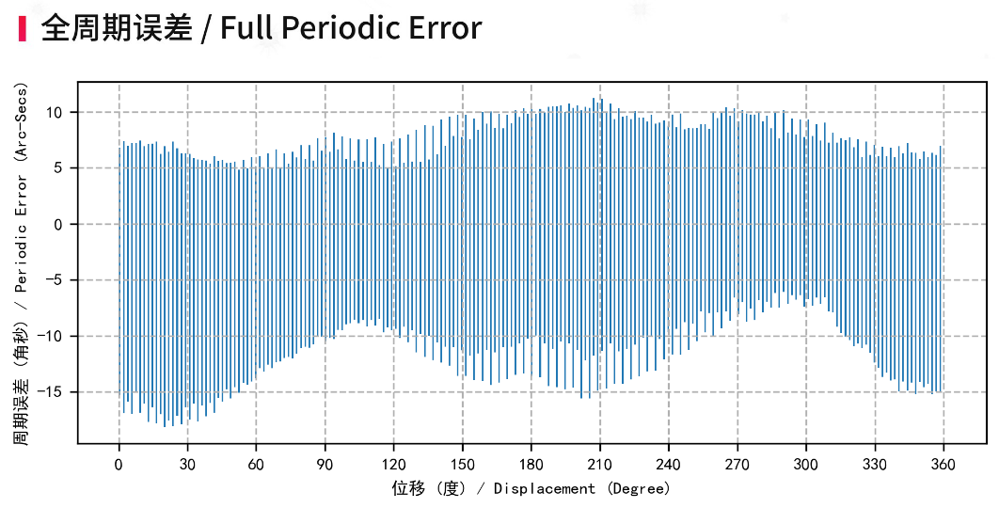
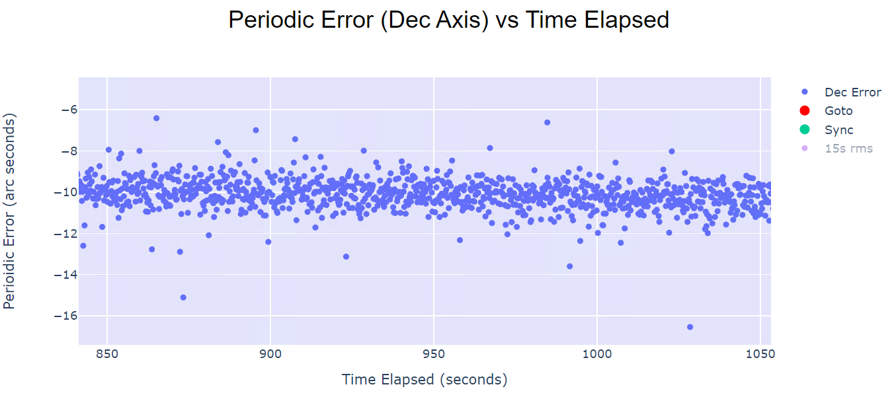
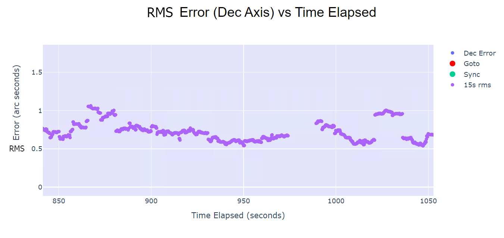
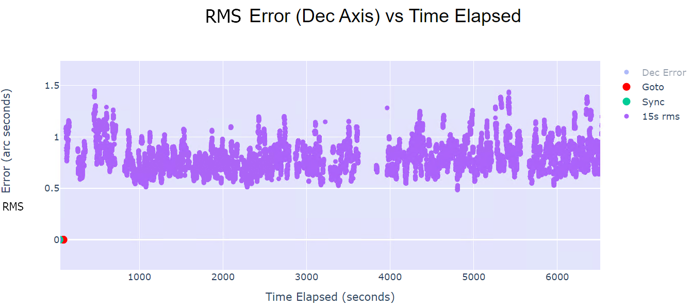
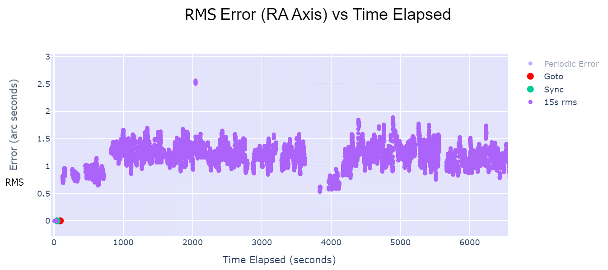

# Improving Aiming and Tracking Performance
Are you interested in improving the aiming and tracking performance of your Benro Polaris? This development update is all about understanding the current performance, what factors are within our control, what Alpaca has improved, and what can be done further. It's pretty technical and will involve some statistical data analysis, so if you enjoy that sort of thing, read on. Otherwise, you may want just to read the executive summary.

# Executive Summary

The Alpaca Benro Polaris Driver (ABP) leverages the Benro Polaris's existing hardware capabilities and improves its aiming and tracking performance. The ABP's extensive performance analysis features have confirmed a consistent drift error of +3.4 arc seconds per minute in the RA axis across all pointing locations in the sky. This dramatically limits the Polaris's use for deep-sky astrophotography.

The Benro Polaris tested had a GOTO function aiming bias of +48 arc seconds in the azimuth axis and a standard deviation of +98 arc seconds across multiple targets. The ABP removes any aiming bias inherent in the Benro Polaris and reduces the aiming error standard deviation by around 50% from +98 to +51 arc seconds.

The Benro Polaris tested had limited tracking performance. While the periodic error in the Dec axis was measured to remain within 20 arc seconds, the RA axis drifted to include significant periodic error. This was disappointing, considering the Polaris's excellent RMS Error was measured to remain below 1.8 arc seconds for both the RA and Dec axes. The ABP significantly improves the initial setup of the Benro Polaris, although not enough data has been collected to quantify any improvements with its multi-point alignment feature.

The ABP Driver developers recommend collaborating with the manufacturer, Benro, to further improve Polaris's performance. Working with Benro to develop potential firmware updates could address the RA drift issue and potentially enable auto-guiding in a future version of the ABP Driver.

# Introduction

The Benro Polaris includes an **attitude and heading reference system** (AHRS) to sense its orientation. The Azm and Alt displayed in the top middle of the Benro Polaris App is based on the AHRS. The Alpaca Driver logs this data to measure actual aiming, tracking, drift, and other performance metrics. This data appears accurate and is used for most of this analysis. 

# Aiming Performance 

## Definition, Measurement, and Tolerance

Aiming performance in astrophotography refers to the accuracy and precision with which a telescope or camera mount can point to a specific celestial object. This involves the mount’s ability to locate and center the object in the field of view based on given coordinates.

This paper measures aiming performance by the angular distance between the Target Coordinates and the Actual Coordinates after the Polaris has performed its slew and re-established tracking. This angular distance is measured in arc seconds of a degree for both the Azimuth and Altitude axes. We call this angular distance the **Aim Error**.

Aiming performance becomes more critical with lenses of longer focal lengths. If the Polaris cannot bring the target into the field of view (FOV), knowing which way to move the mount is often challenging, making it difficult to address. For example, a Canon R5 with an 800mm lens has a vertical FOV of only 1.72°, i.e., 6192 arc-seconds. We need a pointing tolerance of a maximum of **3000 arc seconds** to ensure our target is within view. 

Nina uses a default pointing tolerance of 10 arc minutes or **600 arc seconds** as another tolerance guide. Once Nina has plate-solved and moved the target within 600 arc seconds of the FOV center, it proceeds with the sequence. Aiming tolerance does not usually need to be as accurate as tracking tolerance.

## Current Polaris Performance

We created a test in which we commanded the Polaris to slew to a range of Targets across the night sky in 15-degree intervals, measuring the aiming performance with each slew. The scatter plot below shows the Aiming Error for each GOTO as a point, marked by the distance from the target in arc seconds. It's like an archery target, with a center at (0, 0) representing the Polaris hitting the target spot on.

You can see that the Polaris consistently aims to the right and down. It has an average Aim Error on the Azimuth axis of **+48 arc seconds**. The standard deviation on the Azimuth axis is **98 arc seconds**. The standard deviation on the Altitude axis is **72 arc seconds**. 

Not bad overall, but note that these measurements do not factor in leveling or polar misalignment. They assume that the Polaris is perfectly aligned, which, of course, is never the case. Misalignment with the compass and star alignment will add significant aiming errors of over **3600 arc seconds** per degree of misalignment.

## What can you control?

There are numerous factors that you can control to help improve aiming performance, including:

### Equipment Setup: 
* Base Leveling - The most important thing is to level your tripod base, ideally within 0.3°. 
* Compass Alignment - Align your phone with a book, separated from the Polaris electronics.
* Alignment Magnification - Use your Polaris x16 or cameras x10 for precise alignment.
* Alignment Star - Pick an alignment star close to your target.

### Equipment Choice: 
* Level - Choose an accurate and calibrated spirit level.
* Tripod - Maximise Tripod stability with good placement and suitable size.
* Payload - Minimal Payload Weight of the camera and lens.
* Lens - Gradually build experience with longer focal length; shorter = better aim.

## What does Alpaca improve?

### Atmospheric Refraction Correction

This correction accounts for the bending of light as it passes through Earth’s atmosphere, which causes celestial objects to appear higher in the sky than they are. The refraction angle depends on the object's altitude and the atmospheric conditions (temperature and pressure). A typical correction of a target near the horizon may be up to **2100 arc-seconds**. A target 30° from the horizon only has a correction of around **60 arc seconds**.

### Backlash Delay Correction

When testing the Polaris, we noticed a consistent misaiming of the target, with an error consistently behind on the RA axis. Backlash delay correction compensates for the time to remove any slack in mechanical systems, particularly in gears and lead screws. A typical correction of a target with a zero declination would be **225 arc seconds** to cater for a 15-second delay. A target at 45° declination would have a correction of around **160 arc seconds**.

### Goto Aiming Correction

Surprisingly, the Polaris does not close the control loop on aiming performance. While it is told the coordinates to go to and can read the final orientation of the telescope, it does not appear to do anything to correct any persistent deviation. The Alpaca Driver corrects this with its adaptive integrative algorithm. This can make corrections of up to **3600 arc-seconds**.

## Alpaca Improvement Results

With these three improvements above, the chart below shows the improved Aiming Performance achieved using the Alpaca Driver. I've included both charts side by side to make it easier to compare them.

You can see that Alpaca consistently aims to be ON target due to the GOTO Aiming correction. It has an average Aim Error on the Azimuth axis of **+2 arc seconds**. The standard deviation on the Azimuth axis is **51 arc seconds**. The standard deviation on the Altitude axis is **44 arc seconds**. 

Much better, but note again that these measurements do not factor in leveling or polar misalignment. They assume that the Polaris is perfectly aligned, which, of course, is never the case. Misalignment with the compass and star alignment will add significant aiming errors of over **3600 arc seconds** per degree of misalignment.

## Plate-solving Correction

By using Nina and ASTAP, you can leverage the best Aim Performance improvement enabled by Alpaca. Plate-solving is a game changer. Forget about the polar misalignment; short exposure plate-solving can get on target with even a poorly aligned Polaris. ASTAP can solve the image from your camera to move closer to the target in incremental steps.

Not only that, it will also align the Polaris on the way when you have Sync enabled. 

Overall, Plate-Solving Correction eliminates any aiming problems with the Polaris. You will never fumble in the dark to find your target nebula. Plate-solving is worth the effort to get going. 

# Tracking Performance

## Definition, Measurement, and Tolerance

Tracking performance refers to the mount’s ability to follow the apparent motion of celestial objects across the sky due to Earth’s rotation. Good tracking performance ensures that the object remains centered in the field of view over time, allowing for long-exposure photography without star trails. 

The Earth's sidereal rotation speed is approximately **900 arc seconds per minute**. This means that in one minute of sidereal time, a star will appear to move 900 arcseconds across the sky. Ideal tracking eliminates this motion.  In this paper, we quantify how well the Polaris does this using three measures: Periodic Error, RMS Error, and Drift Error. 

**Periodic Error** refers to the regular, repeating deviations in the tracking accuracy of a telescope mount caused by imperfections in the mount’s drive gears. We measure Periodic Error as an absolute arc-second deviation from the desired tracked position. Think of it as an absolute error. The chart above is an example of the Periodic Error tolerance of a high-end ZWO AM5 mount. The Periodic Error ranges from **-18 arc seconds** to **+12 arc seconds**.

**RMS Error** (Root Mean Square) is a statistical measure representing the average deviation or spread of the telescope’s actual position from the desired tracked position over a short period. The nature of RMS removes any longer-term bias from the measure and only measures spread.  We will use a 15-second interval for all our RMS Error calculations. Think of it as the variation in the error. The chart above is an example RMS Error tolerance measured in PHD2. The RMS Error ranges from **-3 arc-second** to **+3 arc-second** on the blue RA Axis. An excellent mount can achieve an RMS Error of **+/- 0.5 arc seconds**.

**Drift Error** refers to the apparent movement of a celestial object in the telescope’s field of view over a more extended period. We measure Drift Error as an angular distance across the RA and Dec axes in arc seconds per minute, effectively an angular speed. Drift error occurs because the telescope is not accurately tracking the sky’s rotation. Think of it as a rotational slip speed. The chart above shows an apparent drift on the Dec axis. A typical tolerance for astrophotography is to keep Drift Error within **1 arc second per minute**. 

## Current Polaris Performance

Ideally, we would measure current tracking performance using a guide scope. Unfortunately, I have had a lack of clear skies and, more importantly, a lack of a guide scope! Even though we'll be using the AHRS data as a proxy for actual tracking performance, it will illustrate Polaris's best possible case. I'd gladly redo the tests if anyone wants to donate a guide scope.

We start with a chart showing the Declination Axis Periodic Error on the y-axis and time/angle along the horizontal axis. This chart is zoomed out, with the following sequence of events: GOTO@730s, Plate-Solve@750s, SYNC@765s, GOTO@770s, Plate-Solve@820s within tolerance, 850s onwards is tracking. Let's zoom in around 850s.

I'm impressed with Polaris's performance. The periodic error ranges from -9 to -11 arc seconds, averaging around **-10 arc seconds**.  Let's look at the RMS Error.

This is great. An RMS Error of between **0.5 and 1.0 arc seconds**. That's what you'd expect with a guided mount! This shows what the Polaris can do when expertly leveled and aligned (I'm not really an expert). Let's see how the RMS Error behaves over a more extended period. 

This is really good. Over 100 minutes, the declination axis RMS Error only peaked at **1.5 arc seconds**. I should note that I was tracking C101 during this test, located at Epoch J2000, RA 19h09m and Dec -63°51'. On the declination axis I have had similar performance with other targets. Now, the RA axis isn't as great. Let's look at it.

Interesting, the Periodic Error on the RA axis shows a clear drift, we will come back to this soon. Disregarding the drift, the variation of the Periodic Error looks sort of similar to the Dec axis. Let's look at the RMS Error.

This is really good, too. Over 100 minutes, the RA axis RMS Error only peaked at **1.8 arc seconds**. We'll disregard the 2.5 peaks and the rare peak to 20 arc seconds (not shown on the chart). These abnormal peaks are instantaneous and would only impact one image out of many. I don't feel they represent the Polaris's performance and may even be related to the AHRS restarting. 

So, in summary, there is reasonable short-term tracking performance in the RA and Dec axes. The Periodic Error is better on the Dec axis and typically ranges from +50 to -50 arc seconds, depending on the target. The Periodic Error on the RA axis is affected significantly by Drift Error and quickly departs the excellent Aiming Performance. The RMS Error on the RA and Dec axis appears to be less than **2 arc seconds**.

Now let's look at how bad that Drift Error is and where it occurs. I created a new test measuring the Drift Error over a 3-minute interval at different targets across the night sky, spaced by 15°. I measured the RA and Dec Drift Errors at each target to fully understand how bad the Drift Error problem was.

This unique chart shows the Drift Error as a vector at different targets in the sky. The x-axis is the target's RA coordinate, and the y-axis is its Dec coordinate. The vectors near the top of the "hill" are closer to the horizon. I've removed all targets within 15° of the horizon, as I found Polaris is terrible at tracking them. Next to each vector is a number that represents the magnitude of the vector or size of the Drift Error Vector. All targets are calculated with an observer based in Sydney, Australia, hence the primarily negative declination.

I was surprised that all targets had a consistent RA axis Drift Error. It's significant and terrible. In my understanding, the astro axis is 45° offset and influences the azimuth and field rotation axes. That's why it usually spins in concert with the azimuth axis, each offsetting the other slightly. Did Benro make a mistake coding the astro modules' sidereal tracking calculations? Did they purposely slow the RA axis by an average Drift Error of **-3.4 arc-seconds per minute**? Surely not.  I, of course, maybe totally incorrect in my conclusions, but these are measurements directly from the AHRS, independent of any polar misalignment. Is this unique to my Polaris? I don't think so based on the number of people with Drift problems.

## What Could Benro Improve?

A consistent Drift Error of -3.4 arc seconds per minute in the RA axis is a significant Tracking Performance issue. This explains why targets drift off the field of view, and many images past 15s at longer focal lengths are commonly streaked in the RA axis direction.

Can Benro look into this anomaly? Could they provide a protocol to allow the BP App or Alpaca to adjust the sidereal tracking rates? Ideally, we would like to change these rates without disabling sidereal tracking, allowing us to use auto-guiding with Alpaca. Resolving this issue would help ALL Polaris customers. Please help us escalate this issue with Benro.

Additionally, can Benro review the validity of these findings or contribute some technical expertise to the discussion? These tests were performed without internal design knowledge, treating the Benro Polaris as a black box. Does the Polaris already perform periodic error correction or Atmospheric Refraction Correction? We may have some fundamental misunderstanding or have made incorrect conclusions from the test results. Having Benro's input can help address this possibility.

## What can you control?

Even with these current performance results, you can take steps to improve the tracking of the Benro Polaris.

### Environmental:
* Wind - Shelter your equipment from any wind.
* Ground - Minimise any potential for ground vibrations. Beware of decks.
* Temperature - Ensure equipment has reached thermal equilibrium.
* Dew Point - Use dew heaters or shields to prevent dew from forming on your optics.
* Light Pollution - Use a dark sky location, light shields, or filters to minimize effect.

### Equipment Setup: 
* Base Leveling - The most important thing is to level your tripod base, ideally within 0.3°. 
* Compass Alignment - Align your phone with a book, separated from the Polaris electronics.
* Alignment Magnification - Use your Polaris x16 or cameras x10 for precise alignment.
* Alignment Star - Pick an alignment star close to your target.
* Cable Management - Prevent them from dragging or pulling on the mount.
* Firmware - Keep your Polaris firmware current and use the most recent Alpaca release.

### Imaging Setup:
* Aperture - A wide aperture lets in as much light as possible, reducing exposure time.
* ISO - Increase the ISO setting for greater light sensitivity, reducing exposure time.
* Lens - Ensure Lens Stabilization is OFF, as this can fight against tracking.
* Lens - Ensure Lens Autofocus is OFF, which can affect camera control.
* Camera - Ensure Low Light Correction is OFF, which can affect camera control.
* Camera - Use Electronic Shutter Mode to reduce possible vibrations.
* Camera - Use BULB mode rather than MANUAL to address Canon electronic shutter issue.

### Equipment Choice: 
* Level - Choose an accurate and calibrated spirit level.
* Tripod - Maximise Tripod stability with good placement and suitable size.
* Payload - Minimal Payload Weight of the camera and lens.
* Focal Length - Gradually build experience with a longer focal length; shorter = better aim.
* Mount - Not satisfied with the Polaris; upgrade to a better mount.

## What does Alpaca improve?

### System Setup Ease of Use

When you use Nina, ASTAP, plate-solving, and sync, the setup of the Benro Polaris is greatly simplified. You can spend less time focusing on the perfection of these three setup steps as the first manual plate-solve, and sync will align the Polaris.

* Compass Alignment - Align your phone with a book, separated from the Polaris electronics.
* Alignment Magnification - Use your Polaris x16 or cameras x10 for precise alignment.
* Alignment Star - Pick an alignment star close to your target.

### Plate-Solving Sync

The Plate-Solving and Sync with Alpaca will update Polaris with a new understanding of its orientation. A single manual plate-solve and sync is equivalent to performing a one-star alignment. The accuracy of an ASTAP plate-solve is reportedly better than 1 arc second. This high level of precision helps ensure the accuracy of the Polaris polar alignment.

### Three Point Alignment

The three-point-alignment Nina plugin can help you measure Polaris's polar misalignment. The results of this measure are challenging to apply when trying to improve the polar alignment of the Polaris. It was added as a trial and not recommended for use.

### Multi-Point Alignment

As Nina performs target centering, multiple plate-solves and syncs are performed close to your target. Theoretically, this should improve Polaris's polar alignment. However, we do not have sufficient data to confirm whether this is true or by how much. We need more clear nights to collect the data.

## Alpaca Improvement Results

So far, I've been disappointed with Alpaca's Tracking Performance improvement results. The results of past nighttime imaging sessions have been better, even before Multi-Point Alignment was introduced. 

This chart shows the HFR history of a good night. It was well-aligned and windless, and the tracking was excellent up to exposure 80. At that point, I moved to a new target nearer the horizon. At exposure 120, I gave up on it and moved to another target higher in the sky. Overall, the results are consistent with reasonable HFR and high star counts. This was before Multi-Point Alignment.

This chart shows a more frustrating night, with many images where the HFR peaks and stars are streaks rather than dots. I tried numerous things, from repositioning the mount, further sheltering it from a very slight breeze, checking camera settings, etc. This was even after Multi-Point Alignment. 

So, the jury is still out. 

## Ongoing Alpaca improvements

### Drift Error Correction (using Sync Adjustments)

A future version of Alpaca may explore using the various Plate-Solve results and Drift Error measurements to adjust the syncing with the Polaris to improve polar alignment further. Theoretically, if a star drifts north or south, this indicates a misalignment in your mount's azimuth (left-right). We may be able to adjust the sync passed through to the Polaris to counter this measured Drift Error. Maybe.

### Auto-guiding Support

Unfortunately, the Alpaca Benro Polaris Driver does not currently support auto-guiding. Auto-guiding requires sending minute move commands to the mount while tracking is engaged without performing backlash removal, which the Benro Polaris's firmware doesn't currently support. I would be willing to integrate this into Alpaca, when and if Benro changed the firmware.

### Polaris Limitations

It's important to note that while the Alpaca Benro Polaris Driver unlocks significant potential from the Benro Polaris, it cannot entirely overcome the device's inherent hardware limitations. Users aiming for extended exposures, particularly with longer focal lengths, might still encounter tracking errors despite the driver's enhancements. Therefore, managing your expectations regarding the Polaris's capabilities, especially for deep-sky astrophotography, is crucial.

# Conclusions

The ABP Driver substantially improves the Benro Polaris's aiming accuracy. This is achieved through a combination of Refraction correction, Backlash delay correction, Goto aiming correction, and plate solving.

However, the ABP Driver cannot entirely overcome the Polaris's tracking limitations. For example, the Polaris exhibits a consistent drift error in the RA axis, averaging -3.4 arc seconds per minute. While the Declination axis performs better than the RA axis, it still shows variations depending on the target's position.

Optimizing user-controlled factors such as precise base leveling and appropriate exposure times can significantly improve the deep sky imaging results from the Benro Polaris.

The Benro Polaris exhibits excellent design quality and performance, with an RMS error below 1.8 arc seconds for both the RA and Dec axes. However, the consistent drift error and lack of application tracking control diminish this performance.

# Appendix

## Calculating Sensor Pixel Width in arc seconds

What type of RMS Error is required for your needs? One approach is to calculate the sensor pixel width of your camera/lens in arc seconds. This will indicate how much movement in the tracking will blur a star. With a typical half flux ratio of around 2.1 for a small star, a movement of 1 pixel width may blur or elongate a star by 50%.  Below are some sample calculations for a Canon setup.

    Camera: Canon R5
    Pixel size: 4.4 µm
    Focal length: 800 mm

    Arc radians per sensor pixel θ = Pixel size (microns) / Focal length (m) 

    Sensor Px Width θ = ( (180 × 60 × 60) / pi ) × Pixel size / Focal length(m)
                      = 206.265 x Pixel size (microns) / Focal length(mm)
                      = 206.265 x 4.4 / 800 
                      = 1.135 arc seconds per sensor pixel

So, with an 800mm lens on a Canon R5 camera, each pixel covers approximately 1.135 arc seconds of the sky.

## Calculating Screen Pixel Width in arc seconds

You can relax your tolerance if you only view your images on your screen and don't care about printing images or pixel peeping. You can convert the Sensor Pixel Width to Screen Pixel Width using the following approach.

    Camera: Canon R5
    Camera Resolution: 45 Megapixels, 8192 x 5464 pixels.
    Screen Resolution: Wide Quad HD, 2560 x 1440 pixels.

    Screen pixel width θ = Camera Px Width x Sensor Px / Screen Px Width
                         = 8192 x 1.135 / 2560
                         = 3.63 arc seconds per screen pixel

## Calculating RMS Error

The RMS Error measurement in this paper is based on the AHRS data logged. All AHRS data is collected over a rolling 15-second window. The raw error is based on the deviation from the mean of all the values from the 15-second window. The raw error units are arc seconds.

        Raw Error = position - mean(positions)

        Square Raw Error = Raw Error ^ 2

        RMS Error = Square Root ( 1/N * sum (Square Raw Error) )

## Calculating Drift Error

The Drift Error measurement in this paper is based on the AHRS data logged. The position is recorded at the beginning and end of a 3-minute period. These two positions are converted into RA/Dec coordinates. The duration of the 3-minute period is measured precisely and converted into minutes.

        Drift Error = (Start Position - End Position) / Duration (minutes).

