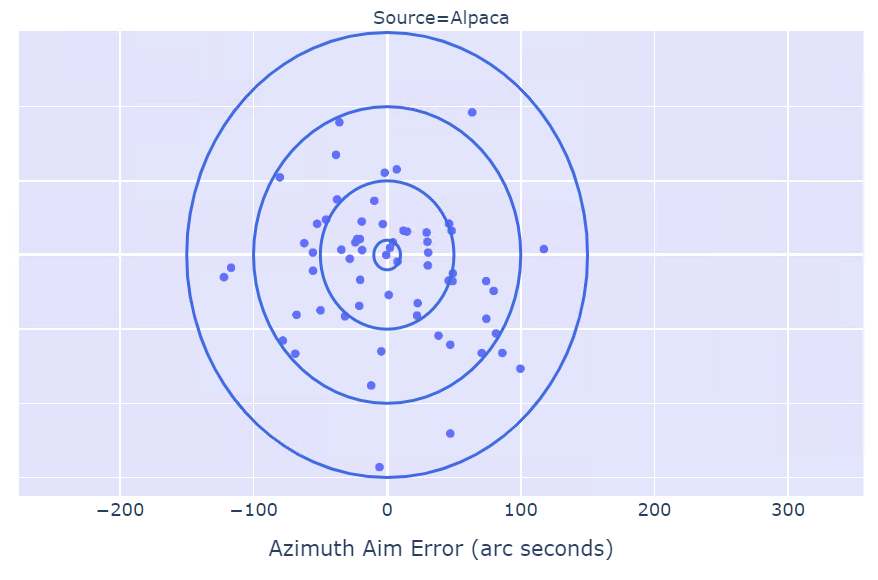
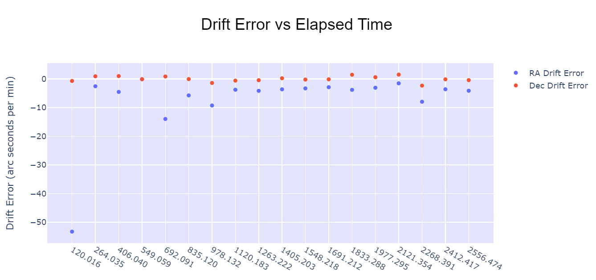
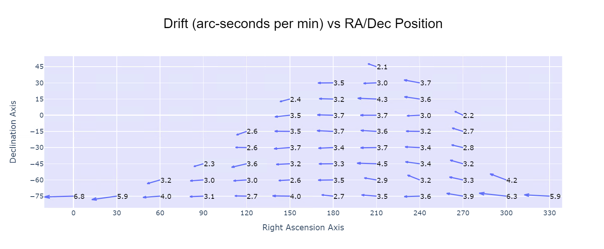
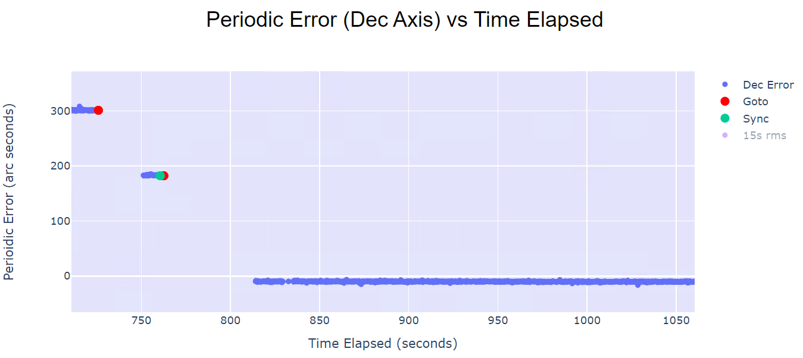
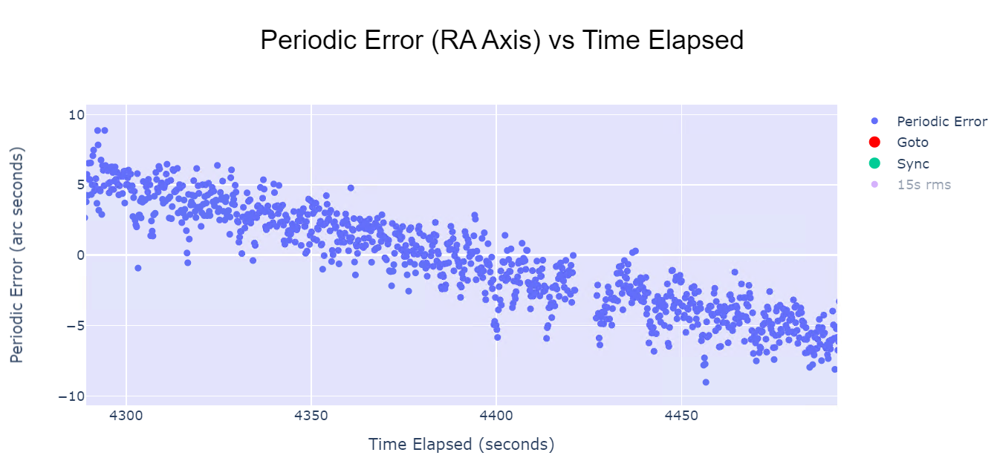

# Performance Analysis Test Procedure

The Alpaca Benro Polaris Project includes performance data logging and tests within the driver. This document describes how you can enable and use these tests to assess the performance of your own Benro Polaris. 

This secion assumes you are fairly technical in nature and are familiar with using Jupyter Notebooks and Python for data analysis.
**INTENDED FOR DEVELOPERS AND TESTERS ONLY**

## Prerequistites
The software to perform the data logging and tests is currently only in the development branch of the GitHub repository. You will need to download the latest code from the [GitHub Repository Dev Branch](https://github.com/ogecko/alpaca-benro-polaris/tree/dev). Simply overwrite your current copy of the driver, or place in a separate directory.

The Notebooks require three extra Python libraries to be installed before they can function (pandas, plotly and jupyterlab). To install these libraries enter the following command from the Command Window (we assume you are in the directory where you expanded the zip file).

```
pip install -r platforms/win/perf-requirements.txt
```

## Data logging
All data logging is controlled by the following entry in Config.toml
```
log_performance_data = 0    # Logging of Polaris Performance Data 
                            # 0=Disabled, 
                            # 1=Aim Data, 
                            # 2=Drift data, 
                            # 3=Speed data, 
                            # 4=Position Data (heavy logging)
```
If you set this entry to a value other than zero, the Alpaca Driver will change the name of alpaca.log to alpaca.csv. This file will still contain all the usual log data, but it will also include a CSV header line, and the actual data lines will be interspersed throughout the file. The second column of the CSV file can be useful for filtering the specific data you need.

One great thing about this is that if you want to delve deeper into what happened at a specific data point, you just need to locate the line in alpaca.csv and review all the log entries that preceded it.  This is great for troubleshooting and debugging.

## Data Analysis
The alpaca.csv file can be read directly by Microsoft Excel. It will handle parsing the csv file as a comma separated variable file and read the values into columns of the worksheet. You can use Pivot Charts to quickly view the data from the log file.

We also provide several Jupyter Notebooks in this directory that were used to create the Analysis Paper. These can be run from VS Code or from the Jupyter Notebook server directly. Feel free to modify and extend these Notebooks with your own analysis.

## Aiming Performance - Aim Error

### Aiming Performance Data
Setting log_performance_data = 1, will cause a DATA1 log entry after the completion of every GOTO command. 
```
Log	Dataset	Time	AimAz	AimAlt	OffsetAz OffsetAlt	AimErrorAz	AimErrorAlt	AimErrorMagnitude
2024 DATA1	28.043	166.42	24.48	0.0289	 0.0072	    34.115	    -39.836	    52.447499
```

The following data is logged:
* Log - This column contains the raw log lines of the log file
* Dataset - The dataset name is always DATA1 for this logging
* Time - The number of seconds since the data logging was started
* AimAz - The Azimuth of the GOTO command (in ASCOM co-ordinate space)
* AimAlt - The Altitude of the GOTO command (in ASCOM co-ordinate space)
* OffsetAz - The updated Azimuth offset in the Adaptive Integrative algorithm
* OffsetAlt - The updated Altitude offset in the Adaptive Integrative algorithm
* AimErrorAz - The Aim Error in arc seconds on the Azimuth axis
* AimErrorAlt - The Aim Error in arc seconds on the Altitude axis

### Aiming Performance Analysis
The notebook `performance_aim_error.ipynb` provides a sample template to create the archery targets that shows the results of the Aim Performance logging. This can be run at any time and will show dots on the chart for all GOTO commands excecuted up to that point in time. 



The Notebook charts from plotly are interactive. This allows you to click and drag a zoom region to look closer at the data. Show and hide traces. Hover over datapoints to get more information, etc. Plotly is a very powerful charting package in Python.

### Aiming Performance Test
You do not need to run the Aiming Performance Test to use the Aiming Performance Data Logging and Analysis. This test is included for a more thorough set of GOTO data points. 

To run the Aiming Performance Tests,  set the Config.toml entry `log_performance_data_test` to 1 and restart the driver. The driver's test procedure will take control of your mount 30 seconds after the driver starts. In this time make sure you have set the site latitude and longitude from Nina or StellariumPLUS. The test will take around **30 minutes** to complete. Dont forget to set this entry back to 0 after you have conducted the test.
```
log_performance_data_test = 1     # (DEV ONLY) Run Performance tests 
                                  # 0=none, 
                                  # 1=Aim test
```
The test will calculate a set of GOTO targets spanning the sky. Starting at Declination = -90° (in the southern hemisphere) and Declination = +90° (in the northern hemisphere). At each 15° of Declination it will rotate around the Right Ascension axis in 30 degree steps. It will only perfom a GOTO on the calculated co-ordinate if its Altitide is greater than 12° and less than 80°.

After each GOTO command, the Aiming Error will be logged to the alpaca.csv file. You can use the notebook `performance_aim_error.ipynb` to analyse the data.

If you notice that the mount is not proceeding to the next GOTO point just toggle the Tracking OFF and back ON again. This should cause the GOTO to complete and proceed. 

## Tracking Performance - Drift Error
### Drift Performance Data
Setting log_performance_data = 2, will cause a DATA2 log entry every 2 minutes.

```
Log	 Dataset Time	TrackingT0	TrackingT1	TargetRA	TargetDec	DriftErrRA	DriftErrDec
2024 DATA2	 406.0	True	    True	    2.0	        -75.0	    -4.554	    0.965
```

The following data is logged:
* Log - This column contains the raw log lines of the log file
* Dataset - The dataset name is always DATA2 for this logging
* Time - The number of seconds since the data logging was started
* TrackingT0 - Tracking state at begining of sample (True or False)
* TrackingT1 - Tracking state at end of sample (True or False)
* TargetRA - The Right Ascension coordinate of the target (in ASCOM co-ordinate space)
* TargetDec - The Declination coordinate of the target (in ASCOM co-ordinate space)
* DriftErrRA - The Drift Error in arc seconds on the Right Ascension axis
* DriftErrDec - The Drift Error in arc seconds on the Declination axis

### Drift Performance Analysis
The notebook `performance_drift_error.ipynb provides a sample template to two different charts to analyse the Drift Error. 

The first chart is a simple scatter plot. It shows the Drift Error on the vertical Axis and Time Elapsed on the horizontal axis. It includes two traces, one for the Drift Error on the RA Axis, and one for the Dec axis.


The second chart is a quiver plot. It shows the Drift Error Vector across the RA and Dec Target co-ordinates.


### Drift Performance Test

You do not need to run the Drift Performance Test to use the Drift Performance Data Logging and Analysis. This test is included for a more thorough set of GOTO data points. 

To run the Drift Performance Tests,  set the Config.toml entry `log_performance_data_test` to 2 and restart the driver. The driver's test procedure will take control of your mount 30 seconds after the driver starts. In this time make sure you have set the site latitude and longitude from Nina or StellariumPLUS. The test will take around **3.5 hours** to complete. 

Yes, you read that right - THREE AND A HALF HOURS TO COMPLETE - because at each GOTO point it waits 3 minutes to perform its drift measurement. Dont forget to set this entry back to 0 after you have conducted the test.
```
log_performance_data_test = 1     # (DEV ONLY) Run Performance tests 
                                  # 0=none, 
                                  # 2=Drift test
```
The test will calculate a set of GOTO targets spanning the sky. Starting at Declination = -90° (in the southern hemisphere) and Declination = +90° (in the northern hemisphere). At each 15° of Declination it will rotate around the Right Ascension axis in 30 degree steps. It will only perfom a GOTO on the calculated co-ordinate if its Altitide is greater than 12° and less than 80°.

After each GOTO command, the Driver will log the RA/Dec position of the Polaris, then wait 3 minutes, and log the RA/Dec position again. It will use these two measurements to calculate the Drift Error. You can use the notebook `performance_drift_error.ipynb` to analyse the data.

## Tracking Performance - Periodic and RMS Error
### Periodic Error Data
Setting log_performance_data = 4, will cause a DATA4 log entry every time the AHRS updates the Driver on the position of the Polaris. This occurs every 20ms, so be prepared for your log file filling up very quickly.

The following data is logged:
* Log - This column contains the raw log lines of the log file
* Dataset - The dataset name is always DATA2 for this logging
* Time - The number of seconds since the data logging was started
* Tracking - Tracking state (True or False)
* Slewing - Slewing state, ie is the mount moving (True or False)
* Gotoing - Gotoing state, ie is the mount performing a GOTO (True or False)
* TargetRA - The Right Ascension coordinate of the target (in ASCOM co-ordinate space)
* TargetDec - The Declination coordinate of the last GOTO target (in ASCOM co-ordinate space)
* AscomRA - The current Right Ascension coordinate  (in ASCOM co-ordinate space)
* AscomDec - The current Declination coordinate (in ASCOM co-ordinate space)
* AscomAz - The current Azimuth coordinate  (in ASCOM co-ordinate space)
* AscomAlt - The current Altitude coordinate (in ASCOM co-ordinate space)
* ErrorRA - The Periodic Error in arc seconds on the Right Ascension axis
* ErrorDec - The Periodic Error in arc seconds on the Declination axis

### Periodic and RMS Error Analysis
The notebook `performance_periodic_error.ipynb provides a sample template to two different charts to analyse the Periodic Error. The template also calculates the RMS Error using the pandas rolling_window function.

The first chart is a simple scatter plot. It shows the Declination Periodic Error on the vertical Axis and Time Elapsed on the horizontal axis. It includes two traces, one for the Periodic Error and one for the 15s RMS Error. It also adds markers for when the GOTO and SYNC commands occur.


The second chart is the same format, but for the Right Ascension axis.


### Periodic Error Performance Test

There is no special test for the Periodic Error. You can simply use the Polaris through Nina or Stellarium and analyse the Periodic and RMS Errors at any time during its use.

